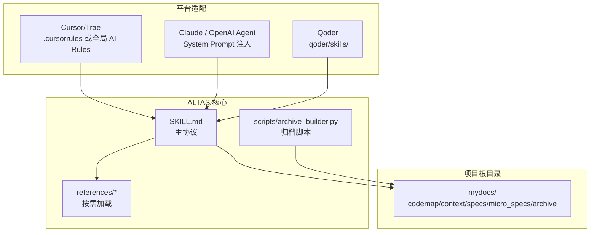
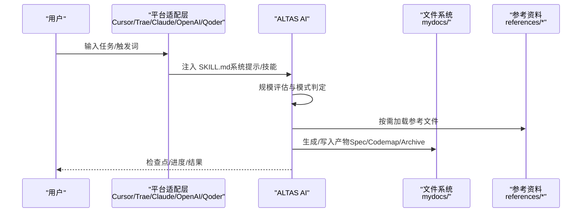
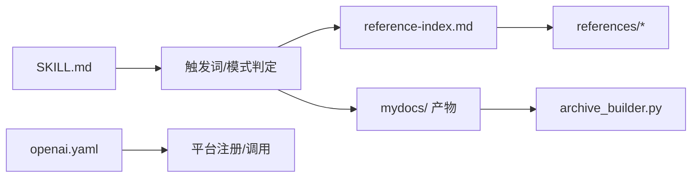

# 平台集成

<cite>
**本文引用的文件**
- [README.md](file://README.md)
- [QUICKSTART.md](file://altas-workflow/QUICKSTART.md)
- [SKILL.md](file://altas-workflow/SKILL.md)
- [reference-index.md](file://altas-workflow/reference-index.md)
- [commands.md](file://altas-workflow/references/spec-driven-development/commands.md)
- [SKILL.md（系统化调试）](file://altas-workflow/references/superpowers/systematic-debugging/SKILL.md)
- [archive_builder.py](file://altas-workflow/scripts/archive_builder.py)
- [openai.yaml（SDD-RIPER ONE）](file://altas-workflow/references/agents/sdd-riper-one/agents/openai.yaml)
- [openai.yaml（SDD-RIPER ONE Light）](file://altas-workflow/references/agents/sdd-riper-one-light/agents/openai.yaml)
- [README.md（SDD-RIPER ONE）](file://altas-workflow/references/agents/sdd-riper-one/README.md)
- [README.md（SDD-RIPER ONE Light）](file://altas-workflow/references/agents/sdd-riper-one-light/README.md)
- [CLAUDE.md](file://CLAUDE.md)
- [AGENTS.md](file://AGENTS.md)
</cite>

## 目录
1. [简介](#简介)
2. [项目结构](#项目结构)
3. [核心组件](#核心组件)
4. [架构总览](#架构总览)
5. [详细组件分析](#详细组件分析)
6. [依赖关系分析](#依赖关系分析)
7. [性能考虑](#性能考虑)
8. [故障排除指南](#故障排除指南)
9. [结论](#结论)
10. [附录](#附录)

## 简介
本指南面向在不同 AI 平台上集成 ALTAS Workflow 的工程师与技术负责人，覆盖 Cursor/Trae、Claude、OpenAI Agent、Qoder 等主流平台的安装与配置方法，提供命令示例、配置要点、平台差异与注意事项，并给出性能优化与最佳实践建议，帮助在多平台环境中稳定落地 ALTAS。

## 项目结构
ALTAS Workflow 的核心由“主协议 SKILL.md”、“按需加载的参考资料”、“专用协议与方法论”、“Agent 定义”、“自动化脚本”组成。平台适配的关键在于将 SKILL.md 作为系统提示或技能注入到各平台，同时在项目根目录准备 mydocs/ 目录用于落盘产物。

图表来源
- [README.md: 114-121:114-121](file://README.md#L114-L121)
- [QUICKSTART.md: 11-15:11-15](file://altas-workflow/QUICKSTART.md#L11-L15)
- [SKILL.md: 1-5:1-5](file://altas-workflow/SKILL.md#L1-L5)

章节来源
- [README.md: 46-82:46-82](file://README.md#L46-L82)
- [QUICKSTART.md: 11-28:11-28](file://altas-workflow/QUICKSTART.md#L11-L28)

## 核心组件
- 主协议 SKILL.md：定义触发词、规模评估、阶段流程、铁律约束、进度可视化与上下文装配策略，是各平台适配的统一入口。
- 参考资料 reference-index.md：按场景与阶段指引 AI 按需加载对应文件，避免上下文污染。
- 原生命令 commands.md：提供 create_codemap、build_context_bundle、sdd_bootstrap 等命令的参数与行为说明。
- 系统化调试 SKILL.md：提供 DEBUG 模式的四阶段根因分析方法，确保“无根因不修复”的纪律。
- 归档脚本 archive_builder.py：将 Spec/Codemap 等中间产物生成 human/llm 双视角归档文档。
- Agent 配置 openai.yaml：为 OpenAI 平台提供显示名称、简述与默认提示词，便于在平台侧注册与调用。

章节来源
- [SKILL.md: 11-21:11-21](file://altas-workflow/SKILL.md#L11-L21)
- [reference-index.md: 1-14:1-14](file://altas-workflow/reference-index.md#L1-L14)
- [commands.md: 1-37:1-37](file://altas-workflow/references/spec-driven-development/commands.md#L1-L37)
- [SKILL.md（系统化调试）: 1-20:1-20](file://altas-workflow/references/superpowers/systematic-debugging/SKILL.md#L1-L20)
- [archive_builder.py: 1-20:1-20](file://altas-workflow/scripts/archive_builder.py#L1-L20)
- [openai.yaml（SDD-RIPER ONE）: 1-8:1-8](file://altas-workflow/references/agents/sdd-riper-one/agents/openai.yaml#L1-L8)

## 架构总览
平台适配遵循“统一协议 + 按需加载 + 产物落盘”的原则。AI 在各平台以系统提示或技能形式加载 SKILL.md，随后根据任务触发词进入相应模式（如 FAST/DEEP/DEBUG/MULTI/DOC/MAP/ARCHIVE），并在必要时按 reference-index.md 的指引加载参考文件，最终将产物写入 mydocs/。

图表来源
- [SKILL.md: 45-73:45-73](file://altas-workflow/SKILL.md#L45-L73)
- [reference-index.md: 16-81:16-81](file://altas-workflow/reference-index.md#L16-L81)
- [QUICKSTART.md: 17-28:17-28](file://altas-workflow/QUICKSTART.md#L17-L28)

## 详细组件分析

### Cursor/Trae 平台
- 安装方式
  - 将 SKILL.md 内容复制到项目根目录的 .cursorrules 或全局 AI Rules。
- 项目配置
  - 在项目根目录创建 mydocs/ 目录，AI 会在需要时自动创建。
- 使用要点
  - 通过触发词（如 FAST、DEEP、DEBUG、MULTI、DOC、MAP、ARCHIVE、>> 等）激活对应模式。
  - mydocs/ 下的产物（Spec、Codemap、Archive）建议纳入版本管理，便于知识沉淀与交接。
- 注意事项
  - Cursor/Trae 的规则文件会直接影响对话上下文，建议保持 SKILL.md 的简洁与稳定。
  - 若任务规模评估为 XS/S，可直接执行；M/L 需要严格的检查点与审批流程。

章节来源
- [README.md: 114-121:114-121](file://README.md#L114-L121)
- [QUICKSTART.md: 11-15:11-15](file://altas-workflow/QUICKSTART.md#L11-L15)
- [QUICKSTART.md: 19-28:19-28](file://altas-workflow/QUICKSTART.md#L19-L28)

### Claude 平台
- 安装方式
  - 将 SKILL.md 内容作为 System Prompt 注入到 Claude 的会话或助手设置中。
- 行为建议
  - 可叠加 CLAUDE.md 的行为准则，减少 LLM 常见错误（假设、过度改进、无关重构等）。
- 使用要点
  - 与 Cursor/Trae 类似，通过触发词进入对应模式；DEBUG 模式强调“无根因不修复”。
- 注意事项
  - Claude 的上下文长度有限，建议配合 ALTAS 的按需加载策略，避免一次性注入过多内容。

章节来源
- [README.md: 114-121:114-121](file://README.md#L114-L121)
- [CLAUDE.md: 1-65:1-65](file://CLAUDE.md#L1-L65)

### OpenAI Agent 平台
- 安装方式
  - 将 SKILL.md 内容作为 System Prompt 注入到 OpenAI Agent 的配置中。
- Agent 注册（可选）
  - 可使用 openai.yaml 定义显示名称、简述与默认提示词，便于在平台侧注册与调用。
- 使用要点
  - 通过触发词进入模式；DEBUG 模式严格遵循四阶段根因分析。
- 注意事项
  - Agent 的默认提示词应与 SKILL.md 的核心约束保持一致，避免冲突。

章节来源
- [README.md: 114-121:114-121](file://README.md#L114-L121)
- [openai.yaml（SDD-RIPER ONE）: 1-8:1-8](file://altas-workflow/references/agents/sdd-riper-one/agents/openai.yaml#L1-L8)
- [openai.yaml（SDD-RIPER ONE Light）: 1-5:1-5](file://altas-workflow/references/agents/sdd-riper-one-light/agents/openai.yaml#L1-L5)

### Qoder 平台
- 安装方式
  - 将 SKILL.md 放入项目 .qoder/skills/ 目录，由 Qoder 自动加载。
- 使用要点
  - 与其它平台一致，通过触发词进入模式；mydocs/ 产物建议纳入版本管理。
- 注意事项
  - 确保 .qoder/skills/ 目录存在且权限正确，避免加载失败。

章节来源
- [README.md: 114-121:114-121](file://README.md#L114-L121)

### 专用 Agent（SDD-RIPER ONE / SDD-RIPER ONE Light）
- SDD-RIPER ONE（标准版）
  - 严格阶段门禁：No Spec No Code、Plan Approved、Spec is Truth、Reverse Sync。
  - 适用场景：中大型任务、需要完整审计链的研发任务。
  - 安装：通过平台技能注册工具安装。
- SDD-RIPER ONE Light（轻量版）
  - 面向强模型的轻量模式：保留 spec、checkpoint、审批三类硬门禁，其余让强模型自行处理。
  - 适用场景：高频多轮、大上下文任务。
  - 安装：通过平台技能注册工具安装。

章节来源
- [README.md（SDD-RIPER ONE）: 16-33:16-33](file://altas-workflow/references/agents/sdd-riper-one/README.md#L16-L33)
- [README.md（SDD-RIPER ONE Light）: 18-28:18-28](file://altas-workflow/references/agents/sdd-riper-one-light/README.md#L18-L28)
- [openai.yaml（SDD-RIPER ONE）: 1-8:1-8](file://altas-workflow/references/agents/sdd-riper-one/agents/openai.yaml#L1-L8)
- [openai.yaml（SDD-RIPER ONE Light）: 1-5:1-5](file://altas-workflow/references/agents/sdd-riper-one-light/agents/openai.yaml#L1-L5)

### 原生命令与模式
- create_codemap / build_context_bundle / sdd_bootstrap
  - 用于生成代码索引、整理需求上下文与启动 RIPER 流程。
- DEBUG 模式
  - 四阶段根因分析：根因调查、模式分析、假设与测试、实施与验证。
- MULTI 模式
  - 自动发现子项目、作用域隔离与跨项目协作。
- DOC / MAP / ARCHIVE 模式
  - 文档专家、链路梳理与知识沉淀。

章节来源
- [commands.md: 5-37:5-37](file://altas-workflow/references/spec-driven-development/commands.md#L5-L37)
- [SKILL.md（系统化调试）: 46-297:46-297](file://altas-workflow/references/superpowers/systematic-debugging/SKILL.md#L46-L297)
- [SKILL.md: 221-275:221-275](file://altas-workflow/SKILL.md#L221-L275)

### 归档与产物落盘
- 产物命名约定
  - 统一时间前缀 YYYY-MM-DD_hh-mm_，分别落盘到 codemap/context/specs/micro_specs/archive。
- 归档脚本
  - archive_builder.py 支持 human/llm 双视角归档，自动抽取关键决策、结果、风险与契约等信息，并生成 Trace to Sources。

章节来源
- [SKILL.md: 302-315:302-315](file://altas-workflow/SKILL.md#L302-L315)
- [archive_builder.py: 36-79:36-79](file://altas-workflow/scripts/archive_builder.py#L36-L79)
- [archive_builder.py: 451-500:451-500](file://altas-workflow/scripts/archive_builder.py#L451-L500)

## 依赖关系分析
- 平台适配层依赖 SKILL.md 的统一协议与触发词。
- AI 在执行过程中按需加载 reference-index.md 指引的文件，降低上下文负担。
- 产物写入 mydocs/，并通过 archive_builder.py 生成双视角归档。
- Agent 配置 openai.yaml 提供平台侧注册所需的元数据。

图表来源
- [SKILL.md: 45-73:45-73](file://altas-workflow/SKILL.md#L45-L73)
- [reference-index.md: 16-81:16-81](file://altas-workflow/reference-index.md#L16-L81)
- [archive_builder.py: 1-20:1-20](file://altas-workflow/scripts/archive_builder.py#L1-L20)
- [openai.yaml（SDD-RIPER ONE）: 1-8:1-8](file://altas-workflow/references/agents/sdd-riper-one/agents/openai.yaml#L1-L8)

章节来源
- [reference-index.md: 16-81:16-81](file://altas-workflow/reference-index.md#L16-L81)
- [archive_builder.py: 1-20:1-20](file://altas-workflow/scripts/archive_builder.py#L1-L20)

## 性能考虑
- 上下文装配策略
  - XS/S：依赖对话上下文，无需显式装配。
  - M/L：采用 Hot/Warm/Cold 三层上下文，按轮/阶段切换/按需加载，减少冗余信息。
- 按需加载
  - 仅在命中场景时加载参考文件，避免一次性全量注入导致上下文污染与延迟。
- 产物落盘
  - mydocs/ 产物建议纳入版本管理，减少重复生成与检索成本。
- Agent 与平台差异
  - 强模型（如 Claude Opus/GPT-4+）更适合轻量模式（S/XS），可减少交互轮次与上下文开销。
  - 标准模式（M/L）适用于复杂任务与强约束场景，需合理使用检查点与审批流程。

章节来源
- [SKILL.md: 318-334:318-334](file://altas-workflow/SKILL.md#L318-L334)
- [reference-index.md: 175-202:175-202](file://altas-workflow/reference-index.md#L175-L202)
- [README.md: 600-607:600-607](file://README.md#L600-L607)

## 故障排除指南
- AI 一次性输出过多或跳过检查点
  - ALTAS 内置检查点机制，AI 完成一步后必须暂停等待确认。若出现异常，回复“请停止，严格执行检查点机制，每次只推进一步。”
- 如何中途干预计划
  - 在任意检查点回复“[修改] + 具体意见”，AI 会根据反馈调整 Plan 后重新请求 Approve。
- 触发词误用或模式不符
  - 使用 `>>`/FAST/快速 为 XS/S；默认为 M；`DEEP` 为 L；DEBUG/MULTI/DOC/MAP/ARCHIVE 为对应模式。
- DEBUG 模式无根因不修复
  - 严格遵循四阶段根因分析，只读分析，代码修改需进入 RIPER 或 FAST。
- 归档脚本报错（活跃 Spec）
  - archive_builder.py 默认禁止归档未完成 Review 的活跃 Spec，如需强制请显式授权。

章节来源
- [README.md: 539-552:539-552](file://README.md#L539-L552)
- [QUICKSTART.md: 119-140:119-140](file://altas-workflow/QUICKSTART.md#L119-L140)
- [SKILL.md（系统化调试）: 16-23:16-23](file://altas-workflow/references/superpowers/systematic-debugging/SKILL.md#L16-L23)
- [archive_builder.py: 464-474:464-474](file://altas-workflow/scripts/archive_builder.py#L464-L474)

## 结论
通过将 SKILL.md 作为统一协议注入各平台，并结合 reference-index.md 的按需加载与 mydocs/ 的产物落盘，ALTAS Workflow 能在 Cursor/Trae、Claude、OpenAI Agent、Qoder 等平台上稳定运行。针对不同模型强度与任务规模，选择合适的模式（XS/S/M/L）与 Agent（标准/轻量），并遵循检查点与铁律约束，可显著提升交付质量与可维护性。

## 附录

### 平台适配清单
- Cursor/Trae
  - 安装：将 SKILL.md 内容复制到 .cursorrules 或全局 AI Rules。
  - 项目配置：mkdir -p mydocs/{codemap,context,specs,micro_specs,archive}
- Claude / OpenAI Agent
  - 安装：将 SKILL.md 内容作为 System Prompt 注入。
  - Agent 注册（可选）：使用 openai.yaml 定义显示名称与默认提示词。
- Qoder
  - 安装：将 SKILL.md 放入 .qoder/skills/ 目录。

章节来源
- [README.md: 114-121:114-121](file://README.md#L114-L121)
- [QUICKSTART.md: 11-15:11-15](file://altas-workflow/QUICKSTART.md#L11-L15)
- [openai.yaml（SDD-RIPER ONE）: 1-8:1-8](file://altas-workflow/references/agents/sdd-riper-one/agents/openai.yaml#L1-L8)

### 命令与模式速查
- 触发词：FAST/DEEP/DEBUG/MULTI/DOC/MAP/ARCHIVE/>> 及其本地化变体。
- 原生命令：create_codemap、build_context_bundle、sdd_bootstrap、review_spec、review_execute、archive。
- 模式说明：DEBUG 四阶段根因分析；MULTI 自动发现子项目；DOC 文档专家；MAP 代码链路梳理；ARCHIVE 知识沉淀。

章节来源
- [SKILL.md: 61-73:61-73](file://altas-workflow/SKILL.md#L61-L73)
- [commands.md: 5-37:5-37](file://altas-workflow/references/spec-driven-development/commands.md#L5-L37)
- [SKILL.md（系统化调试）: 46-297:46-297](file://altas-workflow/references/superpowers/systematic-debugging/SKILL.md#L46-L297)