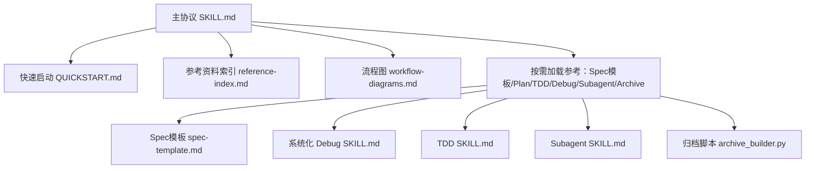
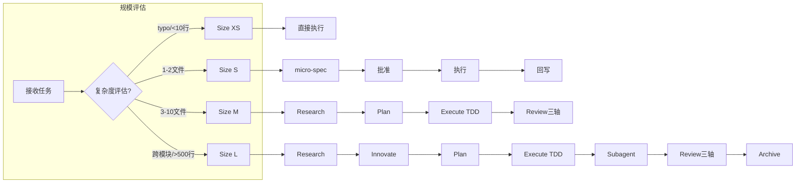
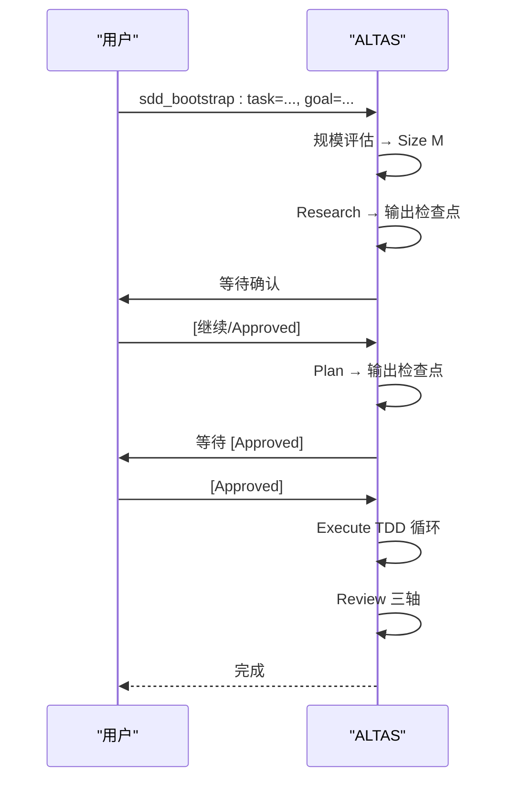
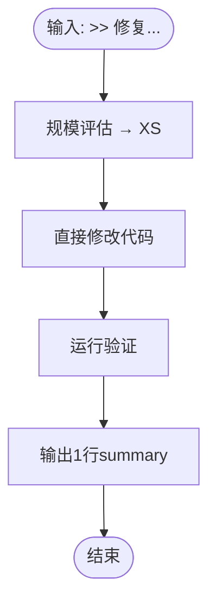
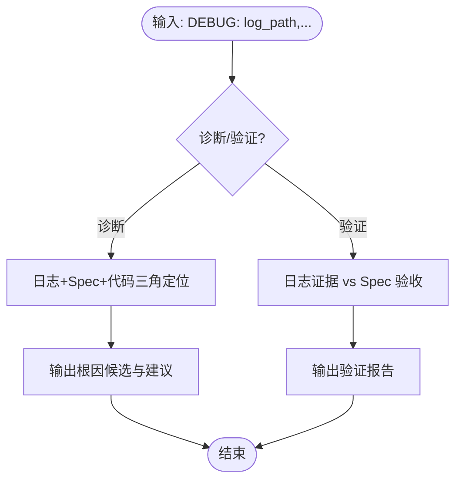
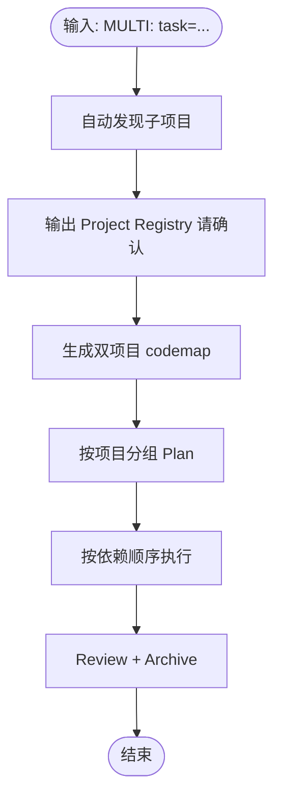
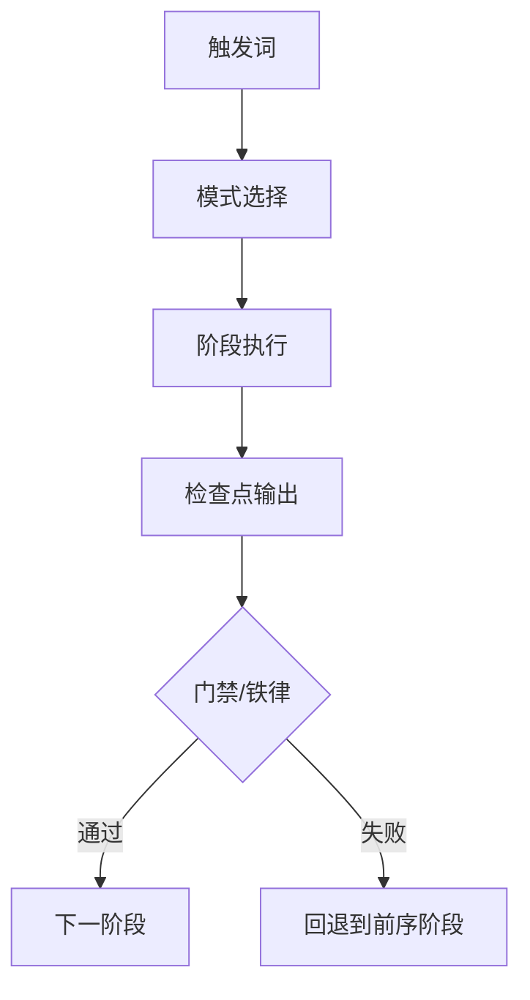

# 应用场景

<cite>
**本文引用的文件**
- [README.md](file://README.md)
- [QUICKSTART.md](file://altas-workflow/QUICKSTART.md)
- [SKILL.md](file://altas-workflow/SKILL.md)
- [reference-index.md](file://altas-workflow/reference-index.md)
- [workflow-diagrams.md](file://altas-workflow/workflow-diagrams.md)
- [spec-template.md](file://altas-workflow/references/spec-driven-development/spec-template.md)
- [usage-examples.md](file://altas-workflow/references/spec-driven-development/usage-examples.md)
- [modules.md](file://altas-workflow/references/checkpoint-driven/modules.md)
- [SKILL.md (Systematic Debugging)](file://altas-workflow/references/superpowers/systematic-debugging/SKILL.md)
- [SKILL.md (TDD)](file://altas-workflow/references/superpowers/test-driven-development/SKILL.md)
- [SKILL.md (Subagent)](file://altas-workflow/references/superpowers/subagent-driven-development/SKILL.md)
- [archive_builder.py](file://altas-workflow/scripts/archive_builder.py)
</cite>

## 目录
1. [简介](#简介)
2. [项目结构](#项目结构)
3. [核心组件](#核心组件)
4. [架构总览](#架构总览)
5. [详细场景解析](#详细场景解析)
6. [依赖关系分析](#依赖关系分析)
7. [性能与效率考量](#性能与效率考量)
8. [故障排查与常见问题](#故障排查与常见问题)
9. [结论](#结论)
10. [附录](#附录)

## 简介
本指南面向 ALTAS Workflow 的实际应用，围绕不同规模与类型的开发任务，系统讲解如何在日常功能迭代、紧急修复、架构重构、Bug 排查、多项目协作等典型场景中高效落地。文档提供每个场景的操作流程、触发命令、预期输出与产物形态，并解释如何根据任务特征选择合适的执行模式（XS/S/M/L），以及在执行过程中进行人工干预与模式升级/降级的决策方法。同时给出丰富的实际案例与最佳实践，帮助团队在不同情况下做出最优选择。

## 项目结构
ALTAS Workflow 以“融合 Spec-Driven、Checkpoint-Driven 与 Superpowers”的理念构建，核心由主协议 SKILL.md、快速启动 QUICKSTART.md、参考资料索引 reference-index.md、流程图 workflow-diagrams.md 以及大量按需加载的参考文档组成。其工作流按规模分级（XS/S/M/L），并通过检查点机制与三轴评审保障质量与可追溯性。

图表来源
- [SKILL.md:1-351](file://altas-workflow/SKILL.md#L1-L351)
- [reference-index.md:1-210](file://altas-workflow/reference-index.md#L1-L210)
- [workflow-diagrams.md:1-338](file://altas-workflow/workflow-diagrams.md#L1-L338)

章节来源
- [README.md:48-82](file://README.md#L48-L82)
- [SKILL.md:1-351](file://altas-workflow/SKILL.md#L1-L351)

## 核心组件
- 触发词与命令体系：FAST/DEEP/DEBUG/MULTI/DOC/MAP/ARCHIVE 等，配合 >>、sdd_bootstrap 等命令，自动评估规模并进入相应工作流。
- 规模评估与智能深度适配：XS/S/M/L 四级深度，支持自动评估与手动升降级。
- 检查点机制与进度可视化：每步完成后输出标准化检查点，等待人类确认后再推进。
- 铁律与门禁：No Spec, No Code；No Approval, No Execute；Spec is Truth；Reverse Sync；Evidence First；No Root Cause, No Fix；TDD Iron Law；Resume Ready。
- 按需加载的参考资料：仅在命中场景时读取对应文件，避免上下文污染。
- 产物与归档：Spec、CodeMap、Archive（human/llm 双视角），统一命名约定与存储位置。

章节来源
- [SKILL.md:45-102](file://altas-workflow/SKILL.md#L45-L102)
- [SKILL.md:138-218](file://altas-workflow/SKILL.md#L138-L218)
- [reference-index.md:175-202](file://altas-workflow/reference-index.md#L175-L202)

## 架构总览
下图展示了 ALTAS 的整体工作流：根据任务复杂度自动评估规模，进入对应阶段（Research/Innovate/Plan/Execute/Review/Archive），并在每个阶段输出检查点，等待人类批准后推进。

图表来源
- [workflow-diagrams.md:7-41](file://altas-workflow/workflow-diagrams.md#L7-L41)

章节来源
- [workflow-diagrams.md:7-41](file://altas-workflow/workflow-diagrams.md#L7-L41)

## 详细场景解析

### 场景一：日常功能迭代（Size M）
- 触发命令：sdd_bootstrap: task=..., goal=...
- 典型任务：新增接口、模块重构、跨模块改动
- 流程要点：
  - Research：对齐目标、梳理现状、识别风险与未知项，形成 Spec 初稿
  - Plan：拆解为原子 Checklist，明确文件变更、签名、Done Contract
  - Execute：TDD 驱动（RED→GREEN→REFACTOR），逐步或批量执行
  - Review：三轴评审（Spec质量/Spec-代码一致性/代码内在质量）
  - Archive：可选沉淀（human/llm 双视角）
- 预期输出：
  - Spec 文档（mydocs/specs/...）
  - 代码改动与测试文件
  - 可选：Archive（mydocs/archive/...）

图表来源
- [workflow-diagrams.md:291-337](file://altas-workflow/workflow-diagrams.md#L291-L337)

章节来源
- [QUICKSTART.md:52-65](file://altas-workflow/QUICKSTART.md#L52-L65)
- [README.md:419-439](file://README.md#L419-L439)

### 场景二：紧急修复（Size XS）
- 触发命令：>> 修复 [文件] 中 [内容]
- 典型任务：配置项修改、typo、日志修正
- 流程要点：
  - 直接执行→验证→1行summary
  - 无需 Spec，事后同步
- 预期输出：1行 summary（修改内容与验证结果）

图表来源
- [workflow-diagrams.md:291-337](file://altas-workflow/workflow-diagrams.md#L291-L337)

章节来源
- [QUICKSTART.md:67-75](file://altas-workflow/QUICKSTART.md#L67-L75)
- [README.md:441-455](file://README.md#L441-L455)

### 场景三：架构重构（Size L）
- 触发命令：DEEP: [架构改造描述]
- 典型任务：跨模块重构、服务拆分、网关层设计
- 流程要点：
  - create_codemap → 生成代码索引
  - Research → 梳理现状链路，标识风险
  - Innovate → 给出多种方案对比（Pros/Cons/Risks/Effort）
  - Plan → 原子 Checklist + Subagent 分配
  - Execute → TDD + Subagent 并行实现 + 两阶段 Review
  - Review → 三轴评审 + Archive 沉淀
- 预期输出：
  - CodeMap（mydocs/codemap/...）
  - Spec（mydocs/specs/...）
  - Archive（mydocs/archive/...）

图表来源
- [workflow-diagrams.md:129-151](file://altas-workflow/workflow-diagrams.md#L129-L151)

章节来源
- [QUICKSTART.md:77-90](file://altas-workflow/QUICKSTART.md#L77-L90)
- [README.md:457-478](file://README.md#L457-L478)

### 场景四：Bug 排查（DEBUG 模式）
- 触发命令：DEBUG: log_path=..., issue=...
- 典型任务：日志驱动根因分析、功能验证
- 流程要点：
  - 诊断模式：日志+Spec+代码三角定位→根因候选
  - 验证模式：日志证据 vs Spec 验收标准→PASS/FAIL/INCONCLUSIVE
  - 代码修改需进入 RIPER 或 FAST
- 预期输出：症状/预期行为/根因候选/建议修复

图表来源
- [SKILL.md (Systematic Debugging):1-297](file://altas-workflow/references/superpowers/systematic-debugging/SKILL.md#L1-L297)

章节来源
- [QUICKSTART.md:92-102](file://altas-workflow/QUICKSTART.md#L92-L102)
- [usage-examples.md:336-386](file://altas-workflow/references/spec-driven-development/usage-examples.md#L336-L386)

### 场景五：多项目协作（MULTI 模式）
- 触发命令：MULTI: task=...
- 典型任务：前后端联动、跨子项目发布
- 流程要点：
  - 自动发现子项目（package.json/pom.xml/go.mod 等）
  - 输出 Project Registry 请确认
  - 生成双项目 codemap
  - Plan 按项目分组：Provider→Consumer
  - 执行按依赖顺序，记录 Contract Interfaces
- 预期输出：
  - Project Registry
  - Contract Interfaces
  - Touched Projects

图表来源
- [usage-examples.md:174-333](file://altas-workflow/references/spec-driven-development/usage-examples.md#L174-L333)

章节来源
- [QUICKSTART.md:104-115](file://altas-workflow/QUICKSTART.md#L104-L115)
- [usage-examples.md:174-333](file://altas-workflow/references/spec-driven-development/usage-examples.md#L174-L333)

### 场景六：文档专家（DOC 模式）
- 触发命令：DOC: [任务描述]
- 典型任务：技术文档、设计文档、评审材料
- 流程要点：Absorb→Outline→Author→Fact-Check，不猜测实现，每个细节对照实际代码验证
- 预期输出：结构化文档草稿与最终版本

章节来源
- [SKILL.md:249-255](file://altas-workflow/SKILL.md#L249-L255)

### 场景七：代码链路梳理（MAP 模式）
- 触发命令：MAP / PROJECT MAP
- 典型任务：功能级/项目级 CodeMap 生成
- 流程要点：只读分析，不改代码；输出 CodeMap 后暂停等待用户指示；如需修改代码→进入 Research→Plan→Execute
- 预期输出：功能/项目级 CodeMap

章节来源
- [SKILL.md:257-264](file://altas-workflow/SKILL.md#L257-L264)

### 场景八：知识沉淀（ARCHIVE 模式）
- 触发命令：ARCHIVE: targets=[...], kind=..., audience=..., mode=...
- 典型任务：任务收口后的双视角归档
- 流程要点：生成 human/llm 双视角文档，每个结论附 Trace to Sources
- 预期输出：mydocs/archive/YYYY-MM-DD_hh-mm_<topic>_{human,llm}.md

章节来源
- [SKILL.md:266-274](file://altas-workflow/SKILL.md#L266-L274)
- [archive_builder.py:1-505](file://altas-workflow/scripts/archive_builder.py#L1-L505)

## 依赖关系分析
- 触发词与模式映射：FAST/DEEP/MAP/MULTI/DEBUG/REVIEW/ARCHIVE/DOC 等触发词映射到对应工作流与模块。
- 按需加载机制：reference-index.md 明确各文件的调用时机，避免一次性加载全部资料。
- 阶段依赖：Research→Plan→Execute→Review→Archive，任一阶段失败均回退到前序阶段。
- 上下文装配：Hot/Warm/Cold 三层上下文，按需加载，冲突/不确定时从磁盘重读 Spec。

图表来源
- [reference-index.md:1-210](file://altas-workflow/reference-index.md#L1-L210)
- [SKILL.md:90-102](file://altas-workflow/SKILL.md#L90-L102)

章节来源
- [reference-index.md:1-210](file://altas-workflow/reference-index.md#L1-L210)
- [SKILL.md:318-333](file://altas-workflow/SKILL.md#L318-L333)

## 性能与效率考量
- 检查点机制：每步完成后暂停，避免一次性输出过多内容，降低认知负担与上下文污染。
- 按需加载：仅在命中场景时读取对应参考文件，显著减少 token 消耗。
- 批量执行：M/L 规模支持“全部/execute all”，在保证质量前提下加速推进。
- Subagent 并行：Size L 的 Subagent 驱动开发，两阶段审查（Spec 合规→代码质量），提升并行效率与质量门禁。
- TDD 铁律：先失败测试再实现，减少调试成本与回归风险。
- 归档沉淀：统一命名与双视角输出，便于后续复用与交接。

章节来源
- [SKILL.md:185-192](file://altas-workflow/SKILL.md#L185-L192)
- [SKILL.md (Subagent):40-84](file://altas-workflow/references/superpowers/subagent-driven-development/SKILL.md#L40-L84)
- [SKILL.md (TDD):47-68](file://altas-workflow/references/superpowers/test-driven-development/SKILL.md#L47-L68)

## 故障排查与常见问题
- AI 一次性输出过多：ALTAS 内置检查点机制，必须在每步完成后等待确认。若 AI 暴走，回复“请停止，严格执行检查点机制，每次只推进一步。”
- 如何中途干预计划：在任意检查点回复“[修改] 请不要使用 Redis，改为内存缓存”，AI 会根据反馈调整 Plan 后重新请求 Approve。
- 如何选择 XS/S/M/L：ALTAS 会自动评估。你也可以强制指定：>>=XS, FAST=S, 默认=M, DEEP=L。执行中可随时“[升级为M]”或“[降级为S]”。
- TDD 何时可跳过：Size XS/S（typo、配置、单文件小改动）可豁免 TDD。Size M/L 必须遵守 TDD 铁律。
- 多人协作：Spec 是团队共享的真相源。每个人创建自己的 Spec 文件，通过 Git 协作。核心开发者只需 Review Plan，不必 Review 全部代码。
- mydocs 文件管理：强烈建议提交。Spec 和 Archive 是项目的唯一真相源，防止上下文腐烂，帮助新人接手。

章节来源
- [QUICKSTART.md:119-151](file://altas-workflow/QUICKSTART.md#L119-L151)
- [README.md:537-607](file://README.md#L537-L607)

## 结论
ALTAS Workflow 通过“智能深度适配 + 渐进式披露 + 检查点机制 + 三轴评审 + 归档沉淀”的组合拳，覆盖从日常迭代到架构重构的全场景开发需求。团队可根据任务特征选择合适规模（XS/S/M/L），在执行过程中灵活进行人工干预与模式升级/降级，确保高质量交付与可持续的知识积累。建议新团队从标准模式（M/L）起步，逐步引入轻量模式（S/XS）与高级能力（Subagent、Debug、DOC、MAP、ARCHIVE），以达到效率与质量的最佳平衡。

## 附录

### 触发词与命令速查
- FAST/快速/>>：极速通道（Size XS/S）
- DEEP：深度模式（Size L）
- MAP/项目总图：功能级/项目级 CodeMap
- MULTI/多项目：多项目协作
- DEBUG/排查：系统化 Debug
- REVIEW SPEC/计划评审：执行前建议性预审
- REVIEW EXECUTE/代码评审：执行后三轴审查
- ARCHIVE/归档：知识沉淀
- DOC/写文档：文档专家模式
- EXIT ALTAS：停用协议

章节来源
- [README.md:158-191](file://README.md#L158-L191)
- [SKILL.md:61-72](file://altas-workflow/SKILL.md#L61-L72)

### 规模评估速查
- XS：typo、配置值、<10行
- S：1-2文件，逻辑清晰
- M：3-10文件，模块内
- L：跨模块、>500行、架构级

章节来源
- [README.md:235-260](file://README.md#L235-L260)
- [QUICKSTART.md:155-169](file://altas-workflow/QUICKSTART.md#L155-L169)

### 产物命名约定
- CodeMap（功能/项目）：mydocs/codemap/YYYY-MM-DD_hh-mm_<feature/项目总图>.md
- Context Bundle：mydocs/context/YYYY-MM-DD_hh-mm_<task>_context_bundle.md
- Spec（M/L）：mydocs/specs/YYYY-MM-DD_hh-mm_<TaskName>.md
- Micro-spec（S）：mydocs/micro_specs/YYYY-MM-DD_hh-mm_<TaskName>.md
- Archive（human/llm）：mydocs/archive/YYYY-MM-DD_hh-mm_<topic>_{human,llm}.md

章节来源
- [SKILL.md:302-315](file://altas-workflow/SKILL.md#L302-L315)