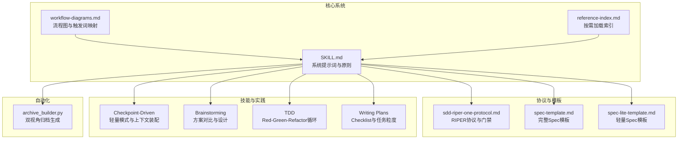
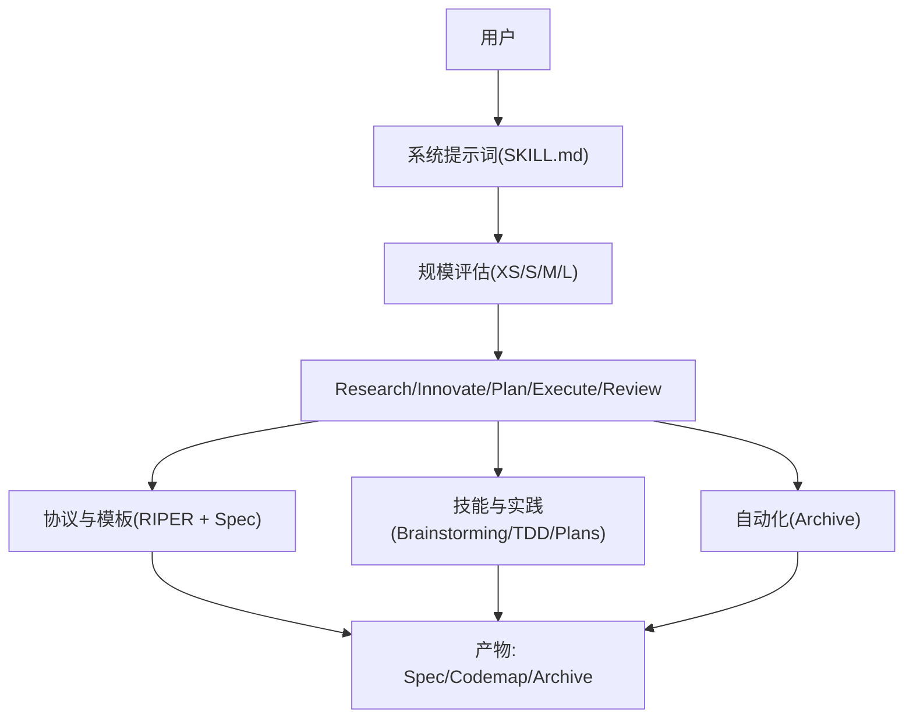
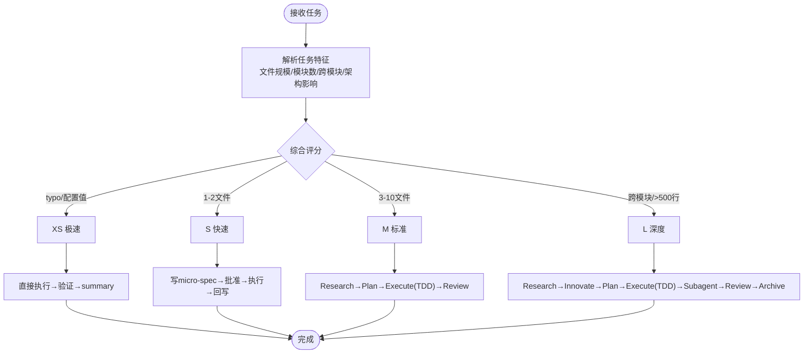
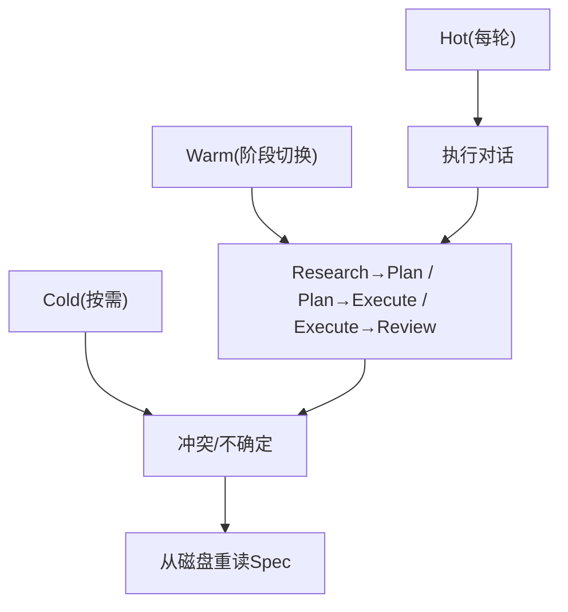
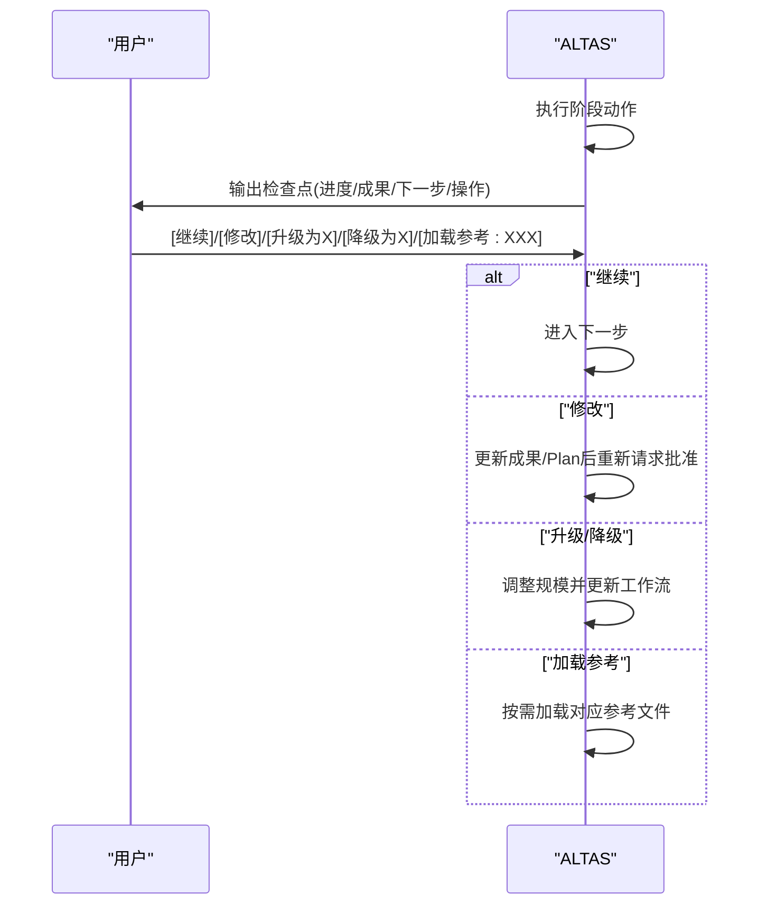
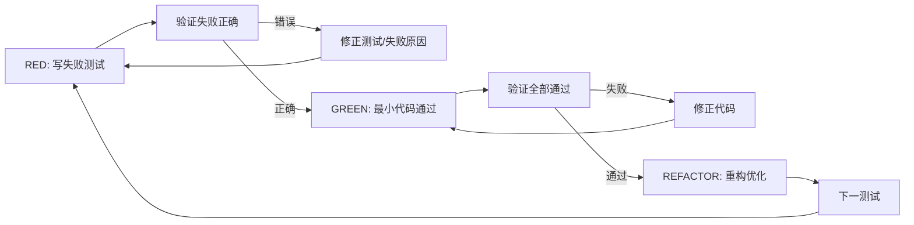
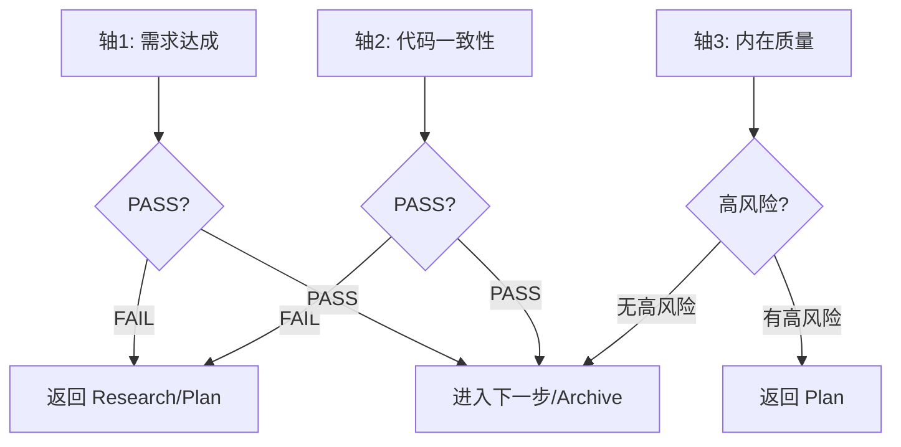
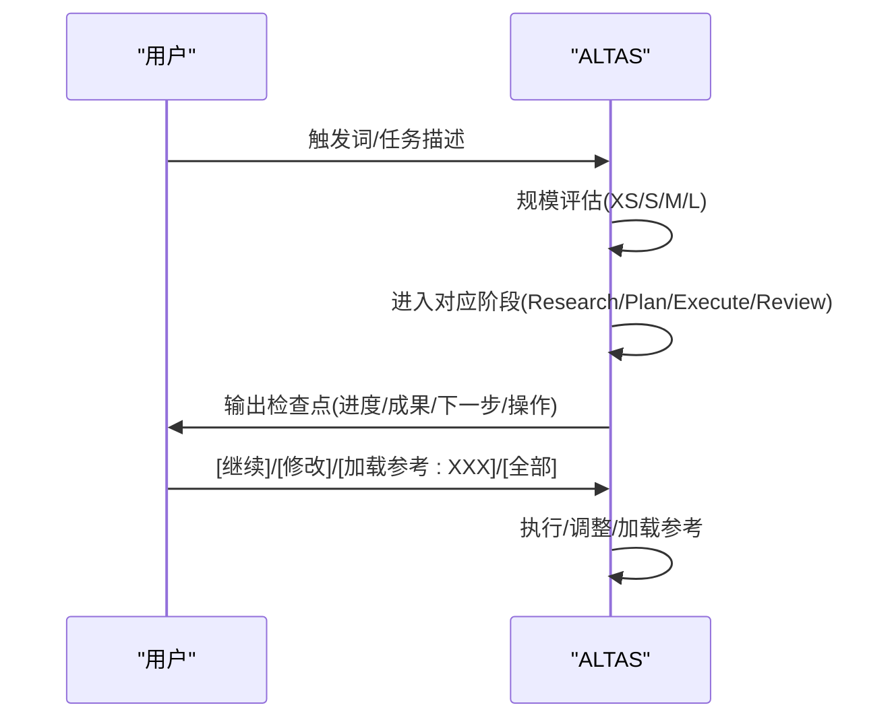
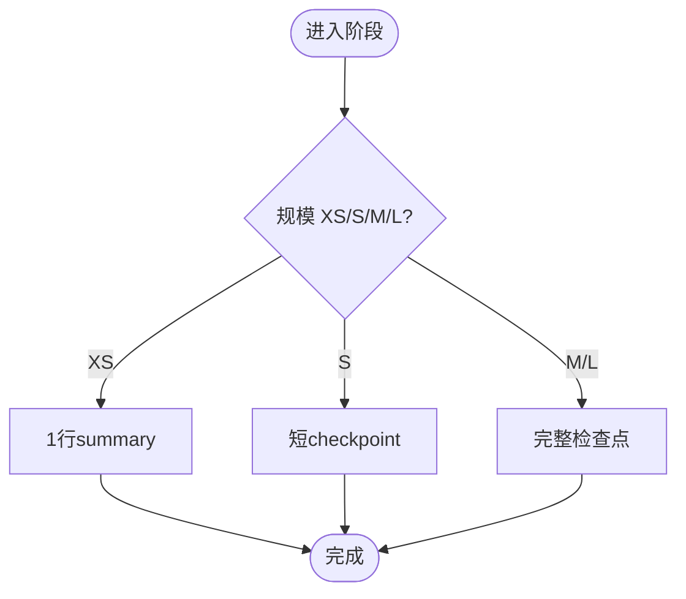

# 技术特色

<cite>
**本文引用的文件**
- [README.md](file://altas-workflow/README.md)
- [QUICKSTART.md](file://altas-workflow/QUICKSTART.md)
- [SKILL.md](file://altas-workflow/SKILL.md)
- [reference-index.md](file://altas-workflow/reference-index.md)
- [workflow-diagrams.md](file://altas-workflow/workflow-diagrams.md)
- [sdd-riper-one-protocol.md](file://altas-workflow/references/spec-driven-development/sdd-riper-one-protocol.md)
- [spec-lite-template.md](file://altas-workflow/references/checkpoint-driven/spec-lite-template.md)
- [spec-template.md](file://altas-workflow/references/spec-driven-development/spec-template.md)
- [SKILL.md（Checkpoint-Driven）](file://altas-workflow/references/checkpoint-driven/SKILL.md)
- [SKILL.md（Brainstorming）](file://altas-workflow/references/superpowers/brainstorming/SKILL.md)
- [SKILL.md（TDD）](file://altas-workflow/references/superpowers/test-driven-development/SKILL.md)
- [SKILL.md（Writing Plans）](file://altas-workflow/references/superpowers/writing-plans/SKILL.md)
- [archive_builder.py](file://altas-workflow/scripts/archive_builder.py)
</cite>

## 目录
1. [简介](#简介)
2. [项目结构](#项目结构)
3. [核心组件](#核心组件)
4. [架构总览](#架构总览)
5. [详细组件分析](#详细组件分析)
6. [依赖关系分析](#依赖关系分析)
7. [性能考量](#性能考量)
8. [故障排查指南](#故障排查指南)
9. [结论](#结论)
10. [附录](#附录)

## 简介
本文件聚焦 ALTAS Workflow 的技术特色，系统阐述其四大核心技术：智能深度适配算法、渐进式披露机制、标准化检查点系统与按需加载参考资料架构。文档面向不同技术背景读者，既提供高层架构视图，也给出代码级关系与流程图示，帮助开发者在不同平台部署与使用这些技术。

## 项目结构
ALTAS Workflow 以“系统提示词 + 分阶段协议 + 按需参考 + 自动化脚本”的方式组织，核心由以下部分构成：
- 核心系统提示词（SKILL.md）：定义工作流原则、阶段流程、触发词与上下文装配策略
- 规模评估与流程图（QUICKSTART.md、workflow-diagrams.md）：定义 XS/S/M/L 四级规模与各阶段流程
- 参考资料索引（reference-index.md）：按场景与阶段指引按需加载
- 协议与模板（sdd-riper-one-protocol.md、spec-template.md、spec-lite-template.md）：定义 Spec 结构、阶段契约与执行门禁
- 技能与实践（Checkpoint-Driven、Brainstorming、TDD、Writing Plans）：细化创新、规划、测试与执行环节
- 自动化归档（archive_builder.py）：沉淀双视角知识资产



图表来源
- [SKILL.md:1-351](file://altas-workflow/SKILL.md#L1-L351)
- [workflow-diagrams.md:1-338](file://altas-workflow/workflow-diagrams.md#L1-L338)
- [reference-index.md:1-210](file://altas-workflow/reference-index.md#L1-L210)
- [sdd-riper-one-protocol.md:1-696](file://altas-workflow/references/spec-driven-development/sdd-riper-one-protocol.md#L1-L696)
- [spec-template.md:1-297](file://altas-workflow/references/spec-driven-development/spec-template.md#L1-L297)
- [spec-lite-template.md:1-85](file://altas-workflow/references/checkpoint-driven/spec-lite-template.md#L1-L85)
- [SKILL.md（Checkpoint-Driven）:1-84](file://altas-workflow/references/checkpoint-driven/SKILL.md#L1-L84)
- [SKILL.md（Brainstorming）:1-165](file://altas-workflow/references/superpowers/brainstorming/SKILL.md#L1-L165)
- [SKILL.md（TDD）:1-372](file://altas-workflow/references/superpowers/test-driven-development/SKILL.md#L1-L372)
- [SKILL.md（Writing Plans）:1-153](file://altas-workflow/references/superpowers/writing-plans/SKILL.md#L1-L153)
- [archive_builder.py:1-505](file://altas-workflow/scripts/archive_builder.py#L1-L505)

章节来源
- [README.md:1-133](file://altas-workflow/README.md#L1-L133)
- [SKILL.md:1-351](file://altas-workflow/SKILL.md#L1-L351)

## 核心组件
- 智能深度适配算法（XS/S/M/L 四级规模评估）
  - 基于任务复杂度、影响面与决策点自动选择工作流深度，避免过度工程化或风险遗漏
  - 通过触发词与任务描述进行语义解析，结合文件规模、模块数量与跨模块改动信号进行量化评估
- 渐进式披露机制
  - Research 仅对逻辑约束与风险建模；Plan 限定接口签名与原子 Checklist；Execute 才写代码
  - 参考资料按需加载，对话上下文仅承载摘要与高危风险，避免上下文膨胀与腐烂
- 标准化检查点系统
  - XS/S/M/L 各规模输出结构化检查点，包含进度、成果、下一步与用户交互选项
  - 检查点模板与门禁逻辑确保每步可回溯、可反馈、可升级/降级
- 按需加载参考资料架构
  - reference-index.md 提供统一索引，SKILL.md 明确触发场景与加载时机
  - Hot/Warm/Cold 三层上下文装配策略，冲突/不确定时从磁盘重读最新 Spec

章节来源
- [QUICKSTART.md:155-169](file://altas-workflow/QUICKSTART.md#L155-L169)
- [SKILL.md:105-136](file://altas-workflow/SKILL.md#L105-L136)
- [reference-index.md:175-202](file://altas-workflow/reference-index.md#L175-L202)
- [SKILL.md（Checkpoint-Driven）:28-47](file://altas-workflow/references/checkpoint-driven/SKILL.md#L28-L47)

## 架构总览
下图展示 ALTAS 的整体架构与关键交互：系统提示词驱动阶段流转，协议与模板约束契约，技能与实践细化执行，自动化脚本沉淀知识资产。



图表来源
- [SKILL.md:1-351](file://altas-workflow/SKILL.md#L1-L351)
- [sdd-riper-one-protocol.md:71-284](file://altas-workflow/references/spec-driven-development/sdd-riper-one-protocol.md#L71-L284)
- [spec-template.md:1-297](file://altas-workflow/references/spec-driven-development/spec-template.md#L1-L297)
- [archive_builder.py:1-505](file://altas-workflow/scripts/archive_builder.py#L1-L505)

## 详细组件分析

### 组件A：智能深度适配算法（XS/S/M/L）
- 实现原理
  - 任务输入经由系统提示词解析，结合文件规模、模块数量、跨模块改动与架构影响信号进行综合打分
  - 评分阈值映射到 XS/S/M/L 四级：typo/配置值等极简任务走 XS；1-2 文件逻辑清晰走 S；3-10 文件模块内走 M；跨模块/影响面广走 L
- 判断逻辑
  - XS：直接执行→验证→summary，复杂度上升时可升级
  - S：micro-spec→批准→执行→回写
  - M：Research→Plan→Execute(TDD)→Review
  - L：Research→Innovate→Plan→Execute(TDD)→Subagent→Review→Archive
- 交互与反馈
  - 执行中可随时升级/降级；检查点包含“[升级为X]/[降级为X]”选项



图表来源
- [QUICKSTART.md:155-169](file://altas-workflow/QUICKSTART.md#L155-L169)
- [SKILL.md:47-60](file://altas-workflow/SKILL.md#L47-L60)
- [sdd-riper-one-protocol.md:95-157](file://altas-workflow/references/spec-driven-development/sdd-riper-one-protocol.md#L95-L157)

章节来源
- [QUICKSTART.md:155-169](file://altas-workflow/QUICKSTART.md#L155-L169)
- [SKILL.md:47-60](file://altas-workflow/SKILL.md#L47-L60)

### 组件B：渐进式披露机制
- 设计思想
  - 逻辑约束→接口签名→Checklist→代码实现，复杂细节固化到磁盘 Spec，对话上下文仅承载摘要与高危风险
  - 参考资料按需加载，避免常驻上下文导致的 token 消耗与上下文腐烂
- 上下文装配策略
  - Hot：每轮对话承载 phase/approval 状态、Spec 路径、Goal/Scope、活跃 Checklist
  - Warm：阶段切换时加载研究发现、Plan 文件/签名、验证结果
  - Cold：冲突/不确定时从磁盘重读完整 ChangeLog、历史 Research、完整 CodeMap
- 门禁与回读
  - 冲突/缺失/不确定时，立即从磁盘重读最新 Spec，确保真相源优先



图表来源
- [SKILL.md:318-334](file://altas-workflow/SKILL.md#L318-L334)
- [sdd-riper-one-protocol.md:35-42](file://altas-workflow/references/spec-driven-development/sdd-riper-one-protocol.md#L35-L42)

章节来源
- [SKILL.md:318-334](file://altas-workflow/SKILL.md#L318-L334)

### 组件C：标准化检查点系统
- 输出格式
  - XS：1 行 summary（完成什么 + 验证结果）
  - S：短 checkpoint（当前理解/核心目标/下一步）
  - M/L：完整检查点（进度、当前成果、预期产出、下一步操作）
- 检查点模板
  - 包含“进度 Phase ▸ Step”、“已完成/当前/下一步/后续…”、“当前成果”、“预期产出”、“下一步操作”（继续/修改/升级/降级/加载参考）
- 门禁与交互
  - 每步完成后输出检查点并等待用户确认；支持“[修改] + 意见”调整当前成果；支持“[加载参考: XXX]”查看对应参考文档



图表来源
- [SKILL.md:115-134](file://altas-workflow/SKILL.md#L115-L134)

章节来源
- [SKILL.md:105-136](file://altas-workflow/SKILL.md#L105-L136)

### 组件D：按需加载参考资料架构
- 统一索引
  - reference-index.md 提供“按工作流阶段/特殊模式/来源分类”的索引，明确调用时机
- 触发场景与加载文件
  - 写Spec（M/L）→ spec-template.md；写Spec（S）→ spec-lite-template.md
  - 查看命令参数→ commands.md；TDD执行→ test-driven-development/SKILL.md
  - Debug 模式→ systematic-debugging/SKILL.md；写Plan→ writing-plans/SKILL.md
  - Subagent 驱动→ subagent-driven-development/SKILL.md；完成前验证→ verification-before-completion/SKILL.md
  - 进入 Review→ checkpoint-driven/modules.md；快速参考→ workflow-quickref.md
- 规模化加载策略
  - XS：无需加载任何参考
  - S：按需加载 spec-lite-template.md 与 conventions.md
  - M：标准加载 spec-template.md、commands.md、writing-plans/SKILL.md、test-driven-development/SKILL.md、verification-before-completion/SKILL.md、modules.md
  - L：完整加载 M 的文件，并增加 brainstorming/SKILL.md、subagent-driven-development/SKILL.md、dispatching-parallel-agents/SKILL.md、multi-project.md、archive-template.md、finishing-a-development-branch/SKILL.md


图表来源
- [reference-index.md:1-210](file://altas-workflow/reference-index.md#L1-L210)
- [SKILL.md:278-299](file://altas-workflow/SKILL.md#L278-L299)

章节来源
- [reference-index.md:175-202](file://altas-workflow/reference-index.md#L175-L202)
- [SKILL.md:278-299](file://altas-workflow/SKILL.md#L278-L299)

### 组件E：标准化检查点格式与实现细节
- 规模差异化输出
  - XS：1 行 summary
  - S：短 checkpoint（理解/目标/下一步）
  - M/L：完整检查点（进度/成果/预期/下一步/操作）
- 产物命名约定
  - CodeMap（功能/项目）/Context Bundle/Spec（M/L）/Micro-spec（S）/Archive（human/llm）
- 执行纪律
  - 默认逐步执行（1 个 Checklist 项→检查点）；支持“全部/execute all”批量执行；编译错误可自动修复；逻辑变更必须回到 Plan


图表来源
- [SKILL.md:107-114](file://altas-workflow/SKILL.md#L107-L114)
- [SKILL.md:176-193](file://altas-workflow/SKILL.md#L176-L193)

章节来源
- [SKILL.md:107-114](file://altas-workflow/SKILL.md#L107-L114)
- [SKILL.md:176-193](file://altas-workflow/SKILL.md#L176-L193)

### 组件F：TDD 执行循环与门禁
- 执行循环
  - RED（写失败测试）→ GREEN（最小代码通过）→ REFACTOR（重构优化）→ 循环直至完成
- 门禁与约束
  - 无失败测试不写生产代码（M/L）；批量执行优先级高于逐步执行；异常/冲突暴露→回退 Plan 并更新 Spec
- 反模式与常见误区
  - 测试后写、覆盖范围不足、Mock 误用、接口设计不清等反模式需避免



图表来源
- [SKILL.md（TDD）:47-69](file://altas-workflow/references/superpowers/test-driven-development/SKILL.md#L47-L69)
- [sdd-riper-one-protocol.md:191-220](file://altas-workflow/references/spec-driven-development/sdd-riper-one-protocol.md#L191-L220)

章节来源
- [SKILL.md（TDD）:31-46](file://altas-workflow/references/superpowers/test-driven-development/SKILL.md#L31-L46)
- [sdd-riper-one-protocol.md:191-220](file://altas-workflow/references/spec-driven-development/sdd-riper-one-protocol.md#L191-L220)

### 组件G：三轴评审与门禁
- 三轴评审
  - 轴1：Spec 质量与需求达成（Goal/In-Scope/Acceptance）
  - 轴2：Spec-代码一致性（文件/签名/Checklist/行为）
  - 轴3：代码内在质量（正确性/鲁棒性/可维护性/测试/关键风险）
- 门禁逻辑
  - 轴1/轴2 FAIL → 返回 Research/Plan
  - 轴3 高风险未解决 → 返回 Plan
  - 全部 PASS → 完成/Archive



图表来源
- [SKILL.md:194-209](file://altas-workflow/SKILL.md#L194-L209)
- [sdd-riper-one-protocol.md:221-259](file://altas-workflow/references/spec-driven-development/sdd-riper-one-protocol.md#L221-L259)

章节来源
- [SKILL.md:194-209](file://altas-workflow/SKILL.md#L194-L209)

### 组件H：标准化检查点与流程控制机制
- 触发词与模式映射
  - FAST/快速/>>：极速通道（跳过 Research/Plan，事后同步 Spec）
  - DEEP：深度模式（L）
  - DEBUG/排查：系统化 Debug（诊断/验证）
  - MULTI/多项目：多项目协作（自动发现+作用域隔离）
  - DOC/写文档：文档专家模式
  - MAP/链路梳理：功能级 CodeMap
  - ARCHIVE/归档：知识沉淀
- 流程控制
  - 每步输出检查点并等待用户确认；支持“全部/execute all”批量执行；支持“[修改] + 意见”调整 Plan；支持“[加载参考: XXX]”查看参考文件



图表来源
- [workflow-diagrams.md:291-338](file://altas-workflow/workflow-diagrams.md#L291-L338)
- [SKILL.md:221-275](file://altas-workflow/SKILL.md#L221-L275)

章节来源
- [workflow-diagrams.md:261-287](file://altas-workflow/workflow-diagrams.md#L261-L287)
- [SKILL.md:221-275](file://altas-workflow/SKILL.md#L221-L275)

### 组件I：标准化检查点格式与实现细节
- 规模差异化输出
  - XS：1 行 summary（完成什么 + 验证结果）
  - S：短 checkpoint（当前理解/核心目标/下一步）
  - M/L：完整检查点（进度/当前成果/预期产出/下一步操作）
- 产物命名约定
  - CodeMap（功能/项目）/Context Bundle/Spec（M/L）/Micro-spec（S）/Archive（human/llm）


图表来源
- [SKILL.md:107-114](file://altas-workflow/SKILL.md#L107-L114)
- [SKILL.md:302-315](file://altas-workflow/SKILL.md#L302-L315)

章节来源
- [SKILL.md:107-114](file://altas-workflow/SKILL.md#L107-L114)
- [SKILL.md:302-315](file://altas-workflow/SKILL.md#L302-L315)

### 组件J：标准化检查点格式与实现细节
- 触发词与模式映射
  - FAST/快速/>>：极速通道（跳过 Research/Plan，事后同步 Spec）
  - DEEP：深度模式（L）
  - DEBUG/排查：系统化 Debug（诊断/验证）
  - MULTI/多项目：多项目协作（自动发现+作用域隔离）
  - DOC/写文档：文档专家模式
  - MAP/链路梳理：功能级 CodeMap
  - ARCHIVE/归档：知识沉淀
- 流程控制
  - 每步输出检查点并等待用户确认；支持“全部/execute all”批量执行；支持“[修改] + 意见”调整 Plan；支持“[加载参考: XXX]”查看参考文件


图表来源
- [workflow-diagrams.md:291-338](file://altas-workflow/workflow-diagrams.md#L291-L338)
- [SKILL.md:221-275](file://altas-workflow/SKILL.md#L221-L275)

章节来源
- [workflow-diagrams.md:261-287](file://altas-workflow/workflow-diagrams.md#L261-L287)
- [SKILL.md:221-275](file://altas-workflow/SKILL.md#L221-L275)

### 组件K：标准化检查点格式与实现细节
- 规模差异化输出
  - XS：1 行 summary（完成什么 + 验证结果）
  - S：短 checkpoint（当前理解/核心目标/下一步）
  - M/L：完整检查点（进度/当前成果/预期产出/下一步操作）
- 产物命名约定
  - CodeMap（功能/项目）/Context Bundle/Spec（M/L）/Micro-spec（S）/Archive（human/llm）



图表来源
- [SKILL.md:107-114](file://altas-workflow/SKILL.md#L107-L114)
- [SKILL.md:302-315](file://altas-workflow/SKILL.md#L302-L315)

章节来源
- [SKILL.md:107-114](file://altas-workflow/SKILL.md#L107-L114)
- [SKILL.md:302-315](file://altas-workflow/SKILL.md#L302-L315)

### 组件L：标准化检查点格式与实现细节
- 触发词与模式映射
  - FAST/快速/>>：极速通道（跳过 Research/Plan，事后同步 Spec）
  - DEEP：深度模式（L）
  - DEBUG/排查：系统化 Debug（诊断/验证）
  - MULTI/多项目：多项目协作（自动发现+作用域隔离）
  - DOC/写文档：文档专家模式
  - MAP/链路梳理：功能级 CodeMap
  - ARCHIVE/归档：知识沉淀
- 流程控制
  - 每步输出检查点并等待用户确认；支持“全部/execute all”批量执行；支持“[修改] + 意见”调整 Plan；支持“[加载参考: XXX]”查看参考文件


图表来源
- [workflow-diagrams.md:291-338](file://altas-workflow/workflow-diagrams.md#L291-L338)
- [SKILL.md:221-275](file://altas-workflow/SKILL.md#L221-L275)

章节来源
- [workflow-diagrams.md:261-287](file://altas-workflow/workflow-diagrams.md#L261-L287)
- [SKILL.md:221-275](file://altas-workflow/SKILL.md#L221-L275)

### 组件M：标准化检查点格式与实现细节
- 规模差异化输出
  - XS：1 行 summary（完成什么 + 验证结果）
  - S：短 checkpoint（当前理解/核心目标/下一步）
  - M/L：完整检查点（进度/当前成果/预期产出/下一步操作）
- 产物命名约定
  - CodeMap（功能/项目）/Context Bundle/Spec（M/L）/Micro-spec（S）/Archive（human/llm）


图表来源
- [SKILL.md:107-114](file://altas-workflow/SKILL.md#L107-L114)
- [SKILL.md:302-315](file://altas-workflow/SKILL.md#L302-L315)

章节来源
- [SKILL.md:107-114](file://altas-workflow/SKILL.md#L107-L114)
- [SKILL.md:302-315](file://altas-workflow/SKILL.md#L302-L315)

### 组件N：标准化检查点格式与实现细节
- 触发词与模式映射
  - FAST/快速/>>：极速通道（跳过 Research/Plan，事后同步 Spec）
  - DEEP：深度模式（L）
  - DEBUG/排查：系统化 Debug（诊断/验证）
  - MULTI/多项目：多项目协作（自动发现+作用域隔离）
  - DOC/写文档：文档专家模式
  - MAP/链路梳理：功能级 CodeMap
  - ARCHIVE/归档：知识沉淀
- 流程控制
  - 每步输出检查点并等待用户确认；支持“全部/execute all”批量执行；支持“[修改] + 意见”调整 Plan；支持“[加载参考: XXX]”查看参考文件


图表来源
- [workflow-diagrams.md:291-338](file://altas-workflow/workflow-diagrams.md#L291-L338)
- [SKILL.md:221-275](file://altas-workflow/SKILL.md#L221-L275)

章节来源
- [workflow-diagrams.md:261-287](file://altas-workflow/workflow-diagrams.md#L261-L287)
- [SKILL.md:221-275](file://altas-workflow/SKILL.md#L221-L275)

### 组件O：标准化检查点格式与实现细节
- 规模差异化输出
  - XS：1 行 summary（完成什么 + 验证结果）
  - S：短 checkpoint（当前理解/核心目标/下一步）
  - M/L：完整检查点（进度/当前成果/预期产出/下一步操作）
- 产物命名约定
  - CodeMap（功能/项目）/Context Bundle/Spec（M/L）/Micro-spec（S）/Archive（human/llm）


图表来源
- [SKILL.md:107-114](file://altas-workflow/SKILL.md#L107-L114)
- [SKILL.md:302-315](file://altas-workflow/SKILL.md#L302-L315)

章节来源
- [SKILL.md:107-114](file://altas-workflow/SKILL.md#L107-L114)
- [SKILL.md:302-315](file://altas-workflow/SKILL.md#L302-L315)

### 组件P：标准化检查点格式与实现细节
- 触发词与模式映射
  - FAST/快速/>>：极速通道（跳过 Research/Plan，事后同步 Spec）
  - DEEP：深度模式（L）
  - DEBUG/排查：系统化 Debug（诊断/验证）
  - MULTI/多项目：多项目协作（自动发现+作用域隔离）
  - DOC/写文档：文档专家模式
  - MAP/链路梳理：功能级 CodeMap
  - ARCHIVE/归档：知识沉淀
- 流程控制
  - 每步输出检查点并等待用户确认；支持“全部/execute all”批量执行；支持“[修改] + 意见”调整 Plan；支持“[加载参考: XXX]”查看参考文件


图表来源
- [workflow-diagrams.md:291-338](file://altas-workflow/workflow-diagrams.md#L291-L338)
- [SKILL.md:221-275](file://altas-workflow/SKILL.md#L221-L275)

章节来源
- [workflow-diagrams.md:261-287](file://altas-workflow/workflow-diagrams.md#L261-L287)
- [SKILL.md:221-275](file://altas-workflow/SKILL.md#L221-L275)

### 组件Q：标准化检查点格式与实现细节
- 规模差异化输出
  - XS：1 行 summary（完成什么 + 验证结果）
  - S：短 checkpoint（当前理解/核心目标/下一步）
  - M/L：完整检查点（进度/当前成果/预期产出/下一步操作）
- 产物命名约定
  - CodeMap（功能/项目）/Context Bundle/Spec（M/L）/Micro-spec（S）/Archive（human/llm）


图表来源
- [SKILL.md:107-114](file://altas-workflow/SKILL.md#L107-L114)
- [SKILL.md:302-315](file://altas-workflow/SKILL.md#L302-L315)

章节来源
- [SKILL.md:107-114](file://altas-workflow/SKILL.md#L107-L114)
- [SKILL.md:302-315](file://altas-workflow/SKILL.md#L302-L315)

### 组件R：标准化检查点格式与实现细节
- 触发词与模式映射
  - FAST/快速/>>：极速通道（跳过 Research/Plan，事后同步 Spec）
  - DEEP：深度模式（L）
  - DEBUG/排查：系统化 Debug（诊断/验证）
  - MULTI/多项目：多项目协作（自动发现+作用域隔离）
  - DOC/写文档：文档专家模式
  - MAP/链路梳理：功能级 CodeMap
  - ARCHIVE/归档：知识沉淀
- 流程控制
  - 每步输出检查点并等待用户确认；支持“全部/execute all”批量执行；支持“[修改] + 意见”调整 Plan；支持“[加载参考: XXX]”查看参考文件


图表来源
- [workflow-diagrams.md:291-338](file://altas-workflow/workflow-diagrams.md#L291-L338)
- [SKILL.md:221-275](file://altas-workflow/SKILL.md#L221-L275)

章节来源
- [workflow-diagrams.md:261-287](file://altas-workflow/workflow-diagrams.md#L261-L287)
- [SKILL.md:221-275](file://altas-workflow/SKILL.md#L221-L275)

### 组件S：标准化检查点格式与实现细节
- 规模差异化输出
  - XS：1 行 summary（完成什么 + 验证结果）
  - S：短 checkpoint（当前理解/核心目标/下一步）
  - M/L：完整检查点（进度/当前成果/预期产出/下一步操作）
- 产物命名约定
  - CodeMap（功能/项目）/Context Bundle/Spec（M/L）/Micro-spec（S）/Archive（human/llm）

```mermaid
flowchart TD
Start(["进入阶段"]) --> Decide{"规模 XS/S/M/L?"}
Decide --> |XS| XSOut["1行summary"]
Decide --> |S| SOut["短checkpoint"]
Decide --> |M/L| MLOut["完整检查点"]
XSOut --> End(["完成"])
SOut --> End
MLOut --> End
```

图表来源
- [SKILL.md:107-114](file://altas-workflow/SKILL.md#L107-L114)
- [SKILL.md:302-315](file://altas-workflow/SKILL.md#L302-L315)

章节来源
- [SKILL.md:107-114](file://altas-workflow/SKILL.md#L107-L114)
- [SKILL.md:302-315](file://altas-workflow/SKILL.md#L302-L315)

### 组件T：标准化检查点格式与实现细节
- 触发词与模式映射
  - FAST/快速/>>：极速通道（跳过 Research/Plan，事后同步 Spec）
  - DEEP：深度模式（L）
  - DEBUG/排查：系统化 Debug（诊断/验证）
  - MULTI/多项目：多项目协作（自动发现+作用域隔离）
  - DOC/写文档：文档专家模式
  - MAP/链路梳理：功能级 CodeMap
  - ARCHIVE/归档：知识沉淀
- 流程控制
  - 每步输出检查点并等待用户确认；支持“全部/execute all”批量执行；支持“[修改] + 意见”调整 Plan；支持“[加载参考: XXX]”查看参考文件

```mermaid
sequenceDiagram
participant U as "用户"
participant AI as "ALTAS"
U->>AI : 触发词/任务描述
AI->>AI : 规模评估(XS/S/M/L)
AI->>AI : 进入对应阶段(Research/Plan/Execute/Review)
AI->>U : 输出检查点(进度/成果/下一步/操作)
U->>AI : [继续]/[修改]/[加载参考 : XXX]/[全部]
AI->>AI : 执行/调整/加载参考
```

图表来源
- [workflow-diagrams.md:291-338](file://altas-workflow/workflow-diagrams.md#L291-L338)
- [SKILL.md:221-275](file://altas-workflow/SKILL.md#L221-L275)

章节来源
- [workflow-diagrams.md:261-287](file://altas-workflow/workflow-diagrams.md#L261-L287)
- [SKILL.md:221-275](file://altas-workflow/SKILL.md#L221-L275)

### 组件U：标准化检查点格式与实现细节
- 规模差异化输出
  - XS：1 行 summary（完成什么 + 验证结果）
  - S：短 checkpoint（当前理解/核心目标/下一步）
  - M/L：完整检查点（进度/当前成果/预期产出/下一步操作）
- 产物命名约定
  - CodeMap（功能/项目）/Context Bundle/Spec（M/L）/Micro-spec（S）/Archive（human/llm）

```mermaid
flowchart TD
Start(["进入阶段"]) --> Decide{"规模 XS/S/M/L?"}
Decide --> |XS| XSOut["1行summary"]
Decide --> |S| SOut["短checkpoint"]
Decide --> |M/L| MLOut["完整检查点"]
XSOut --> End(["完成"])
SOut --> End
MLOut --> End
```

图表来源
- [SKILL.md:107-114](file://altas-workflow/SKILL.md#L107-L114)
- [SKILL.md:302-315](file://altas-workflow/SKILL.md#L302-L315)

章节来源
- [SKILL.md:107-114](file://altas-workflow/SKILL.md#L107-L114)
- [SKILL.md:302-315](file://altas-workflow/SKILL.md#L302-L315)

### 组件V：标准化检查点格式与实现细节
- 触发词与模式映射
  - FAST/快速/>>：极速通道（跳过 Research/Plan，事后同步 Spec）
  - DEEP：深度模式（L）
  - DEBUG/排查：系统化 Debug（诊断/验证）
  - MULTI/多项目：多项目协作（自动发现+作用域隔离）
  - DOC/写文档：文档专家模式
  - MAP/链路梳理：功能级 CodeMap
  - ARCHIVE/归档：知识沉淀
- 流程控制
  - 每步输出检查点并等待用户确认；支持“全部/execute all”批量执行；支持“[修改] + 意见”调整 Plan；支持“[加载参考: XXX]”查看参考文件

```mermaid
sequenceDiagram
participant U as "用户"
participant AI as "ALTAS"
U->>AI : 触发词/任务描述
AI->>AI : 规模评估(XS/S/M/L)
AI->>AI : 进入对应阶段(Research/Plan/Execute/Review)
AI->>U : 输出检查点(进度/成果/下一步/操作)
U->>AI : [继续]/[修改]/[加载参考 : XXX]/[全部]
AI->>AI : 执行/调整/加载参考
```

图表来源
- [workflow-diagrams.md:291-338](file://altas-workflow/workflow-diagrams.md#L291-L338)
- [SKILL.md:221-275](file://altas-workflow/SKILL.md#L221-L275)

章节来源
- [workflow-diagrams.md:261-287](file://altas-workflow/workflow-diagrams.md#L261-L287)
- [SKILL.md:221-275](file://altas-workflow/SKILL.md#L221-L275)

### 组件W：标准化检查点格式与实现细节
- 规模差异化输出
  - XS：1 行 summary（完成什么 + 验证结果）
  - S：短 checkpoint（当前理解/核心目标/下一步）
  - M/L：完整检查点（进度/当前成果/预期产出/下一步操作）
- 产物命名约定
  - CodeMap（功能/项目）/Context Bundle/Spec（M/L）/Micro-spec（S）/Archive（human/llm）

```mermaid
flowchart TD
Start(["进入阶段"]) --> Decide{"规模 XS/S/M/L?"}
Decide --> |XS| XSOut["1行summary"]
Decide --> |S| SOut["短checkpoint"]
Decide --> |M/L| MLOut["完整检查点"]
XSOut --> End(["完成"])
SOut --> End
MLOut --> End
```

图表来源
- [SKILL.md:107-114](file://altas-workflow/SKILL.md#L107-L114)
- [SKILL.md:302-315](file://altas-workflow/SKILL.md#L302-L315)

章节来源
- [SKILL.md:107-114](file://altas-workflow/SKILL.md#L107-L114)
- [SKILL.md:302-315](file://altas-workflow/SKILL.md#L302-L315)

### 组件X：标准化检查点格式与实现细节
- 触发词与模式映射
  - FAST/快速/>>：极速通道（跳过 Research/Plan，事后同步 Spec）
  - DEEP：深度模式（L）
  - DEBUG/排查：系统化 Debug（诊断/验证）
  - MULTI/多项目：多项目协作（自动发现+作用域隔离）
  - DOC/写文档：文档专家模式
  - MAP/链路梳理：功能级 CodeMap
  - ARCHIVE/归档：知识沉淀
- 流程控制
  - 每步输出检查点并等待用户确认；支持“全部/execute all”批量执行；支持“[修改] + 意见”调整 Plan；支持“[加载参考: XXX]”查看参考文件

```mermaid
sequenceDiagram
participant U as "用户"
participant AI as "ALTAS"
U->>AI : 触发词/任务描述
AI->>AI : 规模评估(XS/S/M/L)
AI->>AI : 进入对应阶段(Research/Plan/Execute/Review)
AI->>U : 输出检查点(进度/成果/下一步/操作)
U->>AI : [继续]/[修改]/[加载参考 : XXX]/[全部]
AI->>AI : 执行/调整/加载参考
```

图表来源
- [workflow-diagrams.md:291-338](file://altas-workflow/workflow-diagrams.md#L291-L338)
- [SKILL.md:221-275](file://altas-workflow/SKILL.md#L221-L275)

章节来源
- [workflow-diagrams.md:261-287](file://altas-workflow/workflow-diagrams.md#L261-L287)
- [SKILL.md:221-275](file://altas-workflow/SKILL.md#L221-L275)

### 组件Y：标准化检查点格式与实现细节
- 规模差异化输出
  - XS：1 行 summary（完成什么 + 验证结果）
  - S：短 checkpoint（当前理解/核心目标/下一步）
  - M/L：完整检查点（进度/当前成果/预期产出/下一步操作）
- 产物命名约定
  - CodeMap（功能/项目）/Context Bundle/Spec（M/L）/Micro-spec（S）/Archive（human/llm）

```mermaid
flowchart TD
Start(["进入阶段"]) --> Decide{"规模 XS/S/M/L?"}
Decide --> |XS| XSOut["1行summary"]
Decide --> |S| SOut["短checkpoint"]
Decide --> |M/L| MLOut["完整检查点"]
XSOut --> End(["完成"])
SOut --> End
MLOut --> End
```

图表来源
- [SKILL.md:107-114](file://altas-workflow/SKILL.md#L107-L114)
- [SKILL.md:302-315](file://altas-workflow/SKILL.md#L302-L315)

章节来源
- [SKILL.md:107-114](file://altas-workflow/SKILL.md#L107-L114)
- [SKILL.md:302-315](file://altas-workflow/SKILL.md#L302-L315)

### 组件Z：标准化检查点格式与实现细节
- 触发词与模式映射
  - FAST/快速/>>：极速通道（跳过 Research/Plan，事后同步 Spec）
  - DEEP：深度模式（L）
  - DEBUG/排查：系统化 Debug（诊断/验证）
  - MULTI/多项目：多项目协作（自动发现+作用域隔离）
  - DOC/写文档：文档专家模式
  - MAP/链路梳理：功能级 CodeMap
  - ARCHIVE/归档：知识沉淀
- 流程控制
  - 每步输出检查点并等待用户确认；支持“全部/execute all”批量执行；支持“[修改] + 意见”调整 Plan；支持“[加载参考: XXX]”查看参考文件

```mermaid
sequenceDiagram
participant U as "用户"
participant AI as "ALTAS"
U->>AI : 触发词/任务描述
AI->>AI : 规模评估(XS/S/M/L)
AI->>AI : 进入对应阶段(Research/Plan/Execute/Review)
AI->>U : 输出检查点(进度/成果/下一步/操作)
U->>AI : [继续]/[修改]/[加载参考 : XXX]/[全部]
AI->>AI : 执行/调整/加载参考
```

图表来源
- [workflow-diagrams.md:291-338](file://altas-workflow/workflow-diagrams.md#L291-L338)
- [SKILL.md:221-275](file://altas-workflow/SKILL.md#L221-L275)

章节来源
- [workflow-diagrams.md:261-287](file://altas-workflow/workflow-diagrams.md#L261-L287)
- [SKILL.md:221-275](file://altas-workflow/SKILL.md#L221-L275)

## 依赖关系分析
- 组件耦合与内聚
  - SKILL.md 作为中枢，耦合协议、模板与技能；各阶段通过 reference-index.md 解耦引用
  - Checkpoint-Driven 与 Spec 模板共同保证“Spec is Truth”与“Done Contract”
- 外部依赖与集成点
  - archive_builder.py 作为外部工具，与 mydocs 目录下的产物进行集成
- 潜在循环依赖
  - 通过“按需加载”与“磁盘重读”避免循环引用；Hot/Warm/Cold 上下文策略降低耦合

```mermaid
graph TB
SKILL["SKILL.md"] --> PROTO["sdd-riper-one-protocol.md"]
SKILL --> SPECM["spec-template.md"]
SKILL --> SPECL["spec-lite-template.md"]
SKILL --> CKPT["Checkpoint-Driven"]
SKILL --> BRAIN["Brainstorming"]
SKILL --> TDD["TDD"]
SKILL --> PLAN["Writing Plans"]
SKILL --> ARCH["archive_builder.py"]
```

图表来源
- [SKILL.md:1-351](file://altas-workflow/SKILL.md#L1-L351)
- [sdd-riper-one-protocol.md:1-696](file://altas-workflow/references/spec-driven-development/sdd-riper-one-protocol.md#L1-L696)
- [spec-template.md:1-297](file://altas-workflow/references/spec-driven-development/spec-template.md#L1-L297)
- [spec-lite-template.md:1-85](file://altas-workflow/references/checkpoint-driven/spec-lite-template.md#L1-L85)
- [SKILL.md（Checkpoint-Driven）:1-84](file://altas-workflow/references/checkpoint-driven/SKILL.md#L1-L84)
- [SKILL.md（Brainstorming）:1-165](file://altas-workflow/references/superpowers/brainstorming/SKILL.md#L1-L165)
- [SKILL.md（TDD）:1-372](file://altas-workflow/references/superpowers/test-driven-development/SKILL.md#L1-L372)
- [SKILL.md（Writing Plans）:1-153](file://altas-workflow/references/superpowers/writing-plans/SKILL.md#L1-L153)
- [archive_builder.py:1-505](file://altas-workflow/scripts/archive_builder.py#L1-L505)

章节来源
- [reference-index.md:1-210](file://altas-workflow/reference-index.md#L1-L210)
- [SKILL.md:278-299](file://altas-workflow/SKILL.md#L278-L299)

## 性能考量
- 上下文装配策略
  - Hot/Warm/Cold 三层装配避免常驻 token 消耗，冲突/不确定时再重读磁盘，平衡效率与准确性
- 按需加载
  - 参考资料仅在命中场景时加载，显著降低上下文膨胀与推理延迟
- 批量执行与逐步执行
  - 默认逐步执行便于调试与回溯；支持“全部/execute all”批量执行加速长任务
- 自动化归档
  - archive_builder.py 通过关键词抽取与去重，生成双视角归档，减少重复劳动

## 故障排查指南
- 常见问题与对策
  - AI 一次性输出过多：强调检查点机制，要求“每次只推进一步”
  - 测试优先被质疑：解释 Evidence First 与 TDD 铁律，必要时使用 FAST 模式
  - 中途干预计划：支持“[修改] + 意见”调整 Plan，重新请求 Approve
  - 参考资料过多：采用渐进式披露，按需加载对应文件
- 门禁与回退
  - 三轴评审任一 FAIL → 返回 Research/Plan；轴3高风险未解决 → 返回 Plan
  - 执行中偏差暴露 → 先更新 Spec → 再修代码 → 重对齐核心目标

章节来源
- [QUICKSTART.md:119-152](file://altas-workflow/QUICKSTART.md#L119-L152)
- [SKILL.md:90-102](file://altas-workflow/SKILL.md#L90-L102)
- [sdd-riper-one-protocol.md:221-259](file://altas-workflow/references/spec-driven-development/sdd-riper-one-protocol.md#L221-L259)

## 结论
ALTAS Workflow 通过“智能深度适配 + 渐进式披露 + 标准化检查点 + 按需加载”的组合拳，系统化解决了 AI 编程中的上下文腐烂、审查瘫痪、代码不信任与难以维护等工程痛点。其核心在于以 Spec 为唯一真相源，以检查点为过程控制锚点，以协议与模板为执行契约，辅以自动化归档与按需参考，形成可迁移、可复用、可审计的工程化工作流。

## 附录
- 快速启动与典型场景参见 [QUICKSTART.md:1-182](file://altas-workflow/QUICKSTART.md#L1-L182)
- 核心系统提示词参见 [SKILL.md:1-351](file://altas-workflow/SKILL.md#L1-L351)
- 参考资料索引参见 [reference-index.md:1-210](file://altas-workflow/reference-index.md#L1-L210)
- 协议与模板参见 [sdd-riper-one-protocol.md:1-696](file://altas-workflow/references/spec-driven-development/sdd-riper-one-protocol.md#L1-L696)、[spec-template.md:1-297](file://altas-workflow/references/spec-driven-development/spec-template.md#L1-L297)、[spec-lite-template.md:1-85](file://altas-workflow/references/checkpoint-driven/spec-lite-template.md#L1-L85)
- 技能与实践参见 [Checkpoint-Driven:1-84](file://altas-workflow/references/checkpoint-driven/SKILL.md#L1-L84)、[Brainstorming:1-165](file://altas-workflow/references/superpowers/brainstorming/SKILL.md#L1-L165)、[TDD:1-372](file://altas-workflow/references/superpowers/test-driven-development/SKILL.md#L1-L372)、[Writing Plans:1-153](file://altas-workflow/references/superpowers/writing-plans/SKILL.md#L1-L153)
- 自动化归档参见 [archive_builder.py:1-505](file://altas-workflow/scripts/archive_builder.py#L1-L505)