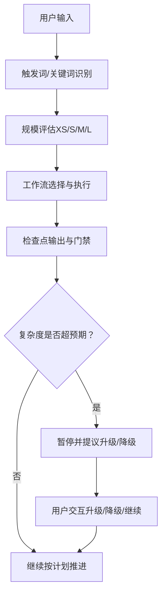
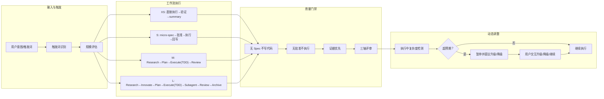
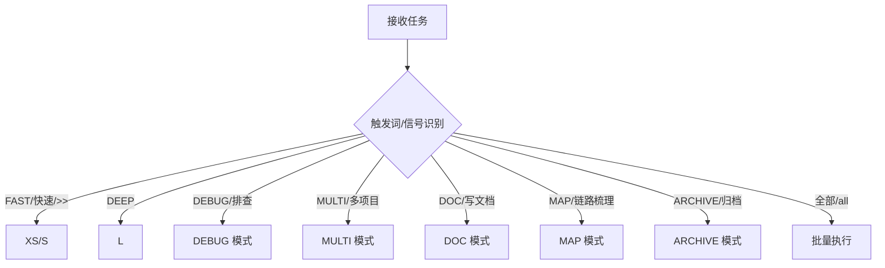
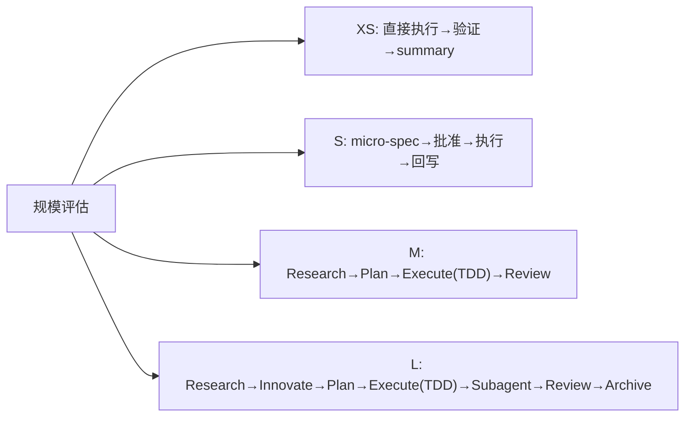
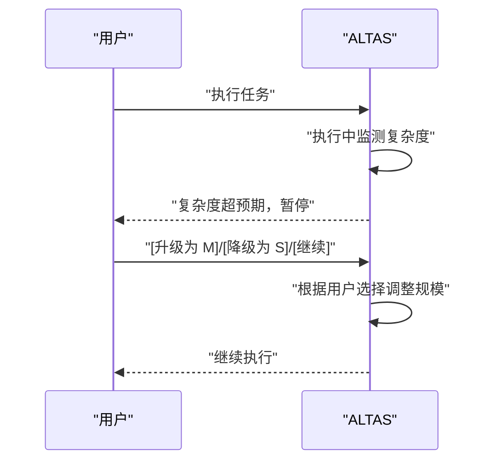
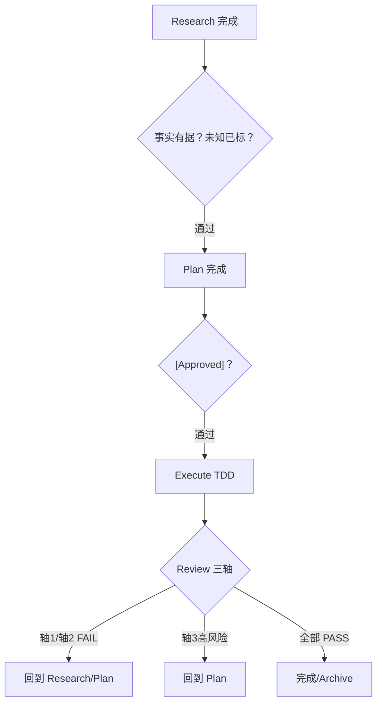
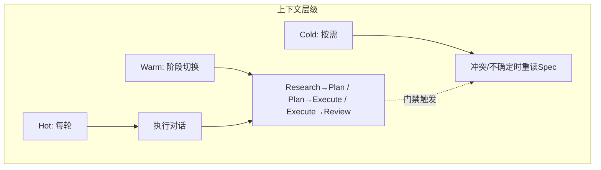
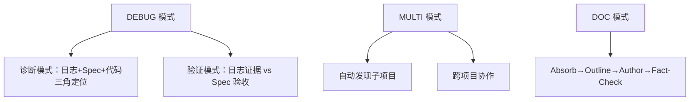
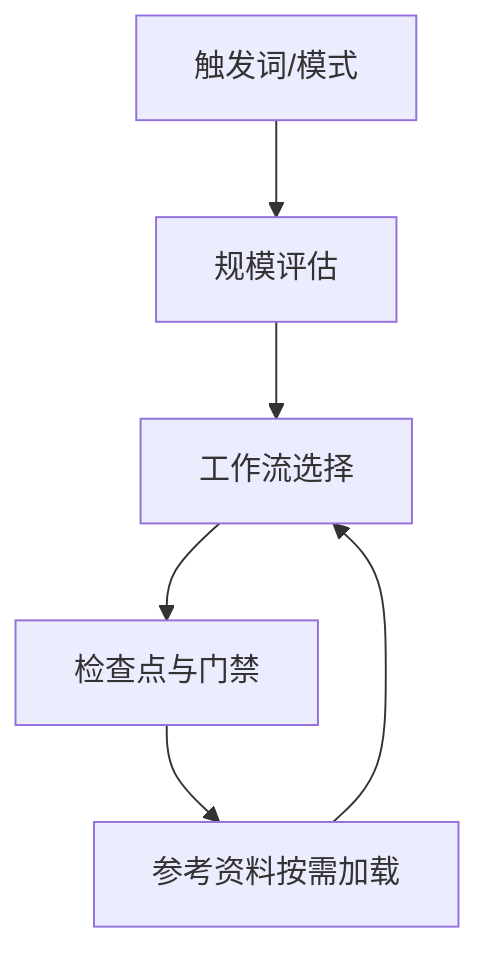

# 智能深度适配算法

<cite>
**本文引用的文件**
- [README.md](file://README.md)
- [README_EN.md](file://README_EN.md)
- [README_JA.md](file://README_JA.md)
- [README_FR.md](file://README_FR.md)
- [altas-workflow/QUICKSTART.md](file://altas-workflow/QUICKSTART.md)
- [altas-workflow/SKILL.md](file://altas-workflow/SKILL.md)
- [altas-workflow/workflow-diagrams.md](file://altas-workflow/workflow-diagrams.md)
- [altas-workflow/reference-index.md](file://altas-workflow/reference-index.md)
- [altas-workflow/references/spec-driven-development/commands.md](file://altas-workflow/references/spec-driven-development/commands.md)
- [altas-workflow/references/checkpoint-driven/spec-lite-template.md](file://altas-workflow/references/checkpoint-driven/spec-lite-template.md)
- [altas-workflow/references/superpowers/test-driven-development/SKILL.md](file://altas-workflow/references/superpowers/test-driven-development/SKILL.md)
- [altas-workflow/references/superpowers/systematic-debugging/root-cause-tracing.md](file://altas-workflow/references/superpowers/systematic-debugging/root-accuracy-tracing.md)
</cite>

## 目录
1. [简介](#简介)
2. [项目结构](#项目结构)
3. [核心组件](#核心组件)
4. [架构总览](#架构总览)
5. [详细组件分析](#详细组件分析)
6. [依赖关系分析](#依赖关系分析)
7. [性能考量](#性能考量)
8. [故障排除指南](#故障排除指南)
9. [结论](#结论)
10. [附录](#附录)

## 简介
本文件系统化阐述 ALTAS Workflow 的“智能深度适配算法”。该算法以任务特征为输入，自动评估并选择合适的执行深度（XS/S/M/L），并在执行过程中动态检测复杂度超出预期时触发暂停与升级/降级提议，确保在不同规模任务之间实现最优的工程投入与质量保障平衡。

## 项目结构
该项目围绕“工作流规范 + 参考资料 + 图表可视化”组织，核心由以下部分组成：
- 工作流规范与技能定义：SKILL.md、QUICKSTART.md、workflow-diagrams.md
- 规模评估与触发词：README 系列文档中的“智能深度适配”章节
- 参考资料索引与按需加载：reference-index.md
- 规模相关参考文件：commands.md、spec-lite-template.md、TDD 规范等

**图表来源**
- [altas-workflow/workflow-diagrams.md:7-41](file://altas-workflow/workflow-diagrams.md#L7-L41)
- [altas-workflow/SKILL.md:45-73](file://altas-workflow/SKILL.md#L45-L73)

**章节来源**
- [README.md:235-268](file://README.md#L235-L268)
- [README_EN.md:235-268](file://README_EN.md#L235-L268)
- [README_JA.md:235-268](file://README_JA.md#L235-L268)
- [README_FR.md:235-268](file://README_FR.md#L235-L268)
- [altas-workflow/QUICKSTART.md:36-49](file://altas-workflow/QUICKSTART.md#L36-L49)
- [altas-workflow/SKILL.md:45-73](file://altas-workflow/SKILL.md#L45-L73)

## 核心组件
- 规模评估器：基于任务特征（如文件数量、逻辑清晰度、影响范围、行数等）进行 XS/S/M/L 判断
- 工作流编排器：根据规模选择对应流程（XS 直接执行；S 写 micro-spec→批准→执行→回写；M/L 研究→计划→执行→评审）
- 自动升降级控制器：在执行中检测复杂度超预期时暂停，提供升级/降级选项
- 检查点与门禁：每步完成后输出标准化检查点，遵循“无 Spec 不写代码、无批准不执行、证据优先”等铁律
- 参考资料按需加载：仅在命中场景时读取对应参考文件，降低 token 消耗与认知负担

**章节来源**
- [altas-workflow/SKILL.md:11-26](file://altas-workflow/SKILL.md#L11-L26)
- [altas-workflow/QUICKSTART.md:119-139](file://altas-workflow/QUICKSTART.md#L119-L139)
- [altas-workflow/workflow-diagrams.md:7-41](file://altas-workflow/workflow-diagrams.md#L7-L41)

## 架构总览
智能深度适配算法的总体流程如下：

**图表来源**
- [altas-workflow/workflow-diagrams.md:7-41](file://altas-workflow/workflow-diagrams.md#L7-L41)
- [altas-workflow/SKILL.md:90-102](file://altas-workflow/SKILL.md#L90-L102)
- [altas-workflow/SKILL.md:200-224](file://altas-workflow/SKILL.md#L200-L224)

## 详细组件分析

### 1) 规模评估与触发词
- 触发词与模式映射：FAST/快速/>>、DEEP、DEBUG/排查、MULTI/多项目、DOC/写文档、MAP/链路梳理、ARCHIVE/归档、全部/all
- 规模评估速查表：基于典型信号（如修复 typo、添加配置项、按钮文案变更、接口参数、函数错误处理、新增 CRUD 接口、模块重构、跨模块数据模型变更、架构级重构、前后端联动）给出推荐规模
- 强制指定：>>=XS，FAST=S，默认=M，DEEP=L

**图表来源**
- [altas-workflow/SKILL.md:61-73](file://altas-workflow/SKILL.md#L61-L73)
- [altas-workflow/QUICKSTART.md:36-49](file://altas-workflow/QUICKSTART.md#L36-L49)
- [altas-workflow/reference-index.md:261-287](file://altas-workflow/reference-index.md#L261-L287)

**章节来源**
- [README.md:246-260](file://README.md#L246-L260)
- [README_EN.md:246-260](file://README_EN.md#L246-L260)
- [README_JA.md:246-260](file://README_JA.md#L246-L260)
- [README_FR.md:246-260](file://README_FR.md#L246-L260)
- [altas-workflow/QUICKSTART.md:155-169](file://altas-workflow/QUICKSTART.md#L155-L169)

### 2) XS/S/M/L 四级深度执行策略
- XS（极速）：typo、配置值、<10 行；直接执行→验证→summary；无需 Spec
- S（快速）：1-2 文件、逻辑清晰；micro-spec（1-3 句）→批准→执行→回写
- M（标准）：3-10 文件、模块内；Research→Plan→Execute(TDD)→Review；Evidence First
- L（深度）：跨模块、>500 行、架构级；Research→Innovate→Plan→Execute(TDD)→Subagent→Review→Archive

**图表来源**
- [altas-workflow/SKILL.md:47-54](file://altas-workflow/SKILL.md#L47-L54)
- [altas-workflow/QUICKSTART.md:38-48](file://altas-workflow/QUICKSTART.md#L38-L48)

**章节来源**
- [README.md:239-244](file://README.md#L239-L244)
- [README_EN.md:239-244](file://README_EN.md#L239-L244)
- [README_JA.md:239-244](file://README_JA.md#L239-L244)
- [README_FR.md:239-244](file://README_FR.md#L239-L244)

### 3) 自动升降级机制
- 执行中复杂度超出预期 → AI 立即暂停，提议升级/降级
- 用户随时可用 [升级为 M]/[降级为 S] 调整
- 强制指定：>>=XS，FAST=S，默认=M，DEEP=L

**图表来源**
- [altas-workflow/SKILL.md:56-60](file://altas-workflow/SKILL.md#L56-L60)
- [README.md:261-266](file://README.md#L261-L266)
- [README_EN.md:261-266](file://README_EN.md#L261-L266)
- [README_JA.md:261-266](file://README_JA.md#L261-L266)
- [README_FR.md:261-266](file://README_FR.md#L261-L266)

**章节来源**
- [altas-workflow/SKILL.md:56-60](file://altas-workflow/SKILL.md#L56-L60)
- [README.md:261-266](file://README.md#L261-L266)

### 4) 执行门禁与检查点
- 铁律约束：无 Spec 不写代码、无批准不执行、Spec 为真、逆向同步、证据优先、无根因不修复、TDD 铁律、可恢复
- 检查点模板：进度、当前成果、预期产出、下一步操作（继续/修改/升级/降级/加载参考）
- 三轴评审：Spec 质量与需求达成、Spec-代码一致性、代码内在质量

**图表来源**
- [altas-workflow/workflow-diagrams.md:71-104](file://altas-workflow/workflow-diagrams.md#L71-L104)
- [altas-workflow/SKILL.md:90-102](file://altas-workflow/SKILL.md#L90-L102)
- [altas-workflow/SKILL.md:200-224](file://altas-workflow/SKILL.md#L200-L224)

**章节来源**
- [README.md:269-305](file://README.md#L269-L305)
- [altas-workflow/SKILL.md:90-102](file://altas-workflow/SKILL.md#L90-L102)
- [altas-workflow/SKILL.md:115-135](file://altas-workflow/SKILL.md#L115-L135)

### 5) 参考资料按需加载与上下文装配
- 按需加载：只在命中场景时读取对应参考文档，避免常驻 token 消耗
- 上下文装配层级：Hot（每轮）、Warm（阶段切换）、Cold（按需）
- 规模相关加载：XS 无需加载；S 按需加载 spec-lite-template；M 标准加载；L 完整加载

**图表来源**
- [altas-workflow/workflow-diagrams.md:241-258](file://altas-workflow/workflow-diagrams.md#L241-L258)
- [altas-workflow/reference-index.md:175-202](file://altas-workflow/reference-index.md#L175-L202)

**章节来源**
- [altas-workflow/reference-index.md:175-202](file://altas-workflow/reference-index.md#L175-L202)
- [altas-workflow/SKILL.md:325-341](file://altas-workflow/SKILL.md#L325-L341)

### 6) TDD 与验证门禁
- TDD 铁律：无失败测试不写生产代码（XS/S 豁免）
- 完成前验证：证据优先，严禁“声称完成”而未运行验证命令
- 执行策略：逐步或批量执行，严格遵守“实现单项→输出检查点请求评审→获批后再执行下一项”

**图表来源**
- [altas-workflow/workflow-diagrams.md:155-169](file://altas-workflow/workflow-diagrams.md#L155-L169)
- [altas-workflow/references/superpowers/test-driven-development/SKILL.md:31-46](file://altas-workflow/references/superpowers/test-driven-development/SKILL.md#L31-L46)

**章节来源**
- [altas-workflow/SKILL.md:182-199](file://altas-workflow/SKILL.md#L182-L199)
- [altas-workflow/references/superpowers/test-driven-development/SKILL.md:31-46](file://altas-workflow/references/superpowers/test-driven-development/SKILL.md#L31-L46)

### 7) 特殊模式与调试
- DEBUG 模式：诊断模式（日志+Spec+代码三角定位）与验证模式（日志证据 vs Spec 验收标准）
- MULTI 模式：自动发现子项目，支持跨项目协作
- DOC 模式：文档专家（吸收→大纲→撰写→事实核查）

**图表来源**
- [altas-workflow/SKILL.md:236-281](file://altas-workflow/SKILL.md#L236-L281)

**章节来源**
- [altas-workflow/SKILL.md:236-281](file://altas-workflow/SKILL.md#L236-L281)

## 依赖关系分析
- 触发词与模式映射依赖于 SKILL.md 中的触发词速查与模式定义
- 规模评估依赖于 README 系列中的速查表与工作流描述
- 执行门禁与检查点模板依赖于 SKILL.md 的铁律与检查点模板
- 参考资料按需加载依赖于 reference-index.md 的索引与各阶段参考文件

**图表来源**
- [altas-workflow/SKILL.md:45-73](file://altas-workflow/SKILL.md#L45-L73)
- [altas-workflow/reference-index.md:1-210](file://altas-workflow/reference-index.md#L1-L210)

**章节来源**
- [altas-workflow/reference-index.md:1-210](file://altas-workflow/reference-index.md#L1-L210)

## 性能考量
- 按需加载：仅在命中场景时读取参考文件，减少 token 消耗与响应延迟
- 上下文层级：Hot/Warm/Cold 分层装配，避免全量上下文常驻
- 执行纪律：单步循环、逐步或批量执行，降低上下文超载与错误传播
- 自动升降级：在复杂度超预期时及时暂停，避免无效投入与风险扩大

## 故障排除指南
- AI 输出过多代码：ALTAS 内置检查点机制，AI 完成一步后必须暂停等确认。若 AI 暴走，回复“请停止，严格执行检查点机制，每次只推进一步”
- 为什么 AI 总是先写测试：这是 Evidence First + TDD 铁律。没有失败测试，AI 生成的代码可能未被执行过。若任务极简，用 >> 触发 XS 模式跳过 TDD
- 如何中途干预：在任意检查点回复“[修改] 请不要使用 Redis，改为内存缓存”，AI 会根据反馈调整 Plan 后重新请求 Approve
- 执行中复杂度超预期：AI 立即暂停并提议升级/降级，用户可随时使用 [升级为 M]/[降级为 S] 调整

**章节来源**
- [altas-workflow/QUICKSTART.md:119-140](file://altas-workflow/QUICKSTART.md#L119-L140)
- [altas-workflow/SKILL.md:56-60](file://altas-workflow/SKILL.md#L56-L60)

## 结论
智能深度适配算法通过“触发词识别—规模评估—工作流选择—检查点与门禁—自动升降级—按需加载”的闭环，实现了对不同规模任务的自适应执行。其核心价值在于：
- 以任务特征为依据，自动匹配最合适的工程投入强度
- 在执行中动态感知复杂度变化，及时调整策略
- 以铁律与检查点保障质量与可追溯性
- 以按需加载与上下文分层降低认知与计算成本

## 附录
- 触发词与模式映射参考：[altas-workflow/SKILL.md:61-73](file://altas-workflow/SKILL.md#L61-L73)
- 规模评估速查表参考：[README.md:246-260](file://README.md#L246-L260)
- 工作流时序图参考：[altas-workflow/workflow-diagrams.md:291-338](file://altas-workflow/workflow-diagrams.md#L291-L338)
- TDD 执行循环参考：[altas-workflow/references/superpowers/test-driven-development/SKILL.md:47-69](file://altas-workflow/references/superpowers/test-driven-development/SKILL.md#L47-L69)
- 三轴评审参考：[altas-workflow/SKILL.md:200-224](file://altas-workflow/SKILL.md#L200-L224)
- 调试与根因追踪参考：[altas-workflow/references/superpowers/systematic-debugging/root-cause-tracing.md:163-170](file://altas-workflow/references/superpowers/systematic-debugging/root-cause-tracing.md#L163-L170)