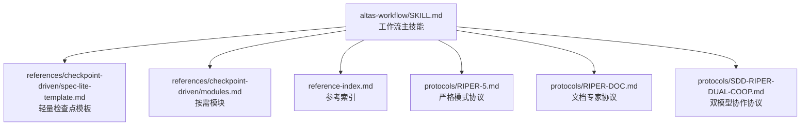
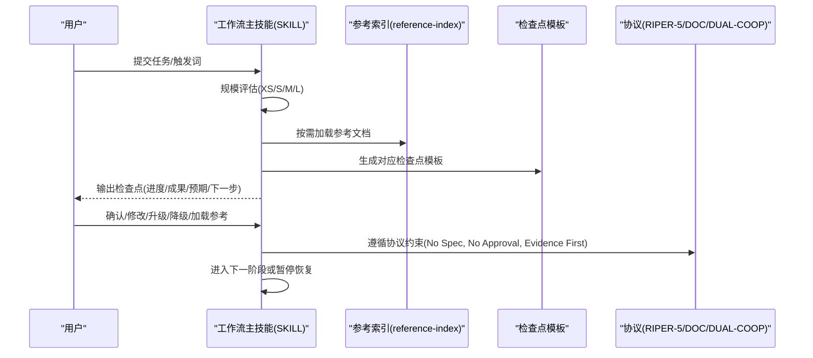
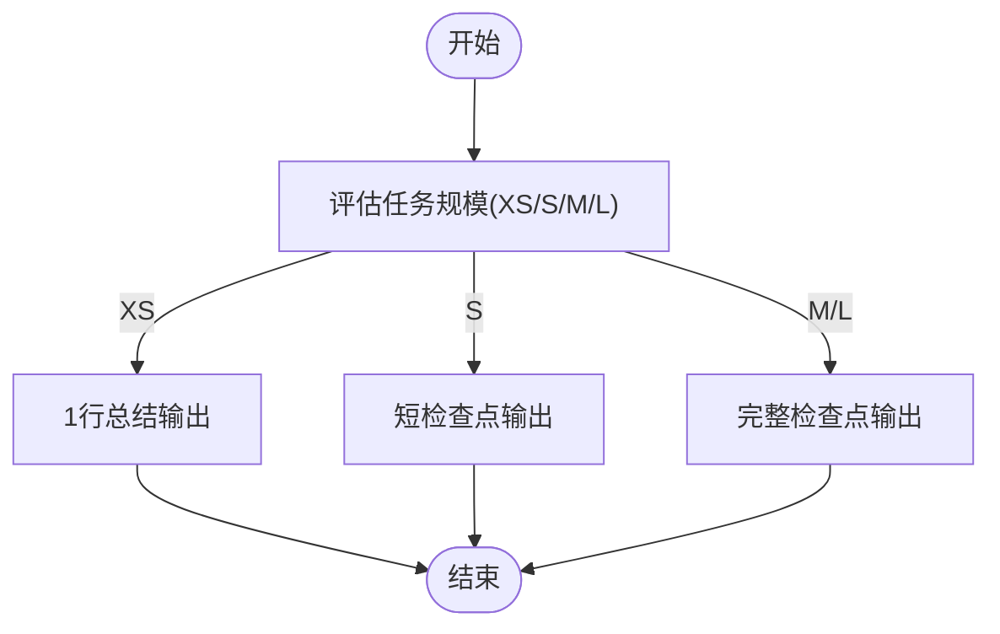
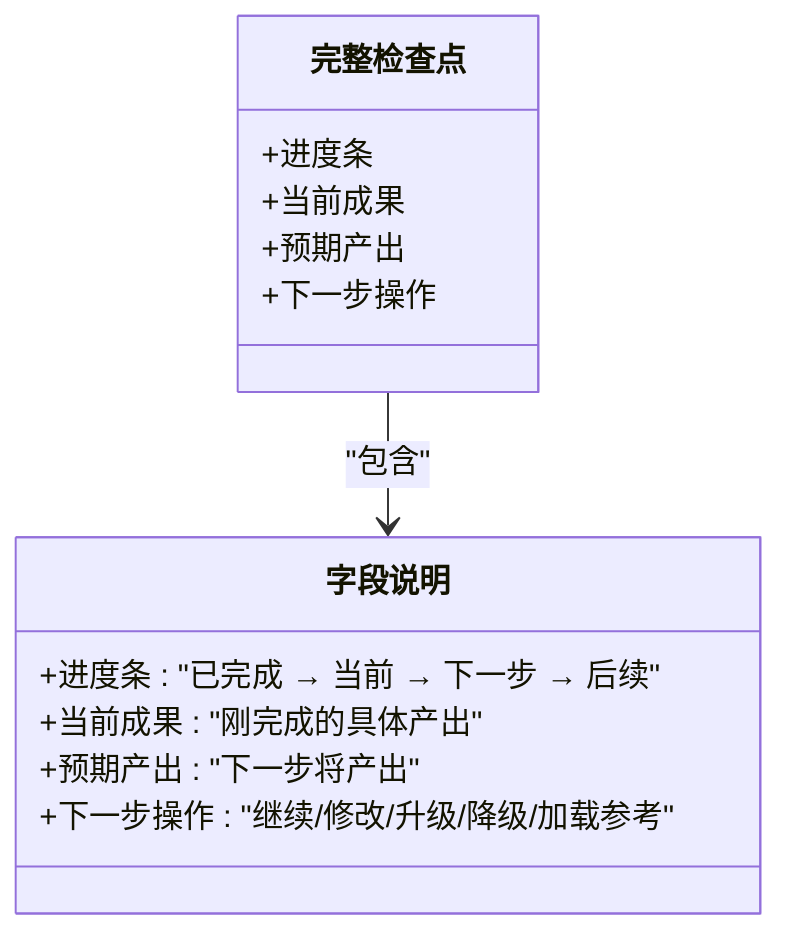
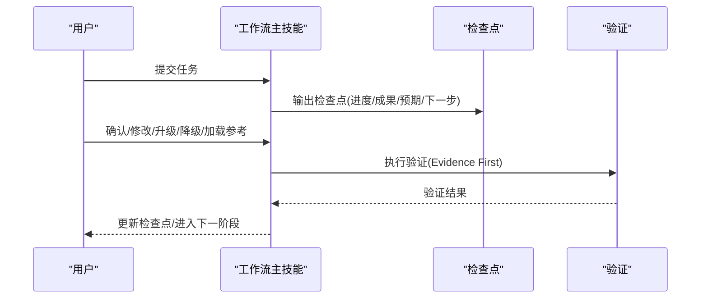
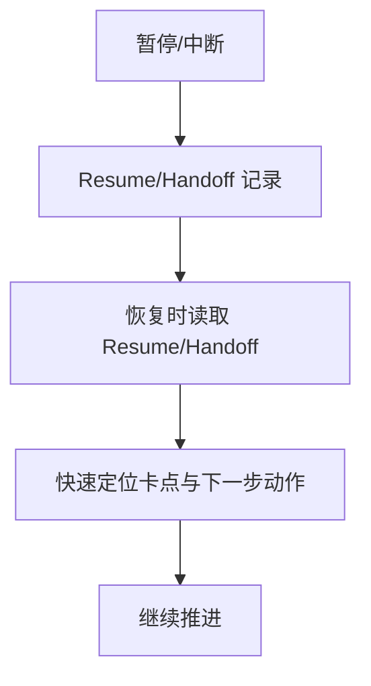
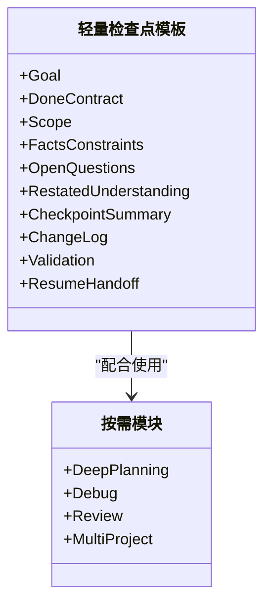
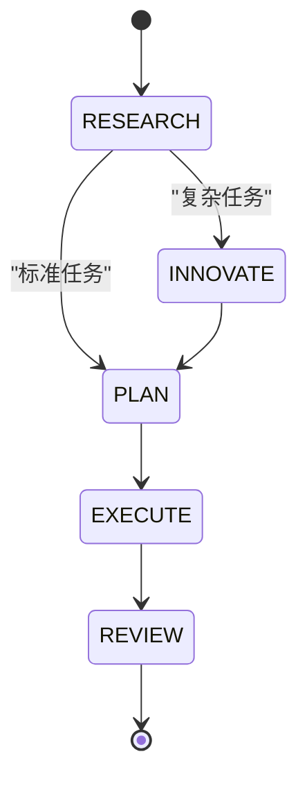
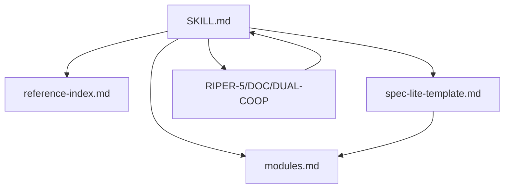

# 标准化检查点系统

<cite>
**本文引用的文件**
- [altas-workflow/SKILL.md](file://altas-workflow/SKILL.md)
- [altas-workflow/reference-index.md](file://altas-workflow/reference-index.md)
- [altas-workflow/references/checkpoint-driven/spec-lite-template.md](file://altas-workflow/references/checkpoint-driven/spec-lite-template.md)
- [altas-workflow/references/checkpoint-driven/modules.md](file://altas-workflow/references/checkpoint-driven/modules.md)
- [altas-workflow/protocols/RIPER-5.md](file://altas-workflow/protocols/RIPER-5.md)
- [altas-workflow/protocols/RIPER-DOC.md](file://altas-workflow/protocols/RIPER-DOC.md)
- [altas-workflow/protocols/SDD-RIPER-DUAL-COOP.md](file://altas-workflow/protocols/SDD-RIPER-DUAL-COOP.md)
</cite>

## 目录
1. [简介](#简介)
2. [项目结构](#项目结构)
3. [核心组件](#核心组件)
4. [架构总览](#架构总览)
5. [详细组件分析](#详细组件分析)
6. [依赖关系分析](#依赖关系分析)
7. [性能考虑](#性能考虑)
8. [故障排除指南](#故障排除指南)
9. [结论](#结论)
10. [附录](#附录)

## 简介
本文件面向“标准化检查点系统”的技术文档，聚焦于检查点格式的设计理念、实现细节与在工作流中的作用。文档覆盖不同规模任务的检查点输出策略差异，完整检查点模板的结构与字段含义，进度跟踪、用户交互与流程控制机制，并阐述检查点如何支持暂停恢复、进度可视化与质量控制。最后提供检查点输出示例与自定义配置方法，帮助读者在实践中高效落地。

## 项目结构
该仓库以“工作流技能”为核心，围绕“规范驱动（Spec-Driven）”“检查点驱动（Checkpoint-Driven）”“超级能力（Superpowers）”三大范式构建。检查点系统主要由以下部分组成：
- 工作流主技能：负责规模评估、阶段推进、按需加载参考、输出检查点与交互控制
- 检查点模板与模块：提供轻量与完整两种检查点模板，以及按需模块（Deep/Debug/Review/Multi）
- 协议与模式：RIPER-5、RIPER-DOC、SDD-RIPER-DUAL-COOP 等，定义严格的模式切换与交互约束

图表来源
- [altas-workflow/SKILL.md:105-136](file://altas-workflow/SKILL.md#L105-L136)
- [altas-workflow/reference-index.md:130-140](file://altas-workflow/reference-index.md#L130-L140)

章节来源
- [altas-workflow/SKILL.md:105-136](file://altas-workflow/SKILL.md#L105-L136)
- [altas-workflow/reference-index.md:130-140](file://altas-workflow/reference-index.md#L130-L140)

## 核心组件
- 规模评估与检查点策略
  - XS 规模：1 行总结（完成事项 + 验证结果）
  - S 规模：短检查点（当前理解 / 核心目标 / 下一步）
  - M/L 规模：完整检查点（包含进度、成果、预期、下一步操作与交互选项）
- 完整检查点模板字段
  - 进度条：已完成 → 当前 → 下一步 → 后续
  - 当前成果：刚完成的具体产出
  - 预期产出：下一步将产出
  - 下一步操作：继续/修改/升级/降级/加载参考
- 用户交互与流程控制
  - 每步完成后输出检查点，等待用户确认或调整
  - 支持升级/降级规模、加载参考文档、批量执行等控制
- 质量控制与恢复锚点
  - 三轴评审（需求达成、Spec-代码一致性、代码内在质量）
  - Resume/Handoff 区块确保暂停后可快速恢复

章节来源
- [altas-workflow/SKILL.md:105-136](file://altas-workflow/SKILL.md#L105-L136)
- [altas-workflow/SKILL.md:200-214](file://altas-workflow/SKILL.md#L200-L214)
- [altas-workflow/references/checkpoint-driven/spec-lite-template.md:40-69](file://altas-workflow/references/checkpoint-driven/spec-lite-template.md#L40-L69)

## 架构总览
检查点系统在整体工作流中的位置与职责如下：
- 输入：用户任务描述或触发词
- 评估：自动判断任务规模（XS/S/M/L）
- 推进：按阶段推进（PRE-RESEARCH → RESEARCH → INNOVATE → PLAN → EXECUTE → REVIEW → ARCHIVE）
- 检查点：每步完成后输出对应格式的检查点
- 交互：用户在检查点上进行确认、修改、升级/降级、加载参考等操作
- 质量：通过三轴评审与证据优先原则保障质量
- 恢复：Resume/Handoff 区块确保暂停恢复

图表来源
- [altas-workflow/SKILL.md:138-224](file://altas-workflow/SKILL.md#L138-L224)
- [altas-workflow/reference-index.md:130-140](file://altas-workflow/reference-index.md#L130-L140)
- [altas-workflow/protocols/RIPER-5.md:128-141](file://altas-workflow/protocols/RIPER-5.md#L128-L141)

## 详细组件分析

### 组件A：检查点输出策略与模板
- XS 规模
  - 输出：1 行总结（完成事项 + 验证结果）
  - 适用：typo、配置值、少于 10 行的小改动
- S 规模
  - 输出：短检查点（当前理解 / 核心目标 / 下一步）
  - 适用：1-2 文件、逻辑清晰的任务
- M/L 规模
  - 输出：完整检查点（进度条、当前成果、预期产出、下一步操作、交互选项）
  - 适用：跨模块、>500 行、架构级任务

图表来源
- [altas-workflow/SKILL.md:107-114](file://altas-workflow/SKILL.md#L107-L114)

章节来源
- [altas-workflow/SKILL.md:107-114](file://altas-workflow/SKILL.md#L107-L114)
- [altas-workflow/SKILL.md:115-135](file://altas-workflow/SKILL.md#L115-L135)

### 组件B：完整检查点模板结构与字段
- 进度条
  - 格式：已完成 → 当前 → 下一步 → 后续
  - 作用：直观展示阶段推进与下一步行动
- 当前成果
  - 描述：刚完成的具体产出（如新增文件、修改接口、通过测试等）
- 预期产出
  - 描述：下一步将产出（如实现某个接口、跑通某条链路、生成报告等）
- 下一步操作
  - 继续/Approved：同意进入下一步
  - 修改 + 意见：调整当前成果
  - 升级为X / 降级为X：调整规模
  - 加载参考: XXX：查看某参考文档的详情

图表来源
- [altas-workflow/SKILL.md:115-135](file://altas-workflow/SKILL.md#L115-L135)

章节来源
- [altas-workflow/SKILL.md:115-135](file://altas-workflow/SKILL.md#L115-L135)

### 组件C：进度跟踪、用户交互与流程控制
- 进度跟踪
  - 每步完成后输出检查点，确保可见性与可审计性
  - 通过“当前理解/核心目标/下一步”维持目标一致性
- 用户交互
  - 用户可在检查点上进行确认、修改、升级/降级、加载参考等操作
  - 支持批量执行（全部/All）以提升效率
- 流程控制
  - 执行纪律：严格禁止一次性实现多个 Checklist 项，必须“实现单项 → 输出检查点请求 Review → 获批后再执行下一项”
  - 升降级：执行中发现复杂度超出预期 → 立即暂停，提议升级；用户可随时调整规模
  - 暂停恢复：Resume/Handoff 区块确保暂停后可快速恢复

图表来源
- [altas-workflow/SKILL.md:182-200](file://altas-workflow/SKILL.md#L182-L200)
- [altas-workflow/SKILL.md:200-214](file://altas-workflow/SKILL.md#L200-L214)

章节来源
- [altas-workflow/SKILL.md:182-200](file://altas-workflow/SKILL.md#L182-L200)
- [altas-workflow/SKILL.md:200-214](file://altas-workflow/SKILL.md#L200-L214)

### 组件D：检查点在工作流中的作用
- 暂停恢复
  - Resume/Handoff 区块记录当前状态、卡点、下一步唯一动作与下一轮核心目标
  - 保证长任务暂停后可快速恢复
- 进度可视化
  - 通过“已完成 → 当前 → 下一步 → 后续”的进度条，直观呈现推进状态
- 质量控制
  - 三轴评审：需求达成、Spec-代码一致性、代码内在质量
  - Evidence First：完成由验证结果证明，非模型自宣布
  - No Approval, No Execute：Plan 阶段人类不点头，绝不写代码

图表来源
- [altas-workflow/SKILL.md:200-214](file://altas-workflow/SKILL.md#L200-L214)
- [altas-workflow/references/checkpoint-driven/spec-lite-template.md:64-69](file://altas-workflow/references/checkpoint-driven/spec-lite-template.md#L64-L69)

章节来源
- [altas-workflow/SKILL.md:200-214](file://altas-workflow/SKILL.md#L200-L214)
- [altas-workflow/references/checkpoint-driven/spec-lite-template.md:64-69](file://altas-workflow/references/checkpoint-driven/spec-lite-template.md#L64-L69)

### 组件E：轻量检查点模板与按需模块
- 轻量检查点模板（S 规模）
  - 包含：Goal、Done Contract、Scope、Facts/Constraints、Open Questions、Restated Understanding、Checkpoint Summary、Change Log、Validation、Resume/Handoff
  - 建议：fast 任务也至少保留关键区块，确保可恢复与可验证
- 按需模块
  - Deep Planning：需求模糊、架构设计、跨模块重构、迁移、长链路任务
  - Debug：系统化排查，先复现、再缩小范围、形成假设、验证
  - Review：三轴评审（Completion/Fidelity/Quality/Risk）
  - Multi-project：多仓、monorepo、跨子项目任务

图表来源
- [altas-workflow/references/checkpoint-driven/spec-lite-template.md:1-85](file://altas-workflow/references/checkpoint-driven/spec-lite-template.md#L1-L85)
- [altas-workflow/references/checkpoint-driven/modules.md:1-57](file://altas-workflow/references/checkpoint-driven/modules.md#L1-L57)

章节来源
- [altas-workflow/references/checkpoint-driven/spec-lite-template.md:1-85](file://altas-workflow/references/checkpoint-driven/spec-lite-template.md#L1-L85)
- [altas-workflow/references/checkpoint-driven/modules.md:1-57](file://altas-workflow/references/checkpoint-driven/modules.md#L1-L57)

### 组件F：协议与模式对检查点的约束
- RIPER-5
  - 严格模式下的五态机：RESEARCH → INNOVATE → PLAN → EXECUTE → REVIEW
  - 每次响应必须声明当前模式，违反将导致灾难性后果
- RIPER-DOC
  - 文档专家模式：ABSORB → OUTLINE → AUTHOR → FACT-CHECK
  - 严禁凭空猜测，必须以代码为准
- SDD-RIPER-DUAL-COOP
  - 双模型协作：External Architect（分析/规划/审查）与 Internal Scout/Executor（探索/执行）
  - 以 Spec 为中心，Chat 历史是暂时的，Spec 是持久的

图表来源
- [altas-workflow/protocols/RIPER-5.md:25-125](file://altas-workflow/protocols/RIPER-5.md#L25-L125)
- [altas-workflow/protocols/RIPER-DOC.md:9-60](file://altas-workflow/protocols/RIPER-DOC.md#L9-L60)
- [altas-workflow/protocols/SDD-RIPER-DUAL-COOP.md:76-153](file://altas-workflow/protocols/SDD-RIPER-DUAL-COOP.md#L76-L153)

章节来源
- [altas-workflow/protocols/RIPER-5.md:25-125](file://altas-workflow/protocols/RIPER-5.md#L25-L125)
- [altas-workflow/protocols/RIPER-DOC.md:9-60](file://altas-workflow/protocols/RIPER-DOC.md#L9-L60)
- [altas-workflow/protocols/SDD-RIPER-DUAL-COOP.md:76-153](file://altas-workflow/protocols/SDD-RIPER-DUAL-COOP.md#L76-L153)

## 依赖关系分析
- 工作流主技能依赖参考索引与按需模块，以实现“按需加载”
- 检查点模板与协议共同约束输出格式与交互行为
- 三轴评审与证据优先原则贯穿执行阶段，保障质量

图表来源
- [altas-workflow/SKILL.md:138-224](file://altas-workflow/SKILL.md#L138-L224)
- [altas-workflow/reference-index.md:130-140](file://altas-workflow/reference-index.md#L130-L140)

章节来源
- [altas-workflow/SKILL.md:138-224](file://altas-workflow/SKILL.md#L138-L224)
- [altas-workflow/reference-index.md:130-140](file://altas-workflow/reference-index.md#L130-L140)

## 性能考虑
- 按需加载：只在命中场景时加载对应模块，避免常驻消耗 token
- 单步循环：严格限制每轮只实现一个 Checklist 项，降低上下文超载风险
- 批量执行：在用户明确授权时使用“全部/All”批量执行，提高效率
- 命名约定：统一时间前缀与产物命名，便于检索与版本管理

## 故障排除指南
- 偏差处理
  - 发现偏差：先更新 Spec → 再修代码 → 重对齐核心目标
  - 无根因不修复：Debug 模式必须先定位根因
- 证据不足
  - Evidence First：完成由验证结果证明，非模型自宣布
  - 三轴评审：任一轴 FAIL → 回到 Research/Plan
- 协议违规
  - 严格模式协议：未声明模式或违反模式切换将导致灾难性后果
  - 文档专家协议：严禁猜测实现，必须对照实际代码验证

章节来源
- [altas-workflow/SKILL.md:191-196](file://altas-workflow/SKILL.md#L191-L196)
- [altas-workflow/SKILL.md:236-246](file://altas-workflow/SKILL.md#L236-L246)
- [altas-workflow/protocols/RIPER-5.md:128-141](file://altas-workflow/protocols/RIPER-5.md#L128-L141)
- [altas-workflow/protocols/RIPER-DOC.md:43-60](file://altas-workflow/protocols/RIPER-DOC.md#L43-L60)

## 结论
标准化检查点系统通过“按规模差异化输出、完整模板字段、严格交互与流程控制、三轴评审与证据优先”四大支柱，实现了高质量、可恢复、可审计的工作流推进。配合按需加载与命名约定，系统在不同规模任务中均能提供稳定、可控、可视化的开发体验。

## 附录
- 检查点输出示例（路径）
  - 完整检查点模板示例：[altas-workflow/SKILL.md:115-135](file://altas-workflow/SKILL.md#L115-L135)
  - 轻量检查点模板示例：[altas-workflow/references/checkpoint-driven/spec-lite-template.md:1-85](file://altas-workflow/references/checkpoint-driven/spec-lite-template.md#L1-L85)
- 自定义配置方法
  - 触发词与模式：FAST/DEEP/DEBUG/MULTI/DOC/MAP/ARCHIVE 及其行为定义
  - 规模评估与升降级：执行中发现复杂度超出预期 → 立即暂停，提议升级；用户随时可调整
  - 按需加载：根据 reference-index.md 中的索引，在命中场景时加载对应参考文档
  - 命名约定：统一时间前缀与产物命名，便于检索与版本管理

章节来源
- [altas-workflow/SKILL.md:61-73](file://altas-workflow/SKILL.md#L61-L73)
- [altas-workflow/SKILL.md:56-60](file://altas-workflow/SKILL.md#L56-L60)
- [altas-workflow/reference-index.md:130-140](file://altas-workflow/reference-index.md#L130-L140)
- [altas-workflow/SKILL.md:309-322](file://altas-workflow/SKILL.md#L309-L322)