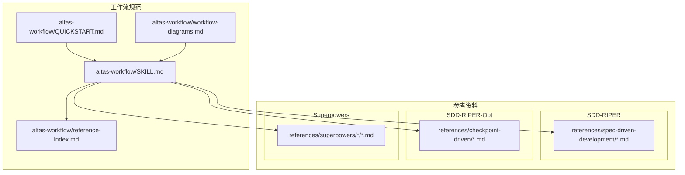
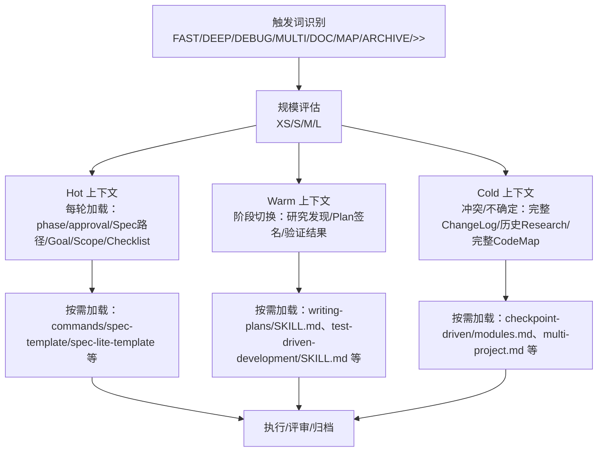
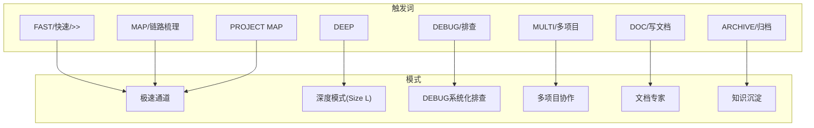
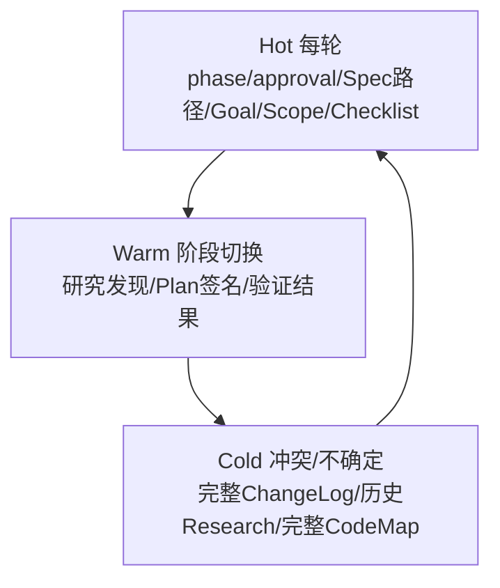
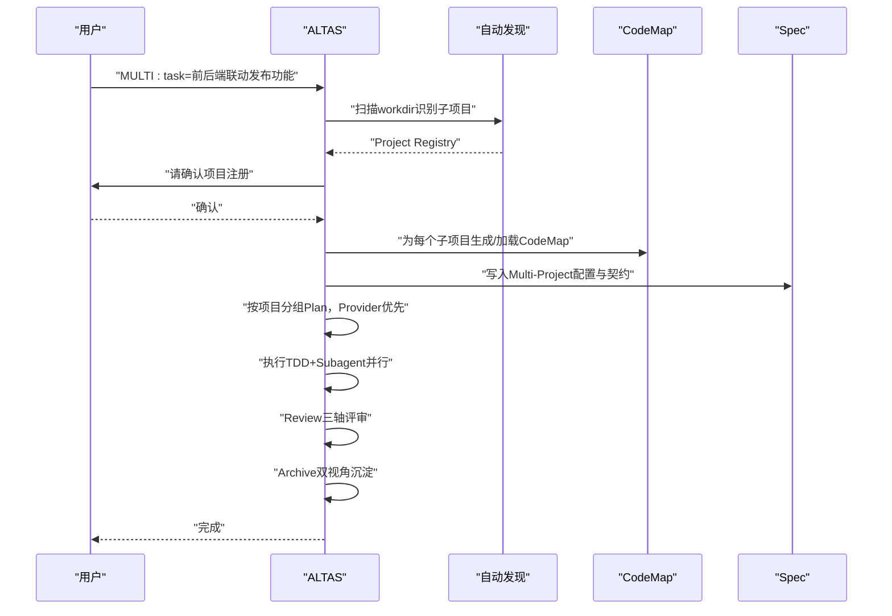
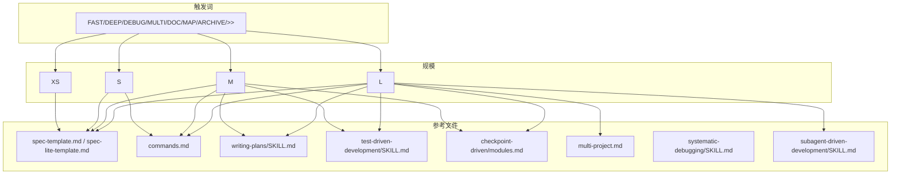

# 渐进式披露机制

<cite>
**本文引用的文件**
- [altas-workflow/QUICKSTART.md](file://altas-workflow/QUICKSTART.md)
- [altas-workflow/SKILL.md](file://altas-workflow/SKILL.md)
- [altas-workflow/reference-index.md](file://altas-workflow/reference-index.md)
- [altas-workflow/workflow-diagrams.md](file://altas-workflow/workflow-diagrams.md)
- [altas-workflow/references/checkpoint-driven/modules.md](file://altas-workflow/references/checkpoint-driven/modules.md)
- [altas-workflow/references/checkpoint-driven/spec-lite-template.md](file://altas-workflow/references/checkpoint-driven/spec-lite-template.md)
- [altas-workflow/references/spec-driven-development/spec-template.md](file://altas-workflow/references/spec-driven-development/spec-template.md)
- [altas-workflow/references/spec-driven-development/commands.md](file://altas-workflow/references/spec-driven-development/commands.md)
- [altas-workflow/references/spec-driven-development/multi-project.md](file://altas-workflow/references/spec-driven-development/multi-project.md)
- [altas-workflow/references/superpowers/test-driven-development/SKILL.md](file://altas-workflow/references/superpowers/test-driven-development/SKILL.md)
- [altas-workflow/references/superpowers/systematic-debugging/SKILL.md](file://altas-workflow/references/superpowers/systematic-debugging/SKILL.md)
- [altas-workflow/references/superpowers/writing-plans/SKILL.md](file://altas-workflow/references/superpowers/writing-plans/SKILL.md)
- [altas-workflow/references/superpowers/subagent-driven-development/SKILL.md](file://altas-workflow/references/superpowers/subagent-driven-development/SKILL.md)
</cite>

## 目录
1. [简介](#简介)
2. [项目结构](#项目结构)
3. [核心组件](#核心组件)
4. [架构总览](#架构总览)
5. [详细组件分析](#详细组件分析)
6. [依赖分析](#依赖分析)
7. [性能考量](#性能考量)
8. [故障排查指南](#故障排查指南)
9. [结论](#结论)
10. [附录](#附录)

## 简介
本文件系统化阐述 ALTAS Workflow 的“渐进式披露机制”。该机制通过“按需加载参考资料”避免上下文污染、降低 Token 消耗、提升 AI 执行效率，并以 Hot/Warm/Cold 三层上下文加载策略实现对不同阶段与情境的精细化控制。同时，结合触发词机制，精确控制参考资料的加载时机与范围，从而支持多项目协作与复杂任务的分阶段处理。

## 项目结构
仓库采用“工作流规范 + 参考资料 + 协议/方法论”的分层组织方式：
- 工作流规范：位于 altas-workflow/ 目录，包含技能定义、触发词、上下文装配策略与流程图。
- 参考资料：位于 altas-workflow/references/，按来源（SDD-RIPER、SDD-RIPER-Opt、Superpowers）与主题（Spec、Plan、TDD、Debug、Multi-project 等）组织。
- 协议与方法论：位于 altas-workflow/protocols/ 与 docs/，提供严格模式与团队落地指导。



**图表来源**
- [altas-workflow/SKILL.md](file://altas-workflow/SKILL.md)
- [altas-workflow/reference-index.md](file://altas-workflow/reference-index.md)
- [altas-workflow/workflow-diagrams.md](file://altas-workflow/workflow-diagrams.md)

**章节来源**
- [altas-workflow/QUICKSTART.md](file://altas-workflow/QUICKSTART.md)
- [altas-workflow/SKILL.md](file://altas-workflow/SKILL.md)
- [altas-workflow/reference-index.md](file://altas-workflow/reference-index.md)
- [altas-workflow/workflow-diagrams.md](file://altas-workflow/workflow-diagrams.md)

## 核心组件
- 触发词与模式映射：通过触发词（如 FAST、DEEP、DEBUG、MULTI、DOC、MAP、ARCHIVE、>>、sdd_bootstrap 等）识别任务类型与模式，决定工作流深度与加载策略。
- 规模评估：根据任务复杂度（行数、文件数、模块范围、是否跨模块/跨项目）自动选择 XS/S/M/L 规模，进而确定上下文装配层级与加载范围。
- 渐进式披露：按阶段与情境动态加载参考文件，避免一次性加载全部资料，减少上下文污染与 Token 消耗。
- Hot/Warm/Cold 三层上下文加载策略：每轮对话（Hot）、阶段切换（Warm）、冲突/不确定时（Cold）分别加载不同粒度的上下文，确保“最小必要上下文”。
- 铁律与门禁：No Spec No Code、No Approval No Execute、Evidence First 等约束贯穿全流程，保证质量与可追溯性。

**章节来源**
- [altas-workflow/SKILL.md](file://altas-workflow/SKILL.md)
- [altas-workflow/workflow-diagrams.md](file://altas-workflow/workflow-diagrams.md)

## 架构总览
下图展示了触发词如何驱动工作流、规模评估如何影响上下文装配层级，以及各阶段如何按需加载参考文件。



**图表来源**
- [altas-workflow/SKILL.md](file://altas-workflow/SKILL.md)
- [altas-workflow/reference-index.md](file://altas-workflow/reference-index.md)
- [altas-workflow/workflow-diagrams.md](file://altas-workflow/workflow-diagrams.md)

**章节来源**
- [altas-workflow/SKILL.md](file://altas-workflow/SKILL.md)
- [altas-workflow/reference-index.md](file://altas-workflow/reference-index.md)
- [altas-workflow/workflow-diagrams.md](file://altas-workflow/workflow-diagrams.md)

## 详细组件分析

### 触发词机制与模式映射
- 触发词集合：FAST、DEEP、DEBUG、MULTI、DOC、MAP、ARCHIVE、>>、sdd_bootstrap、快速、排查、多项目、写文档、链路梳理、归档、全部。
- 模式映射：
  - 极速通道（>>/FAST/快速）：跳过 Research/Plan，直接执行，事后同步 Spec。
  - 深度模式（DEEP）：Size L，进入 Innovate/Plan/Execute/Subagent/Review/Archive。
  - 系统化 Debug（DEBUG/排查）：诊断/验证双子模式，只读分析，必要时进入 RIPER 或 FAST。
  - 多项目协作（MULTI/多项目）：自动发现子项目，作用域隔离，跨项目契约与依赖顺序。
  - 文档专家（DOC/写文档）：Absorb→Outline→Author→Fact-Check。
  - CodeMap（MAP/链路梳理）：功能级/项目级 CodeMap，只读分析。
  - 知识沉淀（ARCHIVE/归档）：双视角归档（human/llm），附 Trace to Sources。
- 加载策略：不同模式在进入阶段时按需加载对应参考文件，避免常驻全部资料。



**图表来源**
- [altas-workflow/SKILL.md](file://altas-workflow/SKILL.md)
- [altas-workflow/workflow-diagrams.md](file://altas-workflow/workflow-diagrams.md)

**章节来源**
- [altas-workflow/SKILL.md](file://altas-workflow/SKILL.md)
- [altas-workflow/workflow-diagrams.md](file://altas-workflow/workflow-diagrams.md)

### 规模评估与上下文装配策略
- 规模评估：根据任务复杂度（typo/<10行→XS；1-2文件→S；3-10文件→M；跨模块/>500行→L）自动选择工作流深度。
- 上下文装配策略（Hot/Warm/Cold）：
  - Hot（每轮）：包含 phase、approval 状态、Spec 路径、Goal、Scope、活跃 Checklist 等，确保对话轮次间上下文稳定。
  - Warm（阶段切换）：在 Research→Plan、Plan→Execute、Execute→Review 时加载研究发现、Plan 文件/签名、验证结果等。
  - Cold（按需）：冲突/不确定时从磁盘重读完整 Spec，加载完整 ChangeLog、历史 Research、完整 CodeMap 等。
- 硬门：冲突/缺失/不确定时，立即从磁盘重读完整 Spec，确保决策依据可靠。



**图表来源**
- [altas-workflow/SKILL.md](file://altas-workflow/SKILL.md)

**章节来源**
- [altas-workflow/SKILL.md](file://altas-workflow/SKILL.md)

### 按需加载参考资料的实现原理
- 参考资料索引：通过 reference-index.md 提供统一发现入口，按阶段/模式/来源分类索引，AI 仅在命中场景时加载对应文件。
- 核心参考（高频）：写 Spec、命令参数、TDD 执行、Debug 模式、写 Plan、Subagent 驱动、完成前验证、进入 Review、快速参考、完整协议定义、落盘命名约定、流程可视化参考等。
- 触发词与加载映射：不同触发词在进入相应阶段时，自动加载对应参考文件，例如：
  - DEBUG 模式：systematic-debugging/SKILL.md；根因不明追加 root-cause-tracing.md；异步问题追加 condition-based-waiting.md。
  - MULTI 模式：multi-project.md；作用域隔离、跨项目契约、依赖顺序。
  - TDD 执行：test-driven-development/SKILL.md。
  - 写 Plan：writing-plans/SKILL.md。
  - Subagent 驱动：subagent-driven-development/SKILL.md。
  - 进入 Review：checkpoint-driven/modules.md。
  - 查看命令参数：spec-driven-development/commands.md。
  - 写 Spec：M/L 使用 spec-template.md；S 使用 spec-lite-template.md；命名约定：conventions.md。

```mermaid
mindmap
root((参考资料))
Spec驱动开发
spec-template.md
commands.md
workflow-quickref.md
usage-examples.md
multi-project.md
archive-template.md
sdd-riper-one-protocol.md
Checkpoint驱动
modules.md
conventions.md
spec-lite-template.md
Superpowers
brainstorming
writing-plans
test-driven-development
systematic-debugging
subagent-driven-development
verification-before-completion
executing-plans
requesting-code-review
receiving-code-review
协议
RIPER-5
SDD-RIPER-DUAL-COOP
RIPER-DOC
方法论
从传统到大模型
团队落地指南
手把手教程
AI原生研发范式
```

**图表来源**
- [altas-workflow/reference-index.md](file://altas-workflow/reference-index.md)

**章节来源**
- [altas-workflow/reference-index.md](file://altas-workflow/reference-index.md)
- [altas-workflow/SKILL.md](file://altas-workflow/SKILL.md)

### 多项目协作与复杂任务分阶段处理
- 自动发现与项目注册：扫描 workdir，通过标志文件识别子项目，生成 Project Registry 并请用户确认。
- 作用域隔离：默认 local，仅在 CROSS 时允许跨项目改动；codemap-first，切换项目前必须加载目标项目的 codemap/context。
- 跨项目契约：Provider→Interface→Consumer→Breaking Change→迁移方案；Plan 按项目分组，Provider 优先。
- 分阶段处理：Pre-Research（create_codemap/build_context_bundle）→ Research（目标对齐/事实依据/未知标注）→ Innovate（方案对比/Pros/Cons/Risks）→ Plan（Checklist/文件变更/签名）→ Execute（TDD 循环/Subagent 并行）→ Review（三轴评审）→ Archive（双视角沉淀）。



**图表来源**
- [altas-workflow/SKILL.md](file://altas-workflow/SKILL.md)
- [altas-workflow/references/spec-driven-development/multi-project.md](file://altas-workflow/references/spec-driven-development/multi-project.md)

**章节来源**
- [altas-workflow/SKILL.md](file://altas-workflow/SKILL.md)
- [altas-workflow/references/spec-driven-development/multi-project.md](file://altas-workflow/references/spec-driven-development/multi-project.md)

### 触发词与加载时机的配置示例
- 极速通道（XS/S）：使用 >> 或 FAST 或快速，跳过 Research/Plan，直接执行，事后同步 Spec。S 规模 micro-spec 回写后确保 Goal 与验证结果落盘。
- 深度模式（L）：DEEP，进入 Innovate→Plan→Execute（TDD+Subagent）→Review→Archive。
- Debug 模式：DEBUG/排查，诊断模式（日志+Spec+代码三角定位→根因候选）；验证模式（日志证据 vs Spec 验收标准→PASS/FAIL/INCONCLUSIVE）。
- MULTI 模式：MULTI/多项目，自动发现子项目；CROSS/跨项目允许跨项目改动；SWITCH 切换 active_project；REGISTRY 显示项目列表；SCOPE LOCAL 回到本地。
- DOC 模式：DOC/写文档，Absorb→Outline→Author→Fact-Check。
- MAP 模式：MAP/链路梳理，输出 CodeMap 后暂停等待指示；升级为修改代码时进入 Research→Plan→Execute。
- ARCHIVE 模式：ARCHIVE/归档，生成双视角归档（human/llm），每个结论附 Trace to Sources。

**章节来源**
- [altas-workflow/SKILL.md](file://altas-workflow/SKILL.md)
- [altas-workflow/QUICKSTART.md](file://altas-workflow/QUICKSTART.md)

## 依赖分析
- 触发词与阶段依赖：触发词决定进入的阶段与模式，进而依赖对应参考文件；例如 DEBUG 模式依赖 systematic-debugging/SKILL.md 及其配套文件，MULTI 模式依赖 multi-project.md。
- 规模与加载范围：XS 规模无需加载任何参考；S 规模按需加载 spec-lite-template.md 与 conventions.md；M 规模标准加载 spec-template.md、commands.md、writing-plans/SKILL.md、test-driven-development/SKILL.md、verification-before-completion/SKILL.md、checkpoint-driven/modules.md；L 规模完整加载并在 M 基础上增加 brainstorming/SKILL.md、subagent-driven-development/SKILL.md、dispatching-parallel-agents/SKILL.md、multi-project.md、archive-template.md、finishing-a-development-branch/SKILL.md。
- 铁律与门禁：No Spec No Code、No Approval No Execute、Evidence First 等贯穿全流程，作为硬门限制加载与执行。



**图表来源**
- [altas-workflow/reference-index.md](file://altas-workflow/reference-index.md)
- [altas-workflow/SKILL.md](file://altas-workflow/SKILL.md)

**章节来源**
- [altas-workflow/reference-index.md](file://altas-workflow/reference-index.md)
- [altas-workflow/SKILL.md](file://altas-workflow/SKILL.md)

## 性能考量
- Token 与上下文控制：通过 Hot/Warm/Cold 三层上下文装配，仅在必要时加载参考文件，显著降低 Token 消耗与上下文污染风险。
- 触发词精准控制：触发词与模式映射确保 AI 在正确时机加载正确资料，避免无关信息干扰。
- 规模评估自动化：根据任务复杂度自动选择 XS/S/M/L，减少人工判断成本与误判。
- 多项目隔离：作用域隔离与 codemap-first 策略降低跨项目上下文噪声，提升执行效率。
- 铁律门禁：No Spec No Code、No Approval No Execute、Evidence First 等约束减少无效尝试与回溯，提升整体效率。

[本节为通用性能讨论，无需特定文件分析]

## 故障排查指南
- 触发词未生效：确认输入是否包含受支持的触发词；若未命中触发词，AI 不会主动输出初始化提示。
- 上下文超载：遵循 Hot/Warm/Cold 策略，避免一次性加载过多资料；在冲突/不确定时使用 Cold 重读完整 Spec。
- 规模误判：若执行中发现复杂度超出预期，立即暂停并提议升级；用户可随时使用“升级为M/降级为S”调整。
- 多项目冲突：切换项目或跨项目改动前，必须加载目标项目的 codemap/context；跨项目改动需记录契约与依赖顺序。
- Debug 未找到根因：按 Systematic Debugging 四阶段执行，先 Root Cause Investigation，再 Pattern Analysis、Hypothesis Testing、Implementation；必要时使用 root-cause-tracing.md、defense-in-depth.md、condition-based-waiting.md。
- TDD 未按流程执行：严格遵守 No Production Code Without Failing Test First；RED→GREEN→REFACTOR 循环不可跳过。

**章节来源**
- [altas-workflow/SKILL.md](file://altas-workflow/SKILL.md)
- [altas-workflow/references/superpowers/systematic-debugging/SKILL.md](file://altas-workflow/references/superpowers/systematic-debugging/SKILL.md)
- [altas-workflow/references/superpowers/test-driven-development/SKILL.md](file://altas-workflow/references/superpowers/test-driven-development/SKILL.md)
- [altas-workflow/references/spec-driven-development/multi-project.md](file://altas-workflow/references/spec-driven-development/multi-project.md)

## 结论
ALTAS 的渐进式披露机制通过“触发词 + 规模评估 + Hot/Warm/Cold 三层上下文装配 + 按需加载参考资料”的组合拳，实现了对复杂任务与多项目协作的高效支持。该机制在保证质量与可追溯性的前提下，显著降低了上下文污染与 Token 消耗，提升了 AI 的执行效率与稳定性。配合严格的铁律与门禁，确保每个阶段都有明确的产出与验证，最终实现高质量、可复用的知识沉淀。

[本节为总结性内容，无需特定文件分析]

## 附录
- 触发词速查与动作映射详见 SKILL.md 中的“触发词速查”与“特殊模式”章节。
- 规模评估速查与自动升降级机制详见 SKILL.md 中的“规模评估速查”与“自动升降级”。
- 参考资料索引与按来源分类详见 reference-index.md。
- 流程图与可视化参考详见 workflow-diagrams.md。

**章节来源**
- [altas-workflow/SKILL.md](file://altas-workflow/SKILL.md)
- [altas-workflow/reference-index.md](file://altas-workflow/reference-index.md)
- [altas-workflow/workflow-diagrams.md](file://altas-workflow/workflow-diagrams.md)