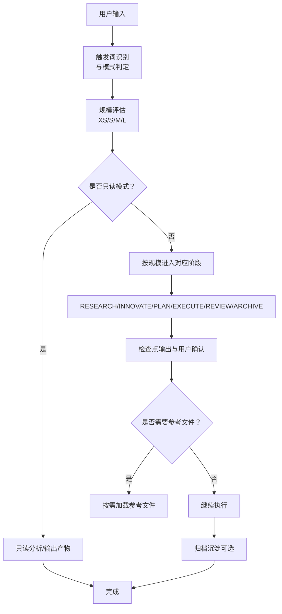
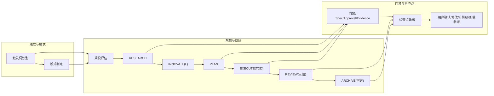
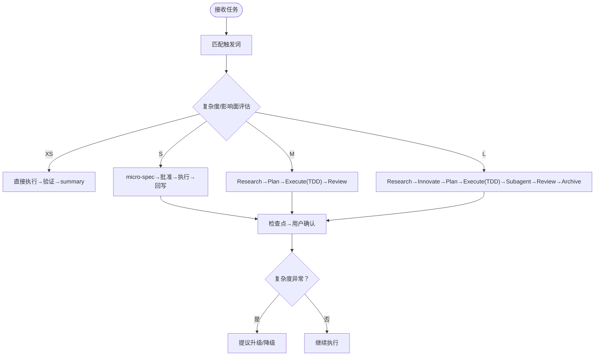
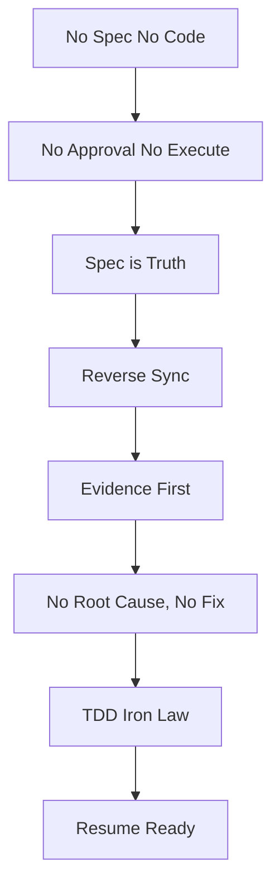
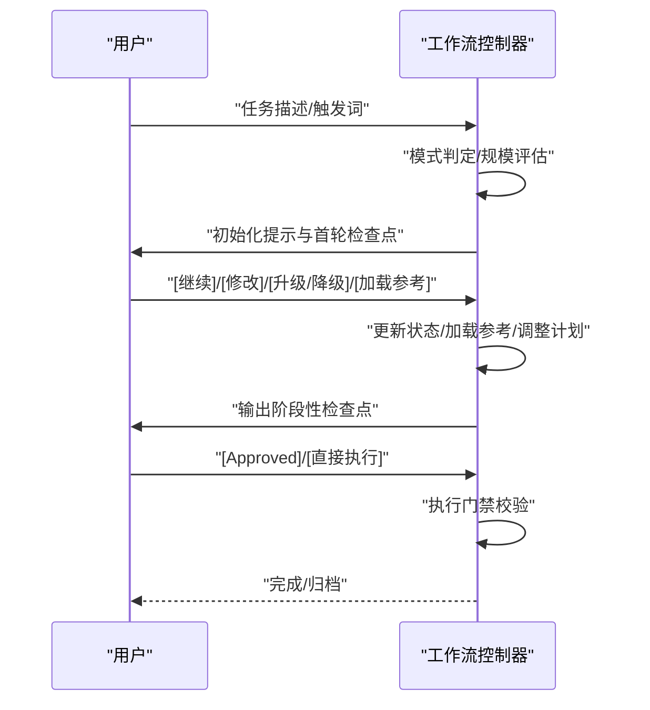
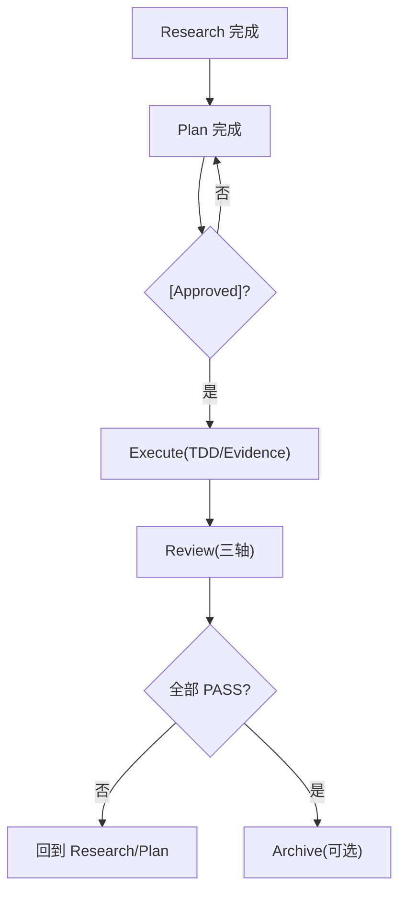
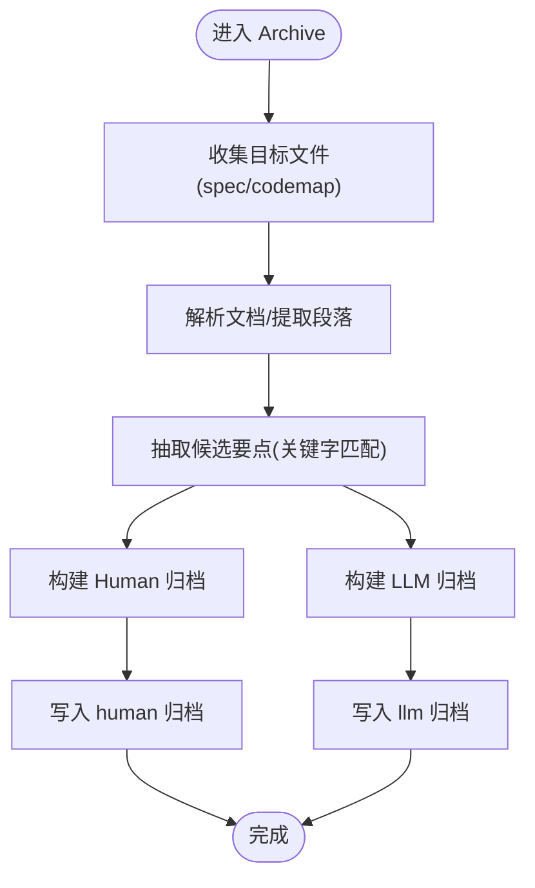
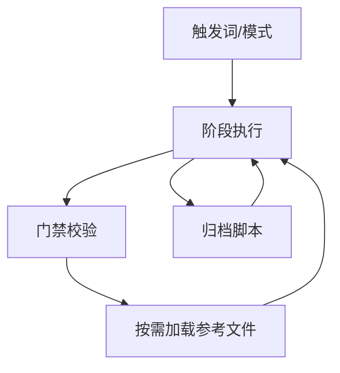

# 自适应工作流控制

<cite>
**本文引用的文件**
- [README.md](file://README.md)
- [SKILL.md](file://altas-workflow/SKILL.md)
- [QUICKSTART.md](file://altas-workflow/QUICKSTART.md)
- [workflow-diagrams.md](file://altas-workflow/workflow-diagrams.md)
- [reference-index.md](file://altas-workflow/reference-index.md)
- [archive_builder.py](file://altas-workflow/scripts/archive_builder.py)
- [archive_builder.py](file://altas-workflow/references/agents/sdd-riper-one/scripts/archive_builder.py)
</cite>

## 目录
1. [简介](#简介)
2. [项目结构](#项目结构)
3. [核心组件](#核心组件)
4. [架构总览](#架构总览)
5. [详细组件分析](#详细组件分析)
6. [依赖关系分析](#依赖关系分析)
7. [性能考量](#性能考量)
8. [故障排除指南](#故障排除指南)
9. [结论](#结论)
10. [附录](#附录)

## 简介
本技术文档围绕“自适应工作流控制”主题，系统阐述 ALTAS Workflow 的工作流状态机实现原理、动态路径控制机制、铁律约束体系、用户交互与决策点设计，以及可扩展的实现方法。该工作流融合 Spec-Driven Development、Checkpoint-Driven 与 Superpowers，通过规模评估与按需加载的渐进式披露，确保在不同任务规模下自动选择最合适的执行深度与门禁策略，同时以“证据优先”和“计划先行”的铁律约束保障交付质量与可维护性。

## 项目结构
- 核心系统提示词与工作流规范位于 altas-workflow/SKILL.md，定义了触发词、规模评估、阶段执行指南、铁律约束、进度可视化与上下文装配策略。
- QUICKSTART.md 提供快速启动、典型场景与常见问题，便于用户快速上手。
- workflow-diagrams.md 提供完整的流程图集合，涵盖架构总览、阶段流程、铁律与门禁、三轴评审、TDD 循环、特殊模式与上下文层级等。
- reference-index.md 提供按阶段/模式/来源的参考资料索引，指导 AI 在命中场景时按需加载对应文件。
- scripts/archive_builder.py 与 references/.../scripts/archive_builder.py 提供归档沉淀的自动化工具，支持生成 human/llm 双视角归档文档。

图表来源
- [SKILL.md: 369-385:369-385](file://altas-workflow/SKILL.md#L369-L385)
- [workflow-diagrams.md: 291-337:291-337](file://altas-workflow/workflow-diagrams.md#L291-L337)

章节来源
- [README.md: 1-133:1-133](file://README.md#L1-L133)
- [SKILL.md: 1-385:1-385](file://altas-workflow/SKILL.md#L1-L385)
- [QUICKSTART.md: 1-182:1-182](file://altas-workflow/QUICKSTART.md#L1-L182)
- [workflow-diagrams.md: 1-338:1-338](file://altas-workflow/workflow-diagrams.md#L1-L338)
- [reference-index.md: 1-210:1-210](file://altas-workflow/reference-index.md#L1-L210)

## 核心组件
- 触发词与模式判定：通过 trigger_keywords 识别用户意图，区分 Coding/Debug/Doc/Map/Archive 等入口模式，并在首轮输出初始化提示与任务复述。
- 规模评估引擎：基于复杂度、影响面与决策点自动选择 XS/S/M/L 四级深度，XS 豁免 Spec 与 Approve，S 要求 micro-spec，M/L 强制 Research/Plan/Execute/Review/Archive。
- 阶段执行控制器：按阶段拆解任务，输出标准化检查点，等待用户确认或执行许可，严格遵循“实现单项→输出检查点→获批→再执行下一项”的单步循环。
- 铁律约束系统：No Spec No Code、No Approval No Execute、Spec is Truth、Reverse Sync、Evidence First、No Fixes Without Root Cause、TDD Iron Law、Resume Ready。
- 渐进式披露与上下文装配：Hot/Warm/Cold 三层上下文，按需加载参考文件，避免上下文膨胀。
- 归档沉淀控制器：支持 snapshot/thematic 模式，生成 human/llm 双视角归档，附带 Trace to Sources。

章节来源
- [SKILL.md: 114-126:114-126](file://altas-workflow/SKILL.md#L114-L126)
- [SKILL.md: 162-250:162-250](file://altas-workflow/SKILL.md#L162-L250)
- [SKILL.md: 351-367:351-367](file://altas-workflow/SKILL.md#L351-L367)
- [reference-index.md: 16-210:16-210](file://altas-workflow/reference-index.md#L16-L210)

## 架构总览
自适应工作流以“触发词→模式→规模→阶段→检查点→参考加载→归档”的闭环为核心，通过状态机在不同规模间切换，并在关键节点设置门禁与用户干预点。

图表来源
- [workflow-diagrams.md: 45-67:45-67](file://altas-workflow/workflow-diagrams.md#L45-L67)
- [SKILL.md: 114-126:114-126](file://altas-workflow/SKILL.md#L114-L126)

## 详细组件分析

### 规模评估与自适应路径
- 触发词映射：FAST/快速/>> 对应 XS/S 极速通道；DEEP 对应 L 深度；DEBUG/排查 对应系统化 Debug；MULTI/多项目 对应多项目协作；DOC/写文档 对应文档专家；MAP/链路梳理 对应 CodeMap；ARCHIVE/归档 对应知识沉淀。
- 规模判定：XS（<10行/配置值）、S（1-2文件/逻辑清晰）、M（3-10文件/模块内）、L（跨模块/>500行/架构级）。
- 动态升降级：执行中发现复杂度超出预期立即暂停并提议升级；用户可随时选择“升级为M/降级为S”。

图表来源
- [SKILL.md: 55-68:55-68](file://altas-workflow/SKILL.md#L55-L68)
- [QUICKSTART.md: 36-49:36-49](file://altas-workflow/QUICKSTART.md#L36-L49)
- [workflow-diagrams.md: 7-41:7-41](file://altas-workflow/workflow-diagrams.md#L7-L41)

章节来源
- [SKILL.md: 53-81:53-81](file://altas-workflow/SKILL.md#L53-L81)
- [QUICKSTART.md: 52-116:52-116](file://altas-workflow/QUICKSTART.md#L52-L116)

### 铁律约束系统与门禁控制
- No Spec No Code：未形成最小 Spec 前不写代码（XS 豁免）。
- No Approval No Execute：进入高影响执行前必须获得明确执行许可（XS/FAST 或用户明确要求直接执行时可视为已授权）。
- Spec is Truth：Spec 与代码冲突时，代码是错的；Bug 先修 Spec 再修代码。
- Reverse Sync：执行中发现偏差→先更新 Spec→再修代码。
- Evidence First：完成由验证结果证明，非模型自宣布。
- No Fixes Without Root Cause：Bug 修复前必须有根因分析，禁止盲改。
- TDD Iron Law：Size M/L：无失败测试不写生产代码（XS/S 豁免）。
- Resume Ready：长任务暂停前在 Spec 中留恢复锚点。

图表来源
- [SKILL.md: 114-126:114-126](file://altas-workflow/SKILL.md#L114-L126)

章节来源
- [SKILL.md: 114-126:114-126](file://altas-workflow/SKILL.md#L114-L126)

### 用户交互与决策点设计
- 检查点输出：XS 为 1 行 summary；S 为短 checkpoint；M/L 为完整检查点，包含“当前成果/预期产出/下一步操作”。
- 决策点类型：[继续]/[修改]/[升级为X]/[降级为X]/[加载参考: XXX]。
- 用户干预：可在任意阶段修改 Plan、调整规模、加载参考文件、或直接执行（需满足门禁）。

图表来源
- [SKILL.md: 139-158:139-158](file://altas-workflow/SKILL.md#L139-L158)
- [SKILL.md: 369-385:369-385](file://altas-workflow/SKILL.md#L369-L385)

章节来源
- [SKILL.md: 139-158:139-158](file://altas-workflow/SKILL.md#L139-L158)
- [SKILL.md: 369-385:369-385](file://altas-workflow/SKILL.md#L369-L385)

### 执行门禁与三轴评审
- 门禁链路：Research 完成（事实有据、未知已标）→ Plan 完成（含 Approved）→ Execute（Evidence First/TDD）→ Review（三轴评审）。
- 三轴评审：Spec 质量与需求达成、Spec-代码一致性、代码内在质量；任一轴 FAIL 回到 Research/Plan，高风险未解决回到 Plan。

图表来源
- [workflow-diagrams.md: 108-125:108-125](file://altas-workflow/workflow-diagrams.md#L108-L125)
- [SKILL.md: 226-241:226-241](file://altas-workflow/SKILL.md#L226-L241)

章节来源
- [workflow-diagrams.md: 108-125:108-125](file://altas-workflow/workflow-diagrams.md#L108-L125)
- [SKILL.md: 226-241:226-241](file://altas-workflow/SKILL.md#L226-L241)

### 归档沉淀与双视角输出
- 产物类型：human 版（汇报视角）与 llm 版（开发参考视角），附带 Trace to Sources。
- 生成逻辑：按 snapshot/thematic 模式抽取关键决策、结果、风险、约束、接口、触点与模式，去重并生成结构化归档。
- 自动化：优先调用脚本生成，若不存在则通过文件读写工具生成。

图表来源
- [archive_builder.py: 1-505:1-505](file://altas-workflow/scripts/archive_builder.py#L1-L505)
- [archive_builder.py: 1-505:1-505](file://altas-workflow/references/agents/sdd-riper-one/scripts/archive_builder.py#L1-L505)

章节来源
- [archive_builder.py: 1-505:1-505](file://altas-workflow/scripts/archive_builder.py#L1-L505)
- [archive_builder.py: 1-505:1-505](file://altas-workflow/references/agents/sdd-riper-one/scripts/archive_builder.py#L1-L505)

## 依赖关系分析
- 触发词与模式映射：SKILL.md 定义 trigger_keywords，QUICKSTART.md 提供典型命令与场景。
- 阶段与参考文件：reference-index.md 按阶段/模式/来源提供索引，指导按需加载。
- 工具与脚本：归档脚本在 scripts/ 与 references/.../scripts/ 两处提供，确保在不同部署环境下可用。

图表来源
- [reference-index.md: 16-210:16-210](file://altas-workflow/reference-index.md#L16-L210)
- [SKILL.md: 310-332:310-332](file://altas-workflow/SKILL.md#L310-L332)

章节来源
- [reference-index.md: 16-210:16-210](file://altas-workflow/reference-index.md#L16-L210)
- [SKILL.md: 310-332:310-332](file://altas-workflow/SKILL.md#L310-L332)

## 性能考量
- 渐进式披露：仅在命中场景时加载参考文件，避免上下文膨胀导致推理开销增加。
- 单步循环：严格限制一次只实现一个 Checklist 项，减少上下文超载与错误传播。
- 检查点频率：XS/S/M/L 分别输出不同粒度的检查点，确保用户及时干预，降低无效执行成本。
- 归档生成：按需抽取关键字与段落，去重后生成结构化归档，避免重复内容带来的存储与检索压力。

## 故障排除指南
- AI 暴走或一次性输出过多：提示 AI 严格执行检查点机制，每次只推进一步。
- 任务极简但 AI 仍先写测试：XS/S 规模可使用 >>/FAST 跳过 TDD；或在执行中选择“直接执行”。
- 多人协作与多人模型：参考 protocols/ 与 references/.../using-superpowers/SKILL.md，采用双模型协作或严格模式协议。
- 归档生成失败：确认目标文件为 Markdown，且未检测到 active/non-finalized specs；必要时使用 --allow-active-spec。

章节来源
- [QUICKSTART.md: 119-152:119-152](file://altas-workflow/QUICKSTART.md#L119-L152)
- [reference-index.md: 108-173:108-173](file://altas-workflow/reference-index.md#L108-L173)

## 结论
ALTAS Workflow 通过“触发词→模式→规模→阶段→门禁→检查点→归档”的闭环，实现了面向不同任务规模的自适应工作流控制。其核心在于以铁律约束确保交付质量，以渐进式披露与按需加载降低上下文负担，以标准化检查点与用户干预点保证可控性与可维护性。归档沉淀进一步固化知识，形成“文档驱动”的研发范式。

## 附录
- 快速启动与典型场景参见 QUICKSTART.md。
- 完整流程图与可视化参考参见 workflow-diagrams.md。
- 参考资料索引与调用时机参见 reference-index.md。
- 归档脚本与使用方法参见 scripts/archive_builder.py 与 references/.../scripts/archive_builder.py。