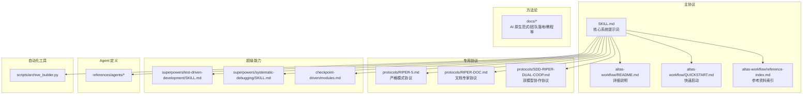
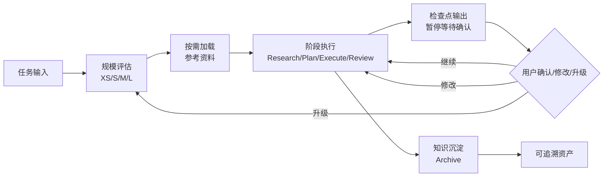
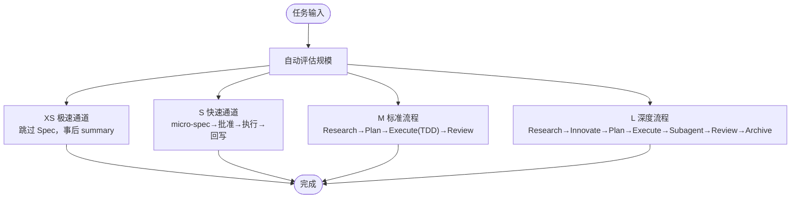
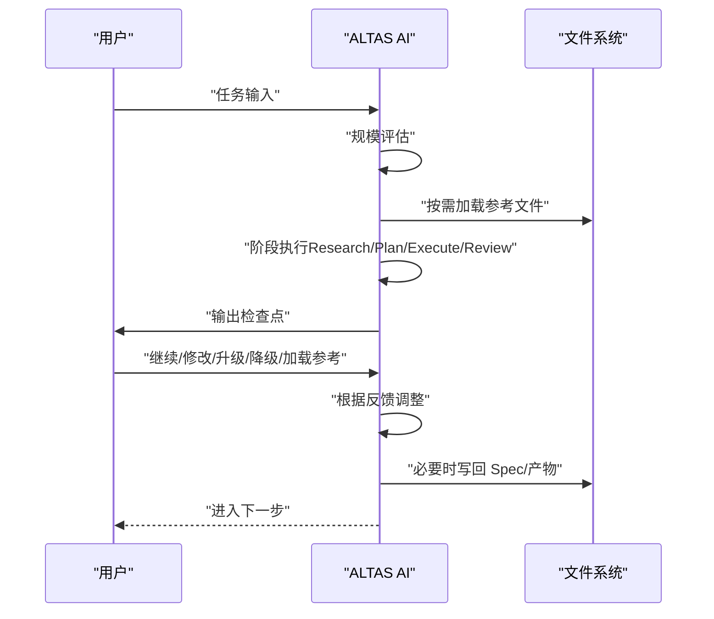
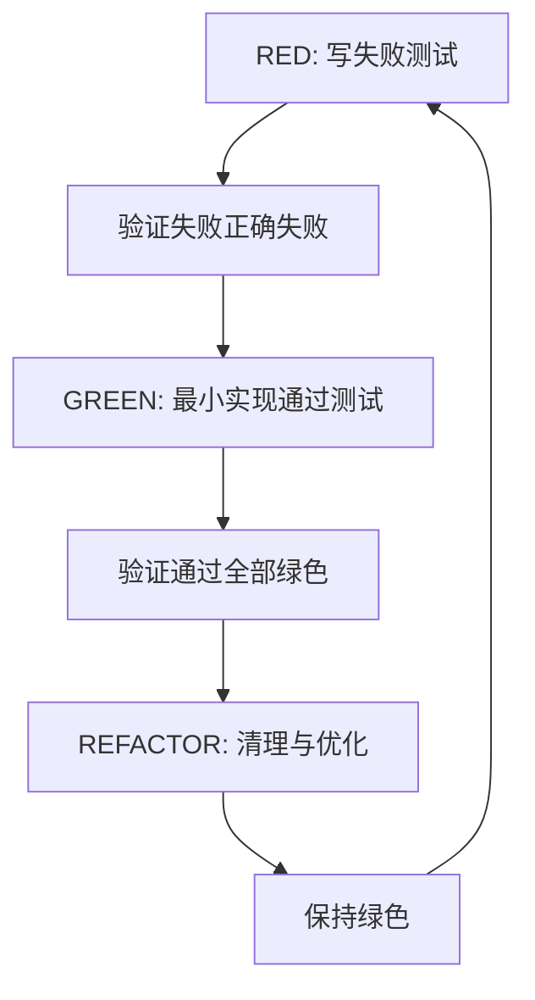
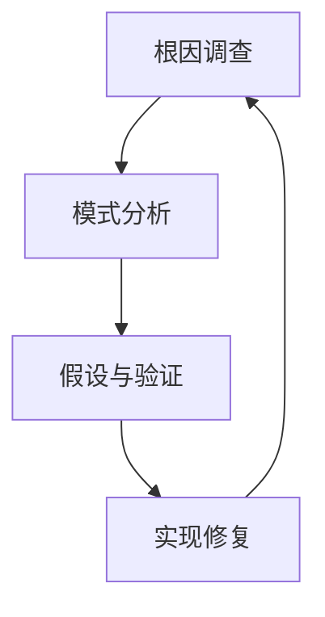
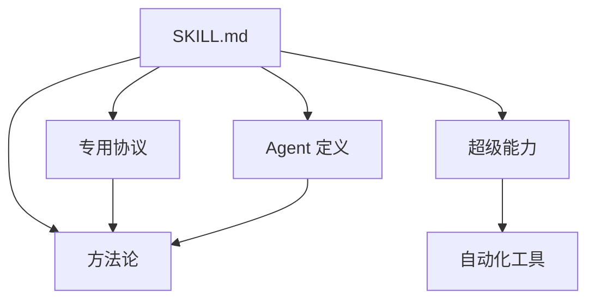

# 核心理念

<cite>
**本文引用的文件**
- [README.md](file://README.md)
- [altas-workflow/README.md](file://altas-workflow/README.md)
- [altas-workflow/QUICKSTART.md](file://altas-workflow/QUICKSTART.md)
- [altas-workflow/reference-index.md](file://altas-workflow/reference-index.md)
- [altas-workflow/SKILL.md](file://altas-workflow/SKILL.md)
- [altas-workflow/protocols/RIPER-5.md](file://altas-workflow/protocols/RIPER-5.md)
- [altas-workflow/protocols/RIPER-DOC.md](file://altas-workflow/protocols/RIPER-DOC.md)
- [altas-workflow/protocols/SDD-RIPER-DUAL-COOP.md](file://altas-workflow/protocols/SDD-RIPER-DUAL-COOP.md)
- [altas-workflow/references/superpowers/test-driven-development/SKILL.md](file://altas-workflow/references/superpowers/test-driven-development/SKILL.md)
- [altas-workflow/references/superpowers/systematic-debugging/SKILL.md](file://altas-workflow/references/superpowers/systematic-debugging/SKILL.md)
- [altas-workflow/references/checkpoint-driven/modules.md](file://altas-workflow/references/checkpoint-driven/modules.md)
</cite>

## 目录
1. [简介](#简介)
2. [项目结构](#项目结构)
3. [核心组件](#核心组件)
4. [架构总览](#架构总览)
5. [详细组件分析](#详细组件分析)
6. [依赖分析](#依赖分析)
7. [性能考量](#性能考量)
8. [故障排查指南](#故障排查指南)
9. [结论](#结论)
10. [附录](#附录)

## 简介
ALTAS Workflow 是一套融合 Spec-Driven Development、Checkpoint-Driven 与 Superpowers 的 AI 原生研发工作流规范，旨在解决 AI 编程中的四大工程痛点：上下文腐烂、审查瘫痪、代码不信任、难以维护。其核心理念是以“文档/规范”为唯一真相源，通过“检查点控制系统”确保可控的 AI 开发过程，并以“4 级智能深度适配机制”实现从极简到深度重构的渐进式披露与执行。

## 项目结构
仓库采用“主协议 + 专用协议 + 方法论 + 超级能力 + Agent 定义 + 自动化工具”的分层组织，辅以“按需加载”的参考资料索引，确保在不同规模任务中只加载必要的上下文，避免上下文污染与资源浪费。

图表来源
- [altas-workflow/README.md:1-120](file://altas-workflow/README.md#L1-L120)
- [altas-workflow/reference-index.md:1-210](file://altas-workflow/reference-index.md#L1-L210)

章节来源
- [README.md:40-120](file://README.md#L40-L120)
- [altas-workflow/README.md:40-120](file://altas-workflow/README.md#L40-L120)
- [altas-workflow/reference-index.md:109-210](file://altas-workflow/reference-index.md#L109-L210)

## 核心组件
- 核心协议（SKILL.md）：定义 ALTAS 的触发词、规模评估、阶段执行、进度可视化、铁律约束与按需加载机制，是 AI Agent 的“操作系统”。
- 专用协议：RIPER-5（严格模式）、RIPER-DOC（文档专家）、SDD-RIPER-DUAL-COOP（双模型协作），分别覆盖高风险控制、文档撰写与多模型协同。
- 超级能力：TDD 铁律、系统化 Debug、Subagent 驱动、并行 Agent、完成前验证等，支撑不同规模任务的质量与效率。
- 检查点控制系统：标准化检查点输出，确保每步完成后暂停等待确认，防止 AI 暴走与偏差扩散。
- 4 级智能深度适配：XS/S/M/L 四级任务深度，自动评估 + 手动升降级，兼顾极简与深度重构。
- 渐进式披露：只在命中场景时按需加载参考资料，避免上下文污染与 token 浪费。

章节来源
- [altas-workflow/SKILL.md:1-351](file://altas-workflow/SKILL.md#L1-L351)
- [altas-workflow/protocols/RIPER-5.md:1-187](file://altas-workflow/protocols/RIPER-5.md#L1-L187)
- [altas-workflow/protocols/RIPER-DOC.md:1-66](file://altas-workflow/protocols/RIPER-DOC.md#L1-L66)
- [altas-workflow/protocols/SDD-RIPER-DUAL-COOP.md:1-210](file://altas-workflow/protocols/SDD-RIPER-DUAL-COOP.md#L1-L210)
- [altas-workflow/references/superpowers/test-driven-development/SKILL.md:1-372](file://altas-workflow/references/superpowers/test-driven-development/SKILL.md#L1-L372)
- [altas-workflow/references/superpowers/systematic-debugging/SKILL.md:1-297](file://altas-workflow/references/superpowers/systematic-debugging/SKILL.md#L1-L297)
- [altas-workflow/references/checkpoint-driven/modules.md:1-57](file://altas-workflow/references/checkpoint-driven/modules.md#L1-L57)

## 架构总览
ALTAS 的整体架构围绕“规范中心论”展开：Spec 是唯一真相源，AI 围绕 Spec 执行与互审，人类在设计、决策与验收环节回归价值。工作流按规模分为 XS/S/M/L 四级，配合检查点控制系统与按需加载机制，确保可控、可回溯、可维护。

图表来源
- [altas-workflow/README.md:284-350](file://altas-workflow/README.md#L284-L350)
- [altas-workflow/SKILL.md:105-135](file://altas-workflow/SKILL.md#L105-L135)

章节来源
- [altas-workflow/README.md:235-350](file://altas-workflow/README.md#L235-L350)
- [altas-workflow/SKILL.md:105-135](file://altas-workflow/SKILL.md#L105-L135)

## 详细组件分析

### 4 级智能深度适配机制
- XS（极速）：typo、配置值、<10 行，跳过 Spec，事后 1 行 summary，直接执行→验证→summary。
- S（快速）：1-2 文件，逻辑清晰，micro-spec（1-3 句），micro-spec→批准→执行→回写。
- M（标准）：3-10 文件，模块内，轻量 Spec 落盘，Research→Plan→Execute(TDD)→Review。
- L（深度）：跨模块、>500 行、架构级，完整 Spec + Innovate + Archive，Research→Innovate→Plan→Execute(TDD)→Subagent→Review→Archive。

图表来源
- [altas-workflow/README.md:235-266](file://altas-workflow/README.md#L235-L266)
- [altas-workflow/SKILL.md:47-60](file://altas-workflow/SKILL.md#L47-L60)

章节来源
- [altas-workflow/README.md:235-266](file://altas-workflow/README.md#L235-L266)
- [altas-workflow/SKILL.md:47-60](file://altas-workflow/SKILL.md#L47-L60)

### 渐进式披露原理与工程价值
- 按需加载：只在命中场景时读取对应参考文件，避免常驻消耗 token 与上下文污染。
- 上下文装配策略：Hot（每轮）/Warm（阶段切换）/Cold（按需）三层装配，冲突/不确定时立即从磁盘重读完整 Spec。
- 工程价值：降低大模型上下文负担，提升任务执行稳定性与可预测性，避免“信息过载导致的注意力分散”。

章节来源
- [altas-workflow/SKILL.md:318-334](file://altas-workflow/SKILL.md#L318-L334)
- [altas-workflow/reference-index.md:1-210](file://altas-workflow/reference-index.md#L1-L210)

### 检查点控制系统
- 每步完成后输出标准化检查点，包含“进度、当前成果、预期产出、下一步操作”，并支持“继续/修改/升级/降级/加载参考”等交互。
- XS/S 输出简要检查点；M/L 输出完整检查点模板，确保每步可回溯、可验证、可暂停。

图表来源
- [altas-workflow/README.md:284-350](file://altas-workflow/README.md#L284-L350)
- [altas-workflow/SKILL.md:115-135](file://altas-workflow/SKILL.md#L115-L135)

章节来源
- [altas-workflow/README.md:284-350](file://altas-workflow/README.md#L284-L350)
- [altas-workflow/SKILL.md:115-135](file://altas-workflow/SKILL.md#L115-L135)

### 核心铁律详解
- No Spec, No Code：未形成最小 Spec 前不写代码（Size XS 豁免）。
- No Approval, No Execute：Plan 阶段人类不点头，绝不写代码。
- Spec is Truth：Spec 与代码冲突时，代码是错的；Bug 先修 Spec 再修代码。
- Reverse Sync：执行中发现偏差→先更新 Spec→再修代码。
- Evidence First：完成由验证结果证明，非模型自宣布。
- No Root Cause, No Fix：Bug 修复前必须有根因分析，禁止盲改。
- TDD Iron Law：Size M/L：无失败测试不写生产代码。
- Resume Ready：长任务暂停前在 Spec 中留恢复锚点。

章节来源
- [README.md:31-41](file://README.md#L31-L41)
- [altas-workflow/README.md:269-281](file://altas-workflow/README.md#L269-L281)
- [altas-workflow/SKILL.md:90-102](file://altas-workflow/SKILL.md#L90-L102)

### TDD 铁律与测试驱动开发
- 核心循环：RED（写失败测试）→ GREEN（最小实现）→ REFACTOR（清理）。
- 铁律：NO PRODUCTION CODE WITHOUT A FAILING TEST FIRST。
- 价值：系统化发现边界与错误，防止回归，文档化行为，支持安全重构。

图表来源
- [altas-workflow/references/superpowers/test-driven-development/SKILL.md:47-69](file://altas-workflow/references/superpowers/test-driven-development/SKILL.md#L47-L69)

章节来源
- [altas-workflow/references/superpowers/test-driven-development/SKILL.md:31-46](file://altas-workflow/references/superpowers/test-driven-development/SKILL.md#L31-L46)
- [altas-workflow/references/superpowers/test-driven-development/SKILL.md:168-184](file://altas-workflow/references/superpowers/test-driven-development/SKILL.md#L168-L184)

### 系统化 Debug 四阶段
- Phase 1：根因调查（读取错误、重现、检查变更、收集证据）。
- Phase 2：模式分析（寻找工作示例、对比差异、理解依赖）。
- Phase 3：假设与验证（单一假设、最小验证、确认或新假设）。
- Phase 4：实现（创建失败测试、单点修复、验证修复、必要时架构反思）。

图表来源
- [altas-workflow/references/superpowers/systematic-debugging/SKILL.md:46-215](file://altas-workflow/references/superpowers/systematic-debugging/SKILL.md#L46-L215)

章节来源
- [altas-workflow/references/superpowers/systematic-debugging/SKILL.md:16-23](file://altas-workflow/references/superpowers/systematic-debugging/SKILL.md#L16-L23)
- [altas-workflow/references/superpowers/systematic-debugging/SKILL.md:170-215](file://altas-workflow/references/superpowers/systematic-debugging/SKILL.md#L170-L215)

### 专用协议与特殊模式
- RIPER-5 严格模式：严格分阶段、强制模式声明、不允许偏差执行，适用于高风险项目。
- RIPER-DOC 文档专家：ABSROB→OUTLINE→AUTHOR→FACT-CHECK，确保文档与代码一致。
- SDD-RIPER-DUAL-COOP 双模型协作：外部模型（架构师）负责 Spec，内部模型（执行者）负责文件 I/O 与实现，避免“弱推理 + 代码库盲视”的组合风险。

章节来源
- [altas-workflow/protocols/RIPER-5.md:1-187](file://altas-workflow/protocols/RIPER-5.md#L1-L187)
- [altas-workflow/protocols/RIPER-DOC.md:1-66](file://altas-workflow/protocols/RIPER-DOC.md#L1-L66)
- [altas-workflow/protocols/SDD-RIPER-DUAL-COOP.md:1-210](file://altas-workflow/protocols/SDD-RIPER-DUAL-COOP.md#L1-L210)

### 实战案例与应用效果
- 日常功能迭代（Size M）：sdd_bootstrap 启动，Research→Plan→Execute(TDD)→Review，产出 Spec、代码与测试。
- 紧急修复线上配置（Size XS）：>> 命令触发，极速通道直接修改→验证→1 行 summary。
- 架构重构（Size L）：DEEP 命令触发，create_codemap→Research→Innovate→Plan→Execute(TDD)+Subagent→Review→Archive。
- Bug 排查（DEBUG）：只读分析，日志+Spec+CodeMap 三角定位，输出根因候选与建议修复。
- 多项目协作（MULTI）：自动发现子项目，生成双项目 codemap，按依赖顺序执行并记录契约接口。

章节来源
- [altas-workflow/README.md:419-518](file://altas-workflow/README.md#L419-L518)
- [altas-workflow/QUICKSTART.md:52-116](file://altas-workflow/QUICKSTART.md#L52-L116)

## 依赖分析
- 组件耦合与内聚：核心协议（SKILL.md）内聚了三大来源的能力（SDD-RIPER、SDD-RIPER-Optimized、Superpowers），并通过参考索引实现按需加载，降低耦合。
- 直接与间接依赖：主协议依赖专用协议与超级能力；超级能力依赖方法论与 Agent 定义；自动化工具服务于知识沉淀。
- 外部依赖与集成点：平台适配（Cursor/Trae/Claude/Qoder），命令触发词与触发模式，以及 mydocs/ 目录结构约定。

图表来源
- [altas-workflow/SKILL.md:76-87](file://altas-workflow/SKILL.md#L76-L87)
- [altas-workflow/reference-index.md:109-210](file://altas-workflow/reference-index.md#L109-L210)

章节来源
- [altas-workflow/SKILL.md:76-87](file://altas-workflow/SKILL.md#L76-L87)
- [altas-workflow/reference-index.md:109-210](file://altas-workflow/reference-index.md#L109-L210)

## 性能考量
- 按需加载与渐进式披露：避免一次性加载全部参考资料，降低 token 消耗与上下文污染。
- 检查点控制：每步暂停等待确认，减少无效执行与回滚成本。
- 规模评估与自动升降级：根据任务复杂度动态选择工作流深度，平衡效率与质量。
- TDD 铁律：通过失败测试驱动实现，减少调试成本与回归风险。

## 故障排查指南
- AI 一次性输出过多：使用检查点机制强制“每次只推进一步”，并在需要时升级为更严格的模式（如 RIPER-5）。
- 中途干预计划：在任意检查点回复“[修改] + 意见”，AI 将根据反馈调整 Plan 后重新请求 Approve。
- 选择 XS/S/M/L：ALTAS 会自动评估，也可强制指定；执行中可随时“[升级为 M]/[降级为 S]”。

章节来源
- [altas-workflow/README.md:537-552](file://altas-workflow/README.md#L537-L552)
- [altas-workflow/QUICKSTART.md:119-148](file://altas-workflow/QUICKSTART.md#L119-L148)
- [altas-workflow/protocols/RIPER-5.md:128-141](file://altas-workflow/protocols/RIPER-5.md#L128-L141)

## 结论
ALTAS Workflow 以“规范中心论”为核心，通过 4 级智能深度适配与检查点控制系统，结合 TDD 铁律与系统化 Debug，实现了可控、可回溯、可维护的 AI 原生研发范式。其渐进式披露与按需加载机制有效缓解了 AI 编程中的上下文腐烂与审查瘫痪，通过“Spec is Truth”与“Evidence First”等铁律，解决了代码不信任与难以维护的问题。在不同规模任务中，ALTAS 提供了从极简到深度重构的完整能力谱系，帮助团队在 AI 时代实现可复制、可规模化的工程能力。

## 附录
- 快速启动：复制 SKILL.md 到 AI 助手的 Custom Instructions，或在 Cursor/Trae 中运行 cp 命令，创建 mydocs/ 目录。
- 命令总览：FAST/DEEP/DEBUG/MULTI/DOC/MAP/ARCHIVE 等触发词与命令，覆盖从极速修改到多项目协作的全场景。
- 参考资料索引：按需加载地图，明确每个文件的调用时机，避免“全量加载”带来的上下文污染。

章节来源
- [README.md:98-155](file://README.md#L98-L155)
- [altas-workflow/README.md:158-192](file://altas-workflow/README.md#L158-L192)
- [altas-workflow/reference-index.md:1-210](file://altas-workflow/reference-index.md#L1-L210)