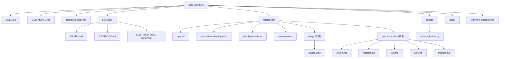
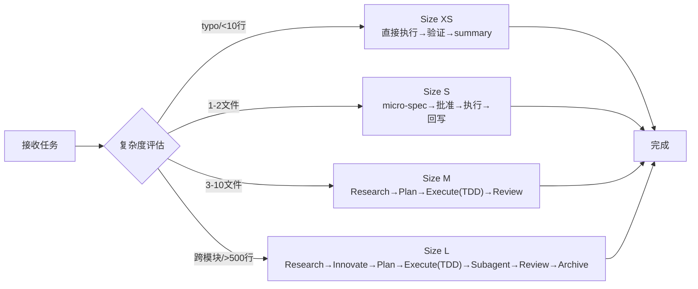
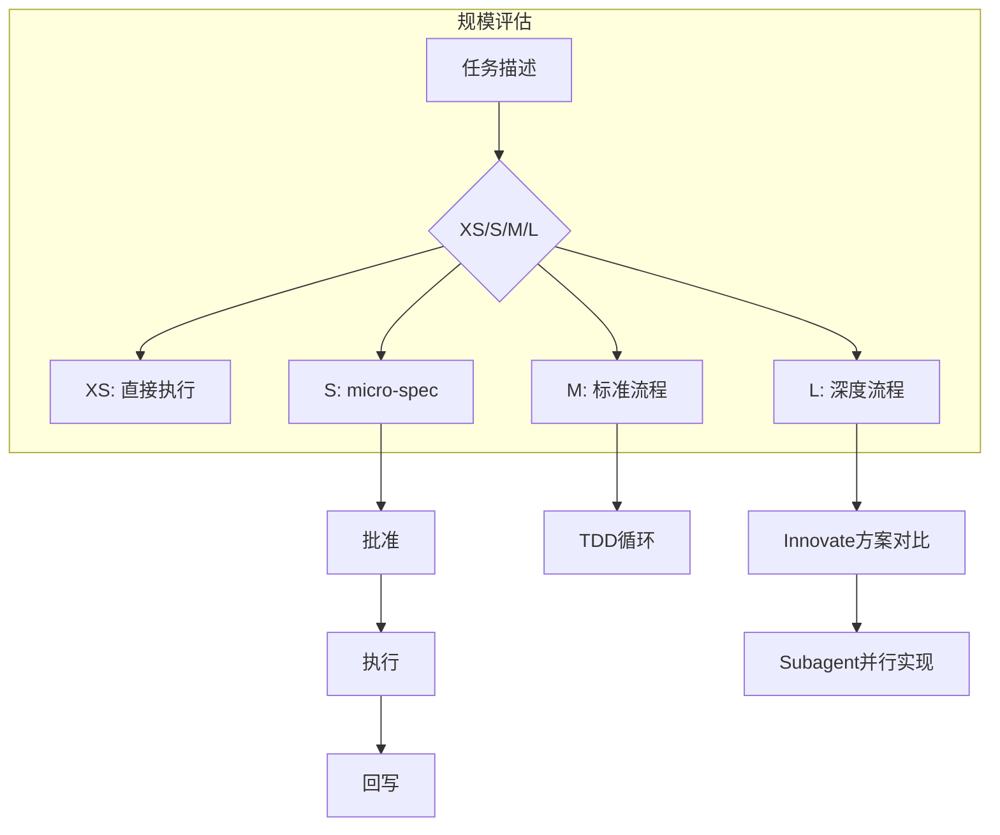
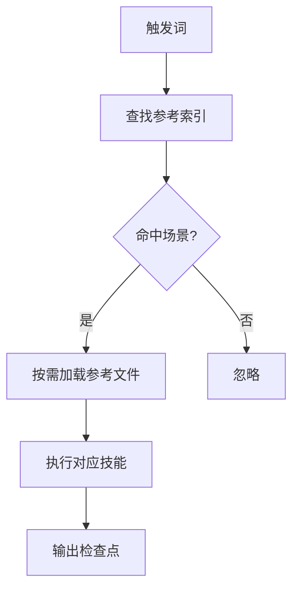
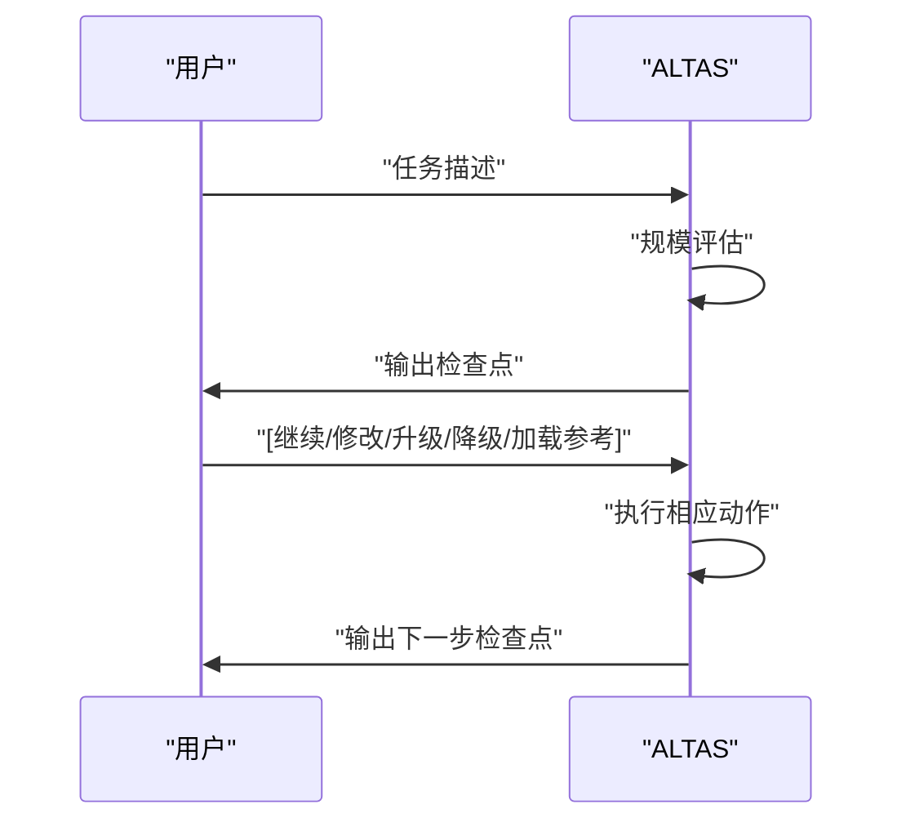
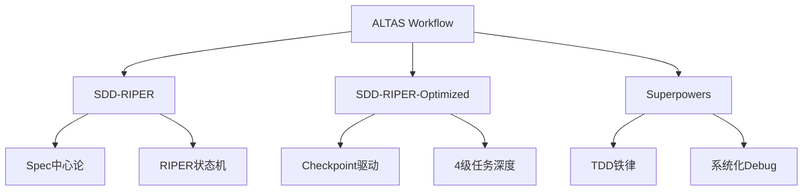
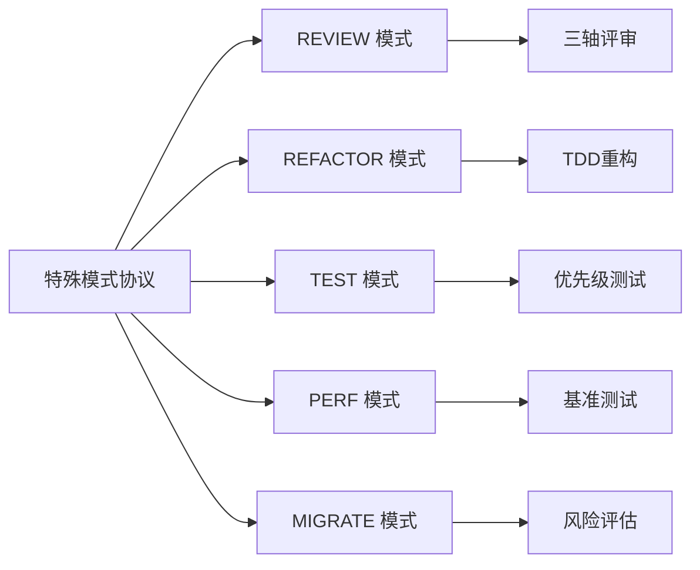
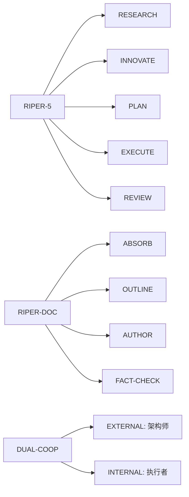
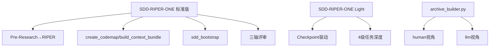
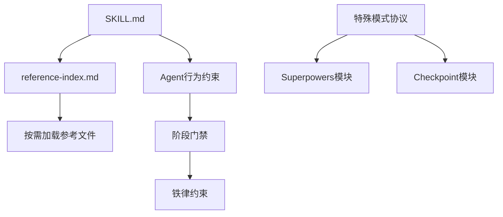

# 项目概述

<cite>
**本文引用的文件**
- [README.md](file://README.md)
- [QUICKSTART.md](file://altas-workflow/QUICKSTART.md)
- [SKILL.md](file://altas-workflow/SKILL.md)
- [SKILL-entry-review.md](file://altas-workflow/SKILL-entry-review.md)
- [reference-index.md](file://altas-workflow/reference-index.md)
- [workflow-diagrams.md](file://altas-workflow/workflow-diagrams.md)
- [RIPER-5.md](file://altas-workflow/protocols/RIPER-5.md)
- [RIPER-DOC.md](file://altas-workflow/protocols/RIPER-DOC.md)
- [SDD-RIPER-DUAL-COOP.md](file://altas-workflow/protocols/SDD-RIPER-DUAL-COOP.md)
- [sdd-riper-one/SKILL.md](file://altas-workflow/references/agents/sdd-riper-one/SKILL.md)
- [sdd-riper-one-light/SKILL.md](file://altas-workflow/references/agents/sdd-riper-one-light/SKILL.md)
- [从传统编程转向大模型编程.md](file://altas-workflow/docs/从传统编程转向大模型编程.md)
- [AI-原生研发范式-从代码中心到文档驱动的演进.md](file://altas-workflow/docs/AI-原生研发范式-从代码中心到文档驱动的演进.md)
- [archive_builder.py](file://altas-workflow/scripts/archive_builder.py)
- [sources.md](file://altas-workflow/references/entry/sources.md)
- [review.md](file://altas-workflow/references/special-modes/review.md)
- [refactor.md](file://altas-workflow/references/special-modes/refactor.md)
- [test.md](file://altas-workflow/references/special-modes/test.md)
- [perf.md](file://altas-workflow/references/special-modes/perf.md)
- [migrate.md](file://altas-workflow/references/special-modes/migrate.md)
</cite>

## 目录
1. [简介](#简介)
2. [项目结构](#项目结构)
3. [核心组件](#核心组件)
4. [架构总览](#架构总览)
5. [详细组件分析](#详细组件分析)
6. [依赖分析](#依赖分析)
7. [性能考虑](#性能考虑)
8. [故障排除指南](#故障排除指南)
9. [结论](#结论)
10. [附录](#附录)

## 简介
ALTAS Workflow 是一套综合性 AI 原生研发工作流规范，融合了 SDD-RIPER、SDD-RIPER-Optimized（Checkpoint-Driven）与 Superpowers 三大优秀工作流的精华。其核心使命是解决 AI 编程中的四大工程痛点：
- 上下文腐烂：通过 CodeMap 索引与渐进式披露，按需加载参考资料，避免上下文污染
- 审查瘫痪：通过 4 级智能深度（XS/S/M/L）与检查点控制系统，确保每步可反馈、可验证
- 代码不信任：通过 Spec 中心论与三轴评审，确保 Spec 与代码的一致性与可信度
- 难以维护：通过 Archive 知识沉淀与 TDD 铁律，确保完成即资产、可追溯可复用

ALTAS 的核心铁律包括：No Spec, No Code；No Approval, No Execute；Spec is Truth；Reverse Sync；Evidence First；No Root Cause, No Fix；TDD Iron Law；Resume Ready。这些铁律构成了工作流的不可逾越的门禁，确保在任何规模的任务中都能保持可控与可追溯。

**更新** 新增入口层来源整合与特殊模式协议，扩展了工作流的适用场景与方法论基础。

## 项目结构
仓库采用按功能与来源分类的组织方式，核心目录包括：
- altas-workflow/：主协议与参考资料目录，包含 SKILL.md、QUICKSTART.md、reference-index.md、protocols/、references/、scripts/、docs/、workflow-diagrams.md
- 顶层文档：README.md、AGENTS.md、CLAUDE.md、EXAMPLES.md

**章节来源**
- [README.md:48-82](file://README.md#L48-L82)
- [reference-index.md:109-173](file://altas-workflow/reference-index.md#L109-L173)

## 核心组件
- 核心协议 SKILL.md：定义了 ALTAS 的触发词、规模评估、进度可视化、阶段执行、特殊模式与参考资料索引，是 AI Agent 的系统提示词与行为约束
- 参考资料索引 reference-index.md：提供了按需加载的参考资料地图，涵盖 Spec 驱动开发、Checkpoint 驱动与 Superpowers 的各类技能
- 入口层来源整合 sources.md：承载 ALTAS Workflow 入口层的"来源整合"说明，记录了 SDD-RIPER、Checkpoint-Driven、Superpowers 三大方法论的采纳能力映射
- 专用协议：RIPER-5（严格模式）、RIPER-DOC（文档专家）、SDD-RIPER-DUAL-COOP（双模型协作）
- 特殊模式协议：REVIEW（代码审查）、REFACTOR（重构）、TEST（测试）、PERF（性能优化）、MIGRATE（迁移）
- 独立 Agent：SDD-RIPER-ONE 标准版与轻量版，分别适用于中大型任务与高频多轮场景
- 自动化工具：archive_builder.py，用于生成双视角（human/llm）知识沉淀文档

**章节来源**
- [SKILL.md:1-351](file://altas-workflow/SKILL.md#L1-L351)
- [reference-index.md:1-210](file://altas-workflow/reference-index.md#L1-L210)
- [sources.md:1-24](file://altas-workflow/references/entry/sources.md#L1-L24)
- [RIPER-5.md:1-187](file://altas-workflow/protocols/RIPER-5.md#L1-L187)
- [RIPER-DOC.md:1-66](file://altas-workflow/protocols/RIPER-DOC.md#L1-L66)
- [SDD-RIPER-DUAL-COOP.md:1-210](file://altas-workflow/protocols/SDD-RIPER-DUAL-COOP.md#L1-L210)
- [sdd-riper-one/SKILL.md:1-208](file://altas-workflow/references/agents/sdd-riper-one/SKILL.md#L1-L208)
- [sdd-riper-one-light/SKILL.md:1-84](file://altas-workflow/references/agents/sdd-riper-one-light/SKILL.md#L1-L84)
- [archive_builder.py:1-505](file://altas-workflow/scripts/archive_builder.py#L1-L505)

## 架构总览
ALTAS 的架构以"智能深度适配 + 渐进式披露 + 检查点控制系统"为核心，通过 4 级任务深度（XS/S/M/L）自动评估任务规模，并在每个阶段完成后输出标准化检查点，确保每步可反馈、可验证。架构优势体现在：
- 规模评估：根据任务复杂度自动选择工作流深度，XS/S 跳过 Research/Plan，M/L 严格遵循 RIPER 流程
- 渐进式披露：只在命中场景时按需加载对应参考资料，避免上下文污染
- 检查点控制：每个步骤完成后必须输出检查点，等待用户确认后方可推进，防止 AI 暴走
- 特殊模式扩展：新增的特殊模式协议为特定场景提供专业化的执行框架

**图表来源**
- [workflow-diagrams.md:7-41](file://altas-workflow/workflow-diagrams.md#L7-L41)
- [README.md:235-266](file://README.md#L235-L266)

**章节来源**
- [workflow-diagrams.md:7-41](file://altas-workflow/workflow-diagrams.md#L7-L41)
- [README.md:235-266](file://README.md#L235-L266)

## 详细组件分析

### 4 级智能深度适配机制
- XS（极速）：typo、配置值、<10 行，跳过 Research/Plan，直接执行→验证→summary
- S（快速）：1-2 文件，逻辑清晰，micro-spec（1-3 句）→批准→执行→回写
- M（标准）：3-10 文件，模块内，轻量 Spec 落盘，Research→Plan→Execute(TDD)→Review
- L（深度）：跨模块、>500 行、架构级，完整 Spec + Innovate + Archive，Research→Innovate→Plan→Execute→Subagent→Review→Archive

**图表来源**
- [workflow-diagrams.md:129-151](file://altas-workflow/workflow-diagrams.md#L129-L151)
- [SKILL.md:47-60](file://altas-workflow/SKILL.md#L47-L60)

**章节来源**
- [SKILL.md:47-60](file://altas-workflow/SKILL.md#L47-L60)
- [workflow-diagrams.md:129-151](file://altas-workflow/workflow-diagrams.md#L129-L151)

### 渐进式披露原理
- 按需加载：AI Agent 无需常驻全部参考资料，只需在命中场景时按需加载对应文件
- 触发词映射：通过 trigger_keywords 与 reference-index.md 的索引表，实现触发词到参考文件的精准映射
- 上下文装配：Hot/Warm/Cold 三层上下文装配策略，确保在不同阶段加载合适的上下文

**图表来源**
- [SKILL.md:4-86](file://altas-workflow/SKILL.md#L4-L86)
- [reference-index.md:278-299](file://altas-workflow/reference-index.md#L278-L299)

**章节来源**
- [SKILL.md:4-86](file://altas-workflow/SKILL.md#L4-L86)
- [reference-index.md:278-299](file://altas-workflow/reference-index.md#L278-L299)

### 检查点控制系统
- 标准化检查点：每个步骤完成后必须输出标准化检查点，包含当前成果、预期产出与下一步操作
- 交互式推进：用户可选择继续、修改、升级/降级规模或加载参考，确保每步可控
- 铁律约束：No Spec, No Code；No Approval, No Execute；Spec is Truth；Reverse Sync；Evidence First；No Root Cause, No Fix；TDD Iron Law；Resume Ready

**图表来源**
- [README.md:284-347](file://README.md#L284-L347)
- [SKILL.md:115-134](file://altas-workflow/SKILL.md#L115-L134)

**章节来源**
- [README.md:284-347](file://README.md#L284-L347)
- [SKILL.md:115-134](file://altas-workflow/SKILL.md#L115-L134)

### 三大来源整合
- SDD-RIPER：Spec 中心论、RIPER 状态机、三轴 Review、Multi-Project、Debug/Archive 协议、CodeMap 索引
- SDD-RIPER-Optimized：Checkpoint-Driven 轻量模式、4 级任务深度、Done Contract、Resume Ready、Hot/Warm/Cold 上下文装配、micro-spec
- Superpowers：TDD 铁律、系统化 Debug、Subagent 驱动、并行 Agent、验证优先

**图表来源**
- [README.md:399-416](file://README.md#L399-L416)
- [SKILL.md:76-86](file://altas-workflow/SKILL.md#L76-L86)

**章节来源**
- [README.md:399-416](file://README.md#L399-L416)
- [SKILL.md:76-86](file://altas-workflow/SKILL.md#L76-L86)

### 入口层来源整合
**新增** sources.md 文件承载 ALTAS Workflow 入口层的"来源整合"说明，明确了三大方法论的采纳能力映射：

- **SDD-RIPER**：Spec 中心论、RIPER 状态机、三轴 Review、Multi-Project、Debug/Archive 协议
- **Checkpoint-Driven**：轻量模式、4 级规模、Done Contract、Resume Ready、Hot/Warm/Cold 上下文策略
- **Superpowers**：TDD 铁律、系统化 Debug、Subagent、并行 Agent、验证优先

该文件为方法论介绍、团队推广或入口设计复盘提供了权威依据。

**章节来源**
- [sources.md:1-24](file://altas-workflow/references/entry/sources.md#L1-L24)

### 特殊模式协议体系
**新增** ALTAS 现已扩展为包含五大特殊模式的专业化执行框架：

#### REVIEW 模式（代码审查）
- 触发词：REVIEW、代码审查、审查 PR
- 适用场景：Pull Request 审查、代码变更审查、第三方视角评估
- 三轴评审：Spec 质量与需求达成、Spec-代码一致性、代码内在质量
- 问题分级：P0（阻塞）→P1（高优）→P2（建议）→P3（可选）

#### REFACTOR 模式（重构）
- 触发词：REFACTOR、重构
- 适用场景：代码结构改进、技术债务消除、可维护性提升
- TDD 驱动：小步重构 + 回归测试验证
- CodeMap 先行：重构前后的代码结构对比

#### TEST 模式（测试）
- 触发词：TEST、写测试、补测试
- 适用场景：测试覆盖率提升、失败测试修复、测试报告生成
- 优先级排序：P0（核心逻辑）→P1（边界条件）→P2（异常路径）→P3（集成）→P4（性能）
- 测试最佳实践：AAA 模式、测试命名规范、测试独立性

#### PERF 模式（性能优化）
- 触发词：PERF、性能优化
- 适用场景：响应时间优化、吞吐量提升、资源消耗控制
- 基准测试：建立性能基线 → Profile 定位瓶颈 → 优化方案对比 → 小步验证
- 性能预算：防止性能退化、CI/CD 集成

#### MIGRATE 模式（数据/版本迁移）
- 触发词：MIGRATE、迁移、数据迁移、版本升级
- 适用场景：数据库迁移、依赖版本升级、API 迁移、基础设施迁移
- 风险评估：一次性迁移 vs 渐进式迁移 vs 蓝绿迁移
- 回滚方案：触发条件、步骤清单、验证标准

**图表来源**
- [review.md:1-137](file://altas-workflow/references/special-modes/review.md#L1-L137)
- [refactor.md:1-181](file://altas-workflow/references/special-modes/refactor.md#L1-L181)
- [test.md:1-210](file://altas-workflow/references/special-modes/test.md#L1-L210)
- [perf.md:1-234](file://altas-workflow/references/special-modes/perf.md#L1-L234)
- [migrate.md:1-306](file://altas-workflow/references/special-modes/migrate.md#L1-L306)

**章节来源**
- [review.md:1-137](file://altas-workflow/references/special-modes/review.md#L1-L137)
- [refactor.md:1-181](file://altas-workflow/references/special-modes/refactor.md#L1-L181)
- [test.md:1-210](file://altas-workflow/references/special-modes/test.md#L1-L210)
- [perf.md:1-234](file://altas-workflow/references/special-modes/perf.md#L1-L234)
- [migrate.md:1-306](file://altas-workflow/references/special-modes/migrate.md#L1-L306)

### 专用协议与特殊模式
- RIPER-5：严格模式协议，强制声明模式、严格阶段门禁，防止 AI 未经授权修改代码
- RIPER-DOC：文档专家协议，ABSORB→OUTLINE→AUTHOR→FACT-CHECK 的文档撰写流程
- SDD-RIPER-DUAL-COOP：双模型协作协议，外部模型（架构师）与内部模型（执行者）的角色分工与协作

**图表来源**
- [RIPER-5.md:25-126](file://altas-workflow/protocols/RIPER-5.md#L25-L126)
- [RIPER-DOC.md:9-60](file://altas-workflow/protocols/RIPER-DOC.md#L9-L60)
- [SDD-RIPER-DUAL-COOP.md:11-149](file://altas-workflow/protocols/SDD-RIPER-DUAL-COOP.md#L11-L149)

**章节来源**
- [RIPER-5.md:25-126](file://altas-workflow/protocols/RIPER-5.md#L25-L126)
- [RIPER-DOC.md:9-60](file://altas-workflow/protocols/RIPER-DOC.md#L9-L60)
- [SDD-RIPER-DUAL-COOP.md:11-149](file://altas-workflow/protocols/SDD-RIPER-DUAL-COOP.md#L11-L149)

### 独立 Agent 与自动化工具
- SDD-RIPER-ONE 标准版：完整 RIPER 流程，支持 CodeMap、上下文打包、Spec 生命周期与三轴评审
- SDD-RIPER-ONE Light：Checkpoint 驱动轻量模式，适用于强模型高频多轮场景
- archive_builder.py：自动化归档生成器，支持 human/llm 双视角文档输出

**图表来源**
- [sdd-riper-one/SKILL.md:19-142](file://altas-workflow/references/agents/sdd-riper-one/SKILL.md#L19-L142)
- [sdd-riper-one-light/SKILL.md:8-84](file://altas-workflow/references/agents/sdd-riper-one-light/SKILL.md#L8-L84)
- [archive_builder.py:1-505](file://altas-workflow/scripts/archive_builder.py#L1-L505)

**章节来源**
- [sdd-riper-one/SKILL.md:19-142](file://altas-workflow/references/agents/sdd-riper-one/SKILL.md#L19-L142)
- [sdd-riper-one-light/SKILL.md:8-84](file://altas-workflow/references/agents/sdd-riper-one-light/SKILL.md#L8-L84)
- [archive_builder.py:1-505](file://altas-workflow/scripts/archive_builder.py#L1-L505)

## 依赖分析
- 触发词与参考文件的映射关系：通过 SKILL.md 的 trigger_keywords 与 reference-index.md 的索引表建立
- 阶段门禁与铁律约束：No Spec, No Code；No Approval, No Execute；Spec is Truth；Reverse Sync；Evidence First；No Root Cause, No Fix；TDD Iron Law；Resume Ready
- Agent 与协议的耦合：SDD-RIPER-ONE 标准版与轻量版依赖 reference-index.md 中的参考文件，同时遵循 SKILL.md 的行为约束
- 特殊模式依赖：各特殊模式协议依赖相应的 Superpowers 技能模块和 Checkpoint 驱动模块

**图表来源**
- [SKILL.md:4-86](file://altas-workflow/SKILL.md#L4-L86)
- [reference-index.md:278-299](file://altas-workflow/reference-index.md#L278-L299)

**章节来源**
- [SKILL.md:4-86](file://altas-workflow/SKILL.md#L4-L86)
- [reference-index.md:278-299](file://altas-workflow/reference-index.md#L278-L299)

## 性能考虑
- 上下文装配策略：Hot/Warm/Cold 三层策略减少不必要的上下文加载，提高执行效率
- 检查点控制：每步完成后暂停等待确认，避免一次性输出过多代码导致的执行开销
- 自动化工具：archive_builder.py 支持批量归档生成，减少人工处理成本
- 特殊模式优化：各特殊模式协议经过专门优化，针对特定场景提供高效的执行框架

## 故障排除指南
- AI 一次性输出过多代码：ALTAS 内置检查点机制，AI 完成一步后必须暂停等确认。如遇 AI 暴走，回复"请停止，严格执行检查点机制，每次只推进一步"
- 如何中途干预 AI 的计划：在任意检查点回复"[修改] 请不要使用 Redis，改为内存缓存"，AI 会根据反馈调整 Plan 后重新请求 Approve
- 如何选择 XS/S/M/L：ALTAS 会自动评估。也可强制指定：">>"=XS, "FAST"=S, 默认=M, "DEEP"=L。执行中可随时 "[升级为 M]" 或 "[降级为 S]"
- 特殊模式使用：在特殊模式协议中遇到问题，可参考对应模式的门禁逻辑和特殊场景处理建议

**章节来源**
- [README.md:539-552](file://README.md#L539-L552)
- [QUICKSTART.md:119-140](file://altas-workflow/QUICKSTART.md#L119-L140)

## 结论
ALTAS Workflow 通过融合 SDD-RIPER、SDD-RIPER-Optimized 与 Superpowers 的精华，形成了以"智能深度适配 + 渐进式披露 + 检查点控制"为核心的 AI 原生研发工作流框架。其四大核心铁律确保了在任何规模的任务中都能保持可控与可追溯，四大工程痛点的解决方案为团队提供了从上下文腐烂到审查瘫痪、从代码不信任到难以维护的系统性解法。

**更新** 新增的入口层来源整合与五大特殊模式协议显著扩展了 ALTAS 的适用场景，从传统的研发工作流扩展到代码审查、重构、测试、性能优化、数据迁移等专业领域。通过标准化检查点与按需加载的参考资料，ALTAS 不仅提升了开发效率，更为团队沉淀了可持续的知识资产。

## 附录
- 快速启动：通过将 SKILL.md 内容复制到 AI 助手的 Custom Instructions 或全局 AI Rules，30 秒即可上手
- 常用命令：FAST/快速/>>（极速通道）、DEEP（深度模式）、MAP/链路梳理（功能级 CodeMap）、PROJECT MAP/项目总图（项目级 CodeMap）、MULTI/多项目（多项目协作）、DEBUG/排查（系统化 Debug）、REVIEW SPEC/计划评审（执行前建议性预审）、REVIEW EXECUTE/代码评审（执行后三轴审查）、ARCHIVE/归档（知识沉淀）、DOC/写文档（文档专家模式）、REVIEW/审查（代码审查模式）、REFACTOR/重构（重构模式）、TEST/测试（测试模式）、PERF/性能（性能优化模式）、MIGRATE/迁移（数据迁移模式）

**章节来源**
- [README.md:98-191](file://README.md#L98-L191)
- [QUICKSTART.md:36-49](file://altas-workflow/QUICKSTART.md#L36-L49)