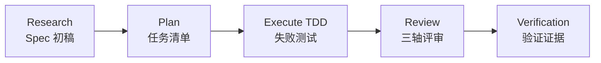
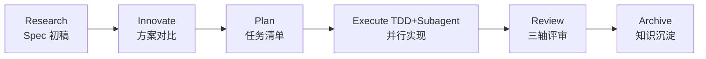

# ALTAS Workflow

> **融合三方优势 | 智能深度适配 | 渐进式披露 | 每步可反馈 | 测试工程师友好**

**Version:** 4.7 (2026-04-19)
**仓库规模:** 17M, 165 Markdown 文件, 120+ 参考资料

---

## 🌐 语言 / Language

**中文** | [English](README_EN.md) | [日本語](README_JA.md) | [Français](README_FR.md) | [Deutsch](README_DE.md)

---

## 🎯 这是什么？

**ALTAS Workflow** 是一套综合性 AI 原生研发工作流规范，融合了 **SDD-RIPER**、**SDD-RIPER-Optimized (Checkpoint-Driven)** 与 **Superpowers** 三大优秀工作流的精华。

### 核心使命

致力于解决 AI 编程中的四大工程痛点：

| 痛点 | ALTAS 解法 |
|------|-----------|
| **上下文腐烂** | CodeMap 索引 + 渐进式披露，按需加载参考资料 |
| **审查瘫痪** | 4 级智能深度 (XS/S/M/L)，小任务不卡审批 |
| **代码不信任** | Spec 中心论 + 三轴评审，Spec is Truth |
| **难以维护** | Archive 知识沉淀 + TDD 铁律，完成即资产 |

### 核心铁律

1. **No Spec, No Code** — 未形成最小 Spec 前不写代码 (Size XS 豁免)
2. **No Approval, No Execute** — Plan 阶段人类不点头，绝不写代码
3. **Spec is Truth** — Spec 与代码冲突时，代码是错的
4. **Reverse Sync** — 执行中发现偏差→先更新 Spec→再修代码
5. **Evidence First** — 完成由验证结果证明，非模型自宣布
6. **No Root Cause, No Fix** — Bug 修复前必须有根因分析，禁止盲改
7. **TDD Iron Law** — Size M/L: 无失败测试不写生产代码
8. **Resume Ready** — 长任务暂停前在 Spec 中留恢复锚点

---

## 📦 包含什么？

### 仓库结构总览

```
altas/
├── altas-workflow/              # 主协议目录 (8.3M, 120+ 文件)
│   ├── SKILL.md                 # ⭐ 核心系统提示词 (AI 读取) - v4.7
│   ├── README.md                # ALTAS 详细说明
│   ├── QUICKSTART.md            # 场景化快速指南
│   ├── reference-index.md       # 参考资料总索引
│   ├── workflow-diagrams.md     # Mermaid 流程图集
│   ├── protocols/               # 专用协议 (4 个)
│   │   ├── RIPER-5.md           # 严格模式协议
│   │   ├── RIPER-DOC.md         # 文档专家协议
│   │   ├── SDD-RIPER-DUAL-COOP.md # 双模型协作协议
│   │   └── PROTOCOL-SELECTION.md # 协议选择指南
│   ├── docs/                    # 方法论文档 (5 篇)
│   │   ├── 从传统编程转向大模型编程.md
│   │   ├── AI-原生研发范式.md
│   │   ├── 团队落地指南.md
│   │   ├── 手把手教程.md
│   │   └── IMPLEMENTATION-PLAN-v4.6.md
│   ├── references/              # 按需加载的参考资料 (95+ 文件)
│   │   ├── spec-driven-development/  # Spec 驱动开发 (7 个核心文档)
│   │   ├── checkpoint-driven/        # Checkpoint 轻量模式 (4 个文档)
│   │   ├── superpowers/              # 超级能力 (50+ 文档)
│   │   │   ├── test-driven-development/  # TDD 铁律
│   │   │   ├── systematic-debugging/     # 系统化 Debug
│   │   │   ├── subagent-driven-development/ # Subagent 驱动
│   │   │   ├── brainstorming/            # 设计头脑风暴
│   │   │   ├── writing-plans/            # 写 Plan 最佳实践
│   │   │   ├── code-review/              # 代码审查 (Go/Python)
│   │   │   └── ... (更多超级能力)
│   │   ├── agents/                       # Agent 定义 (22 个文档)
│   │   │   ├── sdd-riper-one/            # 标准版 Agent
│   │   │   └── sdd-riper-one-light/      # 轻量版 Agent
│   │   ├── entry/                        # 入口配置 (5 个文档)
│   │   ├── special-modes/                # 特殊模式 (5 个文档)
│   │   ├── prd-analysis/                 # PRD 分析工作流 (6 个文档)
│   │   └── testing/                      # 🆕 测试工程专项 (18+ 文档)
│   │       ├── test-strategy-template.md    # 测试策略模板
│   │       ├── pytest-patterns.md           # Pytest 最佳实践
│   │       ├── e2e-testing.md               # E2E 测试指引
│   │       ├── api-testing.md               # API 测试参考
│   │       ├── performance-testing.md       # 性能测试方法论
│   │       ├── security-testing.md          # 安全测试
│   │       ├── contract-testing.md          # 契约测试
│   │       ├── test-data-management.md      # 测试数据管理
│   │       ├── test-environment.md          # 测试环境管理
│   │       ├── ci-cd-integration.md         # CI/CD 集成
│   │       └── templates/                   # 测试脚手架模板
│   └── scripts/                 # 自动化工具
│       ├── archive_builder.py   # Archive 构建器
│       ├── scaffold.py          # 项目脚手架
│       └── validate_aliases_sync.py # 别名同步验证
├── .agents/skills/              # 🆕 独立技能包 (6 个)
│   ├── advanced-api-testing/   # 高级 API 测试
│   ├── go-code-review/         # Go 代码审查
│   ├── python-code-review/     # Python 代码审查
│   ├── pytest-patterns/        # Pytest 测试模式
│   ├── specify-requirements/   # 需求规格说明
│   └── implementation-verify/  # 实现验证
├── .qoder/repowiki/             # Wiki 文档 (69 个文档)
├── AGENTS.md                    # 通用 AI 行为准则
├── CLAUDE.md                    # Claude 专用行为准则
├── EXAMPLES.md                  # 四大原则代码示例
└── skills-lock.json             # 技能包版本锁定
```

### 核心资产统计

| 类别 | 数量 | 说明 |
|------|------|------|
| **核心协议** | 1 个 | SKILL.md (ALTAS Workflow 主协议) v4.7 |
| **专用协议** | 4 个 | RIPER-5 / RIPER-DOC / DUAL-COOP / PROTOCOL-SELECTION |
| **方法论** | 5 篇 | 从传统到大模型 / AI 原生范式 / 团队落地 / 手把手教程 / v4.6实施方案 |
| **参考资料** | 95+ | Spec 驱动 (7) / Checkpoint (4) / Superpowers (50+) / Agents (22) / Entry (5) / Special-Modes (5) / PRD分析 (6) / Testing (18+) |
| **独立 Agent** | 2 个 | SDD-RIPER-ONE (标准版/轻量版) |
| **🆕 技能包** | 6 个 | API测试 / Go审查 / Python审查 / Pytest / 需求规格 / 实现验证 |
| **代码示例** | 1 个 | EXAMPLES.md (四大原则实战示例) |
| **自动化工具** | 3 个 | archive_builder.py / scaffold.py / validate_aliases_sync.py |

---

## 🚀 v4.7 新特性 (2026-04-18)

### 🧪 测试工程师专项优化

- ✅ **E2E 测试框架参考指南**: 端到端测试最佳实践与 Playwright/Cypress 集成
- ✅ **性能/负载测试方法论**: 压测策略、基准测试、性能指标体系
- ✅ **API 测试完整流程**: 契约测试、安全测试、API 测试矩阵模板
- ✅ **Pytest 测试模式文档套件**: Fixture 设计、参数化、Mock 策略、覆盖率
- ✅ **测试数据管理**: 工厂模式、Fixture 层级、测试隔离
- ✅ **测试环境管理**: Docker Compose、依赖注入、环境一致性
- ✅ **CI/CD 集成测试**: 自动化流水线、质量门禁、测试报告
- ✅ **测试脚手架模板**: 开箱即用的 conftest.py / factories / fixtures
- ✅ **Go/Python 测试支持**: 多语言测试最佳实践与反模式

### 🔍 代码审查技能包

- ✅ **Go 代码审查**: 静态分析、性能审计、并发安全检查
- ✅ **Python 代码审查**: 类型安全、异步模式、错误处理规范
- ✅ **审查流程标准化**: Review Request → Code Quality → Spec Compliance

### 📋 PRD 分析工作流

- ✅ **结构化需求分析**: Brainstorm → Discover → Document → Review → Validate
- ✅ **PRD 模板与校验**: 产品概述、用户画像、功能需求、成功指标
- ✅ **质量度量标准**: 结构完整性、内容质量、边界验证、跨节一致性

### 🛠️ 其他改进

- ✅ **别名同步验证脚本**: 自动检查触发词一致性
- ✅ **项目脚手架自动化**: 快速初始化项目结构与规范
- ✅ **实现验证技能**: 自动化验收测试与覆盖率检查
- ✅ **高级 API 测试模式**: 幂等性、输入验证、错误处理、并发测试

---

## 🚀 如何快速使用？

### 30 秒安装

**方法 1**: 复制 `altas-workflow/SKILL.md` 内容到 AI 助手的 Custom Instructions

**方法 2**: 在 Cursor/Trae 中运行：
```bash
cp altas-workflow/SKILL.md .cursorrules
```

**方法 3**: 项目配置
```bash
mkdir -p mydocs/{codemap,context,specs,micro_specs,archive}
```

### 平台适配

| 平台 | 安装方式 |
|------|----------|
| **Cursor / Trae** | 将 `SKILL.md` 内容复制到 `.cursorrules` 或全局 AI Rules |
| **Claude / OpenAI Agent** | 将 `SKILL.md` 内容作为 System Prompt 注入 |
| **Qoder** | 将 `SKILL.md` 放入项目 `.qoder/skills/` 目录 |

---

### 立即使用

**极速修改 (Size XS)**:
```
>> 将 src/config.ts 中的 MAX_RETRIES 从 3 改为 5
```

**小任务 (Size S)**:
```
FAST: 为登录接口添加图形验证码
```

**标准开发 (Size M)**:
```
sdd_bootstrap: task=用户注册接口添加防刷功能，goal=安全性提升
```

**架构重构 (Size L)**:
```
DEEP: 重构认证模块拆分为独立微服务
```

**Bug 排查**:
```
DEBUG: log_path=./logs/error.log, issue=审批通过后未获得授权
```

**多项目协作**:
```
MULTI: task=前后端联动发布新功能
```

**🆕 PRD 分析**:
```
PRD: 分析电商购物车需求，输出结构化 PRD 文档
```

**🆕 测试专项**:
```
TEST: 为支付模块补充 E2E 测试用例
PERF: 对订单查询接口进行性能压测
REVIEW: 审查认证模块代码质量 (Go/Python)
```

---

## 📚 核心命令

### 命令总览

| 命令 | 用途 | 适用规模 | 流程影响 |
|------|------|----------|----------|
| `>>` / `FAST` | 快速通道，跳过 Research/Plan | XS/S | 直接执行→验证→summary |
| `sdd_bootstrap` | 启动 RIPER 流程 | M/L | Research→Plan→Execute→Review |
| `create_codemap` | 生成代码地图 | M/L | 只读分析，不改代码 |
| `MAP` / `PROJECT MAP` | 只读分析项目 | 所有 | 生成架构地图 |
| `DEBUG` | 系统调试模式 | - | 根因分析→诊断报告 |
| `MULTI` | 多项目协作 | L | 自动发现+作用域隔离 |
| `ARCHIVE` | 知识沉淀 | L | human 版 + llm 版双视角 |
| `DOC` | 文档专家模式 | - | ABSORB→OUTLINE→AUTHOR→FACT-CHECK |
| `REVIEW SPEC` | 执行前评审 | M/L | 建议性预审 |
| `REVIEW EXECUTE` | 执行后三轴审查 | M/L | Spec/代码/质量三轴评审 |
| **`PRD`** | **🆕 PRD 分析** | **M/L** | **Brainstorm→Discover→Document→Review→Validate** |
| **`TEST`** | **🆕 测试专项** | **M/L** | **测试策略→用例设计→实现→验证** |
| **`PERF`** | **🆕 性能优化** | **L** | **基线测量→瓶颈分析→优化→回归验证** |
| **`REVIEW`** | **🆕 代码审查** | **M/L** | **请求审查→质量检查→合规验证** |
| **`REFACTOR`** | **重构专项** | **L** | **CodeMap→Plan(TDD)→Execute→Review** |
| **`MIGRATE`** | **迁移专项** | **L** | **风险评估→迁移→验证** |

### 触发词速查

| 触发词 | 动作 | 规模 |
|--------|------|------|
| `FAST` / `快速` / `>>` | 极速通道 | XS/S |
| `DEEP` | 深度模式 | L |
| `MAP` / `链路梳理` | 功能级 CodeMap | - |
| `PROJECT MAP` / `项目总图` | 项目级 CodeMap | - |
| `MULTI` / `多项目` | 多项目模式 | L |
| `CROSS` / `跨项目` | 允许跨项目改动 | L |
| `DEBUG` / `排查` | 系统化 Debug | - |
| `REVIEW SPEC` / `计划评审` | 执行前建议性预审 | M/L |
| `REVIEW EXECUTE` / `代码评审` | 执行后三轴审查 | M/L |
| `ARCHIVE` / `归档` / `沉淀` | 知识沉淀 | L |
| `DOC` / `写文档` | 文档专家模式 | - |
| **`PRD` / `PRD ANALYSIS`** | **🆕 PRD 分析** | **M/L** |
| **`TEST` / `写测试` / `补测试`** | **🆕 测试专项** | **M/L** |
| **`PERF` / `性能优化`** | **🆕 性能优化** | **L** |
| **`REVIEW` / `代码审查` / `审查PR`** | **🆕 代码审查** | **M/L** |
| **`REFACTOR` / `重构`** | **🆕 重构专项** | **L** |
| **`MIGRATE` / `迁移`** | **🆕 迁移专项** | **L** |
| `EXIT ALTAS` / `退出协议` | 停用协议 | - |
| `全部` / `all` / `execute all` | 批量执行 | M/L |

---

## 🏗️ 工作流阶段

### Size M (标准) 流程



**流程说明**:
- **Research**: 研究对齐，形成 Spec（Goal, In-Scope, Out-of-Scope, Facts, Risks, Open Questions）
- **Plan**: 详细规划，拆解为原子 Checklist，明确 File Changes + Signatures + Done Contract
- **Execute**: TDD 驱动实现（RED→GREEN→REFACTOR）
- **Review**: 三轴评审（Spec 质量 / Spec-代码一致性 / 代码内在质量）
- **Verification**: 验证证据，确保测试通过

### Size L (深度) 流程



**流程说明**:
- **Research**: 深度研究，梳理现状链路，标识风险
- **Innovate**: 方案对比，给出 2-3 种方案（Pros/Cons/Risks/Effort）
- **Plan**: 原子 Checklist + Subagent 分配
- **Execute**: TDD 驱动 + Subagent 并行实现 + 两阶段 Review
- **Review**: 三轴评审 + Archive 沉淀
- **Archive**: 生成双视角文档（human 版 + llm 版）

---

## ⚡ 智能深度适配

### 四级任务深度

| 规模 | 触发条件 | Spec 要求 | 工作流 | 典型场景 |
|------|----------|----------|--------|----------|
| **XS (极速)** | typo、配置值、<10 行 | 跳过，事后 1 行 summary | 直接执行→验证→summary | 改配置、修 typo、日志 |
| **S (快速)** | 1-2 文件，逻辑清晰 | micro-spec (1-3 句) | micro-spec→批准→执行→回写 | 加参数、简单功能 |
| **M (标准)** | 3-10 文件，模块内 | 轻量 Spec 落盘 | Research→Plan→Execute(TDD)→Review | 新增接口、模块重构 |
| **L (深度)** | 跨模块、>500 行、架构级 | 完整 Spec + Innovate + Archive | Research→Innovate→Plan→Execute→Subagent→Review→Archive | 架构拆分、跨团队改造 |

### 规模评估速查表

| 信号 | 推荐规模 | 说明 |
|------|----------|------|
| "改个 typo" | XS | 纯机械改动 |
| "加个配置项" | XS | 无架构影响 |
| "改个按钮文案" | XS/S | 边界场景 |
| "这个接口加个参数" | S | 单文件小改动 |
| "给这个函数加错误处理" | S | 逻辑清晰 |
| "新增一个 CRUD 接口" | M | 模块内开发 |
| "重构这个模块" | M/L | 边界场景 |
| "跨模块改数据模型" | L | 跨模块影响 |
| "架构级重构" | L | 全局影响 |
| "前后端联动" | L (MULTI) | 多项目协作 |
| "补充 E2E 测试" | M (TEST) | 🆕 测试专项 |
| "性能压测" | L (PERF) | 🆕 性能优化 |

### 自动升降级

- **执行中发现复杂度超出预期** → AI 立即暂停，提议升级
- **用户随时可用** `[升级为 M]` / `[降级为 S]` 调整
- **强制指定**: `>>`=XS, `FAST`=S, 默认=M, `DEEP`=L

---

## 🛡️ 质量铁律

| # | 铁律 | 含义 |
|---|------|------|
| 1 | **No Spec, No Code** | 未形成最小 Spec 前不写代码 (Size XS 豁免) |
| 2 | **No Approval, No Execute** | Plan 阶段人类不点头，绝不写代码 |
| 3 | **Spec is Truth** | Spec 与代码冲突时，代码是错的 |
| 4 | **Reverse Sync** | 执行中发现偏差→先更新 Spec→再修代码 |
| 5 | **Evidence First** | 完成由验证结果证明，非模型自宣布 |
| 6 | **No Root Cause, No Fix** | Bug 修复前必须有根因分析，禁止盲改 |
| 7 | **TDD Iron Law** | Size M/L: 无失败测试不写生产代码 |
| 8 | **Resume Ready** | 长任务暂停前在 Spec 中留恢复锚点 |

---

## 🎯 进度可视化系统

### 检查点机制

**每个步骤完成后**，AI 必须输出标准化检查点：

```markdown
### 进度 [Phase ▸ Step]
[已完成] ▸ **[当前]** ▸ [下一步] ▸ [后续...]

### 当前成果
- 刚完成了什么（具体产出）

### 预期产出
- 下一步将会产出什么

### 下一步操作
- **[继续/Approved]**: 同意，进入下一步
- **[修改]** + 意见：调整当前成果
- **[升级为 X]** / **[降级为 X]**: 调整规模
- **[加载参考：XXX]**: 查看某参考文档的详情
```

### 检查点示例

**Research 完成后**:
```markdown
### 进度 [Research ▸ Complete]
[ ] ▸ **[Research]** ▸ [Plan] ▸ [Execute] ▸ [Review]

### 当前成果
- 已完成现状分析，识别 3 个核心文件
- 发现现有注册接口无图形库依赖
- Spec 初稿已建立（Goal/Scope/Facts/Risks）

### 预期产出
- Plan 阶段将拆解为原子 Checklist
- 明确每个文件的具体改动和签名

### 下一步操作
- **[继续]**: 进入 Plan 阶段
- **[修改]**: 调整 Spec 中的风险项
- **[加载参考：spec-template.md]**: 查看 Spec 模板详情
```

**Plan 完成后**:
```markdown
### 进度 [Plan ▸ Complete]
[Research] ▸ **[Plan]** ▸ [Execute] ▸ [Review]

### 当前成果
- Checklist 已拆解为 5 个原子任务
- 明确 3 个文件改动 + 函数签名
- Done Contract 已定义

### 预期产出
- Execute 阶段将按 Checklist 逐项实现
- TDD 驱动：先写失败测试→实现逻辑→验证通过

### 下一步操作
- **[Approved]**: 批准 Plan，进入 Execute
- **[修改]**: 调整 Checklist 顺序或实现方案
- **[升级为 L]**: 需要 Subagent 并行实现
```

---

## 📖 详细文档

### 核心文档（必读）

| 文档 | 用途 | 长度 |
|------|------|------|
| [ALTAS Workflow 详细说明](altas-workflow/README.md) | 完整工作流协议 | 300+ 行 |
| [快速启动指南](altas-workflow/QUICKSTART.md) | 30 秒上手 | 170+ 行 |
| [参考资料总索引](altas-workflow/reference-index.md) | 按需加载地图 | 200+ 行 |
| [SKILL.md](altas-workflow/SKILL.md) | AI 系统提示词 | 650+ 行 |
| [流程图集](altas-workflow/workflow-diagrams.md) | Mermaid 可视化 | - |

### 方法论文档（理论）

| 文档 | 主题 | 适用人群 |
|------|------|----------|
| [从传统编程转向大模型编程](altas-workflow/docs/从传统编程转向大模型编程.md) | 范式转换 | 全员 |
| [AI 原生研发范式](altas-workflow/docs/AI-原生研发范式-从代码中心到文档驱动的演进.md) | 文档驱动 | 架构师/Tech Lead |
| [团队落地指南](altas-workflow/docs/团队落地指南.md) | 团队推广 | Tech Lead/Manager |
| [手把手教程](altas-workflow/docs/如何快速从零开始落地大模型编程--手把手教程.md) | 从零开始 | 新手 |
| [v4.6 实施方案](altas-workflow/docs/IMPLEMENTATION-PLAN-v4.6.md) | 版本升级 | Tech Lead |

### 🆕 测试工程专项（v4.7 新增）

| 文档 | 主题 | 适用人群 |
|------|------|----------|
| [测试策略模板](altas-workflow/references/testing/test-strategy-template.md) | 测试策略制定 | QA/Tech Lead |
| [E2E 测试指引](altas-workflow/references/testing/e2e-testing.md) | 端到端测试 | 测试工程师 |
| [API 测试参考](altas-workflow/references/testing/api-testing.md) | API 测试全流程 | 后端/QA |
| [性能测试方法论](altas-workflow/references/testing/performance-testing.md) | 压测与调优 | 性能工程师 |
| [Pytest 测试模式](altas-workflow/references/testing/pytest-patterns.md) | Python 测试最佳实践 | Python 开发者 |
| [安全测试](altas-workflow/references/testing/security-testing.md) | 安全测试 checklist | 安全工程师 |
| [CI/CD 集成](altas-workflow/references/testing/ci-cd-integration.md) | 自动化流水线 | DevOps |
| [测试脚手架模板](altas-workflow/references/testing/test-scaffold-templates.md) | 开箱即用模板 | 全员 |

### 🆕 代码审查技能包（v4.7 新增）

| 技能 | 语言 | 用途 |
|------|------|------|
| [Go 代码审查](.agents/skills/go-code-review/SKILL.md) | Go | 静态分析、并发安全、性能审计 |
| [Python 代码审查](.agents/skills/python-code-review/SKILL.md) | Python | 类型安全、异步模式、错误处理 |
| [高级 API 测试](.agents/skills/advanced-api-testing/SKILL.md) | - | 幂等性、并发、契约测试 |

### 🆕 PRD 分析工作流（v4.7 新增）

| 文档 | 用途 |
|------|------|
| [PRD 分析 Skill](altas-workflow/references/prd-analysis/SKILL.md) | 完整 PRD 分析流程 |
| [PRD 模板](altas-workflow/references/prd-analysis/template.md) | 结构化模板 |
| [PRD 校验](altas-workflow/references/prd-analysis/validation.md) | 质量度量标准 |
| [优质 PRD 示例](altas-workflow/references/prd-analysis/examples/good-prd.md) | 参考范例 |

### 专用协议（特殊场景）

| 协议 | 用途 | 触发方式 |
|------|------|----------|
| [RIPER-5 严格模式](altas-workflow/protocols/RIPER-5.md) | 严格阶段门禁 | 高风险项目 |
| [RIPER-DOC 文档专家](altas-workflow/protocols/RIPER-DOC.md) | 文档撰写 | `DOC` 命令 |
| [双模型协作协议](altas-workflow/protocols/SDD-RIPER-DUAL-COOP.md) | 多模型协作 | 复杂架构 |
| [协议选择指南](altas-workflow/protocols/PROTOCOL-SELECTION.md) | 协议选择决策 | 不确定时查阅 |

### 技能包（独立 Agent）

| Agent | 定位 | 适用场景 |
|-------|------|----------|
| [SDD-RIPER-ONE 标准版](altas-workflow/references/agents/sdd-riper-one/SKILL.md) | 完整 RIPER 流程 | 中大型任务 |
| [SDD-RIPER-ONE Light 轻量版](altas-workflow/references/agents/sdd-riper-one-light/SKILL.md) | Checkpoint 驱动 | 高频多轮/强模型 |

### 超级能力（Superpowers）

| 能力 | 文档 | 调用时机 |
|------|------|----------|
| **TDD** | [test-driven-development/SKILL.md](altas-workflow/references/superpowers/test-driven-development/SKILL.md) | Size M/L 执行阶段 |
| **系统化 Debug** | [systematic-debugging/SKILL.md](altas-workflow/references/superpowers/systematic-debugging/SKILL.md) | DEBUG 模式 |
| **Subagent 驱动** | [subagent-driven-development/SKILL.md](altas-workflow/references/superpowers/subagent-driven-development/SKILL.md) | Size L 并行实现 |
| **设计头脑风暴** | [brainstorming/SKILL.md](altas-workflow/references/superpowers/brainstorming/SKILL.md) | Innovate 阶段 |
| **写 Plan 最佳实践** | [writing-plans/SKILL.md](altas-workflow/references/superpowers/writing-plans/SKILL.md) | Plan 阶段 |
| **完成前验证** | [verification-before-completion/SKILL.md](altas-workflow/references/superpowers/verification-before-completion/SKILL.md) | Review 阶段 |

---

## 🤝 来源整合

### 三大来源总览

| 来源 | 核心优势 | 采纳内容 |
|------|----------|----------|
| **SDD-RIPER** | Spec 中心论、RIPER 状态机 | Spec 模板、三轴 Review、Multi-Project 自动发现、Debug/Archive 协议、CodeMap 索引 |
| **SDD-RIPER-Optimized** | Checkpoint-Driven 轻量模式 | 4 级任务深度 (zero/fast/standard/deep)、Done Contract、Resume Ready、Hot/Warm/Cold上下文装配、micro-spec |
| **Superpowers** | TDD 铁律、系统化 Debug | TDD 反模式、Debug 四阶段法、Subagent 驱动 + 两阶段 Review、并行 Agent 派遣、验证优先铁律 |

### 来源贡献统计

| 来源 | 文档数 | 核心文件 |
|------|--------|----------|
| **SDD-RIPER** | 14+ | spec-template.md, commands.md, multi-project.md, archive-template.md |
| **SDD-RIPER-Optimized** | 6+ | spec-lite-template.md, modules.md, conventions.md |
| **Superpowers** | 24+ | TDD, Debug, Subagent, Brainstorming, Writing-Plans, Verification |
| **🆕 Testing** | 18+ | E2E, API, Performance, Security, Pytest, CI/CD |
| **🆕 Code Review** | 6+ | Go Review, Python Review, Advanced API Testing |
| **🆕 PRD Analysis** | 6 | SKILL, Template, Validation, Examples |

---

## 🎓 典型使用场景

### 场景一：日常功能迭代 (Size M)

**输入**:
```
sdd_bootstrap: task=为用户注册接口添加图形验证码防刷功能，goal=安全性提升
```

**AI 行为**:
1. ✅ 自动评估规模 → Size M (Standard)
2. ✅ **Research** → 读取现有注册接口，发现没有图形库依赖 → 输出检查点
3. ✅ **Plan** → 列出 Checklist（引入库→改接口→加测试）→ 输出检查点等 [Approved]
4. ✅ **Execute** → TDD: 先写失败测试→实现逻辑→验证通过
5. ✅ **Review** → 三轴评审 → 确认通过

**产出**:
- Spec 文档：`mydocs/specs/YYYY-MM-DD_hh-mm_用户注册图形验证码.md`
- 代码改动：`src/api/auth.ts`, `src/utils/captcha.ts`
- 测试文件：`src/api/auth.test.ts`

---

### 场景二：紧急修复线上配置 (Size XS)

**输入**:
```
>> 将 src/config.ts 中的 MAX_RETRIES 从 3 改为 5
```

**AI 行为**:
1. ✅ 识别为 Size XS (极速)
2. ✅ 直接修改代码→运行验证→1 行 summary

**产出**:
- 1 行 summary: `修改 MAX_RETRIES 从 3→5，验证通过`

---

### 场景三：架构重构 (Size L)

**输入**:
```
DEEP: 重构认证模块拆分为独立微服务
```

**AI 行为**:
1. ✅ 识别为 Size L (深度)
2. ✅ **create_codemap** → 生成认证模块代码索引
3. ✅ **Research** → 梳理现状链路，标识风险
4. ✅ **Innovate** → 给出 3 种方案（服务化/模块化/网关层）对比
5. ✅ **Plan** → 原子 Checklist + Subagent 分配
6. ✅ **Execute** → TDD 驱动 + Subagent 并行实现 + 两阶段 Review
7. ✅ **Review** → 三轴评审 + Archive 沉淀

**产出**:
- CodeMap: `mydocs/codemap/YYYY-MM-DD_hh-mm_认证模块.md`
- Spec: `mydocs/specs/YYYY-MM-DD_hh-mm_认证服务化.md`
- Archive: `mydocs/archive/YYYY-MM-DD_hh-mm_认证服务化_{human,llm}.md`

---

### 场景四：Bug 排查

**输入**:
```
DEBUG: log_path=./logs/error.log, issue=审批通过后未获得授权
```

**AI 行为**:
1. ✅ 进入 Debug 模式（只读分析）
2. ✅ 读取日志+Spec+CodeMap → 三角定位
3. ✅ 输出：症状/预期行为/根因候选/建议修复
4. ✅ 如需修复 → 进入 RIPER 流程或 FAST

**产出**:
- 结构化诊断报告：症状 / 预期行为 / 根因候选 (3 个) / 建议修复

---

### 场景五：多项目协作

**输入**:
```
MULTI: task=前后端联动发布新功能
```

**AI 行为**:
1. ✅ 自动扫描 workdir → 发现 web-console + api-service
2. ✅ 输出 Project Registry 请确认
3. ✅ 生成双项目 codemap
4. ✅ Plan 按项目分组：api-service(Provider)→web-console(Consumer)
5. ✅ 执行按依赖顺序，记录 Contract Interfaces

**产出**:
- Project Registry: 识别的子项目列表
- Contract Interfaces: API 接口契约文档
- Touched Projects: 改动的项目清单

---

### 🆕 场景六：PRD 分析 (v4.7)

**输入**:
```
PRD: 分析电商购物车需求，目标=提升转化率20%
```

**AI 行为**:
1. ✅ 进入 PRD 分析模式
2. ✅ **Brainstorm** → 收集利益相关者输入、竞品分析
3. ✅ **Discover** → 用户调研、数据分析、技术可行性
4. ✅ **Document** → 输出结构化 PRD（产品概述/用户画像/旅程/功能需求/成功指标）
5. ✅ **Review** → 利益相关者评审
6. ✅ **Validate** → 质量度量校验（结构完整性/内容质量/边界验证）

**产出**:
- PRD 文档：`mydocs/prds/YYYY-MM-DD_hh-mm_电商购物车优化.md`
- 校验报告：通过/未通过项清单

---

### 🆕 场景七：E2E 测试专项 (v4.7)

**输入**:
```
TEST: 为支付模块补充关键路径 E2E 测试
范围: src/modules/payment
目标: 覆盖下单→支付→回调完整流程
限制: 使用 Playwright，不依赖真实支付网关
```

**AI 行为**:
1. ✅ 进入 TEST 模式
2. ✅ **Strategy** → 参考 [test-strategy-template.md](altas-workflow/references/testing/test-strategy-template.md) 制定测试策略
3. ✅ **Design** → 参考 [e2e-testing.md](altas-workflow/references/testing/e2e-testing.md) 设计用例
4. ✅ **Implement** → 使用 [templates/](altas-workflow/references/testing/templates/) 脚手架快速实现
5. ✅ **Verify** → 运行测试，生成报告

**产出**:
- 测试文件：`src/modules/payment/e2e/checkout-flow.spec.ts`
- 测试报告：覆盖率、通过率、性能指标

---

## 📊 规模评估速查

| 信号 | 推荐规模 |
|------|----------|
| "改个 typo" | XS |
| "加个配置项" | XS |
| "改个按钮文案" | XS/S |
| "这个接口加个参数" | S |
| "给这个函数加错误处理" | S |
| "新增一个 CRUD 接口" | M |
| "重构这个模块" | M/L |
| "跨模块改数据模型" | L |
| "架构级重构" | L |
| "前后端联动" | L (MULTI) |
| "写 PRD 文档" | M (PRD) |
| "补 E2E 测试" | M (TEST) |
| "性能压测" | L (PERF) |
| "代码审查" | M (REVIEW) |

---

## 🔧 常见问题 (FAQ)

### 流程控制类

**Q: AI 一次性输出太多代码，跑完所有步骤怎么办？**

A: ALTAS 内置检查点机制，AI 完成一步后**必须**暂停等确认。如果 AI 暴走，回复："请停止，严格执行检查点机制，每次只推进一步。"

**Q: 如何中途干预 AI 的计划？**

A: 在任意检查点回复 `[修改] 请不要使用 Redis，改为内存缓存`，AI 会根据反馈调整 Plan 后重新请求 Approve。

**Q: 如何选择 XS/S/M/L？**

A: ALTAS 会自动评估。你也可以强制指定：`>>`=XS, `FAST`=S, 默认=M, `DEEP`=L。执行中可随时 `[升级为 M]` 或 `[降级为 S]`。

---

### TDD 类

**Q: 为什么 AI 总是先写测试？太慢了。**

A: 这是 Evidence First + TDD 铁律。没有失败测试，AI 生成的代码可能没被执行过。如果任务极简，用 `>>` 触发 XS 模式跳过 TDD。

**Q: 什么情况下可以跳过 TDD？**

A: Size XS/S（typo、配置、单文件小改动）可豁免 TDD。Size M/L 必须遵守 TDD 铁律。

---

### 🆕 测试专项类 (v4.7)

**Q: ALTAS v4.7 的测试支持有什么特色？**

A: v4.7 新增了完整的测试工程专项，包括：
- E2E 测试框架集成（Playwright/Cypress）
- API 测试全流程（契约测试、安全测试）
- 性能/负载测试方法论
- Pytest 测试模式与脚手架模板
- CI/CD 集成与质量门禁
- Go/Python 多语言测试支持

**Q: 如何使用测试脚手架？**

A: 参考 [test-scaffold-templates.md](altas-workflow/references/testing/test-scaffold-templates.md)，提供开箱即用的 conftest.py、factories.py、fixtures 等。

---

### 🆕 代码审查类 (v4.7)

**Q: 如何触发代码审查？**

A: 使用 `REVIEW` 命令或 `代码审查`/`审查 PR` 触发词：
```
REVIEW: 审查 src/auth/ 模块代码质量
```

**Q: 支持哪些语言的代码审查？**

A: v4.7 内置 Go 和 Python 代码审查技能包，包括静态分析、类型安全、并发安全、性能审计等。

---

### 文档管理类

**Q: mydocs/下太多 md 文件，要提交 Git 吗？**

A: **强烈建议提交**。Spec 和 Archive 是项目的唯一真相源，防止上下文腐烂，帮助新人接手。

**Q: 如何管理 mydocs/下的文件？**

A: 使用统一时间前缀 `YYYY-MM-DD_hh-mm_`，定期归档旧文件。Archive 脚本可自动生成 human/llm 双视角文档。

---

### 参考资料类

**Q: 参考资料 (references/) 太多，AI 每次都要全部读取吗？**

A: **不需要**。ALTAS 采用渐进式披露，只在命中场景时按需读取对应文件。SKILL.md 中的参考索引表明确了每个文件的调用时机。

**Q: 参考资料如何按需加载？**

A: 查看 [reference-index.md](altas-workflow/reference-index.md)，每个文件都标注了调用时机。例如：
- 写 Spec 时 → 读取 `spec-template.md`
- TDD 执行时 → 读取 `test-driven-development/SKILL.md`
- Debug 时 → 读取 `systematic-debugging/SKILL.md`
- 🆕 测试专项时 → 读取 `testing/test-strategy-template.md`
- 🆕 PRD 分析时 → 读取 `prd-analysis/SKILL.md`

---

### 团队协作类

**Q: 多人团队如何协作？**

A: Spec 是团队共享的真相源。每个人创建自己的 Spec 文件，通过 Git 协作。核心开发者只需 Review Plan，不必 Review 全部代码。

**Q: 什么模型适合用 ALTAS？**

A: 任何模型都能使用标准模式 (M/L)。轻量模式 (S/XS) 特别适合强模型（Claude Opus/GPT-4+）高频多轮场景。新团队建议从标准模式开始。

**Q: 如何培训团队成员？**

A: 先阅读 [从传统编程转向大模型编程](altas-workflow/docs/从传统编程转向大模型编程.md)，再实践 [手把手教程](altas-workflow/docs/如何快速从零开始落地大模型编程--手把手教程.md)。

---

## 📋 版本历史

| 版本 | 日期 | 名称 | 状态 | 关键变更 |
|------|------|------|------|----------|
| **v4.7** | 2026-04-18 | ALTAS Workflow | ✅ **当前版本** | 🧪测试工程师专项优化、🔍代码审查技能包、📋PRD分析工作流、🛠️自动化增强 |
| **v4.6** | 2026-04-16 | ALTAS Workflow | ✅ 稳定版本 | 实施方案细化、协议选择指南 |
| **v4.0** | 2026-04-13 | ALTAS Workflow | ✅ 历史版本 | 融合三大工作流，新增智能深度适配、进度可视化、按需加载 |
| **v1.0** | 2026-04-12 | SIGMA Workflow | ❌ 已废弃 | 初始版本 |

### v4.7 核心特性

#### 🧪 测试工程专项
- ✅ E2E 测试框架参考指南（Playwright/Cypress）
- ✅ 性能/负载测试方法论与压测策略
- ✅ API 测试完整流程（契约测试、安全测试）
- ✅ Pytest 测试模式文档套件（Fixture/参数化/Mock）
- ✅ 测试数据管理与工厂模式
- ✅ 测试环境管理与 Docker 集成
- ✅ CI/CD 集成测试与质量门禁
- ✅ 测试脚手架模板（开箱即用）
- ✅ Go/Python 多语言测试支持

#### 🔍 代码审查技能包
- ✅ Go 代码审查（静态分析、并发安全、性能审计）
- ✅ Python 代码审查（类型安全、异步模式、错误处理）
- ✅ 高级 API 测试模式（幂等性、并发、契约测试）
- ✅ 审查流程标准化（Request → Quality → Compliance）

#### 📋 PRD 分析工作流
- ✅ 结构化需求分析五阶段流程
- ✅ PRD 模板与校验标准
- ✅ 质量度量四维度评估
- ✅ 优质 PRD 示例参考

#### 🛠️ 自动化增强
- ✅ 别名同步验证脚本
- ✅ 项目脚手架自动化
- ✅ 实现验证技能
- ✅ 需求规格说明技能

---

## 📊 仓库统计

```
仓库大小：8.3M
Markdown 文件：200+
参考资料：95+
  - Spec-Driven Development: 7
  - Checkpoint-Driven: 4
  - Superpowers: 50+
  - Agents: 22
  - Entry: 5
  - Special-Modes: 5
  - 🆕 PRD Analysis: 6
  - 🆕 Testing: 18+
核心协议：1 个 (SKILL.md v4.7)
专用协议：4 个 (RIPER-5/RIPER-DOC/DUAL-COOP/PROTOCOL-SELECTION)
方法论：5 篇
独立 Agent: 2 个 (标准版/轻量版)
🆕 技能包: 6 个 (API测试/Go审查/Python审查/Pytest/需求规格/实现验证)
自动化工具: 3 个 (archive_builder/scaffold/validate_aliases)
Wiki 文档: 69 个 (.qoder/repowiki/)
```

---

## 🎯 快速导航

### 新手入门

1. [快速启动指南](altas-workflow/QUICKSTART.md) - 30 秒上手
2. [从传统编程转向大模型编程](altas-workflow/docs/从传统编程转向大模型编程.md) - 范式转换
3. [手把手教程](altas-workflow/docs/如何快速从零开始落地大模型编程--手把手教程.md) - 从零开始

### 🆕 测试工程师入门 (v4.7)

1. [测试策略模板](altas-workflow/references/testing/test-strategy-template.md) - 制定测试策略
2. [E2E 测试指引](altas-workflow/references/testing/e2e-testing.md) - 端到端测试
3. [Pytest 测试模式](altas-workflow/references/testing/pytest-patterns.md) - Python 测试
4. [测试脚手架模板](altas-workflow/references/testing/test-scaffold-templates.md) - 开箱即用

### 快速参考

- [核心命令](#-核心命令) - 所有触发词和命令
- [规模评估](#-智能深度适配) - XS/S/M/L 如何选择
- [参考资料索引](altas-workflow/reference-index.md) - 按需加载地图
- [详细文档](#-详细文档) - 完整文档列表
- [流程图集](altas-workflow/workflow-diagrams.md) - Mermaid 可视化

### 高级用法

- [RIPER-5 严格模式](altas-workflow/protocols/RIPER-5.md) - 高风险项目
- [Subagent 驱动开发](altas-workflow/references/superpowers/subagent-driven-development/SKILL.md) - 并行实现
- [系统化 Debug](altas-workflow/references/superpowers/systematic-debugging/SKILL.md) - 根因分析
- [🆕 PRD 分析工作流](altas-workflow/references/prd-analysis/SKILL.md) - 需求分析
- [🆕 代码审查技能](.agents/skills/go-code-review/SKILL.md) - Go/Python 审查

---

## 📊 技术栈兼容性

### 编程语言支持

| 语言 | 测试框架 | 代码审查 | 文档覆盖 |
|------|----------|----------|----------|
| **Python** | Pytest, unittest | ✅ Python Code Review | 类型安全、异步模式、错误处理 |
| **Go** | testing, ginkgo | ✅ Go Code Review | 静态分析、并发安全、性能审计 |
| **JavaScript/TypeScript** | Jest, Playwright, Cypress | ⚠️ 通过 API Testing | E2E、API 测试 |
| **Java** | JUnit, TestNG | ⚠️ 通用流程 | TDD、测试策略 |
| **通用** | - | Implementation Verify | 覆盖率、验收测试 |

### 平台兼容性

| 平台 | 支持程度 | 备注 |
|------|----------|------|
| **Cursor** | ✅ 完整支持 | 推荐，`.cursorrules` 集成 |
| **Trae** | ✅ 完整支持 | 原生集成 |
| **Claude Desktop** | ✅ 完整支持 | System Prompt 注入 |
| **OpenAI Agents** | ✅ 完整支持 | System Prompt 注入 |
| **Qoder** | ✅ 完整支持 | `.qoder/skills/` 集成 |
| **VS Code + Copilot** | ⚠️ 基础支持 | 需手动配置 |

---

## 📈 项目健康度

### 文档完整性

- ✅ 核心协议文档完整 (SKILL.md 650+ 行)
- ✅ 参考资料索引齐全 (reference-index.md 200+ 行)
- ✅ 快速启动指南完善 (QUICKSTART.md 170+ 行)
- ✅ 流程图可视化 (workflow-diagrams.md)
- ✅ 多语言支持 (中文/英文/日文/法文/德文)
- ✅ 版本锁定与依赖管理 (skills-lock.json)

### 代码质量保障

- ✅ TDD 铁律强制执行
- ✅ 三轴评审机制
- ✅ 代码审查技能包 (Go/Python)
- ✅ 实现验证自动化
- ✅ 测试脚手架模板

### 团队协作就绪

- ✅ Spec 作为单一真相源
- ✅ Git 友好的文档管理
- ✅ 检查点机制确保同步
- ✅ 多项目协作支持
- ✅ 团队落地指南

---

*Powered by the integration of SDD-RIPER, SDD-RIPER-Optimized (Checkpoint-Driven), Superpowers, and enhanced with Testing Engineering & Code Review capabilities.*

**最后更新**: 2026-04-18
**当前版本**: v4.7
**维护状态**: 🟢 活跃开发中
