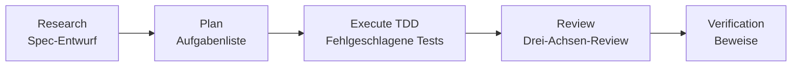
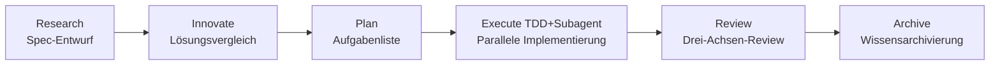

# ALTAS Workflow

> **Fusion dreier Vorteile | Intelligente Tiefenanpassung | Progressive Offenlegung | Schritt-für-Schritt-Feedback**

**Version:** 4.0 (2026-04-16)  
**Repository-Größe:** 8.3M, 169 Markdown-Dateien, 79 Referenzdokumente

---

## 🌐 Sprache / Language

[中文](README.md) | [English](README_EN.md) | [日本語](README_JA.md) | [Français](README_FR.md) | **Deutsch**

---

## 🎯 Was ist das?

**ALTAS Workflow** ist eine umfassende AI-native Entwicklungsworkflow-Spezifikation, die das Wesentliche von drei hervorragenden Workflows integriert: **SDD-RIPER**, **SDD-RIPER-Optimized (Checkpoint-Driven)**, und **Superpowers**.

### Kernmission

Widmet sich der Lösung von vier großen Engineering-Schmerzpunkten in der AI-Programmierung:

| Schmerzpunkt | ALTAS-Lösung |
|------|-----------|
| **Kontextverfall** | CodeMap-Indizierung + progressive Offenlegung, Referenzmaterialien bei Bedarf laden |
| **Review-Lähmung** | 4-stufige intelligente Tiefe (XS/S/M/L), kleine Aufgaben bleiben nicht stecken |
| **Code-Misstrauen** | Spec-Zentralisierung + Drei-Achsen-Review, Spec is Truth |
| **Schwer zu warten** | Archivierung von Wissen + TDD-Eisernes Gesetz, Abschluss bedeutet Vermögenswert |

### Kern-Eiserne Gesetze

1. **No Spec, No Code** — Kein Code vor Bildung des minimalen Specs (Size XS befreit)
2. **No Approval, No Execute** — Niemals Code schreiben, wenn der Mensch in der Plan-Phase nicht nickt
3. **Spec is Truth** — Wenn Spec mit Code konfligiert, hat der Code unrecht
4. **Reverse Sync** — Abweichung bei Ausführung gefunden → zuerst Spec aktualisieren → dann Code korrigieren
5. **Evidence First** — Abschluss durch Verifikationsergebnisse bewiesen, nicht durch Modell-Selbsterklärung
6. **No Root Cause, No Fix** — Ursachenanalyse vor Bug-Fix erforderlich, blinde Korrekturen verboten
7. **TDD Iron Law** — Size M/L: Kein Produktionscode ohne fehlgeschlagene Tests
8. **Resume Ready** — Wiederherstellungsanker in Spec vor langer Aufgabenpause hinterlassen

---

## 📦 Was ist enthalten?

### Repository-Struktur-Überblick

```
altas/
├── altas-workflow/              # Hauptprotokoll-Verzeichnis (8.3M, 92 Dateien)
│   ├── SKILL.md                 # ⭐ Kern-System-Prompt (AI liest)
│   ├── README.md                # ALTAS detaillierte Beschreibung
│   ├── QUICKSTART.md            # Szenario-basierter Schnellleitfaden
│   ├── reference-index.md       # Referenzmaterialien-Hauptindex
│   ├── protocols/               # Spezialisierte Protokolle (3)
│   │   ├── RIPER-5.md           # Strenger Modus Protokoll
│   │   ├── RIPER-DOC.md         # Dokumentations-Experte Protokoll
│   │   └── SDD-RIPER-DUAL-COOP.md # Dual-Modell-Kollaborations-Protokoll
│   ├── docs/                    # Methodologie-Dokumente (4)
│   │   ├── 从传统编程转向大模型编程.md
│   │   ├── AI-原生研发范式.md
│   │   ├── 团队落地指南.md
│   │   └── 手把手教程.md
│   ├── references/              # Bei-Bedarf-Referenzmaterialien (79 Dateien)
│   │   ├── spec-driven-development/  # Spec-getriebene Entwicklung (7 Kern-Dokumente)
│   │   ├── checkpoint-driven/        # Checkpoint leichter Modus (4 Dokumente)
│   │   ├── superpowers/              # Superkräfte (37 Dokumente)
│   │   │   ├── test-driven-development/  # TDD Eisernes Gesetz
│   │   │   ├── systematic-debugging/     # Systematisches Debug
│   │   │   ├── subagent-driven-development/ # Subagent-getrieben
│   │   │   ├── brainstorming/            # Design-Brainstorming
│   │   │   ├── writing-plans/            # Plan-Schreiben Best Practices
│   │   │   └── ... (mehr Superkräfte)
│   │   ├── agents/                       # Agent-Definitionen (22 Dokumente)
│   │   │   ├── sdd-riper-one/            # Standard-Agent
│   │   │   └── sdd-riper-one-light/      # Leichtgewichtiger Agent
│   │   ├── entry/                        # Eintrittskonfiguration (4 Dokumente)
│   │   └── special-modes/                # Spezialmodi (5 Dokumente)
│   └── scripts/                 # Automatisierungstools
│       └── archive_builder.py   # Archiv-Builder
├── .qoder/repowiki/             # Wiki-Dokumente (69 Dokumente)
├── AGENTS.md                    # Allgemeine AI-Verhaltensrichtlinien
├── CLAUDE.md                    # Allgemeine AI-Verhaltensrichtlinien
└── EXAMPLES.md                  # Vier Prinzipien Code-Beispiele
```

### Kern-Vermögenswerte-Statistik

| Kategorie | Anzahl | Beschreibung |
|------|------|------|
| **Kern-Protokoll** | 1 | SKILL.md (ALTAS Workflow Hauptprotokoll) |
| **Spezialisierte Protokolle** | 3 | RIPER-5 / RIPER-DOC / DUAL-COOP |
| **Methodologie** | 4 | Traditionell zu LLM / AI-natives Paradigma / Team-Einführung / Schritt-für-Schritt-Tutorial |
| **Referenzmaterialien** | 79 | Spec-getrieben (7) / Checkpoint (4) / Superpowers (37) / Agents (22) / Entry (4) / Special-Modes (5) |
| **Unabhängige Agents** | 2 | SDD-RIPER-ONE (Standard/Leichtgewicht) |
| **Code-Beispiele** | 1 | EXAMPLES.md (vier Prinzipien Praxisbeispiele) |
| **Automatisierungstools** | 1 | archive_builder.py (Archiv-Builder) |

---

## 🚀 Wie schnell verwenden?

### 30-Sekunden-Installation

**Methode 1**: `altas-workflow/SKILL.md` Inhalt in die Custom Instructions des AI-Assistenten kopieren

**Methode 2**: In Cursor/Trae ausführen:
```bash
cp altas-workflow/SKILL.md .cursorrules
```

**Methode 3**: Projektkonfiguration
```bash
mkdir -p mydocs/{codemap,context,specs,micro_specs,archive}
```

### Plattform-Anpassung

| Plattform | Installationsmethode |
|------|----------|
| **Cursor / Trae** | `SKILL.md` Inhalt in `.cursorrules` oder globale AI Rules kopieren |
| **Claude / OpenAI Agent** | `SKILL.md` Inhalt als System Prompt injizieren |
| **Qoder** | `SKILL.md` im Projekt `.qoder/skills/` Verzeichnis platzieren |

---

### Sofortige Verwendung

**Extrem schnelle Änderung (Size XS)**:
```
>> MAX_RETRIES von 3 auf 5 in src/config.ts ändern
```

**Kleine Aufgabe (Size S)**:
```
FAST: Bild-Verifizierungscode zur Login-Schnittstelle hinzufügen
```

**Standard-Entwicklung (Size M)**:
```
sdd_bootstrap: task=Anti-Scraping-Funktion zur Benutzerregistrierungsschnittstelle hinzufügen, goal=Sicherheitsverbesserung
```

**Architektur-Refactoring (Size L)**:
```
DEEP: Authentifizierungsmodul refaktorieren und in unabhängige Microservices aufteilen
```

**Bug-Untersuchung**:
```
DEBUG: log_path=./logs/error.log, issue=Autorisierung nach Genehmigung nicht erhalten
```

**Multi-Projekt-Kollaboration**:
```
MULTI: task=Frontend-Backend gemeinsame Feature-Veröffentlichung
```

---

## 📚 Kern-Befehle

### Befehls-Überblick

| Befehl | Zweck | Anwendbare Größe | Workflow-Auswirkung |
|------|------|----------|----------|
| `>>` / `FAST` | Schneller Pfad, Research/Plan überspringen | XS/S | Direkt ausführen→verifizieren→zusammenfassen |
| `sdd_bootstrap` | RIPER-Workflow starten | M/L | Research→Plan→Execute→Review |
| `create_codemap` | Code-Map generieren | M/L | Nur-Lese-Analyse, keine Code-Änderungen |
| `MAP` / `PROJECT MAP` | Nur-Lese-Projektanalyse | Alle | Architektur-Map generieren |
| `DEBUG` | System-Debug-Modus | - | Ursachenanalyse→Diagnosebericht |
| `MULTI` | Multi-Projekt-Kollaboration | L | Auto-Entdeckung + Scope-Isolation |
| `ARCHIVE` | Wissensarchivierung | L | Menschen-Version + LLM-Version duale Perspektive |
| `DOC` | Dokumentations-Experte-Modus | - | ABSORB→OUTLINE→AUTHOR→FACT-CHECK |
| `REVIEW SPEC` | Pre-Ausführungs-Review | M/L | Beratende Vorab-Review |
| `REVIEW EXECUTE` | Post-Ausführungs-Drei-Achsen-Review | M/L | Spec/Code/Qualität Drei-Achsen-Review |

### Trigger-Wörter Schnellreferenz

| Trigger-Wort | Aktion | Größe |
|--------|------|------|
| `FAST` / `快速` / `>>` | Extrem schneller Pfad | XS/S |
| `DEEP` | Tiefenmodus | L |
| `MAP` / `链路梳理` | Feature-Level CodeMap | - |
| `PROJECT MAP` / `项目总图` | Projekt-Level CodeMap | - |
| `MULTI` / `多项目` | Multi-Projekt-Modus | L |
| `CROSS` / `跨项目` | Cross-Projekt-Änderungen erlauben | L |
| `DEBUG` / `排查` | Systematisches Debug | - |
| `REVIEW SPEC` / `计划评审` | Pre-Ausführungs beratende Review | M/L |
| `REVIEW EXECUTE` / `代码评审` | Post-Ausführungs Drei-Achsen-Review | M/L |
| `ARCHIVE` / `归档` / `沉淀` | Wissensarchivierung | L |
| `DOC` / `写文档` | Dokumentations-Experte-Modus | - |
| `EXIT ALTAS` / `退出协议` | Protokoll deaktivieren | - |
| `全部` / `all` / `execute all` | Batch-Ausführung | M/L |

---

## 🏗️ Workflow-Stufen

### Size M (Standard) Workflow



**Workflow-Beschreibung**:
- **Research**: Research-Abstimmung, Spec bilden (Goal, In-Scope, Out-of-Scope, Facts, Risks, Open Questions)
- **Plan**: Detaillierte Planung, in atomare Checklist zerlegen, File Changes + Signatures + Done Contract klären
- **Execute**: TDD-getriebene Implementierung (RED→GREEN→REFACTOR)
- **Review**: Drei-Achsen-Review (Spec-Qualität / Spec-Code-Konsistenz / Code-intrinsische Qualität)
- **Verification**: Verifikations-Beweise, sicherstellen dass Tests bestehen

### Size L (Tief) Workflow



**Workflow-Beschreibung**:
- **Research**: Tiefes Research, aktuelle Status-Links ordnen, Risiken identifizieren
- **Innovate**: Lösungsvergleich, 2-3 Lösungen anbieten (Pros/Cons/Risks/Effort)
- **Plan**: Atomare Checklist + Subagent-Zuweisung
- **Execute**: TDD-getrieben + Subagent parallele Implementierung + zwei-stufiger Review
- **Review**: Drei-Achsen-Review + Archivierung
- **Archive**: Duale Perspektive Dokumente generieren (Menschen-Version + LLM-Version)

---

## ⚡ Intelligente Tiefenanpassung

### Vier-Stufen Aufgaben-Tiefe

| Größe | Trigger-Bedingung | Spec-Anforderung | Workflow | Typische Szenarien |
|------|----------|----------|--------|----------|
| **XS (Extrem schnell)** | typo, config-Wert, <10 Zeilen | Überspringen, 1-Zeile Zusammenfassung nachher | Direkt ausführen→verifizieren→zusammenfassen | Config ändern, typo korrigieren, logs |
| **S (Schnell)** | 1-2 Dateien, klare Logik | micro-spec (1-3 Sätze) | micro-spec→genehmigen→ausführen→zurückschreiben | Parameter hinzufügen, einfache Funktion |
| **M (Standard)** | 3-10 Dateien, im Modul | Leichtgewichtiger Spec persistiert | Research→Plan→Execute(TDD)→Review | Neue Schnittstelle, Modul-Refactor |
| **L (Tief)** | Cross-Modul, >500 Zeilen, Architektur-Level | Vollständiger Spec + Innovate + Archive | Research→Innovate→Plan→Execute→Subagent→Review→Archive | Architektur-Aufteilung, Cross-Team-Transformation |

### Größenbewertung Schnellreferenz-Tabelle

| Signal | Empfohlene Größe | Beschreibung |
|------|----------|------|
| "Einen typo korrigieren" | XS | Rein mechanische Änderung |
| "Ein config-Element hinzufügen" | XS | Keine Architektur-Auswirkung |
| "Button-Text ändern" | XS/S | Grenz-Szenario |
| "Einen Parameter zu dieser Schnittstelle hinzufügen" | S | Kleine Änderung in einer Datei |
| "Fehlerbehandlung zu dieser Funktion hinzufügen" | S | Klare Logik |
| "Eine neue CRUD-Schnittstelle hinzufügen" | M | Entwicklung im Modul |
| "Dieses Modul refaktorieren" | M/L | Grenz-Szenario |
| "Cross-Modul Datenmodell-Änderung" | L | Cross-Modul-Auswirkung |
| "Architektur-Level Refactoring" | L | Globale Auswirkung |
| "Frontend-Backend-Verbindung" | L (MULTI) | Multi-Projekt-Kollaboration |

### Auto-Upgrade/Downgrade

- **Komplexität gefunden, die Erwartungen während der Ausführung übersteigt** → AI pausiert sofort, schlägt Upgrade vor
- **Benutzer kann jederzeit** `[Upgrade to M]` / `[Downgrade to S]` verwenden zum Anpassen
- **Erzwungene Spezifikation**: `>>`=XS, `FAST`=S, Standard=M, `DEEP`=L

---

## 🛡️ Qualitäts-Eiserne Gesetze

| # | Eisernes Gesetz | Bedeutung |
|---|------|------|
| 1 | **No Spec, No Code** | Kein Code vor Bildung des minimalen Specs (Size XS befreit) |
| 2 | **No Approval, No Execute** | Niemals Code schreiben, wenn der Mensch in der Plan-Phase nicht nickt |
| 3 | **Spec is Truth** | Wenn Spec mit Code konfligiert, hat der Code unrecht |
| 4 | **Reverse Sync** | Abweichung bei Ausführung gefunden → zuerst Spec aktualisieren → dann Code korrigieren |
| 5 | **Evidence First** | Abschluss durch Verifikationsergebnisse bewiesen, nicht durch Modell-Selbsterklärung |
| 6 | **No Root Cause, No Fix** | Ursachenanalyse vor Bug-Fix erforderlich, blinde Korrekturen verboten |
| 7 | **TDD Iron Law** | Size M/L: Kein Produktionscode ohne fehlgeschlagene Tests |
| 8 | **Resume Ready** | Wiederherstellungsanker in Spec vor langer Aufgabenpause hinterlassen |

---

## 🎯 Fortschritts-Visualisierungs-System

### Checkpoint-Mechanismus

**Nach jedem abgeschlossenen Schritt** muss AI einen standardisierten Checkpoint ausgeben:

```markdown
### Fortschritt [Phase ▸ Schritt]
[Abgeschlossen] ▸ **[Aktuell]** ▸ [Nächster] ▸ [Folgend...]

### Aktuelle Leistung
- Was gerade abgeschlossen wurde (spezifische Ausgabe)

### Erwartete Ausgabe
- Was als Nächstes produziert wird

### Nächste Aktionen
- **[Continue/Approved]**: Zustimmen, zum nächsten Schritt gehen
- **[Modify]** + Feedback: Aktuelle Leistung anpassen
- **[Upgrade to X]** / **[Downgrade to X]**: Größe anpassen
- **[Load Reference: XXX]**: Details eines Referenzdokuments anzeigen
```

---

## 📖 Detaillierte Dokumentation

### Kern-Dokumente (Pflichtlektüre)

| Dokument | Zweck | Länge |
|------|------|------|
| [ALTAS Workflow Detaillierte Beschreibung](altas-workflow/README.md) | Vollständiges Workflow-Protokoll | 650+ Zeilen |
| [Schnellstart-Leitfaden](altas-workflow/QUICKSTART.md) | 30-Sekunden-Onboarding | 170+ Zeilen |
| [Referenzmaterialien-Hauptindex](altas-workflow/reference-index.md) | Bei-Bedarf-Ladekarte | 200+ Zeilen |
| [SKILL.md](altas-workflow/SKILL.md) | AI-System-Prompt | 650+ Zeilen |

### Methodologie-Dokumente (Theorie)

| Dokument | Thema | Zielgruppe |
|------|------|----------|
| [Von traditioneller Programmierung zu LLM-Programmierung](altas-workflow/docs/从传统编程转向大模型编程.md) | Paradigmenwechsel | Alle |
| [AI-natives Entwicklungsparadigma](altas-workflow/docs/AI-原生研发范式 - 从代码中心到文档驱动的演进.md) | Dokument-getrieben | Architekt/Tech Lead |
| [Team-Einführungs-Leitfaden](altas-workflow/docs/团队落地指南.md) | Team-Förderung | Tech Lead/Manager |
| [Schritt-für-Schritt-Tutorial](altas-workflow/docs/如何快速从零开始落地大模型编程%20--%20手把手教程.md) | Von Grund auf | Anfänger |

---

## 📊 Repository-Statistik

```
Repository-Größe: 8.3M
Markdown-Dateien: 169
Referenzmaterialien: 79
  - Spec-Driven Development: 7
  - Checkpoint-Driven: 4
  - Superpowers: 37
  - Agents: 22
  - Entry: 4
  - Special-Modes: 5
Kern-Protokolle: 1 (SKILL.md)
Spezialisierte Protokolle: 3 (RIPER-5/RIPER-DOC/DUAL-COOP)
Methodologie: 4
Unabhängige Agents: 2 (Standard/Leichtgewicht)
Automatisierungstools: 1 (archive_builder.py)
Wiki-Dokumente: 69 (.qoder/repowiki/)
```

---

## 🎯 Schnellnavigation

### Anfänger-Onboarding

1. [Schnellstart-Leitfaden](altas-workflow/QUICKSTART.md) - 30-Sekunden-Onboarding
2. [Von traditioneller Programmierung zu LLM-Programmierung](altas-workflow/docs/从传统编程转向大模型编程.md) - Paradigmenwechsel
3. [Schritt-für-Schritt-Tutorial](altas-workflow/docs/如何快速从零开始落地大模型编程%20--%20手把手教程.md) - Von Grund auf

### Schnellreferenz

- [Kern-Befehle](#-kern-befehle) - Alle Trigger-Wörter und Befehle
- [Größenbewertung](#-intelligente-tiefenanpassung) - Wie XS/S/M/L wählen
- [Referenzmaterialien-Index](altas-workflow/reference-index.md) - Bei-Bedarf-Ladekarte
- [Detaillierte Dokumentation](#-detaillierte-dokumentation) - Vollständige Dokumentenliste

---

*Powered by the integration of SDD-RIPER, SDD-RIPER-Optimized (Checkpoint-Driven), and Superpowers.*

**Letzte Aktualisierung**: 2026-04-16
