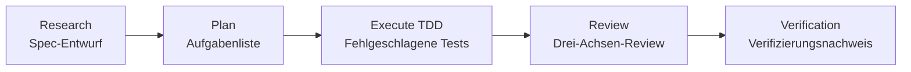
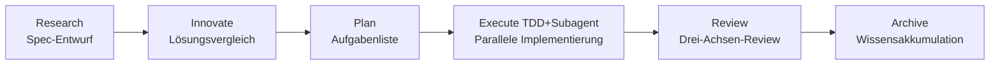

# ALTAS Workflow

> **Drei Vorteile integriert | Intelligente Tiefenanpassung | Progressive Offenlegung | Schritt-für-Schritt-Feedback | Testingenieur-freundlich**

**Version:** 4.7 (2026-04-19)
**Repository-Größe:** 17M, 165 Markdown-Dateien, 120+ Referenzdokumente

---

## 🌐 Sprache / Language

[中文](README.md) | [English](README_EN.md) | [日本語](README_JA.md) | [Français](README_FR.md) | **Deutsch**

---

## 🎯 Was ist das?

**ALTAS Workflow** ist eine umfassende AI-native Entwicklungs-Workflow-Spezifikation, die das Wesen von drei hervorragenden Workflows integriert: **SDD-RIPER**, **SDD-RIPER-Optimized (Checkpoint-Driven)** und **Superpowers**.

### Kernmission

Dediziert an die Lösung vier großer Ingenieurs-Herausforderungen in der AI-Programmierung:

| Herausforderung | ALTAS-Lösung |
|------|-----------|
| **Kontextverfall** | CodeMap-Indexierung + progressive Offenlegung, Referenzmaterialien bei Bedarf laden |
| **Review-Lähmung** | 4-stufige intelligente Tiefe (XS/S/M/L), kleine Aufgaben blockieren nicht Genehmigung |
| **Code-Misstrauen** | Spec-zentriert + Drei-Achsen-Review, Spec is Truth |
| **Schwer wartbar** | Archive-Wissensakkumulation + TDD-Eisernes Gesetz, Fertigstellung = Vermögen |

### Kern-Eiserne Gesetze

1. **No Spec, No Code** — Kein Code vor Bildung des Minimums Specs (Size XS ausgenommen)
2. **No Approval, No Execute** — Niemals Code, wenn Mensch in Plan-Phase nicht nickt
3. **Spec is Truth** — Wenn Spec mit Code kollidiert, ist Code falsch
4. **Reverse Sync** — Abweichung während Ausführung entdeckt → zuerst Spec aktualisieren → dann Code korrigieren
5. **Evidence First** — Fertigstellung durch Verifizierungsergebnisse bewiesen, nicht Modell-Selbstdeklaration
6. **No Root Cause, No Fix** — Ursachenanalyse vor Bug-Fix erforderlich, blinde Korrekturen verboten
7. **TDD Iron Law** — Size M/L: Kein Produktionscode ohne fehlgeschlagenen Test
8. **Resume Ready** — Wiederherstellungsanker in Spec vor langer Aufgabenpause hinterlassen

---

## 📦 Was ist enthalten?

### Repository-Strukturübersicht

```
altas/
├── altas-workflow/              # Hauptprotokollverzeichnis (8.3M, 120+ Dateien)
│   ├── SKILL.md                 # ⭐ Kernsystemprompt (AI liest) - v4.7
│   ├── README.md                # ALTAS-Detailbeschreibung
│   ├── QUICKSTART.md            # Szenariobasierter Schnellstartleitfaden
│   ├── reference-index.md       # Masterindex für Referenzmaterialien
│   ├── workflow-diagrams.md     # Mermaid-Flussdiagrammsammlung
│   ├── protocols/               # Spezialisierte Protokolle (4)
│   │   ├── RIPER-5.md           # Strengmodus-Protokoll
│   │   ├── RIPER-DOC.md         # Dokumentations-Experten-Protokoll
│   │   ├── SDD-RIPER-DUAL-COOP.md # Dual-Modell-Kooperationsprotokoll
│   │   └── PROTOCOL-SELECTION.md # Protokoll-Auswahl-Leitfaden
│   ├── docs/                    # Methodologie-Dokumente (5)
│   │   ├── 从传统编程转向大模型编程.md
│   │   ├── AI-原生研发范式.md
│   │   ├── 团队落地指南.md
│   │   ├── 手把手教程.md
│   │   └── IMPLEMENTATION-PLAN-v4.6.md
│   ├── references/              # Bedarfgesteuerte Referenzmaterialien (95+ Dateien)
│   │   ├── spec-driven-development/  # Spec-gesteuerte Entwicklung (7 Kerndokumente)
│   │   ├── checkpoint-driven/        # Checkpoint-Leichtgewichtsmodus (4 Dokumente)
│   │   ├── superpowers/              # Superkräfte (50+ Dokumente)
│   │   │   ├── test-driven-development/  # TDD Eisernes Gesetz
│   │   │   ├── systematic-debugging/     # Systematisches Debugging
│   │   │   ├── subagent-driven-development/ # Subagent-gesteuert
│   │   │   ├── brainstorming/            # Design-Brainstorming
│   │   │   ├── writing-plans/            # Best Practices für Plan-Schreiben
│   │   │   ├── code-review/              # Code-Review (Go/Python)
│   │   │   └── ... (mehr Superkräfte)
│   │   ├── agents/                       # Agent-Definitionen (22 Dokumente)
│   │   │   ├── sdd-riper-one/            # Standard-Agent
│   │   │   └── sdd-riper-one-light/      # Leichtgewichtiger Agent
│   │   ├── entry/                        # Eingabekonfiguration (5 Dokumente)
│   │   ├── special-modes/                # Spezialmodi (5 Dokumente)
│   │   ├── prd-analysis/                 # 🆕 PRD-Analyse-Workflow (6 Dokumente)
│   │   └── testing/                      # 🆕 Test-Ingenieurwesen-Spezialität (18+ Dokumente)
│   │       ├── test-strategy-template.md    # Test-Strategie-Vorlage
│   │       ├── pytest-patterns.md           # Pytest-Best Practices
│   │       ├── e2e-testing.md               # E2E-Test-Leitfaden
│   │       ├── api-testing.md               # API-Test-Referenz
│   │       ├── performance-testing.md       # Performance-Test-Methodik
│   │       ├── security-testing.md          # Sicherheitstest
│   │       ├── contract-testing.md          # Vertragstest
│   │       ├── test-data-management.md      # Testdatenmanagement
│   │       ├── test-environment.md          # Test-Umgebungsmanagement
│   │       ├── ci-cd-integration.md         # CI/CD-Integration
│   │       └── templates/                   # Test-Gerüst-Vorlagen
│   └── scripts/                 # Automatisierungswerkzeuge
│       ├── archive_builder.py   # Archive-Builder
│       ├── scaffold.py          # Projekt-Gerüst
│       └── validate_aliases_sync.py # Alias-Synchronisierungsvalidierung
├── .agents/skills/              # 🆕 Unabhängige Skill-Pakete (6)
│   ├── advanced-api-testing/   # Erweitertes API-Testing
│   ├── go-code-review/         # Go-Code-Review
│   ├── python-code-review/     # Python-Code-Review
│   ├── pytest-patterns/        # Pytest-Muster
│   ├── specify-requirements/   # Anforderungsspezifikation
│   └── implementation-verify/  # Implementierungsüberprüfung
├── .qoder/repowiki/             # Wiki-Dokumente (69 Dokumente)
├── AGENTS.md                    # Allgemeine AI-Verhaltensrichtlinien
├── CLAUDE.md                    # Claude-spezifische Verhaltensrichtlinien
├── EXAMPLES.md                  # Vier Prinzipien Codebeispiele
└── skills-lock.json             # Skill-Paket-Versionsperrung
```

### Kern-Vermögensstatistiken

| Kategorie | Anzahl | Beschreibung |
|------|------|------|
| **Kernprotokoll** | 1 | SKILL.md (ALTAS Workflow Hauptprotokoll) v4.7 |
| **Spezialisierte Protokolle** | 4 | RIPER-5 / RIPER-DOC / DUAL-COOP / PROTOCOL-SELECTION |
| **Methodik** | 5 | Traditionell zu LLM / AI-natives Paradigma / Team-Einführung / Schritt-für-Schritt-Tutorial / v4.6 Implementierungsplan |
| **Referenzmaterialien** | 95+ | Spec-driven (7) / Checkpoint (4) / Superpowers (50+) / Agents (22) / Entry (5) / Special-Modes (5) / PRD Analyse (6) / Testing (18+) |
| **Unabhängige Agenten** | 2 | SDD-RIPER-ONE (Standard/Leicht) |
| **🆕 Skill-Pakete** | 6 | API-Test / Go-Review / Python-Review / Pytest / Anforderungsspezifikation / Implementierungsprüfung |
| **Codebeispiele** | 1 | EXAMPLES.md (Vier Prinzipien Praxisbeispiele) |
| **Automatisierungswerkzeuge** | 3 | archive_builder.py / scaffold.py / validate_aliases_sync.py |

---

## 🚀 v4.7 Neuheiten (2026-04-19)

### 🧪 Test-Ingenieurwesen-Spezialitätsoptimierung

- ✅ **E2E-Test-Framework-Referenzleitfaden**: End-to-End-Test-Best Practices mit Playwright/Cypress-Integration
- ✅ **Performance-/Lasttest-Methodik**: Stresstest-Strategie, Benchmark-Test, Performance-Metrikensystem
- ✅ **API-Test-vollständiger Prozess**: Vertragstest, Sicherheitstest, API-Test-Matrix-Vorlagen
- ✅ **Pytest-Test-Muster-Dokumentensuite**: Fixture-Design, Parametrisierung, Mock-Strategien, Abdeckung
- ✅ **Testdatenmanagement**: Factory-Pattern, Fixture-Hierarchie, Test-Isolation
- ✅ **Test-Umgebungsmanagement**: Docker Compose, Dependency Injection, Umgebungskonsistenz
- ✅ **CI/CD-Integrationstest**: Automatisierte Pipeline, Quality Gates, Testberichte
- ✅ **Test-Gerüst-Vorlagen**: Sofort einsatzbereit conftest.py / factories / fixtures
- ✅ **Go/Python-Test-Unterstützung**: Mehrsprachige Test-Best Practices und Anti-Pattern

### 🔍 Code-Review-Skill-Pakete

- ✅ **Go-Code-Review**: Statische Analyse, Performance-Audit, Parallelitäts-Sicherheitsprüfungen
- ✅ **Python-Code-Review**: Typsicherheit, Asynchrone Muster, Fehlerbehandlungsstandards
- ✅ **Review-Prozessstandardisierung**: Review Request → Code Quality → Spec Compliance

### 📋 PRD-Analyse-Workflow

- ✅ **Strukturierte Anforderungsanalyse**: Brainstorm → Discover → Document → Review → Validate
- ✅ **PRD-Vorlage & Validierung**: Produktübersicht, User Personas, Journey, Funktionsanforderungen, Erfolgsmetriken
- ✅ **Qualitätsmetrik-Standards**: Strukturelle Vollständigkeit, Inhaltqualität, Grenzvalidierung, Querschnittskonsistenz

### 🛠️ Andere Verbesserungen

- ✅ **Alias-Synchronisierungsvalidierungsskript**: Automatische Konsistenzprüfung von Triggerwörtern
- ✅ **Projekt-Gerüst-Automatisierung**: Schnelle Initialisierung von Projektstruktur und Konventionen
- ✅ **Implementierungsprüfung-Skill**: Automatisierte Akzeptanztests und Abdeckungsprüfung
- ✅ **Erweiterte API-Test-Muster**: Idempotenz, Eingabevalidierung, Fehlerbehandlung, Parallelitätstests

---

## 🚀 Wie schnell verwenden?

### 30-Sekunden-Installation

**Methode 1**: `altas-workflow/SKILL.md` Inhalt in Custom Instructions des AI-Assistenten kopieren

**Methode 2**: In Cursor/Trae ausführen:
```bash
cp altas-workflow/SKILL.md .cursorrules
```

**Methode 3**: Projektkonfiguration
```bash
mkdir -p mydocs/{codemap,context,specs,micro_specs,archive}
```

### Plattformanpassung

| Plattform | Installationsmethode |
|------|----------|
| **Cursor / Trae** | `SKILL.md` Inhalt in `.cursorrules` oder globale AI Rules kopieren |
| **Claude / OpenAI Agent** | `SKILL.md` Inhalt als System Prompt injizieren |
| **Qoder** | `SKILL.md` in Projekt `.qoder/skills/` Verzeichnis platzieren |

---

### Sofortige Verwendung

**Ultra-schnelle Änderung (Size XS)**:
```
>> MAX_RETRIES in src/config.ts von 3 auf 5 ändern
```

**Kleine Aufgabe (Size S)**:
```
FAST: Bildverifizierungscode zur Login-Oberfläche hinzufügen
```

**Standardentwicklung (Size M)**:
```
sdd_bootstrap: task=Anti-Scraping-Funktion durch Bildcode zur Benutzerregistrierung hinzufügen, goal=Sicherheitsverbesserung
```

**Architektur-Refactoring (Size L)**:
```
DEEP: Authentifizierungsmodul refaktorisieren, um in unabhängige Microservices aufzuteilen
```

**Bug-Untersuchung**:
```
DEBUG: log_path=./logs/error.log, issue=Autorisierung nach Genehmigung nicht erhalten
```

**Multi-Projekt-Zusammenarbeit**:
```
MULTI: task=Frontend-Backend-Joint-Funktionsfreigabe
```

**🆕 PRD-Analyse**:
```
PRD: E-Commerce-Warenkorb-Anforderungen analysieren, strukturiertes PRD-Dokument ausgeben
```

**🆕 Test-Spezialität**:
```
TEST: E2E-Testfälle für Zahlungsmodul ergänzen
PERF: Performance-Stresstest auf Auftragsabfrage-Schnittstelle
REVIEW: Authentifizierungsmodul Codequalität prüfen (Go/Python)
```

---

## 📚 Kernbefehle

### Befehlsübersicht

| Befehl | Zweck | Anwendbare Größe | Workflow-Auswirkung |
|------|------|----------|----------|
| `>>` / `FAST` | Fast Track, Research/Plan überspringen | XS/S | Direkt ausführen→überprüfen→Zusammenfassung |
| `sdd_bootstrap` | RIPER-Workflow starten | M/L | Research→Plan→Execute→Review |
| `create_codemap` | Codekarte generieren | M/L | Nur-Lese-Analyse, keine Codeänderungen |
| `MAP` / `PROJECT MAP` | Nur-Lese-Projektanalyse | Alle | Architekturkarte generieren |
| `DEBUG` | System-Debug-Modus | - | Ursachenanalyse→Diagnosebericht |
| `MULTI` | Multi-Projekt-Zusammenarbeit | L | Auto-Entdeckung + Scope-Isolation |
| `ARCHIVE` | Wissensakkumulation | L | Menschliche Version + LLM-Version Doppelperspektive |
| `DOC` | Dokumentations-Experten-Modus | - | ABSORB→OUTLINE→AUTHOR→FACT-CHECK |
| `REVIEW SPEC` | Prä-Ausführungs-Review | M/L | Beratendes Pre-Review |
| `REVIEW EXECUTE` | Post-Ausführung Drei-Achsen-Review | M/L | Spec/Code/Qualität Drei-Achsen-Review |
| **`PRD`** | **🆕 PRD-Analyse** | **M/L** | **Brainstorm→Discover→Document→Review→Validate** |
| **`TEST`** | **🆕 Test-Spezialität** | **M/L** | **Test-Strategie→Fall-Design→Implementierung→Verifizierung** |
| **`PERF`** | **🆕 Performance-Optimierung** | **L** | **Baselinemessung→Engpassanalyse→Optimierung→Regressionverifizierung** |
| **`REVIEW`** | **🆕 Code-Review** | **M/L** | **Review-Anfrage→Qualitätsprüfung→Compliance-Validierung** |
| **`REFACTOR`** | **🆕 Refactoring-Spezialität** | **L** | **CodeMap→Plan(TDD)→Execute→Review** |
| **`MIGRATE`** | **🆕 Migration-Spezialität** | **L** | **Risikobewertung→Migration→Verifizierung** |

### Triggerwörter Schnellreferenz

| Triggerwort | Aktion | Größe |
|--------|------|------|
| `FAST` / `快速` / `>>` | Ultraschneller Track | XS/S |
| `DEEP` | Tiefen-Modus | L |
| `MAP` / `链路梳理` | CodeMap Feature-Ebene | - |
| `PROJECT MAP` / `项目总图` | CodeMap Projekt-Ebene | - |
| `MULTI` / `多项目` | Multi-Projekt-Modus | L |
| `CROSS` / `跨项目` | Cross-Projekt-Änderungen erlauben | L |
| `DEBUG` / `排查` | Systematisches Debuggen | - |
| `REVIEW SPEC` / `计划评审` | Prä-Ausführung beratendes Review | M/L |
| `REVIEW EXECUTE` / `代码评审` | Post-Ausführung Drei-Achsen-Review | M/L |
| `ARCHIVE` / `归档` / `沉淀` | Wissensakkumulation | L |
| `DOC` / `写文档` | Dokumentations-Experten-Modus | - |
| **`PRD` / `PRD ANALYSIS`** | **🆕 PRD-Analyse** | **M/L** |
| **`TEST` / `写测试` / `补测试`** | **🆕 Test-Spezialität** | **M/L** |
| **`PERF` / `性能优化`** | **🆕 Performance-Optimierung** | **L** |
| **`REVIEW` / `代码审查` / `审查PR`** | **🆕 Code-Review** | **M/L** |
| **`REFACTOR` / `重构`** | **🆕 Refactoring-Spezialität** | **L** |
| **`MIGRATE` / `迁移`** | **🆕 Migration-Spezialität** | **L** |
| `EXIT ALTAS` / `退出协议` | Protokoll deaktivieren | - |
| `全部` / `all` / `execute all` | Batch-Ausführung | M/L |

---

## 🏗️ Workflow-Phasen

### Size M (Standard) Workflow



**Workflow-Beschreibung**:
- **Research**: Research-Ausrichtung, Spec bilden (Goal, In-Scope, Out-of-Scope, Facts, Risks, Open Questions)
- **Plan**: Detaillierte Planung, in atomare Checkliste zerlegen, File Changes + Signatures + Done Contract klären
- **Execute**: TDD-getriebene Implementierung (RED→GREEN→REFACTOR)
- **Review**: Drei-Achsen-Review (Spec-Qualität / Spec-Code-Konsistenz / Code-intrinsische Qualität)
- **Verification**: Verifizierungsnachweis, Testdurchlauf sicherstellen

### Size L (Tief) Workflow



**Workflow-Beschreibung**:
- **Research**: Tiefgründige Research, aktuelle Status-Links sortieren, Risiken identifizieren
- **Innovate**: Lösungsvergleich, 2-3 Lösungen bereitstellen (Pros/Cons/Risks/Effort)
- **Plan**: Atomare Checkliste + Subagent-Zuweisung
- **Execute**: TDD-getrieben + Subagent parallele Implementierung + zweistufiges Review
- **Review**: Drei-Achsen-Review + Archive-Akkumulation
- **Archive**: Doppelperspektiv-Dokumente generieren (menschliche Version + LLM-Version)

---

## ⚡ Intelligente Tiefenanpassung

### Vierstufige Task-Tiefe

| Größe | Triggerbedingung | Spec-Anforderung | Workflow | Typische Szenarien |
|------|----------|----------|--------|----------|
| **XS (Ultraschnell)** | Typo, Konfigurationswert, <10 Zeilen | Überspringen, 1-Zeilen-Zusammenfassung danach | Direkt ausführen→überprüfen→Zusammenfassung | Konfiguration ändern, Typo korrigieren, Logs |
| **S (Schnell)** | 1-2 Dateien, klare Logik | Micro-Spec (1-3 Sätze) | Micro-Spec→genehmigen→ausführen→zurückschreiben | Parameter hinzufügen, einfache Funktion |
| **M (Standard)** | 3-10 Dateien, innerhalb Modul | Leichtes Spec persistiert | Research→Plan→Execute(TDD)→Review | Neue Schnittstelle, Modul-Refactoring |
| **L (Tief)** | Cross-Modul, >500 Zeilen, Architektur-Ebene | Vollständiges Spec + Innovate + Archive | Research→Innovate→Plan→Execute→Subagent→Review→Archive | Architekturaufteilung, Cross-Team-Transformation |

### Größenbewertung Schnellreferenztabelle

| Signal | Empfohlene Größe | Beschreibung |
|------|----------|------|
| "Typo korrigieren" | XS | Rein mechanische Änderung |
| "Konfigurationseintrag hinzufügen" | XS | Keine Architektur-Auswirkung |
| "Button-Text ändern" | XS/S | Grenz-Szenario |
| "Parameter zu dieser Schnittstelle hinzufügen" | S | Einzelne Datei kleine Änderung |
| "Fehlerbehandlung zu dieser Funktion hinzufügen" | S | Klare Logik |
| "Neue CRUD-Schnittstelle hinzufügen" | M | Entwicklung innerhalb Modul |
| "Dieses Modul refaktorisieren" | M/L | Grenz-Szenario |
| "Cross-Modul Datenmodell-Änderung" | L | Cross-Modul-Auswirkung |
| "Architektur-Ebene Refactoring" | L | Globale Auswirkung |
| "Frontend-Backend-Joint" | L (MULTI) | Multi-Projekt-Zusammenarbeit |
| "E2E-Tests ergänzen" | M (TEST) | 🆕 Test-Spezialität |
| "Performance-Stresstest" | L (PERF) | 🆕 Performance-Optimierung |

### Auto Upgrade/Downgrade

- **Komplexität während Ausführung höher als erwartet entdeckt** → AI pausiert sofort, schlägt Upgrade vor
- **Jederzeit nutzbar** `[Upgrade zu M]` / `[Downgrade zu S]` zum Anpassen
- **Erzwingen**: `>>`=XS, `FAST`=S, Standard=M, `DEEP`=L

---

## 🛡️ Qualitäts-Eiserne Gesetze

| # | Eisernes Gesetz | Bedeutung |
|---|------|------|
| 1 | **No Spec, No Code** | Kein Code vor Minimum Spec-Bildung (Size XS ausgenommen) |
| 2 | **No Approval, No Execute** | Kein Code wenn Mensch in Plan-Phase nicht genehmigt |
| 3 | **Spec is Truth** | Wenn Spec mit Code kollidiert, ist Code falsch |
| 4 | **Reverse Sync** | Abweichung während Ausführung → erst Spec aktualisieren → dann Code korrigieren |
| 5 | **Evidence First** | Fertigstellung durch Verifizierungsergebnisse bewiesen, nicht Selbstdeklaration des Modells |
| 6 | **No Root Cause, No Fix** | Ursachenanalyse vor Bug-Fix erforderlich, blinde Korrekturen verboten |
| 7 | **TDD Iron Law** | Size M/L: Kein Produktionscode ohne fehlgeschlagenen Test |
| 8 | **Resume Ready** | Wiederherstellungsanker in Spec vor langer Aufgabenpause hinterlassen

---

## 🎯 Fortschrittsvisualisierungssystem

### Checkpoint-Mechanismus

**Nach Abschluss jedes Schritts** muss AI standardisierten Checkpoint ausgeben:

```markdown
### Fortschritt [Phase ▸ Schritt]
[Abgeschlossen] ▸ **[Aktuell]** ▸ [Nächster] ▸ [Zukünftig...]

### Aktuelles Ergebnis
- Was wurde gerade abgeschlossen (konkretes Ergebnis)

### Erwartetes Ergebnis
- Was wird im nächsten Schritt produziert

### Nächste Aktionen
- **[Weiter/Approved]**: Einverstanden, zum nächsten Schritt
- **[Ändern]** + Feedback: Aktuelles Ergebnis anpassen
- **[Upgrade zu X]** / **[Downgrade zu X]**: Größe anpassen
- **[Referenz laden: XXX]**: Details eines Referenzdokuments anzeigen
```

### Checkpoint-Beispiel

**Nach Abschluss von Research**:
```markdown
### Fortschritt [Research ▸ Abgeschlossen]
[ ] ▸ **[Research]** ▸ [Plan] ▸ [Execute] ▸ [Review]

### Aktuelles Ergebnis
- Aktuelle Status-Analyse abgeschlossen, 3 Core-Dateien identifiziert
- Bestehende Registrierungs-Schnittstelle hat keine Grafikbibliothek-Abhängigkeit
- Spec-Entwurf erstellt (Goal/Scope/Facts/Risks)

### Erwartetes Ergebnis
- Plan-Phase wird in atomare Checkliste zerlegt
- Spezifische Änderungen und Signaturen für jede Datei klären

### Nächste Aktionen
- **[Weiter]**: In Plan-Phase eintreten
- **[Ändern]**: Risiko-Elemente im Spec anpassen
- **[Referenz laden: spec-template.md]**: Spec-Vorlage Details anzeigen
```

**Nach Abschluss von Plan**:
```markdown
### Fortschritt [Plan ▸ Abgeschlossen]
[Research] ▸ **[Plan]** ▸ [Execute] ▸ [Review]

### Aktuelles Ergebnis
- Checkliste in 5 atomare Aufgaben zerlegt
- 3 Datei-Änderungen + Funktions-Signaturen geklärt
- Done Contract definiert

### Erwartetes Ergebnis
- Execute-Phase implementiert sequentiell gemäß Checkliste
- TDD-getrieben: zuerst fehlgeschlagenen Test schreiben→Logik implementieren→Verifizierung bestehen

### Nächste Aktionen
- **[Approved]**: Plan genehmigen, in Execute eintreten
- **[Ändern]**: Checklisten-Reihenfolge oder Implementierungsplan anpassen
- **[Upgrade zu L]**: Subagent parallele Implementierung benötigt
```

---

## 📖 Detaillierte Dokumentation

### Kern-Dokumente (Pflichtlektüre)

| Dokument | Zweck | Länge |
|------|------|------|
| [ALTAS Workflow Detailbeschreibung](altas-workflow/README.md) | Vollständiges Workflow-Protokoll | 300+ Zeilen |
| [Schnellstart-Leitfaden](altas-workflow/QUICKSTART.md) | 30-Sekunden-Onboarding | 170+ Zeilen |
| [Referenzmaterialien-Masterindex](altas-workflow/reference-index.md) | Bedarfs-Lade-Karte | 200+ Zeilen |
| [SKILL.md](altas-workflow/SKILL.md) | AI-Systemprompt | 650+ Zeilen |
| [Flussdiagramm-Sammlung](altas-workflow/workflow-diagrams.md) | Mermaid-Visualisierung | - |

### Methodologie-Dokumente (Theorie)

| Dokument | Thema | Zielgruppe |
|------|------|----------|
| [Von traditioneller Programmierung zu LLM-Programmierung](altas-workflow/docs/从传统编程转向大模型编程.md) | Paradigmenwechsel | Alle |
| [AI-natives Entwicklungsparadigma](altas-workflow/docs/AI-原生研发范式-从代码中心到文档驱动的演进.md) | Dokument-getrieben | Architekt/Tech Lead |
| [Team-Einführungsleitfaden](altas-workflow/docs/团队落地指南.md) | Team-Promotion | Tech Lead/Manager |
| [Schritt-für-Schritt-Tutorial](altas-workflow/docs/如何快速从零开始落地大模型编程--手把手教程.md) | Von Null an | Anfänger |
| [v4.6 Implementierungsplan](altas-workflow/docs/IMPLEMENTATION-PLAN-v4.6.md) | Version-Upgrade | Tech Lead |

### 🆕 Test-Ingenieurwesen-Spezialität (v4.7 Neu)

| Dokument | Thema | Zielgruppe |
|------|------|----------|
| [Test-Strategie-Vorlage](altas-workflow/references/testing/test-strategy-template.md) | Test-Strategie-Formulierung | QA/Tech Lead |
| [E2E-Test-Leitfaden](altas-workflow/references/testing/e2e-testing.md) | End-to-End-Test | Testingenieur |
| [API-Test-Referenz](altas-workflow/references/testing/api-testing.md) | API-Test-Vollprozess | Backend/QA |
| [Performance-Test-Methodik](altas-workflow/references/testing/performance-testing.md) | Stresstest und Tuning | Performance-Ingenieur |
| [Pytest-Test-Muster](altas-workflow/references/testing/pytest-patterns.md) | Python-Test-Best Practices | Python-Entwickler |
| [Sicherheitstest](altas-workflow/references/testing/security-testing.md) | Sicherheitstest-Checkliste | Sicherheitsingenieur |
| [CI/CD-Integration](altas-workflow/references/testing/ci-cd-integration.md) | Automatisierte Pipeline | DevOps |
| [Test-Gerüst-Vorlagen](altas-workflow/references/testing/test-scaffold-templates.md) | Sofort einsatzbereit | Alle |

### 🆕 Code-Review-Skill-Pakete (v4.7 Neu)

| Skill | Sprache | Zweck |
|------|------|------|
| [Go-Code-Review](.agents/skills/go-code-review/SKILL.md) | Go | Statische Analyse, Parallelitätssicherheit, Performance-Audit |
| [Python-Code-Review](.agents/skills/python-code-review/SKILL.md) | Python | Typsicherheit, asynchrone Muster, Fehlerbehandlung |
| [Erweitertes API-Testing](.agents/skills/advanced-api-testing/SKILL.md) | - | Idempotenz, Parallelität, Vertragstest |

### 🆕 PRD-Analyse-Workflow (v4.7 Neu)

| Dokument | Zweck |
|------|------|
| [PRD-Analyse-Skill](altas-workflow/references/prd-analysis/SKILL.md) | Vollständiger PRD-Analyse-Prozess |
| [PRD-Vorlage](altas-workflow/references/prd-analysis/template.md) | Strukturierte Vorlage |
| [PRD-Validierung](altas-workflow/references/prd-analysis/validation.md) | Qualitätsmetrik-Standards |
| [Gutes PRD-Beispiel](altas-workflow/references/prd-analysis/examples/good-prd.md) | Referenzbeispiel |

### Spezialisierte Protokolle (Spezialszenarien)

| Protokoll | Zweck | Trigger-Methode |
|------|------|----------|
| [RIPER-5 Strengmodus](altas-workflow/protocols/RIPER-5.md) | Strenge Phasen-Gates | Hochrisiko-Projekte |
| [RIPER-DOC Dokumentations-Experte](altas-workflow/protocols/RIPER-DOC.md) | Dokumentenerstellung | `DOC`-Befehl |
| [Dual-Modell-Kooperationsprotokoll](altas-workflow/protocols/SDD-RIPER-DUAL-COOP.md) | Multi-Modell-Zusammenarbeit | Komplexe Architektur |
| [Protokoll-Auswahl-Leitfaden](altas-workflow/protocols/PROTOCOL-SELECTION.md) | Protokoll-Auswahl-Entscheidung | Bei Unsicherheit konsultieren |

### Skill-Pakete (Unabhängige Agenten)

| Agent | Positionierung | Anwendbare Szenarien |
|-------|------|----------|
| [SDD-RIPER-ONE Standard](altas-workflow/references/agents/sdd-riper-one/SKILL.md) | Vollständiger RIPER-Workflow | Mittel-große Aufgaben |
| [SDD-RIPER-ONE Light](altas-workflow/references/agents/sdd-riper-one-light/SKILL.md) | Checkpoint-getrieben | Hochfrequenz Multi-Turn/Starke Modelle |

### Superkräfte (Superpowers)

| Fähigkeit | Dokument | Aufruf-Zeitpunkt |
|------|------|----------|
| **TDD** | [test-driven-development/SKILL.md](altas-workflow/references/superpowers/test-driven-development/SKILL.md) | Size M/L Execute-Phase |
| **Systematisches Debuggen** | [systematic-debugging/SKILL.md](altas-workflow/references/superpowers/systematic-debugging/SKILL.md) | DEBUG-Modus |
| **Subagent-Getrieben** | [subagent-driven-development/SKILL.md](altas-workflow/references/superpowers/subagent-driven-development/SKILL.md) | Size L parallele Implementierung |
| **Design-Brainstorming** | [brainstorming/SKILL.md](altas-workflow/references/superpowers/brainstorming/SKILL.md) | Innovate-Phase |
| **Plan-Schreiben Best Practices** | [writing-plans/SKILL.md](altas-workflow/references/superpowers/writing-plans/SKILL.md) | Plan-Phase |
| **Pre-Completion-Verifizierung** | [verification-before-completion/SKILL.md](altas-workflow/references/superpowers/verification-before-completion/SKILL.md) | Review-Phase |

---

## 🤝 Quell-Integration

### Drei Quellen Überblick

| Quelle | Kernvorteil | Übernommener Inhalt |
|------|----------|----------|
| **SDD-RIPER** | Spec-zentriert, RIPER-State-Machine | Spec-Vorlage, Drei-Achsen-Review, Multi-Project Auto-Discovery, Debug/Archive-Protokolle, CodeMap-Indexierung |
| **SDD-RIPER-Optimized** | Checkpoint-Driven Leichtgewichtsmodus | 4-stufige Task-Tiefe (zero/fast/standard/deep), Done Contract, Resume Ready, Hot/Warm/Cold Kontext-Assembly, Micro-Spec |
| **Superpowers** | TDD-Eisernes Gesetz, systematisches Debuggen | TDD-Anti-Patterns, Debuggen Vier-Stufen-Methode, Subagent-Getrieben + Zweistufiges Review, paralleler Agent-Dispatch, Verifizierung-zuerst Eisernes Gesetz |

### Quell-Beitragsstatistiken

| Quelle | Dokumentanzahl | Kern-Dateien |
|------|--------|----------|
| **SDD-RIPER** | 14+ | spec-template.md, commands.md, multi-project.md, archive-template.md |
| **SDD-RIPER-Optimized** | 6+ | spec-lite-template.md, modules.md, conventions.md |
| **Superpowers** | 24+ | TDD, Debug, Subagent, Brainstorming, Writing-Plans, Verification |
| **🆕 Testing** | 18+ | E2E, API, Performance, Security, Pytest, CI/CD |
| **🆕 Code Review** | 6+ | Go Review, Python Review, Advanced API Testing |
| **🆕 PRD Analysis** | 6 | SKILL, Template, Validation, Examples |

---

## 🎓 Typische Verwendungsszenarien

### Szenario 1: Tägliche Feature-Iteration (Size M)

**Eingabe**:
```
sdd_bootstrap: task=Anti-Scraping-Funktion durch Bildcode zur Benutzerregistrierung hinzufügen, goal=Sicherheitsverbesserung
```

**AI-Verhalten**:
1. ✅ Auto-Größenbewertung → Size M (Standard)
2. ✅ **Research** → Bestehende Registrierungs-Schnittstelle lesen, keine Grafikbibliothek-Abhängigkeit entdeckt → Checkpoint ausgeben
3. ✅ **Plan** → Checkliste auflisten (Bibliothek einführen→Schnittstelle ändern→Test hinzufügen) → Checkpoint ausgeben, auf [Approved] warten
4. ✅ **Execute** → TDD: Zuerst fehlgeschlagenen Test schreiben→Logik implementieren→Verifizierung bestehen
5. ✅ **Review** → Drei-Achsen-Review → Bestätigung bestanden

**Ergebnis**:
- Spec-Dokument: `mydocs/specs/YYYY-MM-DD_hh-mm_BenutzerregistrierungBildverifizierung.md`
- Code-Änderungen: `src/api/auth.ts`, `src/utils/captcha.ts`
- Testdatei: `src/api/auth.test.ts`

---

### Szenario 2: Notfall-Änderung Online-Konfiguration (Size XS)

**Eingabe**:
```
>> MAX_RETRIES in src/config.ts von 3 auf 5 ändern
```

**AI-Verhalten**:
1. ✅ Als Size XS (Ultraschnell) identifiziert
2. ✅ Code direkt ändern→Verifizierung ausführen→1-Zeilen-Zusammenfassung

**Ergebnis**:
- 1-Zeilen-Zusammenfassung: `MAX_RETRIES von 3→5 geändert, Verifizierung bestanden`

---

### Szenario 3: Architektur-Refactoring (Size L)

**Eingabe**:
```
DEEP: Authentifizierungsmodul refaktorisieren, um in unabhängige Microservices aufzuteilen
```

**AI-Verhalten**:
1. ✅ Als Size L (Tief) identifiziert
2. ✅ **create_codemap** → Authentifizierungsmodul Code-Index generieren
3. ✅ **Research** → Aktuelle Status-Links sortieren, Risiken identifizieren
4. ✅ **Innovate** → 3 Lösungen bereitstellen (Service-orientiert/Modularisiert/Gateway-Schicht) Vergleich
5. ✅ **Plan** → Atomare Checkliste + Subagent-Zuweisung
6. ✅ **Execute** → TDD-getrieben + Subagent parallele Implementierung + zweistufiges Review
7. ✅ **Review** → Drei-Achsen-Review + Archive-Akkumulation

**Ergebnis**:
- CodeMap: `mydocs/codemap/YYYY-MM-DD_hh-mm_Authentifizierungsmodul.md`
- Spec: `mydocs/specs/YYYY-MM-DD_hh-mm_Authentifizierungsservice.md`
- Archive: `mydocs/archive/YYYY-MM-DD_hh-mm_Authentifizierungsservice_{human,llm}.md`

---

### Szenario 4: Bug-Untersuchung

**Eingabe**:
```
DEBUG: log_path=./logs/error.log, issue=Autorisierung nach Genehmigung nicht erhalten
```

**AI-Verhalten**:
1. ✅ Debug-Modus betreten (Nur-Lese-Analyse)
2. ✅ Logs + Spec + CodeMap lesen → Dreieckspositionierung
3. ✅ Ausgeben: Symptome / Erwartetes Verhalten / Root-Cause-Kandidaten / Vorgeschlagene Korrekturen
4. ✅ Wenn Korrektur benötigt → RIPER-Workflow oder FAST eintreten

**Ergebnis**:
- Strukturierter Diagnosebericht: Symptome / Erwartetes Verhalten / Root-Cause-Kandidaten (3) / Vorgeschlagene Korrekturen

---

### Szenario 5: Multi-Projekt-Zusammenarbeit

**Eingabe**:
```
MULTI: task=Frontend-Backend-Joint-Funktionsfreigabe
```

**AI-Verhalten**:
1. ✅ Workdir auto-scannen → web-console + api-service entdecken
2. ✅ Project Registry zur Bestätigung ausgeben
3. ✅ Dual-Projekt CodeMap generieren
4. ✅ Plan nach Projekt gruppiert: api-service(Provider)→web-console(Consumer)
5. ✅ In Abhängigkeitsreihenfolge ausführen, Contract Interfaces aufzeichnen

**Ergebnis**:
- Project Registry: Identifizierte Subprojekt-Liste
- Contract Interfaces: API-Schnittstellen-Vertragsdokumente
- Touched Projects: Geänderte Projekt-Liste

---

### 🆕 Szenario 6: PRD-Analyse (v4.7)

**Eingabe**:
```
PRD: E-Commerce-Warenkorb-Anforderungen analysieren, Ziel=Konversionsrate um 20% steigern
```

**AI-Verhalten**:
1. ✅ PRD-Analyse-Modus betreten
2. ✅ **Brainstorm** → Stakeholder-Eingaben sammeln, Wettbewerbsanalyse
3. ✅ **Discover** → Nutzerforschung, Datenanalyse, technische Machbarkeit
4. ✅ **Document** → Strukturiertes PRD ausgeben (Produktübersicht/User Personas/Journey/Funktionale Anforderungen/Erfolgsmetriken)
5. ✅ **Review** → Stakeholder-Review
6. ✅ **Validate** → Qualitätsmetrik-Validierung (Strukturelle Vollständigkeit/Inhaltsqualität/Grenzvalidierung)

**Ergebnis**:
- PRD-Dokument: `mydocs/prds/YYYY-MM-DD_hh-mm_ECommerceWarenkorbOptimierung.md`
- Validierungsbericht: Liste bestandener/nicht bestandener Punkte

---

### 🆕 Szenario 7: E2E-Test-Spezialität (v4.7)

**Eingabe**:
```
TEST: Kritische Pfad-E2E-Tests für Zahlungsmodul ergänzen
Bereich: src/modules/payment
Ziel: Kompletten Ablauf Bestellung→Zahlung→Callback abdecken
Einschränkungen: Playwright verwenden, keine echte Zahlungs-Gateway-Abhängigkeit
```

**AI-Verhalten**:
1. ✅ TEST-Modus betreten
2. ✅ **Strategy** → [test-strategy-template.md](altas-workflow/references/testing/test-strategy-template.md) referenzieren, Test-Strategie formulieren
3. ✅ **Design** → [e2e-testing.md](altas-workflow/references/testing/e2e-testing.md) referenzieren, Testfälle entwerfen
4. ✅ **Implement** → [templates/](altas-workflow/references/testing/templates/) Gerüst für schnelle Implementierung verwenden
5. ✅ **Verify** → Tests ausführen, Berichte generieren

**Ergebnis**:
- Testdatei: `src/modules/payment/e2e/checkout-flow.spec.ts`
- Testbericht: Abdeckung, Durchlaufquote, Performance-Metriken

---

## 📊 Größenbewertung Schnellreferenz

| Signal | Empfohlene Größe |
|------|----------|
| "Typo korrigieren" | XS |
| "Konfigurationseintrag hinzufügen" | XS |
| "Button-Text ändern" | XS/S |
| "Parameter zu dieser Schnittstelle hinzufügen" | S |
| "Fehlerbehandlung zu dieser Funktion hinzufügen" | S |
| "Neue CRUD-Schnittstelle hinzufügen" | M |
| "Dieses Modul refaktorisieren" | M/L |
| "Cross-Modul Datenmodell-Änderung" | L |
| "Architektur-Ebene Refactoring" | L |
| "Frontend-Backend-Joint" | L (MULTI) |
| "PRD-Dokument schreiben" | M (PRD) |
| "E2E-Tests ergänzen" | M (TEST) |
| "Performance-Stresstest" | L (PERF) |
| "Code-Review" | M (REVIEW) |

---

## 🔧 FAQ

### Workflow-Steuerung

**F: AI gibt zu viel Code auf einmal aus, durchläuft alle Schritte, was tun?**

A: ALTAS hat eingebauten Checkpoint-Mechanismus, AI **muss** nach Abschluss eines Schritts pausieren, um auf Bestätigung zu warten. Wenn AI durchgeht, antworten: "Bitte stoppen, Checkpoint-Mechanismus strikt ausführen, jeweils einen Schritt vorrücken."

**F: Wie kann ich in AI's Plan eingreifen?**

A: Bei jedem Checkpoint antworten `[Ändern] Kein Redis verwenden, stattdessen Memory-Cache verwenden`, AI wird Plan basierend auf Feedback anpassen und erneut um Genehmigung bitten.

**F: Wie wähle ich XS/S/M/L?**

A: ALTAS bewertet automatisch. Kann auch erzwingen: `>>`=XS, `FAST`=S, Standard=M, `DEEP`=L. Während Ausführung jederzeit `[Upgrade zu M]` oder `[Downgrade zu S]`.

---

### TDD

**F: Warum schreibt AI immer zuerst Tests? Zu langsam.**

A: Das ist Evidence First + TDD-Eisernes Gesetz. Ohne fehlgeschlagenen Test kann AI-generierter Code nicht ausgeführt worden sein. Wenn Aufgabe minimal, `>>` verwenden, um XS-Modus zu triggern und TDD zu überspringen.

**F: Wann kann TDD übersprungen werden?**

A: Size XS/S (Typo, Konfiguration, einzelne Datei kleine Änderung) können von TDD befreit werden. Size M/L müssen TDD-Eisernes Gesetz befolgen.

---

### 🆕 Test-Spezialität (v4.7)

**F: Was sind die Highlights von ALTAS v4.7's Test-Unterstützung?**

A: v4.7 hat vollständige Test-Ingenieurwesen-Spezialität hinzugefügt:
- E2E-Test-Framework-Integration (Playwright/Cypress)
- API-Test-Vollprozess (Vertragstest, Sicherheitstest)
- Performance-/Lasttest-Methodik
- Pytest-Test-Muster und Gerüst-Vorlagen
- CI/CD-Integration und Quality Gates
- Go/Python mehrsprachige Test-Unterstützung

**F: Wie verwende ich Test-Gerüst?**

A: Referenzieren [test-scaffold-templates.md](altas-workflow/references/testing/test-scaffold-templates.md), bietet sofort einsatzbereit conftest.py, factories.py, fixtures usw.

---

### 🆕 Code-Review (v4.7)

**F: Wie löse ich Code-Review aus?**

A: `REVIEW`-Befehl oder Triggerwörter `代码审查`/`审查 PR` verwenden:
```
REVIEW: src/auth/ Modul Codequalität prüfen
```

**F: Welche Sprachen werden für Code-Review unterstützt?**

A: v4.7 hat eingebaute Go- und Python-Code-Review-Skill-Pakete, einschließlich statischer Analyse, Typsicherheit, Parallelitätssicherheit, Performance-Audit usw.

---

### Dokumentenverwaltung

**F: Zu viele md-Dateien unter mydocs/, sollte ich auf Git committen?**

A: **Dringend empfohlen**. Spec und Archive sind einzige Wahrheitsquelle des Projekts, verhindern Kontextverfall, helfen Neueinsteigern beim Onboarding.

**F: Wie verwalte ich Dateien unter mydocs/?**

A: Einheitliches Zeit-Präfix `YYYY-MM-DD_hh-mm_` verwenden, regelmäßig alte Dateien archivieren. Archive-Skript kann automatisch menschliche/LLM-Doppelperspektiv-Dokumente generieren.

---

### Referenzmaterialien

**F: Zu viele Referenzmaterialien (references/), muss AI jedes Mal alles lesen?**

A: **Nein**. ALTAS verwendet progressive Offenlegung, liest nur entsprechende Dateien bei Bedarf wenn Szenarien treffen. Referenz-Indextabelle in SKILL.md klärt Aufruf-Zeitpunkt für jede Datei.

**F: Wie lade ich Referenzmaterialien bei Bedarf?**

A: Siehe [reference-index.md](altas-workflow/reference-index.md), jede Datei ist mit Aufruf-Zeitpunkt markiert. Beispiel:
- Beim Spec-Schreiben → `spec-template.md` lesen
- Bei TDD-Ausführung → `test-driven-development/SKILL.md` lesen
- Beim Debuggen → `systematic-debugging/SKILL.md` lesen
- 🆕 Bei Test-Spezialität → `testing/test-strategy-template.md` lesen
- 🆕 Bei PRD-Analyse → `prd-analysis/SKILL.md` lesen

---

### Team-Zusammenarbeit

**F: Wie kollaboriere ich im Multi-Personen-Team?**

A: Spec ist geteilte Wahrheitsquelle des Teams. Jede Person erstellt eigene Spec-Dateien, kollaboriert über Git. Core-Entwickler müssen nur Plan reviewen, nicht gesamten Code.

**F: Welche Modelle sind für ALTAS geeignet?**

A: Jedes Modell kann Standard-Modus (M/L) verwenden. Leichtgewichtiger Modus (S/XS) ist besonders geeignet für starke Modelle (Claude Opus/GPT-4+) Hochfrequenz-Multi-Turn-Szenarien. Neue Teams empfehlen, mit Standard-Modus zu beginnen.

**F: Wie schule ich Team-Mitglieder?**

A: Zuerst [Von traditioneller Programmierung zu LLM-Programmierung](altas-workflow/docs/从传统编程转向大模型编程.md) lesen, dann [Schritt-für-Schritt-Tutorial](altas-workflow/docs/如何快速从零开始落地大模型编程--手把手教程.md) praktizieren.

---

## 📋 Versionshistorie

| Version | Datum | Name | Status | Schlüsseländerungen |
|------|------|------|------|----------|
| **v4.7** | 2026-04-19 | ALTAS Workflow | ✅ **Aktuelle Version** | 🧪Test-Ingenieurwesen-Spezialitätsoptimierung, 🔍Code-Review-Skill-Pakete, 📋PRD-Analyse-Workflow, 🛠️Automatisierungsverbesserung |
| **v4.6** | 2026-04-16 | ALTAS Workflow | ✅ Stabile Version | Implementierungsplan-Verfeinerung, Protokoll-Auswahl-Leitfaden |
| **v4.0** | 2026-04-13 | ALTAS Workflow | ✅ Historische Version | Drei Workflows integriert, intelligente Tiefenanpassung, Fortschrittsvisualisierung, Bedarfsladen hinzugefügt |
| **v1.0** | 2026-04-12 | SIGMA Workflow | ❌ Veraltet | Initialversion |

### v4.7 Kernmerkmale

#### 🧪 Test-Ingenieurwesen-Spezialität
- ✅ E2E-Test-Framework-Referenzleitfaden (Playwright/Cypress)
- ✅ Performance-/Lasttest-Methodik und Stresstest-Strategie
- ✅ API-Test-vollständiger Prozess (Vertragstest, Sicherheitstest)
- ✅ Pytest-Test-Muster-Dokumentensuite (Fixture/Parametrisierung/Mock)
- ✅ Testdatenmanagement und Factory-Pattern
- ✅ Test-Umgebungsmanagement und Docker-Integration
- ✅ CI/CD-Integrationstest und Quality Gates
- ✅ Test-Gerüst-Vorlagen (Sofort einsatzbereit)
- ✅ Go/Python mehrsprachige Test-Unterstützung

#### 🔍 Code-Review-Skill-Pakete
- ✅ Go-Code-Review (Statische Analyse, Parallelitätssicherheit, Performance-Audit)
- ✅ Python-Code-Review (Typsicherheit, Asynchrone Muster, Fehlerbehandlung)
- ✅ Erweiterte API-Test-Muster (Idempotenz, Parallelität, Vertragstest)
- ✅ Review-Prozessstandardisierung (Request → Quality → Compliance)

#### 📋 PRD-Analyse-Workflow
- ✅ Strukturierte Anforderungsanalyse Fünf-Phasen-Prozess
- ✅ PRD-Vorlage und Validierungsstandards
- ✅ Qualitätsmetrik Vier-Dimensionen-Bewertung
- ✅ Gutes PRD-Beispielreferenz

#### 🛠️ Automatisierungsverbesserung
- ✅ Alias-Synchronisierungsvalidierungsskript
- ✅ Projekt-Gerüst-Automatisierung
- ✅ Implementierungsprüfung-Skill
- ✅ Anforderungsspezifikations-Skill

---

## 📊 Repository-Statistiken

```
Repository-Größe: 17M
Markdown-Dateien: 165
Referenzmaterialien: 95+
  - Spec-Driven Development: 7
  - Checkpoint-Driven: 4
  - Superpowers: 50+
  - Agents: 22
  - Entry: 5
  - Special-Modes: 5
  - 🆕 PRD Analysis: 6
  - 🆕 Testing: 18+
Kernprotokolle: 1 (SKILL.md v4.7)
Spezialisierte Protokolle: 4 (RIPER-5/RIPER-DOC/DUAL-COOP/PROTOCOL-SELECTION)
Methodik: 5
Unabhängige Agenten: 2 (Standard/Leicht)
🆕 Skill-Pakete: 6 (API-Test/Go-Review/Python-Review/Pytest/Anforderungsspezifikation/Implementierungsprüfung)
Automatisierungswerkzeuge: 3 (archive_builder/scaffold/validate_aliases)
Wiki-Dokumente: 69 (.qoder/repowiki/)
```

---

## 🎯 Schnellnavigation

### Anfänger-Onboarding

1. [Schnellstart-Leitfaden](altas-workflow/QUICKSTART.md) - 30-Sekunden-Onboarding
2. [Von traditioneller Programmierung zu LLM-Programmierung](altas-workflow/docs/从传统编程转向大模型编程.md) - Paradigmenwechsel
3. [Schritt-für-Schritt-Tutorial](altas-workflow/docs/如何快速从零开始落地大模型编程--手把手教程.md) - Von Null an

### 🆕 Testingenieur-Onboarding (v4.7)

1. [Test-Strategie-Vorlage](altas-workflow/references/testing/test-strategy-template.md) - Test-Strategie formulieren
2. [E2E-Test-Leitfaden](altas-workflow/references/testing/e2e-testing.md) - End-to-End-Test
3. [Pytest-Test-Muster](altas-workflow/references/testing/pytest-patterns.md) - Python-Test
4. [Test-Gerüst-Vorlagen](altas-workflow/references/testing/test-scaffold-templates.md) - Sofort einsatzbereit

### Schnellreferenz

- [Kernbefehle](#-kernbefehle) - Alle Triggerwörter und Befehle
- [Größenbewertung](#-intelligente-tiefenanpassung) - Wie wähle ich XS/S/M/L
- [Referenzmaterialien-Index](altas-workflow/reference-index.md) - Bedarfs-Lade-Karte
- [Detaillierte Dokumentation](#-detaillierte-dokumentation) - Vollständige Dokumentenliste
- [Flussdiagramm-Sammlung](altas-workflow/workflow-diagrams.md) - Mermaid-Visualisierung

### Fortgeschrittene Nutzung

- [RIPER-5 Strengmodus](altas-workflow/protocols/RIPER-5.md) - Hochrisiko-Projekte
- [Subagent-Getriebene Entwicklung](altas-workflow/references/superpowers/subagent-driven-development/SKILL.md) - Parallele Implementierung
- [Systematisches Debuggen](altas-workflow/references/superpowers/systematic-debugging/SKILL.md) - Ursachenanalyse
- [🆕 PRD-Analyse-Workflow](altas-workflow/references/prd-analysis/SKILL.md) - Anforderungsanalyse
- [🆕 Code-Review-Skills](.agents/skills/go-code-review/SKILL.md) - Go/Python-Review

---

## 📊 Technologie-Stack-Kompatibilität

### Programmiersprachenunterstützung

| Sprache | Test-Framework | Code-Review | Dokumentationsabdeckung |
|------|----------|----------|----------|
| **Python** | Pytest, unittest | ✅ Python Code Review | Typsicherheit, asynchrone Muster, Fehlerbehandlung |
| **Go** | testing, ginkgo | ✅ Go Code Review | Statische Analyse, Parallelitätssicherheit, Performance-Audit |
| **JavaScript/TypeScript** | Jest, Playwright, Cypress | ⚠️ Über API Testing | E2E, API-Test |
| **Java** | JUnit, TestNG | ⚠️ Allgemeiner Prozess | TDD, Test-Strategie |
| **Allgemein** | - | Implementation Verify | Abdeckung, Akzeptanztest |

### Plattformkompatibilität

| Plattform | Unterstützungsgrad | Hinweise |
|------|----------|------|
| **Cursor** | ✅ Volle Unterstützung | Empfohlen, `.cursorrules` Integration |
| **Trae** | ✅ Volle Unterstützung | Native Integration |
| **Claude Desktop** | ✅ Volle Unterstützung | System Prompt Injektion |
| **OpenAI Agents** | ✅ Volle Unterstützung | System Prompt Injektion |
| **Qoder** | ✅ Volle Unterstützung | `.qoder/skills/` Integration |
| **VS Code + Copilot** | ⚠️ Grundlegende Unterstützung | Manuelle Konfiguration erforderlich |

---

## 📈 Projektgesundheit

### Dokumentenvollständigkeit

- ✅ Kernprotokoll-Dokumentation vollständig (SKILL.md 650+ Zeilen)
- ✅ Referenzmaterialien-Index vollständig (reference-index.md 200+ Zeilen)
- ✅ Schnellstart-Leitfaden vollständig (QUICKSTART.md 170+ Zeilen)
- ✅ Flussdiagramm-Visualisierung (workflow-diagrams.md)
- ✅ Mehrsprachige Unterstützung (Chinesisch/Englisch/Japanisch/Französisch/Deutsch)
- ✅ Versionsperrung und Abhängigkeitsmanagement (skills-lock.json)

### Code-Qualitätssicherung

- ✅ TDD-Eisernes Gesetz durchgesetzt
- ✅ Drei-Achsen-Review-Mechanismus
- ✅ Code-Review-Skill-Pakete (Go/Python)
- ✅ Implementierungsprüfungs-Automatisierung
- ✅ Test-Gerüst-Vorlagen

### Team-Zusammenarbeit Bereit

- ✅ Spec als einzige Wahrheitsquelle
- ✅ Git-freundliche Dokumentenverwaltung
- ✅ Checkpoint-Mechanismus stellt Synchronisation sicher
- ✅ Multi-Projekt-Zusammenarbeit unterstützt
- ✅ Team-Einführungsleitfaden

---

*Angetrieben durch die Integration von SDD-RIPER, SDD-RIPER-Optimized (Checkpoint-Driven), Superpowers und erweitert mit Test-Ingenieurwesen- & Code-Review-Fähigkeiten.*

**Letzte Aktualisierung**: 2026-04-19
**Aktuelle Version**: v4.7
**Wartungsstatus**: 🟢 Aktive Entwicklung