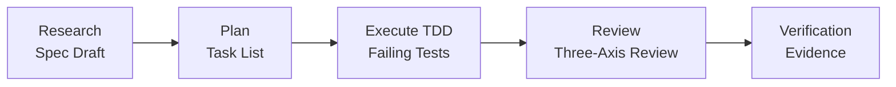
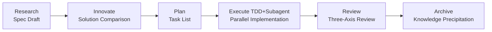

# ALTAS Workflow

> **Fusing Three Advantages | Intelligent Depth Adaptation | Progressive Disclosure | Step-by-Step Feedback**

**Version:** 4.0 (2026-04-16)  
**Repository Size:** 8.3M, 169 Markdown files, 79 reference documents

---

## 🌐 Language / 语言

[中文](README.md) | **English** | [日本語](README_JA.md) | [Français](README_FR.md) | [Deutsch](README_DE.md)

---

## 🎯 What is this?

**ALTAS Workflow** is a comprehensive AI-native development workflow specification that integrates the essence of three excellent workflows: **SDD-RIPER**, **SDD-RIPER-Optimized (Checkpoint-Driven)**, and **Superpowers**.

### Core Mission

Dedicated to solving four major engineering pain points in AI programming:

| Pain Point | ALTAS Solution |
|------|-----------|
| **Context Decay** | CodeMap indexing + progressive disclosure, load reference materials on demand |
| **Review Paralysis** | 4-level intelligent depth (XS/S/M/L), small tasks don't get stuck in approval |
| **Code Distrust** | Spec-centric + three-axis review, Spec is Truth |
| **Hard to Maintain** | Archive knowledge precipitation + TDD iron law, completion means asset |

### Core Iron Laws

1. **No Spec, No Code** — No code before forming minimum Spec (Size XS exempt)
2. **No Approval, No Execute** — Never write code if human doesn't nod in Plan phase
3. **Spec is Truth** — When Spec conflicts with code, code is wrong
4. **Reverse Sync** — Deviation found in execution → update Spec first → then fix code
5. **Evidence First** — Completion proven by verification results, not model self-declaration
6. **No Root Cause, No Fix** — Must have root cause analysis before bug fix, blind fixes prohibited
7. **TDD Iron Law** — Size M/L: No production code without failing tests
8. **Resume Ready** — Leave recovery anchor in Spec before long task pause

---

## 📦 What's Included?

### Repository Structure Overview

```
altas/
├── altas-workflow/              # Main protocol directory (8.3M, 92 files)
│   ├── SKILL.md                 # ⭐ Core system prompt (AI reads)
│   ├── README.md                # ALTAS detailed description
│   ├── QUICKSTART.md            # Scenario-based quick guide
│   ├── reference-index.md       # Reference materials master index
│   ├── protocols/               # Specialized protocols (3)
│   │   ├── RIPER-5.md           # Strict mode protocol
│   │   ├── RIPER-DOC.md         # Documentation expert protocol
│   │   └── SDD-RIPER-DUAL-COOP.md # Dual-model collaboration protocol
│   ├── docs/                    # Methodology documents (4)
│   │   ├── 从传统编程转向大模型编程.md
│   │   ├── AI-原生研发范式.md
│   │   ├── 团队落地指南.md
│   │   └── 手把手教程.md
│   ├── references/              # On-demand reference materials (79 files)
│   │   ├── spec-driven-development/  # Spec-driven development (7 core docs)
│   │   ├── checkpoint-driven/        # Checkpoint lightweight mode (4 docs)
│   │   ├── superpowers/              # Superpowers (37 docs)
│   │   │   ├── test-driven-development/  # TDD iron law
│   │   │   ├── systematic-debugging/     # Systematic Debug
│   │   │   ├── subagent-driven-development/ # Subagent driven
│   │   │   ├── brainstorming/            # Design brainstorming
│   │   │   ├── writing-plans/            # Write Plan best practices
│   │   │   └── ... (more superpowers)
│   │   ├── agents/                       # Agent definitions (22 docs)
│   │   │   ├── sdd-riper-one/            # Standard Agent
│   │   │   └── sdd-riper-one-light/      # Lightweight Agent
│   │   ├── entry/                        # Entry configuration (4 docs)
│   │   └── special-modes/                # Special modes (5 docs)
│   └── scripts/                 # Automation tools
│       └── archive_builder.py   # Archive builder
├── .qoder/repowiki/             # Wiki documents (69 docs)
├── AGENTS.md                    # General AI behavior guidelines
├── CLAUDE.md                    # General AI behavior guidelines
└── EXAMPLES.md                  # Four principles code examples
```

### Core Asset Statistics

| Category | Count | Description |
|------|------|------|
| **Core Protocol** | 1 | SKILL.md (ALTAS Workflow main protocol) |
| **Specialized Protocols** | 3 | RIPER-5 / RIPER-DOC / DUAL-COOP |
| **Methodology** | 4 | Traditional to LLM / AI-native paradigm / Team adoption / Step-by-step tutorial |
| **Reference Materials** | 79 | Spec-driven (7) / Checkpoint (4) / Superpowers (37) / Agents (22) / Entry (4) / Special-Modes (5) |
| **Independent Agents** | 2 | SDD-RIPER-ONE (standard/lightweight) |
| **Code Examples** | 1 | EXAMPLES.md (four principles practical examples) |
| **Automation Tools** | 1 | archive_builder.py (Archive builder) |

---

## 🚀 How to Use Quickly?

### 30-Second Installation

**Method 1**: Copy `altas-workflow/SKILL.md` content to AI assistant's Custom Instructions

**Method 2**: Run in Cursor/Trae:
```bash
cp altas-workflow/SKILL.md .cursorrules
```

**Method 3**: Project configuration
```bash
mkdir -p mydocs/{codemap,context,specs,micro_specs,archive}
```

### Platform Adaptation

| Platform | Installation Method |
|------|----------|
| **Cursor / Trae** | Copy `SKILL.md` content to `.cursorrules` or global AI Rules |
| **Claude / OpenAI Agent** | Inject `SKILL.md` content as System Prompt |
| **Qoder** | Place `SKILL.md` in project `.qoder/skills/` directory |

---

### Immediate Use

**Extreme Fast Modification (Size XS)**:
```
>> Change MAX_RETRIES from 3 to 5 in src/config.ts
```

**Small Task (Size S)**:
```
FAST: Add image verification code to login interface
```

**Standard Development (Size M)**:
```
sdd_bootstrap: task=Add anti-scraping function to user registration interface, goal=Security improvement
```

**Architecture Refactoring (Size L)**:
```
DEEP: Refactor authentication module to split into independent microservices
```

**Bug Investigation**:
```
DEBUG: log_path=./logs/error.log, issue=Authorization not obtained after approval
```

**Multi-Project Collaboration**:
```
MULTI: task=Frontend-backend joint feature release
```

---

## 📚 Core Commands

### Command Overview

| Command | Purpose | Applicable Size | Workflow Impact |
|------|------|----------|----------|
| `>>` / `FAST` | Fast track, skip Research/Plan | XS/S | Direct execute→verify→summary |
| `sdd_bootstrap` | Start RIPER workflow | M/L | Research→Plan→Execute→Review |
| `create_codemap` | Generate code map | M/L | Read-only analysis, no code changes |
| `MAP` / `PROJECT MAP` | Read-only project analysis | All | Generate architecture map |
| `DEBUG` | System debug mode | - | Root cause analysis→diagnostic report |
| `MULTI` | Multi-project collaboration | L | Auto-discovery + scope isolation |
| `ARCHIVE` | Knowledge precipitation | L | Human version + LLM version dual perspective |
| `DOC` | Documentation expert mode | - | ABSORB→OUTLINE→AUTHOR→FACT-CHECK |
| `REVIEW SPEC` | Pre-execution review | M/L | Advisory pre-review |
| `REVIEW EXECUTE` | Post-execution three-axis review | M/L | Spec/code/quality three-axis review |

### Trigger Words Quick Reference

| Trigger Word | Action | Size |
|--------|------|------|
| `FAST` / `快速` / `>>` | Extreme fast track | XS/S |
| `DEEP` | Deep mode | L |
| `MAP` / `链路梳理` | Feature-level CodeMap | - |
| `PROJECT MAP` / `项目总图` | Project-level CodeMap | - |
| `MULTI` / `多项目` | Multi-project mode | L |
| `CROSS` / `跨项目` | Allow cross-project changes | L |
| `DEBUG` / `排查` | Systematic Debug | - |
| `REVIEW SPEC` / `计划评审` | Pre-execution advisory review | M/L |
| `REVIEW EXECUTE` / `代码评审` | Post-execution three-axis review | M/L |
| `ARCHIVE` / `归档` / `沉淀` | Knowledge precipitation | L |
| `DOC` / `写文档` | Documentation expert mode | - |
| `EXIT ALTAS` / `退出协议` | Disable protocol | - |
| `全部` / `all` / `execute all` | Batch execution | M/L |

---

## 🏗️ Workflow Stages

### Size M (Standard) Workflow



**Workflow Description**:
- **Research**: Research alignment, form Spec (Goal, In-Scope, Out-of-Scope, Facts, Risks, Open Questions)
- **Plan**: Detailed planning, break down into atomic Checklist, clarify File Changes + Signatures + Done Contract
- **Execute**: TDD-driven implementation (RED→GREEN→REFACTOR)
- **Review**: Three-axis review (Spec quality / Spec-code consistency / Code intrinsic quality)
- **Verification**: Verification evidence, ensure tests pass

### Size L (Deep) Workflow



**Workflow Description**:
- **Research**: Deep research, sort out current status links, identify risks
- **Innovate**: Solution comparison, provide 2-3 solutions (Pros/Cons/Risks/Effort)
- **Plan**: Atomic Checklist + Subagent allocation
- **Execute**: TDD-driven + Subagent parallel implementation + two-stage Review
- **Review**: Three-axis review + Archive precipitation
- **Archive**: Generate dual-perspective documents (human version + LLM version)

---

## ⚡ Intelligent Depth Adaptation

### Four-Level Task Depth

| Size | Trigger Condition | Spec Requirement | Workflow | Typical Scenarios |
|------|----------|----------|--------|----------|
| **XS (Extreme Fast)** | typo, config value, <10 lines | Skip, 1-line summary after | Direct execute→verify→summary | Change config, fix typo, logs |
| **S (Fast)** | 1-2 files, clear logic | micro-spec (1-3 sentences) | micro-spec→approve→execute→writeback | Add parameter, simple function |
| **M (Standard)** | 3-10 files, within module | Lightweight Spec persisted | Research→Plan→Execute(TDD)→Review | New interface, module refactor |
| **L (Deep)** | Cross-module, >500 lines, architecture-level | Complete Spec + Innovate + Archive | Research→Innovate→Plan→Execute→Subagent→Review→Archive | Architecture split, cross-team transformation |

### Size Assessment Quick Reference Table

| Signal | Recommended Size | Description |
|------|----------|------|
| "Fix a typo" | XS | Pure mechanical change |
| "Add a config item" | XS | No architecture impact |
| "Change button text" | XS/S | Boundary scenario |
| "Add a parameter to this interface" | S | Single file small change |
| "Add error handling to this function" | S | Clear logic |
| "Add a new CRUD interface" | M | Within-module development |
| "Refactor this module" | M/L | Boundary scenario |
| "Cross-module data model change" | L | Cross-module impact |
| "Architecture-level refactor" | L | Global impact |
| "Frontend-backend joint" | L (MULTI) | Multi-project collaboration |

### Auto Upgrade/Downgrade

- **Complexity found exceeding expectation during execution** → AI immediately pauses, proposes upgrade
- **User can use anytime** `[Upgrade to M]` / `[Downgrade to S]` to adjust
- **Force specify**: `>>`=XS, `FAST`=S, default=M, `DEEP`=L

---

## 🛡️ Quality Iron Laws

| # | Iron Law | Meaning |
|---|------|------|
| 1 | **No Spec, No Code** | No code before forming minimum Spec (Size XS exempt) |
| 2 | **No Approval, No Execute** | Never write code if human doesn't nod in Plan phase |
| 3 | **Spec is Truth** | When Spec conflicts with code, code is wrong |
| 4 | **Reverse Sync** | Deviation found in execution → update Spec first → then fix code |
| 5 | **Evidence First** | Completion proven by verification results, not model self-declaration |
| 6 | **No Root Cause, No Fix** | Must have root cause analysis before bug fix, blind fixes prohibited |
| 7 | **TDD Iron Law** | Size M/L: No production code without failing tests |
| 8 | **Resume Ready** | Leave recovery anchor in Spec before long task pause |

---

## 🎯 Progress Visualization System

### Checkpoint Mechanism

**After each step completes**, AI must output standardized checkpoint:

```markdown
### Progress [Phase ▸ Step]
[Completed] ▸ **[Current]** ▸ [Next] ▸ [Following...]

### Current Achievement
- What was just completed (specific output)

### Expected Output
- What will be produced next

### Next Actions
- **[Continue/Approved]**: Agree, proceed to next step
- **[Modify]** + feedback: Adjust current achievement
- **[Upgrade to X]** / **[Downgrade to X]**: Adjust size
- **[Load Reference: XXX]**: View details of a reference document
```

### Checkpoint Examples

**After Research completes**:
```markdown
### Progress [Research ▸ Complete]
[ ] ▸ **[Research]** ▸ [Plan] ▸ [Execute] ▸ [Review]

### Current Achievement
- Current status analysis completed, identified 3 core files
- Found existing registration interface has no image library dependency
- Spec draft established (Goal/Scope/Facts/Risks)

### Expected Output
- Plan phase will break down into atomic Checklist
- Clarify specific changes and signatures for each file

### Next Actions
- **[Continue]**: Enter Plan phase
- **[Modify]**: Adjust risk items in Spec
- **[Load Reference: spec-template.md]**: View Spec template details
```

**After Plan completes**:
```markdown
### Progress [Plan ▸ Complete]
[Research] ▸ **[Plan]** ▸ [Execute] ▸ [Review]

### Current Achievement
- Checklist broken down into 5 atomic tasks
- Clarified 3 file changes + function signatures
- Done Contract defined

### Expected Output
- Execute phase will implement according to Checklist item by item
- TDD-driven: Write failing test first → implement logic → verify pass

### Next Actions
- **[Approved]**: Approve Plan, enter Execute
- **[Modify]**: Adjust Checklist order or implementation approach
- **[Upgrade to L]**: Need Subagent parallel implementation
```

---

## 📖 Detailed Documentation

### Core Documents (Must Read)

| Document | Purpose | Length |
|------|------|------|
| [ALTAS Workflow Detailed Description](altas-workflow/README.md) | Complete workflow protocol | 650+ lines |
| [Quick Start Guide](altas-workflow/QUICKSTART.md) | 30-second onboarding | 170+ lines |
| [Reference Materials Master Index](altas-workflow/reference-index.md) | On-demand loading map | 200+ lines |
| [SKILL.md](altas-workflow/SKILL.md) | AI system prompt | 650+ lines |

### Methodology Documents (Theory)

| Document | Topic | Target Audience |
|------|------|----------|
| [From Traditional Programming to LLM Programming](altas-workflow/docs/从传统编程转向大模型编程.md) | Paradigm shift | All |
| [AI-Native Development Paradigm](altas-workflow/docs/AI-原生研发范式 - 从代码中心到文档驱动的演进.md) | Document-driven | Architect/Tech Lead |
| [Team Adoption Guide](altas-workflow/docs/团队落地指南.md) | Team promotion | Tech Lead/Manager |
| [Step-by-Step Tutorial](altas-workflow/docs/如何快速从零开始落地大模型编程%20--%20手把手教程.md) | From scratch | Beginners |

### Specialized Protocols (Special Scenarios)

| Protocol | Purpose | Trigger Method |
|------|------|----------|
| [RIPER-5 Strict Mode](altas-workflow/protocols/RIPER-5.md) | Strict phase gates | High-risk projects |
| [RIPER-DOC Documentation Expert](altas-workflow/protocols/RIPER-DOC.md) | Documentation writing | `DOC` command |
| [Dual-Model Collaboration Protocol](altas-workflow/protocols/SDD-RIPER-DUAL-COOP.md) | Multi-model collaboration | Complex architecture |

### Skill Packages (Independent Agents)

| Agent | Positioning | Applicable Scenarios |
|-------|------|----------|
| [SDD-RIPER-ONE Standard](altas-workflow/references/agents/sdd-riper-one/SKILL.md) | Complete RIPER workflow | Medium-large tasks |
| [SDD-RIPER-ONE Light](altas-workflow/references/agents/sdd-riper-one-light/SKILL.md) | Checkpoint-driven | High-frequency multi-turn/strong models |

### Superpowers

| Ability | Document | Call Timing |
|------|------|----------|
| **TDD** | [test-driven-development/SKILL.md](altas-workflow/references/superpowers/test-driven-development/SKILL.md) | Size M/L execute phase |
| **Systematic Debug** | [systematic-debugging/SKILL.md](altas-workflow/references/superpowers/systematic-debugging/SKILL.md) | DEBUG mode |
| **Subagent Driven** | [subagent-driven-development/SKILL.md](altas-workflow/references/superpowers/subagent-driven-development/SKILL.md) | Size L parallel implementation |
| **Design Brainstorming** | [brainstorming/SKILL.md](altas-workflow/references/superpowers/brainstorming/SKILL.md) | Innovate phase |
| **Write Plan Best Practices** | [writing-plans/SKILL.md](altas-workflow/references/superpowers/writing-plans/SKILL.md) | Plan phase |
| **Pre-Completion Verification** | [verification-before-completion/SKILL.md](altas-workflow/references/superpowers/verification-before-completion/SKILL.md) | Review phase |

---

## 🤝 Source Integration

### Three Sources Overview

| Source | Core Advantage | Adopted Content |
|------|----------|----------|
| **SDD-RIPER** | Spec-centric, RIPER state machine | Spec template, three-axis Review, Multi-Project auto-discovery, Debug/Archive protocols, CodeMap indexing |
| **SDD-RIPER-Optimized** | Checkpoint-Driven lightweight mode | 4-level task depth (zero/fast/standard/deep), Done Contract, Resume Ready, Hot/Warm/Cold context assembly, micro-spec |
| **Superpowers** | TDD iron law, systematic Debug | TDD anti-patterns, Debug four-stage method, Subagent-driven + two-stage Review, parallel Agent dispatch, verification-first iron law |

### Source Contribution Statistics

| Source | Document Count | Core Files |
|------|--------|----------|
| **SDD-RIPER** | 14+ | spec-template.md, commands.md, multi-project.md, archive-template.md |
| **SDD-RIPER-Optimized** | 6+ | spec-lite-template.md, modules.md, conventions.md |
| **Superpowers** | 24+ | TDD, Debug, Subagent, Brainstorming, Writing-Plans, Verification |

---

## 🎓 Typical Usage Scenarios

### Scenario 1: Daily Feature Iteration (Size M)

**Input**:
```
sdd_bootstrap: task=Add image verification code anti-scraping function to user registration interface, goal=Security improvement
```

**AI Behavior**:
1. ✅ Auto-assess size → Size M (Standard)
2. ✅ **Research** → Read existing registration interface, found no image library dependency → Output checkpoint
3. ✅ **Plan** → List Checklist (introduce library → change interface → add test) → Output checkpoint wait for [Approved]
4. ✅ **Execute** → TDD: Write failing test first → implement logic → verify pass
5. ✅ **Review** → Three-axis review → Confirm pass

**Output**:
- Spec document: `mydocs/specs/YYYY-MM-DD_hh-mm_UserRegistrationImageVerification.md`
- Code changes: `src/api/auth.ts`, `src/utils/captcha.ts`
- Test file: `src/api/auth.test.ts`

---

### Scenario 2: Emergency Fix Online Config (Size XS)

**Input**:
```
>> Change MAX_RETRIES from 3 to 5 in src/config.ts
```

**AI Behavior**:
1. ✅ Identified as Size XS (Extreme Fast)
2. ✅ Directly modify code → run verification → 1-line summary

**Output**:
- 1-line summary: `Changed MAX_RETRIES from 3→5, verification passed`

---

### Scenario 3: Architecture Refactoring (Size L)

**Input**:
```
DEEP: Refactor authentication module to split into independent microservices
```

**AI Behavior**:
1. ✅ Identified as Size L (Deep)
2. ✅ **create_codemap** → Generate authentication module code index
3. ✅ **Research** → Sort out current status links, identify risks
4. ✅ **Innovate** → Provide 3 solutions (service-oriented/modularized/gateway layer) comparison
5. ✅ **Plan** → Atomic Checklist + Subagent allocation
6. ✅ **Execute** → TDD-driven + Subagent parallel implementation + two-stage Review
7. ✅ **Review** → Three-axis review + Archive precipitation

**Output**:
- CodeMap: `mydocs/codemap/YYYY-MM-DD_hh-mm_AuthenticationModule.md`
- Spec: `mydocs/specs/YYYY-MM-DD_hh-mm_AuthenticationService.md`
- Archive: `mydocs/archive/YYYY-MM-DD_hh-mm_AuthenticationService_{human,llm}.md`

---

### Scenario 4: Bug Investigation

**Input**:
```
DEBUG: log_path=./logs/error.log, issue=Authorization not obtained after approval
```

**AI Behavior**:
1. ✅ Enter Debug mode (read-only analysis)
2. ✅ Read logs + Spec + CodeMap → Triangle positioning
3. ✅ Output: Symptoms / Expected behavior / Root cause candidates / Suggested fixes
4. ✅ If fix needed → Enter RIPER workflow or FAST

**Output**:
- Structured diagnostic report: Symptoms / Expected behavior / Root cause candidates (3) / Suggested fixes

---

### Scenario 5: Multi-Project Collaboration

**Input**:
```
MULTI: task=Frontend-backend joint feature release
```

**AI Behavior**:
1. ✅ Auto-scan workdir → Discover web-console + api-service
2. ✅ Output Project Registry for confirmation
3. ✅ Generate dual-project codemap
4. ✅ Plan grouped by project: api-service(Provider)→web-console(Consumer)
5. ✅ Execute in dependency order, record Contract Interfaces

**Output**:
- Project Registry: Identified subproject list
- Contract Interfaces: API interface contract documents
- Touched Projects: Changed project list

---

## 📊 Size Assessment Quick Reference

| Signal | Recommended Size |
|------|----------|
| "Fix a typo" | XS |
| "Add a config item" | XS |
| "Change button text" | XS/S |
| "Add a parameter to this interface" | S |
| "Add error handling to this function" | S |
| "Add a new CRUD interface" | M |
| "Refactor this module" | M/L |
| "Cross-module data model change" | L |
| "Architecture-level refactor" | L |
| "Frontend-backend joint" | L (MULTI) |

---

## 🔧 FAQ

### Workflow Control

**Q: AI outputs too much code at once, runs through all steps, what to do?**

A: ALTAS has built-in checkpoint mechanism, AI **must** pause after completing one step to wait for confirmation. If AI goes wild, reply: "Please stop, strictly execute checkpoint mechanism, advance one step at a time."

**Q: How to intervene in AI's plan midway?**

A: At any checkpoint reply `[Modify] Please don't use Redis, use memory cache instead`, AI will adjust Plan based on feedback and re-request Approve.

**Q: How to choose XS/S/M/L?**

A: ALTAS will auto-assess. You can also force specify: `>>`=XS, `FAST`=S, default=M, `DEEP`=L. During execution can anytime `[Upgrade to M]` or `[Downgrade to S]`.

---

### TDD

**Q: Why does AI always write tests first? Too slow.**

A: This is Evidence First + TDD iron law. Without failing tests, AI-generated code may not have been executed. If task is minimal, use `>>` to trigger XS mode to skip TDD.

**Q: When can TDD be skipped?**

A: Size XS/S (typo, config, single file small change) can be exempt from TDD. Size M/L must follow TDD iron law.

---

### Document Management

**Q: Too many md files under mydocs/, should I commit to Git?**

A: **Strongly recommend committing**. Spec and Archive are the project's single source of truth, preventing context decay, helping newcomers onboard.

**Q: How to manage files under mydocs/?**

A: Use unified time prefix `YYYY-MM-DD_hh-mm_`, periodically archive old files. Archive script can auto-generate human/LLM dual-perspective documents.

---

### Reference Materials

**Q: Too many reference materials (references/), does AI need to read all every time?**

A: **No need**. ALTAS uses progressive disclosure, only reads corresponding files on-demand when hitting scenarios. Reference index table in SKILL.md clarifies call timing for each file.

**Q: How to load reference materials on demand?**

A: View [reference-index.md](altas-workflow/reference-index.md), each file is marked with call timing. For example:
- When writing Spec → Read `spec-template.md`
- When executing TDD → Read `test-driven-development/SKILL.md`
- When debugging → Read `systematic-debugging/SKILL.md`

---

### Team Collaboration

**Q: How to collaborate in multi-person team?**

A: Spec is team's shared source of truth. Each person creates their own Spec files, collaborates through Git. Core developers only need to Review Plan, not all code.

**Q: What models are suitable for ALTAS?**

A: Any model can use standard mode (M/L). Lightweight mode (S/XS) is especially suitable for strong models (Claude Opus/GPT-4+) high-frequency multi-turn scenarios. New teams recommend starting from standard mode.

**Q: How to train team members?**

A: First read [From Traditional Programming to LLM Programming](altas-workflow/docs/从传统编程转向大模型编程.md), then practice [Step-by-Step Tutorial](altas-workflow/docs/如何快速从零开始落地大模型编程%20--%20手把手教程.md).

---

## 📋 Version History

| Version | Date | Name | Status | Key Changes |
|------|------|------|------|----------|
| **v4.0** | 2026-04-13 | ALTAS Workflow | ✅ Current version | Integrated three workflows, added intelligent depth adaptation, progress visualization, on-demand loading |
| **v1.0** | 2026-04-12 | SIGMA Workflow | ❌ Deprecated | Initial version |

### v4.0 Core Features

- ✅ **Intelligent Depth Adaptation**: 4-level task depth (XS/S/M/L), auto-assessment + manual upgrade/downgrade
- ✅ **Progress Visualization**: Standardized checkpoint mechanism, pause after each step for confirmation
- ✅ **Progressive Disclosure**: On-demand loading of reference materials, avoiding context pollution
- ✅ **Core Iron Laws**: 8 non-negotiable iron laws (No Spec No Code, TDD Iron Law, etc.)
- ✅ **Complete Documentation**: 70+ reference materials, covering Spec-driven/Checkpoint/Superpowers three categories
- ✅ **Independent Agents**: SDD-RIPER-ONE standard/lightweight versions

---

## 📊 Repository Statistics

```
Repository Size: 8.3M
Markdown Files: 169
Reference Materials: 79
  - Spec-Driven Development: 7
  - Checkpoint-Driven: 4
  - Superpowers: 37
  - Agents: 22
  - Entry: 4
  - Special-Modes: 5
Core Protocols: 1 (SKILL.md)
Specialized Protocols: 3 (RIPER-5/RIPER-DOC/DUAL-COOP)
Methodology: 4
Independent Agents: 2 (standard/lightweight)
Automation Tools: 1 (archive_builder.py)
Wiki Documents: 69 (.qoder/repowiki/)
```

---

## 🎯 Quick Navigation

### Beginner Onboarding

1. [Quick Start Guide](altas-workflow/QUICKSTART.md) - 30-second onboarding
2. [From Traditional Programming to LLM Programming](altas-workflow/docs/从传统编程转向大模型编程.md) - Paradigm shift
3. [Step-by-Step Tutorial](altas-workflow/docs/如何快速从零开始落地大模型编程%20--%20手把手教程.md) - From scratch

### Quick Reference

- [Core Commands](#-core-commands) - All trigger words and commands
- [Size Assessment](#-intelligent-depth-adaptation) - How to choose XS/S/M/L
- [Reference Materials Index](altas-workflow/reference-index.md) - On-demand loading map
- [Detailed Documentation](#-detailed-documentation) - Complete document list

### Advanced Usage

- [RIPER-5 Strict Mode](altas-workflow/protocols/RIPER-5.md) - High-risk projects
- [Subagent-Driven Development](altas-workflow/references/superpowers/subagent-driven-development/SKILL.md) - Parallel implementation
- [Systematic Debug](altas-workflow/references/superpowers/systematic-debugging/SKILL.md) - Root cause analysis

---

*Powered by the integration of SDD-RIPER, SDD-RIPER-Optimized (Checkpoint-Driven), and Superpowers.*

**Last Updated**: 2026-04-16
