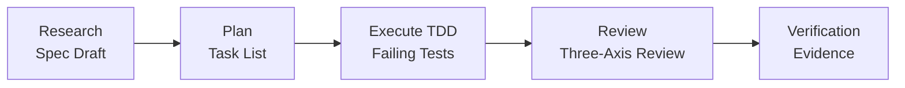
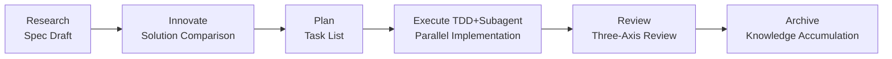

# ALTAS Workflow

> **Fusing Three Advantages | Intelligent Depth Adaptation | Progressive Disclosure | Step-by-Step Feedback | Testing Engineer Friendly**

**Version:** 4.7 (2026-04-19)
**Repository Size:** 17M, 165 Markdown files, 120+ reference documents

---

## 🌐 Language / Language

[中文](README.md) | **English** | [日本語](README_JA.md) | [Français](README_FR.md) | [Deutsch](README_DE.md)

---

## 🎯 What is this?

**ALTAS Workflow** is a comprehensive AI-native development workflow specification that integrates the essence of three excellent workflows: **SDD-RIPER**, **SDD-RIPER-Optimized (Checkpoint-Driven)**, and **Superpowers**.

### Core Mission

Dedicated to solving four major engineering pain points in AI programming:

| Pain Point | ALTAS Solution |
|------|-----------|
| **Context Decay** | CodeMap indexing + progressive disclosure, load reference materials on demand |
| **Review Paralysis** | 4-level intelligent depth (XS/S/M/L), small tasks don't get stuck in approval |
| **Code Distrust** | Spec-centric + three-axis review, Spec is Truth |
| **Hard to Maintain** | Archive knowledge accumulation + TDD iron law, completion means asset |

### Core Iron Laws

1. **No Spec, No Code** — No code before forming minimum Spec (Size XS exempt)
2. **No Approval, No Execute** — Never write code if human doesn't nod in Plan phase
3. **Spec is Truth** — When Spec conflicts with code, code is wrong
4. **Reverse Sync** — Deviation found in execution → update Spec first → then fix code
5. **Evidence First** — Completion proven by verification results, not model self-declaration
6. **No Root Cause, No Fix** — Must have root cause analysis before bug fix, blind fixes prohibited
7. **TDD Iron Law** — Size M/L: No production code without failing tests
8. **Resume Ready** — Leave recovery anchor in Spec before long task pause

---

## 📦 What's Included?

### Repository Structure Overview

```
altas/
├── altas-workflow/              # Main protocol directory (8.3M, 120+ files)
│   ├── SKILL.md                 # ⭐ Core system prompt (AI reads) - v4.7
│   ├── README.md                # ALTAS detailed description
│   ├── QUICKSTART.md            # Scenario-based quick guide
│   ├── reference-index.md       # Reference materials master index
│   ├── workflow-diagrams.md     # Mermaid flowchart collection
│   ├── protocols/               # Specialized protocols (4)
│   │   ├── RIPER-5.md           # Strict mode protocol
│   │   ├── RIPER-DOC.md         # Documentation expert protocol
│   │   ├── SDD-RIPER-DUAL-COOP.md # Dual-model collaboration protocol
│   │   └── PROTOCOL-SELECTION.md # Protocol selection guide
│   ├── docs/                    # Methodology documents (5)
│   │   ├── 从传统编程转向大模型编程.md
│   │   ├── AI-原生研发范式.md
│   │   ├── 团队落地指南.md
│   │   ├── 手把手教程.md
│   │   └── IMPLEMENTATION-PLAN-v4.6.md
│   ├── references/              # On-demand reference materials (95+ files)
│   │   ├── spec-driven-development/  # Spec-driven development (7 core docs)
│   │   ├── checkpoint-driven/        # Checkpoint lightweight mode (4 docs)
│   │   ├── superpowers/              # Superpowers (50+ docs)
│   │   │   ├── test-driven-development/  # TDD iron law
│   │   │   ├── systematic-debugging/     # Systematic Debug
│   │   │   ├── subagent-driven-development/ # Subagent driven
│   │   │   ├── brainstorming/            # Design brainstorming
│   │   │   ├── writing-plans/            # Write Plan best practices
│   │   │   ├── code-review/              # Code review (Go/Python)
│   │   │   └── ... (more superpowers)
│   │   ├── agents/                       # Agent definitions (22 docs)
│   │   │   ├── sdd-riper-one/            # Standard Agent
│   │   │   └── sdd-riper-one-light/      # Lightweight Agent
│   │   ├── entry/                        # Entry configuration (5 docs)
│   │   ├── special-modes/                # Special modes (5 docs)
│   │   ├── prd-analysis/                 # 🆕 PRD analysis workflow (6 docs)
│   │   └── testing/                      # 🆕 Testing engineering specialty (18+ docs)
│   │       ├── test-strategy-template.md    # Test strategy template
│   │       ├── pytest-patterns.md           # Pytest best practices
│   │       ├── e2e-testing.md               # E2E testing guide
│   │       ├── api-testing.md               # API testing reference
│   │       ├── performance-testing.md       # Performance testing methodology
│   │       ├── security-testing.md          # Security testing
│   │       ├── contract-testing.md          # Contract testing
│   │       ├── test-data-management.md      # Test data management
│   │       ├── test-environment.md          # Test environment management
│   │       ├── ci-cd-integration.md         # CI/CD integration
│   │       └── templates/                   # Test scaffold templates
│   └── scripts/                 # Automation tools
│       ├── archive_builder.py   # Archive builder
│       ├── scaffold.py          # Project scaffold
│       └── validate_aliases_sync.py # Alias sync validation
├── .agents/skills/              # 🆕 Independent skill packages (6)
│   ├── advanced-api-testing/   # Advanced API testing
│   ├── go-code-review/         # Go code review
│   ├── python-code-review/     # Python code review
│   ├── pytest-patterns/        # Pytest patterns
│   ├── specify-requirements/   # Requirements specification
│   └── implementation-verify/  # Implementation verification
├── .qoder/repowiki/             # Wiki documents (69 docs)
├── AGENTS.md                    # General AI behavior guidelines
├── CLAUDE.md                    # Claude-specific behavior guidelines
├── EXAMPLES.md                  # Four principles code examples
└── skills-lock.json             # Skill package version lock
```

### Core Asset Statistics

| Category | Count | Description |
|------|------|------|
| **Core Protocol** | 1 | SKILL.md (ALTAS Workflow main protocol) v4.7 |
| **Specialized Protocols** | 4 | RIPER-5 / RIPER-DOC / DUAL-COOP / PROTOCOL-SELECTION |
| **Methodology** | 5 | Traditional to LLM / AI-native paradigm / Team adoption / Step-by-step tutorial / v4.6 implementation plan |
| **Reference Materials** | 95+ | Spec-driven (7) / Checkpoint (4) / Superpowers (50+) / Agents (22) / Entry (5) / Special-Modes (5) / PRD Analysis (6) / Testing (18+) |
| **Independent Agents** | 2 | SDD-RIPER-ONE (standard/lightweight) |
| **🆕 Skill Packages** | 6 | API Testing / Go Review / Python Review / Pytest / Requirements Spec / Implementation Verify |
| **Code Examples** | 1 | EXAMPLES.md (four principles practical examples) |
| **Automation Tools** | 3 | archive_builder.py / scaffold.py / validate_aliases_sync.py |

---

## 🚀 v4.7 New Features (2026-04-19)

### 🧪 Testing Engineering Specialty Optimization

- ✅ **E2E Testing Framework Reference Guide**: End-to-end testing best practices with Playwright/Cypress integration
- ✅ **Performance/Load Testing Methodology**: Stress testing strategy, benchmark testing, performance metrics system
- ✅ **API Testing Complete Process**: Contract testing, security testing, API test matrix templates
- ✅ **Pytest Testing Pattern Document Suite**: Fixture design, parameterization, Mock strategies, coverage
- ✅ **Test Data Management**: Factory pattern, fixture hierarchy, test isolation
- ✅ **Test Environment Management**: Docker Compose, dependency injection, environment consistency
- ✅ **CI/CD Integration Testing**: Automated pipeline, quality gates, test reports
- ✅ **Test Scaffold Templates**: Out-of-the-box conftest.py / factories / fixtures
- ✅ **Go/Python Testing Support**: Multi-language testing best practices and anti-patterns

### 🔍 Code Review Skill Packages

- ✅ **Go Code Review**: Static analysis, performance audit, concurrency safety checks
- ✅ **Python Code Review**: Type safety, async patterns, error handling standards
- ✅ **Review Process Standardization**: Review Request → Code Quality → Spec Compliance

### 📋 PRD Analysis Workflow

- ✅ **Structured Requirement Analysis**: Brainstorm → Discover → Document → Review → Validate
- ✅ **PRD Template & Validation**: Product overview, user personas, journey, functional requirements, success metrics
- ✅ **Quality Metrics Standards**: Structural integrity, content quality, boundary validation, cross-section consistency

### 🛠️ Other Improvements

- ✅ **Alias Sync Validation Script**: Automatically check trigger word consistency
- ✅ **Project Scaffold Automation**: Quickly initialize project structure and conventions
- ✅ **Implementation Verification Skill**: Automated acceptance testing and coverage checking
- ✅ **Advanced API Testing Patterns**: Idempotency, input validation, error handling, concurrency testing

---

## 🚀 How to Use Quickly?

### 30-Second Installation

**Method 1**: Copy `altas-workflow/SKILL.md` content to AI assistant's Custom Instructions

**Method 2**: Run in Cursor/Trae:
```bash
cp altas-workflow/SKILL.md .cursorrules
```

**Method 3**: Project configuration
```bash
mkdir -p mydocs/{codemap,context,specs,micro_specs,archive}
```

### Platform Adaptation

| Platform | Installation Method |
|------|----------|
| **Cursor / Trae** | Copy `SKILL.md` content to `.cursorrules` or global AI Rules |
| **Claude / OpenAI Agent** | Inject `SKILL.md` content as System Prompt |
| **Qoder** | Place `SKILL.md` in project `.qoder/skills/` directory |

---

### Immediate Use

**Extreme Fast Modification (Size XS)**:
```
>> Change MAX_RETRIES from 3 to 5 in src/config.ts
```

**Small Task (Size S)**:
```
FAST: Add image verification code to login interface
```

**Standard Development (Size M)**:
```
sdd_bootstrap: task=Add anti-scraping function to user registration interface, goal=Security improvement
```

**Architecture Refactoring (Size L)**:
```
DEEP: Refactor authentication module to split into independent microservices
```

**Bug Investigation**:
```
DEBUG: log_path=./logs/error.log, issue=Authorization not obtained after approval
```

**Multi-Project Collaboration**:
```
MULTI: task=Frontend-backend joint feature release
```

**🆕 PRD Analysis**:
```
PRD: Analyze e-commerce shopping cart requirements, output structured PRD document
```

**🆕 Testing Specialty**:
```
TEST: Supplement E2E test cases for payment module
PERF: Performance stress test on order query interface
REVIEW: Review authentication module code quality (Go/Python)
```

---

## 📚 Core Commands

### Command Overview

| Command | Purpose | Applicable Size | Workflow Impact |
|------|------|----------|----------|
| `>>` / `FAST` | Fast track, skip Research/Plan | XS/S | Direct execute→verify→summary |
| `sdd_bootstrap` | Start RIPER workflow | M/L | Research→Plan→Execute→Review |
| `create_codemap` | Generate code map | M/L | Read-only analysis, no code changes |
| `MAP` / `PROJECT MAP` | Read-only project analysis | All | Generate architecture map |
| `DEBUG` | System debug mode | - | Root cause analysis→diagnostic report |
| `MULTI` | Multi-project collaboration | L | Auto-discovery + scope isolation |
| `ARCHIVE` | Knowledge accumulation | L | Human version + LLM version dual perspective |
| `DOC` | Documentation expert mode | - | ABSORB→OUTLINE→AUTHOR→FACT-CHECK |
| `REVIEW SPEC` | Pre-execution review | M/L | Advisory pre-review |
| `REVIEW EXECUTE` | Post-execution three-axis review | M/L | Spec/code/quality three-axis review |
| **`PRD`** | **🆕 PRD Analysis** | **M/L** | **Brainstorm→Discover→Document→Review→Validate** |
| **`TEST`** | **🆕 Testing Specialty** | **M/L** | **Test strategy→Case design→Implementation→Verification** |
| **`PERF`** | **🆕 Performance Optimization** | **L** | **Baseline measurement→Bottleneck analysis→Optimization→Regression verification** |
| **`REVIEW`** | **🆕 Code Review** | **M/L** | **Request review→Quality check→Compliance verification** |
| **`REFACTOR`** | **Refactoring Specialty** | **L** | **CodeMap→Plan(TDD)→Execute→Review** |
| **`MIGRATE`** | **Migration Specialty** | **L** | **Risk assessment→Migration→Verification** |

### Trigger Words Quick Reference

| Trigger Word | Action | Size |
|--------|------|------|
| `FAST` / `快速` / `>>` | Extreme fast track | XS/S |
| `DEEP` | Deep mode | L |
| `MAP` / `链路梳理` | Feature-level CodeMap | - |
| `PROJECT MAP` / `项目总图` | Project-level CodeMap | - |
| `MULTI` / `多项目` | Multi-project mode | L |
| `CROSS` / `跨项目` | Allow cross-project changes | L |
| `DEBUG` / `排查` | Systematic Debug | - |
| `REVIEW SPEC` / `计划评审` | Pre-execution advisory review | M/L |
| `REVIEW EXECUTE` / `代码评审` | Post-execution three-axis review | M/L |
| `ARCHIVE` / `归档` / `沉淀` | Knowledge accumulation | L |
| `DOC` / `写文档` | Documentation expert mode | - |
| **`PRD` / `PRD ANALYSIS`** | **🆕 PRD Analysis** | **M/L** |
| **`TEST` / `写测试` / `补测试`** | **🆕 Testing Specialty** | **M/L** |
| **`PERF` / `性能优化`** | **🆕 Performance Optimization** | **L** |
| **`REVIEW` / `代码审查` / `审查PR`** | **🆕 Code Review** | **M/L** |
| **`REFACTOR` / `重构`** | **🆕 Refactoring Specialty** | **L** |
| **`MIGRATE` / `迁移`** | **🆕 Migration Specialty** | **L** |
| `EXIT ALTAS` / `退出协议` | Disable protocol | - |
| `全部` / `all` / `execute all` | Batch execution | M/L |

---

## 🏗️ Workflow Stages

### Size M (Standard) Workflow



**Workflow Description**:
- **Research**: Research alignment, form Spec (Goal, In-Scope, Out-of-Scope, Facts, Risks, Open Questions)
- **Plan**: Detailed planning, break down into atomic Checklist, clarify File Changes + Signatures + Done Contract
- **Execute**: TDD-driven implementation (RED→GREEN→REFACTOR)
- **Review**: Three-axis review (Spec quality / Spec-code consistency / Code intrinsic quality)
- **Verification**: Verification evidence, ensure tests pass

### Size L (Deep) Workflow



**Workflow Description**:
- **Research**: Deep research, sort out current status links, identify risks
- **Innovate**: Solution comparison, provide 2-3 solutions (Pros/Cons/Risks/Effort)
- **Plan**: Atomic Checklist + Subagent allocation
- **Execute**: TDD-driven + Subagent parallel implementation + two-stage Review
- **Review**: Three-axis review + Archive accumulation
- **Archive**: Generate dual-perspective documents (human version + LLM version)

---

## ⚡ Intelligent Depth Adaptation

### Four-Level Task Depth

| Size | Trigger Condition | Spec Requirement | Workflow | Typical Scenarios |
|------|----------|----------|--------|----------|
| **XS (Extreme Fast)** | typo, config value, <10 lines | Skip, 1-line summary after | Direct execute→verify→summary | Change config, fix typo, logs |
| **S (Fast)** | 1-2 files, clear logic | micro-spec (1-3 sentences) | micro-spec→approve→execute→writeback | Add parameter, simple function |
| **M (Standard)** | 3-10 files, within module | Lightweight Spec persisted | Research→Plan→Execute(TDD)→Review | New interface, module refactor |
| **L (Deep)** | Cross-module, >500 lines, architecture-level | Complete Spec + Innovate + Archive | Research→Innovate→Plan→Execute→Subagent→Review→Archive | Architecture split, cross-team transformation |

### Size Assessment Quick Reference Table

| Signal | Recommended Size | Description |
|------|----------|------|
| "Fix a typo" | XS | Pure mechanical change |
| "Add a config item" | XS | No architecture impact |
| "Change button text" | XS/S | Boundary scenario |
| "Add a parameter to this interface" | S | Single file small change |
| "Add error handling to this function" | S | Clear logic |
| "Add a new CRUD interface" | M | Within-module development |
| "Refactor this module" | M/L | Boundary scenario |
| "Cross-module data model change" | L | Cross-module impact |
| "Architecture-level refactor" | L | Global impact |
| "Frontend-backend joint" | L (MULTI) | Multi-project collaboration |
| "Supplement E2E tests" | M (TEST) | 🆕 Testing specialty |
| "Performance stress test" | L (PERF) | 🆕 Performance optimization |

### Auto Upgrade/Downgrade

- **Complexity found exceeding expectation during execution** → AI immediately pauses, proposes upgrade
- **User can use anytime** `[Upgrade to M]` / `[Downgrade to S]` to adjust
- **Force specify**: `>>`=XS, `FAST`=S, default=M, `DEEP`=L

---

## 🛡️ Quality Iron Laws

| # | Iron Law | Meaning |
|---|------|------|
| 1 | **No Spec, No Code** | No code before forming minimum Spec (Size XS exempt) |
| 2 | **No Approval, No Execute** | Never write code if human doesn't nod in Plan phase |
| 3 | **Spec is Truth** | When Spec conflicts with code, code is wrong |
| 4 | **Reverse Sync** | Deviation found in execution → update Spec first → then fix code |
| 5 | **Evidence First** | Completion proven by verification results, not model self-declaration |
| 6 | **No Root Cause, No Fix** | Must have root cause analysis before bug fix, blind fixes prohibited |
| 7 | **TDD Iron Law** | Size M/L: No production code without failing tests |
| 8 | **Resume Ready** | Leave recovery anchor in Spec before long task pause |

---

## 🎯 Progress Visualization System

### Checkpoint Mechanism

**After each step completes**, AI must output standardized checkpoint:

```markdown
### Progress [Phase ▸ Step]
[Completed] ▸ **[Current]** ▸ [Next] ▸ [Following...]

### Current Achievement
- What was just completed (specific output)

### Expected Output
- What will be produced next

### Next Actions
- **[Continue/Approved]**: Agree, proceed to next step
- **[Modify]** + feedback: Adjust current achievement
- **[Upgrade to X]** / **[Downgrade to X]**: Adjust size
- **[Load Reference: XXX]**: View details of a reference document
```

### Checkpoint Example

**After Research completes**:
```markdown
### Progress [Research ▸ Complete]
[ ] ▸ **[Research]** ▸ [Plan] ▸ [Execute] ▸ [Review]

### Current Achievement
- Completed current status analysis, identified 3 core files
- Found existing registration interface has no graphics library dependency
- Spec draft established (Goal/Scope/Facts/Risks)

### Expected Output
- Plan phase will break down into atomic Checklist
- Clarify specific changes and signatures for each file

### Next Actions
- **[Continue]**: Enter Plan phase
- **[Modify]**: Adjust risk items in Spec
- **[Load Reference: spec-template.md]**: View Spec template details
```

**After Plan completes**:
```markdown
### Progress [Plan ▸ Complete]
[Research] ▸ **[Plan]** ▸ [Execute] ▸ [Review]

### Current Achievement
- Checklist broken down into 5 atomic tasks
- Clarified 3 file changes + function signatures
- Done Contract defined

### Expected Output
- Execute phase will implement sequentially per Checklist
- TDD-driven: write failing test first→implement logic→verify pass

### Next Actions
- **[Approved]**: Approve Plan, enter Execute
- **[Modify]**: Adjust Checklist order or implementation plan
- **[Upgrade to L]**: Need Subagent parallel implementation
```

---

## 📖 Detailed Documentation

### Core Documents (Must Read)

| Document | Purpose | Length |
|------|------|------|
| [ALTAS Workflow Detailed Description](altas-workflow/README.md) | Complete workflow protocol | 300+ lines |
| [Quick Start Guide](altas-workflow/QUICKSTART.md) | 30-second onboarding | 170+ lines |
| [Reference Materials Master Index](altas-workflow/reference-index.md) | On-demand loading map | 200+ lines |
| [SKILL.md](altas-workflow/SKILL.md) | AI system prompt | 650+ lines |
| [Flowchart Collection](altas-workflow/workflow-diagrams.md) | Mermaid visualization | - |

### Methodology Documents (Theory)

| Document | Topic | Target Audience |
|------|------|----------|
| [From Traditional Programming to LLM Programming](altas-workflow/docs/从传统编程转向大模型编程.md) | Paradigm shift | All |
| [AI-Native Development Paradigm](altas-workflow/docs/AI-原生研发范式-从代码中心到文档驱动的演进.md) | Document-driven | Architect/Tech Lead |
| [Team Adoption Guide](altas-workflow/docs/团队落地指南.md) | Team promotion | Tech Lead/Manager |
| [Step-by-Step Tutorial](altas-workflow/docs/如何快速从零开始落地大模型编程--手把手教程.md) | From scratch | Beginners |
| [v4.6 Implementation Plan](altas-workflow/docs/IMPLEMENTATION-PLAN-v4.6.md) | Version upgrade | Tech Lead |

### 🆕 Testing Engineering Specialty (v4.7 New)

| Document | Topic | Target Audience |
|------|------|----------|
| [Test Strategy Template](altas-workflow/references/testing/test-strategy-template.md) | Test strategy formulation | QA/Tech Lead |
| [E2E Testing Guide](altas-workflow/references/testing/e2e-testing.md) | End-to-end testing | Test Engineers |
| [API Testing Reference](altas-workflow/references/testing/api-testing.md) | API testing full process | Backend/QA |
| [Performance Testing Methodology](altas-workflow/references/testing/performance-testing.md) | Stress testing and tuning | Performance Engineers |
| [Pytest Testing Patterns](altas-workflow/references/testing/pytest-patterns.md) | Python testing best practices | Python Developers |
| [Security Testing](altas-workflow/references/testing/security-testing.md) | Security testing checklist | Security Engineers |
| [CI/CD Integration](altas-workflow/references/testing/ci-cd-integration.md) | Automated pipeline | DevOps |
| [Test Scaffold Templates](altas-workflow/references/testing/test-scaffold-templates.md) | Out-of-the-box templates | All |

### 🆕 Code Review Skill Packages (v4.7 New)

| Skill | Language | Purpose |
|------|------|----------|
| [Go Code Review](.agents/skills/go-code-review/SKILL.md) | Go | Static analysis, concurrency safety, performance audit |
| [Python Code Review](.agents/skills/python-code-review/SKILL.md) | Python | Type safety, async patterns, error handling |
| [Advanced API Testing](.agents/skills/advanced-api-testing/SKILL.md) | - | Idempotency, concurrency, contract testing |

### 🆕 PRD Analysis Workflow (v4.7 New)

| Document | Purpose |
|------|------|
| [PRD Analysis Skill](altas-workflow/references/prd-analysis/SKILL.md) | Complete PRD analysis process |
| [PRD Template](altas-workflow/references/prd-analysis/template.md) | Structured template |
| [PRD Validation](altas-workflow/references/prd-analysis/validation.md) | Quality metrics standards |
| [Good PRD Example](altas-workflow/references/prd-analysis/examples/good-prd.md) | Reference example |

### Specialized Protocols (Special Scenarios)

| Protocol | Purpose | Trigger Method |
|------|------|----------|
| [RIPER-5 Strict Mode](altas-workflow/protocols/RIPER-5.md) | Strict phase gates | High-risk projects |
| [RIPER-DOC Documentation Expert](altas-workflow/protocols/RIPER-DOC.md) | Documentation writing | `DOC` command |
| [Dual-Model Collaboration Protocol](altas-workflow/protocols/SDD-RIPER-DUAL-COOP.md) | Multi-model collaboration | Complex architecture |
| [Protocol Selection Guide](altas-workflow/protocols/PROTOCOL-SELECTION.md) | Protocol selection decision | Consult when uncertain |

### Skill Packages (Independent Agents)

| Agent | Positioning | Applicable Scenarios |
|-------|------|----------|
| [SDD-RIPER-ONE Standard](altas-workflow/references/agents/sdd-riper-one/SKILL.md) | Complete RIPER workflow | Medium-large tasks |
| [SDD-RIPER-ONE Light](altas-workflow/references/agents/sdd-riper-one-light/SKILL.md) | Checkpoint-driven | High-frequency multi-turn/strong models |

### Superpowers

| Ability | Document | Call Timing |
|------|------|----------|
| **TDD** | [test-driven-development/SKILL.md](altas-workflow/references/superpowers/test-driven-development/SKILL.md) | Size M/L execute phase |
| **Systematic Debug** | [systematic-debugging/SKILL.md](altas-workflow/references/superpowers/systematic-debugging/SKILL.md) | DEBUG mode |
| **Subagent Driven** | [subagent-driven-development/SKILL.md](altas-workflow/references/superpowers/subagent-driven-development/SKILL.md) | Size L parallel implementation |
| **Design Brainstorming** | [brainstorming/SKILL.md](altas-workflow/references/superpowers/brainstorming/SKILL.md) | Innovate phase |
| **Write Plan Best Practices** | [writing-plans/SKILL.md](altas-workflow/references/superpowers/writing-plans/SKILL.md) | Plan phase |
| **Pre-Completion Verification** | [verification-before-completion/SKILL.md](altas-workflow/references/superpowers/verification-before-completion/SKILL.md) | Review phase |

---

## 🤝 Source Integration

### Three Sources Overview

| Source | Core Advantage | Adopted Content |
|------|----------|----------|
| **SDD-RIPER** | Spec-centric, RIPER state machine | Spec template, three-axis Review, Multi-Project auto-discovery, Debug/Archive protocols, CodeMap indexing |
| **SDD-RIPER-Optimized** | Checkpoint-Driven lightweight mode | 4-level task depth (zero/fast/standard/deep), Done Contract, Resume Ready, Hot/Warm/Cold context assembly, micro-spec |
| **Superpowers** | TDD iron law, systematic Debug | TDD anti-patterns, Debug four-stage method, Subagent-driven + two-stage Review, parallel Agent dispatch, verification-first iron law |

### Source Contribution Statistics

| Source | Document Count | Core Files |
|------|--------|----------|
| **SDD-RIPER** | 14+ | spec-template.md, commands.md, multi-project.md, archive-template.md |
| **SDD-RIPER-Optimized** | 6+ | spec-lite-template.md, modules.md, conventions.md |
| **Superpowers** | 24+ | TDD, Debug, Subagent, Brainstorming, Writing-Plans, Verification |
| **🆕 Testing** | 18+ | E2E, API, Performance, Security, Pytest, CI/CD |
| **🆕 Code Review** | 6+ | Go Review, Python Review, Advanced API Testing |
| **🆕 PRD Analysis** | 6 | SKILL, Template, Validation, Examples |

---

## 🎓 Typical Usage Scenarios

### Scenario 1: Daily Feature Iteration (Size M)

**Input**:
```
sdd_bootstrap: task=Add image verification code anti-scraping function to user registration interface, goal=Security improvement
```

**AI Behavior**:
1. ✅ Auto-assess size → Size M (Standard)
2. ✅ **Research** → Read existing registration interface, found no image library dependency → Output checkpoint
3. ✅ **Plan** → List Checklist (introduce library → change interface → add test) → Output checkpoint wait for [Approved]
4. ✅ **Execute** → TDD: Write failing test first → implement logic → verify pass
5. ✅ **Review** → Three-axis review → Confirm pass

**Output**:
- Spec document: `mydocs/specs/YYYY-MM-DD_hh-mm_UserRegistrationImageVerification.md`
- Code changes: `src/api/auth.ts`, `src/utils/captcha.ts`
- Test file: `src/api/auth.test.ts`

---

### Scenario 2: Emergency Fix Online Config (Size XS)

**Input**:
```
>> Change MAX_RETRIES from 3 to 5 in src/config.ts
```

**AI Behavior**:
1. ✅ Identified as Size XS (Extreme Fast)
2. ✅ Directly modify code → run verification → 1-line summary

**Output**:
- 1-line summary: `Changed MAX_RETRIES from 3→5, verification passed`

---

### Scenario 3: Architecture Refactoring (Size L)

**Input**:
```
DEEP: Refactor authentication module to split into independent microservices
```

**AI Behavior**:
1. ✅ Identified as Size L (Deep)
2. ✅ **create_codemap** → Generate authentication module code index
3. ✅ **Research** → Sort out current status links, identify risks
4. ✅ **Innovate** → Provide 3 solutions (service-oriented/modularized/gateway layer) comparison
5. ✅ **Plan** → Atomic Checklist + Subagent allocation
6. ✅ **Execute** → TDD-driven + Subagent parallel implementation + two-stage Review
7. ✅ **Review** → Three-axis review + Archive accumulation

**Output**:
- CodeMap: `mydocs/codemap/YYYY-MM-DD_hh-mm_AuthenticationModule.md`
- Spec: `mydocs/specs/YYYY-MM-DD_hh-mm_AuthenticationService.md`
- Archive: `mydocs/archive/YYYY-MM-DD_hh-mm_AuthenticationService_{human,llm}.md`

---

### Scenario 4: Bug Investigation

**Input**:
```
DEBUG: log_path=./logs/error.log, issue=Authorization not obtained after approval
```

**AI Behavior**:
1. ✅ Enter Debug mode (read-only analysis)
2. ✅ Read logs + Spec + CodeMap → Triangle positioning
3. ✅ Output: Symptoms / Expected behavior / Root cause candidates / Suggested fixes
4. ✅ If fix needed → Enter RIPER workflow or FAST

**Output**:
- Structured diagnostic report: Symptoms / Expected behavior / Root cause candidates (3) / Suggested fixes

---

### Scenario 5: Multi-Project Collaboration

**Input**:
```
MULTI: task=Frontend-backend joint feature release
```

**AI Behavior**:
1. ✅ Auto-scan workdir → Discover web-console + api-service
2. ✅ Output Project Registry for confirmation
3. ✅ Generate dual-project codemap
4. ✅ Plan grouped by project: api-service(Provider)→web-console(Consumer)
5. ✅ Execute in dependency order, record Contract Interfaces

**Output**:
- Project Registry: Identified subproject list
- Contract Interfaces: API interface contract documents
- Touched Projects: Changed project list

---

### 🆕 Scenario 6: PRD Analysis (v4.7)

**Input**:
```
PRD: Analyze e-commerce shopping cart requirements, goal=Increase conversion rate by 20%
```

**AI Behavior**:
1. ✅ Enter PRD analysis mode
2. ✅ **Brainstorm** → Collect stakeholder input, competitive analysis
3. ✅ **Discover** → User research, data analysis, technical feasibility
4. ✅ **Document** → Output structured PRD (Product Overview/User Personas/Journey/Functional Requirements/Success Metrics)
5. ✅ **Review** → Stakeholder review
6. ✅ **Validate** → Quality metrics validation (Structural Integrity/Content Quality/Boundary Validation)

**Output**:
- PRD document: `mydocs/prds/YYYY-MM-DD_hh-mm_ECommerceCartOptimization.md`
- Validation report: Pass/Fail items list

---

### 🆕 Scenario 7: E2E Testing Specialty (v4.7)

**Input**:
```
TEST: Supplement critical path E2E tests for payment module
Scope: src/modules/payment
Goal: Cover Order→Payment→Callback complete flow
Constraints: Use Playwright, no real payment gateway dependency
```

**AI Behavior**:
1. ✅ Enter TEST mode
2. ✅ **Strategy** → Refer to [test-strategy-template.md](altas-workflow/references/testing/test-strategy-template.md) to formulate test strategy
3. ✅ **Design** → Refer to [e2e-testing.md](altas-workflow/references/testing/e2e-testing.md) to design test cases
4. ✅ **Implement** → Use [templates/](altas-workflow/references/testing/templates/) scaffolding for quick implementation
5. ✅ **Verify** → Run tests, generate reports

**Output**:
- Test file: `src/modules/payment/e2e/checkout-flow.spec.ts`
- Test report: Coverage, pass rate, performance metrics

---

## 📊 Size Assessment Quick Reference

| Signal | Recommended Size |
|------|----------|
| "Fix a typo" | XS |
| "Add a config item" | XS |
| "Change button text" | XS/S |
| "Add a parameter to this interface" | S |
| "Add error handling to this function" | S |
| "Add a new CRUD interface" | M |
| "Refactor this module" | M/L |
| "Cross-module data model change" | L |
| "Architecture-level refactor" | L |
| "Frontend-backend joint" | L (MULTI) |
| "Write PRD document" | M (PRD) |
| "Supplement E2E tests" | M (TEST) |
| "Performance stress test" | L (PERF) |
| "Code review" | M (REVIEW) |

---

## 🔧 FAQ

### Workflow Control

**Q: AI outputs too much code at once, runs through all steps, what to do?**

A: ALTAS has built-in checkpoint mechanism, AI **must** pause after completing one step to wait for confirmation. If AI goes wild, reply: "Please stop, strictly execute checkpoint mechanism, advance one step at a time."

**Q: How to intervene in AI's plan midway?**

A: At any checkpoint reply `[Modify] Please don't use Redis, use memory cache instead`, AI will adjust Plan based on feedback and re-request Approve.

**Q: How to choose XS/S/M/L?**

A: ALTAS will auto-assess. You can also force specify: `>>`=XS, `FAST`=S, default=M, `DEEP`=L. During execution can anytime `[Upgrade to M]` or `[Downgrade to S]`.

---

### TDD

**Q: Why does AI always write tests first? Too slow.**

A: This is Evidence First + TDD iron law. Without failing tests, AI-generated code may not have been executed. If task is minimal, use `>>` to trigger XS mode to skip TDD.

**Q: When can TDD be skipped?**

A: Size XS/S (typo, config, single file small change) can be exempt from TDD. Size M/L must follow TDD iron law.

---

### 🆕 Testing Specialty (v4.7)

**Q: What are the highlights of ALTAS v4.7's testing support?**

A: v4.7 added complete testing engineering specialty, including:
- E2E testing framework integration (Playwright/Cypress)
- API testing full process (contract testing, security testing)
- Performance/load testing methodology
- Pytest testing patterns and scaffold templates
- CI/CD integration and quality gates
- Go/Python multi-language testing support

**Q: How to use test scaffolding?**

A: Refer to [test-scaffold-templates.md](altas-workflow/references/testing/test-scaffold-templates.md), providing out-of-the-box conftest.py, factories.py, fixtures, etc.

---

### 🆕 Code Review (v4.7)

**Q: How to trigger code review?**

A: Use `REVIEW` command or `代码审查`/`审查 PR` trigger words:
```
REVIEW: Review src/auth/ module code quality
```

**Q: Which languages' code review are supported?**

A: v4.7 has built-in Go and Python code review skill packages, including static analysis, type safety, concurrency safety, performance audit, etc.

---

### Document Management

**Q: Too many md files under mydocs/, should I commit to Git?**

A: **Strongly recommend committing**. Spec and Archive are project's single source of truth, preventing context decay, helping newcomers onboard.

**Q: How to manage files under mydocs/?**

A: Use unified time prefix `YYYY-MM-DD_hh-mm_`, periodically archive old files. Archive script can auto-generate human/LLM dual-perspective documents.

---

### Reference Materials

**Q: Too many reference materials (references/), does AI need to read all every time?**

A: **No need**. ALTAS uses progressive disclosure, only reads corresponding files on-demand when hitting scenarios. Reference index table in SKILL.md clarifies call timing for each file.

**Q: How to load reference materials on demand?**

A: View [reference-index.md](altas-workflow/reference-index.md), each file is marked with call timing. For example:
- When writing Spec → Read `spec-template.md`
- When executing TDD → Read `test-driven-development/SKILL.md`
- When debugging → Read `systematic-debugging/SKILL.md`
- 🆕 When testing specialty → Read `testing/test-strategy-template.md`
- 🆕 When PRD analysis → Read `prd-analysis/SKILL.md`

---

### Team Collaboration

**Q: How to collaborate in multi-person team?**

A: Spec is team's shared source of truth. Each person creates their own Spec files, collaborates through Git. Core developers only need to Review Plan, not all code.

**Q: What models are suitable for ALTAS?**

A: Any model can use standard mode (M/L). Lightweight mode (S/XS) is especially suitable for strong models (Claude Opus/GPT-4+) high-frequency multi-turn scenarios. New teams recommend starting from standard mode.

**Q: How to train team members?**

A: First read [From Traditional Programming to LLM Programming](altas-workflow/docs/从传统编程转向大模型编程.md), then practice [Step-by-Step Tutorial](altas-workflow/docs/如何快速从零开始落地大模型编程--手把手教程.md).

---

## 📋 Version History

| Version | Date | Name | Status | Key Changes |
|------|------|------|------|----------|
| **v4.7** | 2026-04-19 | ALTAS Workflow | ✅ **Current Version** | 🧪Testing engineer specialty optimization, 🔍Code review skill packages, 📋PRD analysis workflow, 🛠️Automation enhancement |
| **v4.6** | 2026-04-16 | ALTAS Workflow | ✅ Stable version | Implementation plan refinement, protocol selection guide |
| **v4.0** | 2026-04-13 | ALTAS Workflow | ✅ Historical version | Integrated three workflows, added intelligent depth adaptation, progress visualization, on-demand loading |
| **v1.0** | 2026-04-12 | SIGMA Workflow | ❌ Deprecated | Initial version |

### v4.7 Core Features

#### 🧪 Testing Engineering Specialty
- ✅ E2E testing framework reference guide (Playwright/Cypress)
- ✅ Performance/load testing methodology and stress testing strategy
- ✅ API testing complete process (contract testing, security testing)
- ✅ Pytest testing pattern document suite (Fixture/parameterization/Mock)
- ✅ Test data management and factory pattern
- ✅ Test environment management and Docker integration
- ✅ CI/CD integration testing and quality gates
- ✅ Test scaffold templates (out-of-the-box)
- ✅ Go/Python multi-language testing support

#### 🔍 Code Review Skill Packages
- ✅ Go code review (static analysis, concurrency safety, performance audit)
- ✅ Python code review (type safety, async patterns, error handling)
- ✅ Advanced API testing patterns (idempotency, concurrency, contract testing)
- ✅ Review process standardization (Request → Quality → Compliance)

#### 📋 PRD Analysis Workflow
- ✅ Structured requirement analysis five-phase process
- ✅ PRD template and validation standards
- ✅ Quality metrics four-dimension evaluation
- ✅ Good PRD example reference

#### 🛠️ Automation Enhancement
- ✅ Alias sync validation script
- ✅ Project scaffold automation
- ✅ Implementation verification skill
- ✅ Requirements specification skill

---

## 📊 Repository Statistics

```
Repository Size: 17M
Markdown Files: 165
Reference Materials: 95+
  - Spec-Driven Development: 7
  - Checkpoint-Driven: 4
  - Superpowers: 50+
  - Agents: 22
  - Entry: 5
  - Special-Modes: 5
  - 🆕 PRD Analysis: 6
  - 🆕 Testing: 18+
Core Protocols: 1 (SKILL.md v4.7)
Specialized Protocols: 4 (RIPER-5/RIPER-DOC/DUAL-COOP/PROTOCOL-SELECTION)
Methodology: 5
Independent Agents: 2 (standard/lightweight)
🆕 Skill Packages: 6 (API Testing/Go Review/Python Review/Pytest/Requirements Spec/Implementation Verify)
Automation Tools: 3 (archive_builder/scaffold/validate_aliases)
Wiki Documents: 69 (.qoder/repowiki/)
```

---

## 🎯 Quick Navigation

### Beginner Onboarding

1. [Quick Start Guide](altas-workflow/QUICKSTART.md) - 30-second onboarding
2. [From Traditional Programming to LLM Programming](altas-workflow/docs/从传统编程转向大模型编程.md) - Paradigm shift
3. [Step-by-Step Tutorial](altas-workflow/docs/如何快速从零开始落地大模型编程--手把手教程.md) - From scratch

### 🆕 Testing Engineer Onboarding (v4.7)

1. [Test Strategy Template](altas-workflow/references/testing/test-strategy-template.md) - Formulate test strategy
2. [E2E Testing Guide](altas-workflow/references/testing/e2e-testing.md) - End-to-end testing
3. [Pytest Testing Patterns](altas-workflow/references/testing/pytest-patterns.md) - Python testing
4. [Test Scaffold Templates](altas-workflow/references/testing/test-scaffold-templates.md) - Out-of-the-box

### Quick Reference

- [Core Commands](#-core-commands) - All trigger words and commands
- [Size Assessment](#-intelligent-depth-adaptation) - How to choose XS/S/M/L
- [Reference Materials Index](altas-workflow/reference-index.md) - On-demand loading map
- [Detailed Documentation](#-detailed-documentation) - Complete document list
- [Flowchart Collection](altas-workflow/workflow-diagrams.md) - Mermaid visualization

### Advanced Usage

- [RIPER-5 Strict Mode](altas-workflow/protocols/RIPER-5.md) - High-risk projects
- [Subagent-Driven Development](altas-workflow/references/superpowers/subagent-driven-development/SKILL.md) - Parallel implementation
- [Systematic Debug](altas-workflow/references/superpowers/systematic-debugging/SKILL.md) - Root cause analysis
- [🆕 PRD Analysis Workflow](altas-workflow/references/prd-analysis/SKILL.md) - Requirements analysis
- [🆕 Code Review Skills](.agents/skills/go-code-review/SKILL.md) - Go/Python review

---

## 📊 Technology Stack Compatibility

### Programming Language Support

| Language | Test Framework | Code Review | Documentation Coverage |
|------|----------|----------|----------|
| **Python** | Pytest, unittest | ✅ Python Code Review | Type safety, async patterns, error handling |
| **Go** | testing, ginkgo | ✅ Go Code Review | Static analysis, concurrency safety, performance audit |
| **JavaScript/TypeScript** | Jest, Playwright, Cypress | ⚠️ Through API Testing | E2E, API testing |
| **Java** | JUnit, TestNG | ⚠️ General process | TDD, test strategy |
| **General** | - | Implementation Verify | Coverage, acceptance testing |

### Platform Compatibility

| Platform | Support Level | Notes |
|------|----------|------|
| **Cursor** | ✅ Full support | Recommended, `.cursorrules` integration |
| **Trae** | ✅ Full support | Native integration |
| **Claude Desktop** | ✅ Full support | System Prompt injection |
| **OpenAI Agents** | ✅ Full support | System Prompt injection |
| **Qoder** | ✅ Full support | `.qoder/skills/` integration |
| **VS Code + Copilot** | ⚠️ Basic support | Manual configuration required |

---

## 📈 Project Health

### Documentation Completeness

- ✅ Core protocol documentation complete (SKILL.md 650+ lines)
- ✅ Reference materials index complete (reference-index.md 200+ lines)
- ✅ Quick start guide complete (QUICKSTART.md 170+ lines)
- ✅ Flowchart visualization (workflow-diagrams.md)
- ✅ Multi-language support (Chinese/English/Japanese/French/German)
- ✅ Version lock and dependency management (skills-lock.json)

### Code Quality Assurance

- ✅ TDD iron law enforced
- ✅ Three-axis review mechanism
- ✅ Code review skill packages (Go/Python)
- ✅ Implementation verification automation
- ✅ Test scaffold templates

### Team Collaboration Ready

- ✅ Spec as single source of truth
- ✅ Git-friendly document management
- ✅ Checkpoint mechanism ensures synchronization
- ✅ Multi-project collaboration support
- ✅ Team adoption guide

---

*Powered by the integration of SDD-RIPER, SDD-RIPER-Optimized (Checkpoint-Driven), Superpowers, and enhanced with Testing Engineering & Code Review capabilities.*

**Last Updated**: 2026-04-19
**Current Version**: v4.7
**Maintenance Status**: 🟢 Active Development