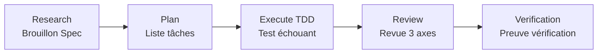
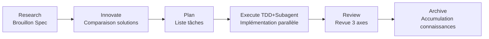

# ALTAS Workflow

> **融合三方优势 | 智能深度适配 | 渐进式披露 | 每步可反馈 | 测试工程师友好**

**Version :** 4.7 (2026-04-19)
**Taille du dépôt :** 17M, 165 fichiers Markdown, 120+ documents de référence

---

## 🌐 Langue / Language

[中文](README.md) | [English](README_EN.md) | [日本語](README_JA.md) | **Français** | [Deutsch](README_DE.md)

---

## 🎯 Qu'est-ce que c'est ?

**ALTAS Workflow** est une spécification complète de workflow de développement AI-native qui intègre l'essence de trois excellents workflows : **SDD-RIPER**, **SDD-RIPER-Optimized (Checkpoint-Driven)** et **Superpowers**.

### Mission Principale

Dédié à résoudre quatre douleurs majeures d'ingénierie dans la programmation AI :

| Douleur | Solution ALTAS |
|------|-----------|
| **Pourriture du contexte** | Indexation CodeMap + divulgation progressive, charger les références à la demande |
| **Paralysie de la revue** | 4 niveaux de profondeur intelligente (XS/S/M/L), petites tâches ne bloquent pas l'approbation |
| **Méfiance du code** | Centré sur Spec + revue à trois axes, Spec is Truth |
| **Difficile à maintenir** | Accumulation des connaissances Archive + loi TDD, complément = actif |

### Lois de Fer Principales

1. **No Spec, No Code** — Pas de code avant formation du minimum Spec (Size XS exempté)
2. **No Approval, No Execute** — Jamais de code si l'humain n'a pas approuvé dans la phase Plan
3. **Spec is Truth** — Quand Spec entre en conflit avec le code, le code a tort
4. **Reverse Sync** — Écart découvert pendant l'exécution → mettre à jour Spec d'abord → puis corriger le code
5. **Evidence First** — Complétion prouvée par résultats de vérification, pas auto-déclaration du modèle
6. **No Root Cause, No Fix** — Analyse de cause racine requise avant correction de bug, corrections aveugles interdites
7. **TDD Iron Law** — Size M/L : Pas de code production sans test échouant
8. **Resume Ready** — Laisser une ancre de récupération dans Spec avant pause longue tâche

---

## 📦 Qu'est-ce qui est inclus ?

### Aperçu de la Structure du Dépôt

```
altas/
├── altas-workflow/              # Répertoire principal du protocole (8.3M, 120+ fichiers)
│   ├── SKILL.md                 # ⭐ Prompt système central (lu par l'IA) - v4.7
│   ├── README.md                # Description détaillée ALTAS
│   ├── QUICKSTART.md            # Guide rapide basé sur scénarios
│   ├── reference-index.md       # Index maître des matériaux de référence
│   ├── workflow-diagrams.md     # Collection de diagrammes Mermaid
│   ├── protocols/               # Protocoles spécialisés (4)
│   │   ├── RIPER-5.md           # Protocole mode strict
│   │   ├── RIPER-DOC.md         # Protocole expert documentation
│   │   ├── SDD-RIPER-DUAL-COOP.md # Protocole collaboration double modèle
│   │   └── PROTOCOL-SELECTION.md # Guide de sélection de protocole
│   ├── docs/                    # Documents méthodologiques (5)
│   │   ├── 从传统编程转向大模型编程.md
│   │   ├── AI-原生研发范式.md
│   │   ├── 团队落地指南.md
│   │   ├── 手把手教程.md
│   │   └── IMPLEMENTATION-PLAN-v4.6.md
│   ├── references/              # Matériaux de référence à la demande (95+ fichiers)
│   │   ├── spec-driven-development/  # Développement piloté par Spec (7 documents)
│   │   ├── checkpoint-driven/        # Mode léger Checkpoint (4 documents)
│   │   ├── superpowers/              # Super-pouvoirs (50+ documents)
│   │   │   ├── test-driven-development/  # Loi TDD
│   │   │   ├── systematic-debugging/     # Débugage systématique
│   │   │   ├── subagent-driven-development/ # Piloté par Subagent
│   │   │   ├── brainstorming/            # Brainstorming de conception
│   │   │   ├── writing-plans/            # Meilleures pratiques d'écriture Plan
│   │   │   ├── code-review/              # Revue de code (Go/Python)
│   │   │   └── ... (plus de super-pouvoirs)
│   │   ├── agents/                       # Définitions d'agents (22 documents)
│   │   │   ├── sdd-riper-one/            # Agent standard
│   │   │   └── sdd-riper-one-light/      # Agent léger
│   │   ├── entry/                        # Configuration d'entrée (5 documents)
│   │   ├── special-modes/                # Modes spéciaux (5 documents)
│   │   ├── prd-analysis/                 # Workflow analyse PRD (6 documents)
│   │   └── testing/                      # 🆕 Spécialité ingénierie de test (18+ documents)
│   │       ├── test-strategy-template.md    # Modèle stratégie de test
│   │       ├── pytest-patterns.md           # Meilleures pratiques Pytest
│   │       ├── e2e-testing.md               # Guide E2E
│   │       ├── api-testing.md               # Référence API test
│   │       ├── performance-testing.md       # Méthodologie performance test
│   │       ├── security-testing.md          # Test sécurité
│   │       ├── contract-testing.md          # Test contrat
│   │       ├── test-data-management.md      # Gestion données test
│   │       ├── test-environment.md          # Gestion environnement test
│   │       ├── ci-cd-integration.md         # Intégration CI/CD
│   │       └── templates/                   # Modèles scaffolding test
│   └── scripts/                 # Outils d'automatisation
│       ├── archive_builder.py   # Archive builder
│       ├── scaffold.py          # Project scaffold
│       └── validate_aliases_sync.py # Alias sync validation
├── .agents/skills/              # 🆕 Paquets de compétences indépendants (6)
│   ├── advanced-api-testing/   # Test API avancé
│   ├── go-code-review/         # Revue code Go
│   ├── python-code-review/     # Revue code Python
│   ├── pytest-patterns/        # Motifs Pytest
│   ├── specify-requirements/   # Spécification exigences
│   └── implementation-verify/  # Vérification implémentation
├── .qoder/repowiki/             # Documents Wiki (69 documents)
├── AGENTS.md                    # Lignes directrices comportement IA générales
├── CLAUDE.md                    # Lignes directrices comportement Claude
├── EXAMPLES.md                  # Exemples code quatre principes
└── skills-lock.json             # Verrouillage version paquets compétences
```

### Statistiques des Actifs Principaux

| Catégorie | Quantité | Description |
|------|------|------|
| **Protocole Central** | 1 | SKILL.md (protocole principal ALTAS Workflow) v4.7 |
| **Protocoles Spécialisés** | 4 | RIPER-5 / RIPER-DOC / DUAL-COOP / PROTOCOL-SELECTION |
| **Méthodologie** | 5 | Traditionnel vers LLM / Paradigme AI-native / Adoption équipe / Tutoriel pas à pas / Plan implémentation v4.6 |
| **Matériaux Référence** | 95+ | Spec-driven (7) / Checkpoint (4) / Superpowers (50+) / Agents (22) / Entry (5) / Special-Modes (5) / PRD Analyse (6) / Testing (18+) |
| **Agents Indépendants** | 2 | SDD-RIPER-ONE (standard/léger) |
| **🆕 Paquets Compétences** | 6 | API Test / Revue Go / Revue Python / Pytest / Spécification Exigences / Vérification Implémentation |
| **Exemples Code** | 1 | EXAMPLES.md (exemples pratiques quatre principes) |
| **Outils Automatisation** | 3 | archive_builder.py / scaffold.py / validate_aliases_sync.py |

---

## 🚀 Nouveautés v4.7 (2026-04-19)

### 🧪 Optimisation Spécialité Ingénierie de Test

- ✅ **Guide de Référence Framework E2E** : Meilleures pratiques test bout-en-bout avec intégration Playwright/Cypress
- ✅ **Méthodologie Test Performance/Charge** : Stratégie stress test, benchmark test, système métriques performance
- ✅ **Processus Complet API Test** : Test contrat, test sécurité, modèles matrice API test
- ✅ **Suite Documents Motifs Pytest** : Conception Fixture, paramétrisation, stratégies Mock, couverture
- ✅ **Gestion Données Test** : Pattern usine, hiérarchie Fixture, isolation test
- ✅ **Gestion Environnement Test** : Docker Compose, injection dépendance, cohérence environnement
- ✅ **Intégration Test CI/CD** : Pipeline automatisé, portes qualité, rapports test
- ✅ **Modèles Scaffolding Test** : Prêt à l'emploi conftest.py / factories / fixtures
- ✅ **Support Test Go/Python** : Meilleures pratiques et anti-patterns multi-langages

### 🔍 Paquets Compétences Revue de Code

- ✅ **Revue Code Go** : Analyse statique, audit performance, vérifications sécurité concurrence
- ✅ **Revue Code Python** : Sécurité type, motifs asynchrones, normes gestion erreurs
- ✅ **Standardisation Processus Revue** : Review Request → Code Quality → Spec Compliance

### 📋 Workflow Analyse PRD

- ✅ **Analyse Exigences Structurée** : Brainstorm → Discover → Document → Review → Validate
- ✅ **Template PRD & Validation** : Aperçu produit, personas utilisateur, parcours, exigences fonctionnelles, métriques succès
- ✅ **Standards Métriques Qualité** : Intégrité structurelle, qualité contenu, validation frontières, cohérence cross-section

### 🛠️ Autres Améliorations

- ✅ **Script Validation Synchronisation Alias** : Vérification automatique cohérence mots déclencheurs
- ✅ **Automatisation Scaffolding Projet** : Initialisation rapide structure projet et conventions
- ✅ **Compétence Vérification Implémentation** : Tests acceptation automatisés et vérification couverture
- ✅ **Motifs Test API Avancés** : Idempotence, validation entrée, gestion erreurs, test concurrence

---

## 🚀 Comment Utiliser Rapidement ?

### Installation 30 Secondes

**Méthode 1** : Copier contenu `altas-workflow/SKILL.md` dans Custom Instructions assistant IA

**Méthode 2** : Exécuter dans Cursor/Trae :
```bash
cp altas-workflow/SKILL.md .cursorrules
```

**Méthode 3** : Configuration projet
```bash
mkdir -p mydocs/{codemap,context,specs,micro_specs,archive}
```

### Adaptation Plateforme

| Plateforme | Méthode Installation |
|------|----------|
| **Cursor / Trae** | Copier contenu `SKILL.md` dans `.cursorrules` ou AI Rules globaux |
| **Claude / OpenAI Agent** | Injecter contenu `SKILL.md` comme System Prompt |
| **Qoder** | Placer `SKILL.md` dans répertoire `.qoder/skills/` du projet |

---

### Utilisation Immédiate

**Modification Ultra Rapide (Size XS)**:
```
>> Changer MAX_RETRIES de 3 à 5 dans src/config.ts
```

**Petite Tâche (Size S)**:
```
FAST: Ajouter code verification image à interface connexion
```

**Développement Standard (Size M)**:
```
sdd_bootstrap: task=Ajouter fonction anti-scraping par code image à inscription utilisateur, goal=Amélioration sécurité
```

**Refactoring Architecture (Size L)**:
```
DEEP: Refactor module authentification pour séparer en microservices indépendants
```

**Investigation Bug**:
```
DEBUG: log_path=./logs/error.log, issue=Autorisation non obtenue après approbation
```

**Collaboration Multi-Projet**:
```
MULTI: task=Publication fonctionnalité conjointe frontend-backend
```

**🆕 Analyse PRD**:
```
PRD: Analyser exigences panier e-commerce, sortie document PRD structuré
```

**🆕 Spécialité Test**:
```
TEST: Compléter cas test E2E module paiement
PERF: Stress test performance interface requête commande
REVIEW: Revue qualité code module authentification (Go/Python)
```

---

## 📚 Commandes Principales

### Aperçu des Commandes

| Commande | Usage | Taille Applicable | Impact Workflow |
|------|------|----------|----------|
| `>>` / `FAST` | Voie rapide, sauter Research/Plan | XS/S | Exécuter directement→vérifier→résumé |
| `sdd_bootstrap` | Démarrer workflow RIPER | M/L | Research→Plan→Execute→Review |
| `create_codemap` | Générer carte code | M/L | Analyse lecture seule, pas modification code |
| `MAP` / `PROJECT MAP` | Analyse projet lecture seule | Tous | Générer carte architecture |
| `DEBUG` | Mode debug système | - | Analyse cause racine→rapport diagnostic |
| `MULTI` | Collaboration multi-projet | L | Auto-découverte + isolation scope |
| `ARCHIVE` | Accumulation connaissances | L | Version humaine + version LLM double perspective |
| `DOC` | Mode expert documentation | - | ABSORB→OUTLINE→AUTHOR→FACT-CHECK |
| `REVIEW SPEC` | Revue pré-exécution | M/L | Pré-revue consultative |
| `REVIEW EXECUTE` | Revue 3 axes post-exécution | M/L | Revue 3 axes Spec/code/qualité |
| **`PRD`** | **🆕 Analyse PRD** | **M/L** | **Brainstorm→Discover→Document→Review→Validate** |
| **`TEST`** | **🆕 Spécialité Test** | **M/L** | **Stratégie test→Conception cas→Implémentation→Vérification** |
| **`PERF`** | **🆕 Optimisation Performance** | **L** | **Mesure baseline→Analyse goulot→Optimisation→Vérification régression** |
| **`REVIEW`** | **🆕 Revue Code** | **M/L** | **Demande revue→Vérification qualité→Validation conformité** |
| **`REFACTOR`** | **🆕 Spécialité Refactoring** | **L** | **CodeMap→Plan(TDD)→Execute→Review** |
| **`MIGRATE`** | **🆕 Spécialité Migration** | **L** | **Évaluation risque→Migration→Vérification** |

### Référence Rapide Mots Déclencheurs

| Mot Déclencheur | Action | Taille |
|--------|------|------|
| `FAST` / `快速` / `>>` | Voie ultra rapide | XS/S |
| `DEEP` | Mode profond | L |
| `MAP` / `链路梳理` | CodeMap niveau fonction | - |
| `PROJECT MAP` / `项目总图` | CodeMap niveau projet | - |
| `MULTI` / `多项目` | Mode multi-projet | L |
| `CROSS` / `跨项目` | Autoriser modifications cross-projet | L |
| `DEBUG` / `排查` | Debug systématique | - |
| `REVIEW SPEC` / `计划评审` | Pré-revue consultative | M/L |
| `REVIEW EXECUTE` / `代码评审` | Revue 3 axes post-exécution | M/L |
| `ARCHIVE` / `归档` / `沉淀` | Accumulation connaissances | L |
| `DOC` / `写文档` | Mode expert documentation | - |
| **`PRD` / `PRD ANALYSIS`** | **🆕 Analyse PRD** | **M/L** |
| **`TEST` / `写测试` / `补测试`** | **🆕 Spécialité Test** | **M/L** |
| **`PERF` / `性能优化`** | **🆕 Optimisation Performance** | **L** |
| **`REVIEW` / `代码审查` / `审查PR`** | **🆕 Revue Code** | **M/L** |
| **`REFACTOR` / `重构`** | **🆕 Spécialité Refactoring** | **L** |
| **`MIGRATE` / `迁移`** | **🆕 Spécialité Migration** | **L** |
| `EXIT ALTAS` / `退出协议` | Désactiver protocole | - |
| `全部` / `all` / `execute all` | Exécution batch | M/L |

---

## 🏗️ Phases Workflow

### Workflow Size M (Standard)



**Description Workflow**:
- **Research**: Alignement recherche, formation Spec (Goal, In-Scope, Out-of-Scope, Facts, Risks, Open Questions)
- **Plan**: Planification détaillée, décomposition en Checklist atomique, clarification File Changes + Signatures + Done Contract
- **Execute**: Implémentation pilotée TDD (RED→GREEN→REFACTOR)
- **Review**: Revue 3 axes (Qualité Spec / Cohérence Spec-code / Qualité intrinsèque code)
- **Verification**: Preuve vérification, assurance passage tests

### Workflow Size L (Profond)



**Description Workflow**:
- **Research**: Recherche approfondie, analyse liens statut actuel, identification risques
- **Innovate**: Comparaison solutions, présentation 2-3 solutions (Pros/Cons/Risks/Effort)
- **Plan**: Checklist atomique + allocation Subagent
- **Execute**: Piloté TDD + Implémentation parallèle Subagent + Revue 2 étapes
- **Review**: Revue 3 axes + Accumulation Archive
- **Archive**: Génération documents double perspective (version humaine + version LLM)

---

## ⚡ Adaptation Intelligente Profondeur

### Quatre Niveaux Profondeur Tâche

| Taille | Condition Déclencheur | Exigence Spec | Workflow | Scénarios Typiques |
|------|----------|----------|--------|----------|
| **XS (Ultra Rapide)** | typo, config valeur, <10 lignes | Sauter, résumé 1 ligne après | Direct exécuter→vérifier→résumé | Modifier config, corriger typo, logs |
| **S (Rapide)** | 1-2 fichiers, logique claire | micro-spec (1-3 phrases) | micro-spec→approuver→exécuter→réécrire | Ajouter paramètre, fonction simple |
| **M (Standard)** | 3-10 fichiers, dans module | Spec léger persisté | Research→Plan→Execute(TDD)→Review | Nouvelle interface, refactoring module |
| **L (Profond)** | Cross-module, >500 lignes, architecture | Spec complet + Innovate + Archive | Research→Innovate→Plan→Execute→Subagent→Review→Archive | Séparation architecture, transformation cross-équipe |

### Tableau Référence Rapide Évaluation Taille

| Signal | Taille Recommandée | Description |
|------|----------|------|
| "Corriger un typo" | XS | Modification purement mécanique |
| "Ajouter un item config" | XS | Pas d'impact architecture |
| "Changer texte bouton" | XS/S | Scénario frontière |
| "Ajouter paramètre à cette interface" | S | Petite modification fichier unique |
| "Ajouter gestion erreurs à cette fonction" | S | Logique claire |
| "Ajouter nouvelle interface CRUD" | M | Développement dans module |
| "Refactorer ce module" | M/L | Scénario frontière |
| "Modification modèle données cross-module" | L | Impact cross-module |
| "Refactoring niveau architecture" | L | Impact global |
| "Joint frontend-backend" | L (MULTI) | Collaboration multi-projet |
| "Compléter tests E2E" | M (TEST) | 🆕 Spécialité test |
| "Stress test performance" | L (PERF) | 🆕 Optimisation performance |

### Auto Upgrade/Downgrade

- **Complexité dépassant expectation pendant exécution** → AI pause immédiatement, propose upgrade
- **Utilisable à tout moment** `[Upgrade vers M]` / `[Downgrade vers S]` pour ajuster
- **Forcer spécification**: `>>`=XS, `FAST`=S, défaut=M, `DEEP`=L

---

## 🛡️ Lois de Fer Qualité

| # | Loi de Fer | Signification |
|---|------|------|
| 1 | **No Spec, No Code** | Pas de code avant minimum Spec (Size XS exempté) |
| 2 | **No Approval, No Execute** | Pas de code si humain n'approuve pas phase Plan |
| 3 | **Spec is Truth** | Quand Spec conflit avec code, code a tort |
| 4 | **Reverse Sync** | Écart trouvé exécution → mettre à jour Spec → puis corriger code |
| 5 | **Evidence First** | Complétion prouvée par vérification, pas auto-déclaration modèle |
| 6 | **No Root Cause, No Fix** | Analyse cause racine requise avant fix bug, corrections aveugles interdites |
| 7 | **TDD Iron Law** | Size M/L: Pas de code production sans test échouant |
| 8 | **Resume Ready** | Laisser ancre récupération Spec avant pause tâche longue |

---

## 🎯 Système Visualisation Progression

### Mécanisme Checkpoint

**Après chaque étape terminée**, l'IA doit output checkpoint standardisé :

```markdown
### Progression [Phase ▸ Step]
[Terminé] ▸ **[Actuel]** ▸ [Prochain] ▸ [Futur...]

### Résultat Actuel
- Qu'est-ce qui vient d'être terminé (résultat spécifique)

### Résultat Attendu
- Ce qui sera produit au prochain step

### Prochaines Opérations
- **[Continuer/Approved]**: D'accord, passer au prochain step
- **[Modifier]** + avis: Ajuster résultat actuel
- **[Upgrade vers X]** / **[Downgrade vers X]**: Ajuster taille
- **[Charger référence: XXX]**: Voir détails d'un document référence
```

### Exemple Checkpoint

**Après Research terminé**:
```markdown
### Progression [Research ▸ Terminé]
[ ] ▸ **[Research]** ▸ [Plan] ▸ [Execute] ▸ [Review]

### Résultat Actuel
- Analyse statut actuel terminée, 3 fichiers core identifiés
- Découvert interface inscription existante sans dépendance bibliothèque graphique
- Brouillon Spec établi (Goal/Scope/Facts/Risks)

### Résultat Attendu
- Phase Plan décomposera en Checklist atomique
- Clarifiera modifications spécifiques et signatures pour chaque fichier

### Prochaines Opérations
- **[Continuer]**: Passer à phase Plan
- **[Modifier]**: Ajuster items risque dans Spec
- **[Charger référence: spec-template.md]**: Voir détails template Spec
```

**Après Plan terminé**:
```markdown
### Progression [Plan ▸ Terminé]
[Research] ▸ **[Plan]** ▸ [Execute] ▸ [Review]

### Résultat Actuel
- Checklist décomposée en 5 tâches atomiques
- 3 modifications fichier + signatures fonction clarifiées
- Done Contract défini

### Résultat Attendu
- Phase Execute implémentera séquentiellement selon Checklist
- Piloté TDD: écrire test échouant d'abord→implémenter logique→vérification passée

### Prochaines Opérations
- **[Approved]**: Approuver Plan, passer à Execute
- **[Modifier]**: Ajuster ordre Checklist ou plan implémentation
- **[Upgrade vers L]**: Besoin implémentation parallèle Subagent
```

---

## 📖 Documentation Détaillée

### Documentation Core (Lecture Obligatoire)

| Document | Usage | Longueur |
|------|------|------|
| [Description Détaillée ALTAS Workflow](altas-workflow/README.md) | Protocole workflow complet | 300+ lignes |
| [Guide Démarrage Rapide](altas-workflow/QUICKSTART.md) | Prise en main 30 secondes | 170+ lignes |
| [Index Maître Matériaux Référence](altas-workflow/reference-index.md) | Map chargement à la demande | 200+ lignes |
| [SKILL.md](altas-workflow/SKILL.md) | Prompt système IA | 650+ lignes |
| [Collection Diagrammes](altas-workflow/workflow-diagrams.md) | Visualisation Mermaid | - |

### Documents Méthodologiques (Théorie)

| Document | Thème | Public Cible |
|------|------|----------|
| [De Programmation Traditionnelle vers Programmation LLM](altas-workflow/docs/从传统编程转向大模型编程.md) | Changement paradigme | Tous |
| [Paradigme Développement AI-Native](altas-workflow/docs/AI-原生研发范式-从代码中心到文档驱动的演进.md) | Piloté par document | Architecte/Tech Lead |
| [Guide Adoption Équipe](altas-workflow/docs/团队落地指南.md) | Promotion équipe | Tech Lead/Manager |
| [Tutoriel Pas à Pas](altas-workflow/docs/如何快速从零开始落地大模型编程--手把手教程.md) | Depuis zéro | Débutant |
| [Plan Implémentation v4.6](altas-workflow/docs/IMPLEMENTATION-PLAN-v4.6.md) | Upgrade version | Tech Lead |

### 🆕 Spécialité Ingénierie Test (Nouveau v4.7)

| Document | Thème | Public Cible |
|------|------|----------|
| [Template Stratégie Test](altas-workflow/references/testing/test-strategy-template.md) | Formulation stratégie test | QA/Tech Lead |
| [Guide Test E2E](altas-workflow/references/testing/e2e-testing.md) | Test bout-en-bout | Ingénieur test |
| [Référence Test API](altas-workflow/references/testing/api-testing.md) | Processus complet test API | Backend/QA |
| [Méthodologie Test Performance](altas-workflow/references/testing/performance-testing.md) | Stress test et tuning | Ingénieur performance |
| [Motifs Test Pytest](altas-workflow/references/testing/pytest-patterns.md) | Meilleures pratiques test Python | Développeur Python |
| [Test Sécurité](altas-workflow/references/testing/security-testing.md) | Checklist test sécurité | Ingénieur sécurité |
| [Intégration CI/CD](altas-workflow/references/testing/ci-cd-integration.md) | Pipeline automatisé | DevOps |
| [Templates Scaffolding Test](altas-workflow/references/testing/test-scaffold-templates.md) | Templates prêt à l'emploi | Tous |

### 🆕 Paquets Compétences Revue Code (Nouveau v4.7)

| Compétence | Langage | Usage |
|------|------|------|
| [Revue Code Go](.agents/skills/go-code-review/SKILL.md) | Go | Analyse statique, sécurité concurrence, audit performance |
| [Revue Code Python](.agents/skills/python-code-review/SKILL.md) | Python | Sécurité type, motifs asynchrones, gestion erreurs |
| [Test API Avancé](.agents/skills/advanced-api-testing/SKILL.md) | - | Idempotence, concurrence, test contrat |

### 🆕 Workflow Analyse PRD (Nouveau v4.7)

| Document | Usage |
|------|------|
| [Compétence Analyse PRD](altas-workflow/references/prd-analysis/SKILL.md) | Processus complet analyse PRD |
| [Template PRD](altas-workflow/references/prd-analysis/template.md) | Template structuré |
| [Validation PRD](altas-workflow/references/prd-analysis/validation.md) | Standards métriques qualité |
| [Exemple Bon PRD](altas-workflow/references/prd-analysis/examples/good-prd.md) | Exemple référence |

### Protocoles Spécialisés (Scénarios Spéciaux)

| Protocole | Usage | Méthode Déclenchement |
|------|------|----------|
| [Mode Strict RIPER-5](altas-workflow/protocols/RIPER-5.md) | Portes phase strictes | Projets haut risque |
| [Expert Documentation RIPER-DOC](altas-workflow/protocols/RIPER-DOC.md) | Rédaction document | Commande `DOC` |
| [Protocole Collaboration Double Modèle](altas-workflow/protocols/SDD-RIPER-DUAL-COOP.md) | Collaboration multi-modèle | Architecture complexe |
| [Guide Sélection Protocole](altas-workflow/protocols/PROTOCOL-SELECTION.md) | Décision sélection protocole | Consulter si incertain |

### Paquets Compétences (Agents Indépendants)

| Agent | Positionnement | Scénarios Applicables |
|-------|------|----------|
| [Version Standard SDD-RIPER-ONE](altas-workflow/references/agents/sdd-riper-one/SKILL.md) | Workflow RIPER complet | Tâches moyennes-grandes |
| [Version Légère SDD-RIPER-ONE Light](altas-workflow/references/agents/sdd-riper-one-light/SKILL.md) | Piloté Checkpoint | Multi-fréquence haute/modèles forts |

### Super-Pouvoirs (Superpowers)

| Capacité | Document | Timing Appel |
|------|------|----------|
| **TDD** | [test-driven-development/SKILL.md](altas-workflow/references/superpowers/test-driven-development/SKILL.md) | Phase exécution Size M/L |
| **Debug Systématique** | [systematic-debugging/SKILL.md](altas-workflow/references/superpowers/systematic-debugging/SKILL.md) | Mode DEBUG |
| **Piloté Subagent** | [subagent-driven-development/SKILL.md](altas-workflow/references/superpowers/subagent-driven-development/SKILL.md) | Implémentation parallèle Size L |
| **Brainstorming Conception** | [brainstorming/SKILL.md](altas-workflow/references/superpowers/brainstorming/SKILL.md) | Phase Innovate |
| **Meilleures Pratiques Écriture Plan** | [writing-plans/SKILL.md](altas-workflow/references/superpowers/writing-plans/SKILL.md) | Phase Plan |
| **Vérification Pré-Complétion** | [verification-before-completion/SKILL.md](altas-workflow/references/superpowers/verification-before-completion/SKILL.md) | Phase Review |

---

## 🤝 Intégration Sources

### Aperçu 3 Sources

| Source | Avantages Core | Contenu Adopté |
|------|----------|----------|
| **SDD-RIPER** | Centré Spec, machine état RIPER | Template Spec, Revue 3 axes, Auto-découverte Multi-Project, Protocoles Debug/Archive, Index CodeMap |
| **SDD-RIPER-Optimized** | Mode léger Checkpoint-Driven | Profondeur tâche 4 niveaux (zero/fast/standard/deep), Done Contract, Resume Ready, Assemblage contexte Hot/Warm/Cold, micro-spec |
| **Superpowers** | Loi TDD, debug systématique | Anti-patterns TDD, Méthode debug 4 étapes, Piloté Subagent + Revue 2 étapes, Dispatch Agent parallèle, Loi vérification prioritaire |

### Statistiques Contribution Sources

| Source | Nb Documents | Fichiers Core |
|------|--------|----------|
| **SDD-RIPER** | 14+ | spec-template.md, commands.md, multi-project.md, archive-template.md |
| **SDD-RIPER-Optimized** | 6+ | spec-lite-template.md, modules.md, conventions.md |
| **Superpowers** | 24+ | TDD, Debug, Subagent, Brainstorming, Writing-Plans, Verification |
| **🆕 Testing** | 18+ | E2E, API, Performance, Security, Pytest, CI/CD |
| **🆕 Code Review** | 6+ | Go Review, Python Review, Advanced API Testing |
| **🆕 PRD Analysis** | 6 | SKILL, Template, Validation, Examples |

---

## 🎓 Scénarios Utilisation Typiques

### Scénario 1 : Itération Fonctionnalité Quotidienne (Size M)

**Entrée**:
```
sdd_bootstrap: task=Ajouter fonction anti-scraping code image à inscription utilisateur, goal=Amélioration sécurité
```

**Comportement IA**:
1. ✅ Auto-évaluer taille → Size M (Standard)
2. ✅ **Research** → Lire interface inscription existante, découvrir pas dépendance bibliothèque image → Output checkpoint
3. ✅ **Plan** → Lister Checklist (introduire bibliothèque→modifier interface→ajouter test) → Output checkpoint attendre [Approved]
4. ✅ **Execute** → TDD: Écrire test échouant d'abord→implémenter logique→vérification passée
5. ✅ **Review** → Revue 3 axes → Confirmation passée

**Résultat**:
- Document Spec: `mydocs/specs/YYYY-MM-DD_hh-mm_InscriptionImageUtilisateur.md`
- Modifications code: `src/api/auth.ts`, `src/utils/captcha.ts`
- Fichier test: `src/api/auth.test.ts`

---

### Scénario 2 : Correction Urgente Config Online (Size XS)

**Entrée**:
```
>> Changer MAX_RETRIES de 3 à 5 dans src/config.ts
```

**Comportement IA**:
1. ✅ Identifié comme Size XS (Ultra Rapide)
2. ✅ Modifier code directement→exécuter vérification→résumé 1 ligne

**Résultat**:
- Résumé 1 ligne: `MAX_RETRIES changé de 3→5, vérification passée`

---

### Scénario 3 : Refactoring Architecture (Size L)

**Entrée**:
```
DEEP: Refactor module authentification pour séparer en microservices indépendants
```

**Comportement IA**:
1. ✅ Identifié comme Size L (Profond)
2. ✅ **create_codemap** → Générer index code module authentification
3. ✅ **Research** → Analyser liens statut actuel, identifier risques
4. ✅ **Innovate** → Présenter 3 solutions (service-oriented/modulaire/couche gateway) comparaison
5. ✅ **Plan** → Checklist atomique + allocation Subagent
6. ✅ **Execute** → Piloté TDD + Implémentation parallèle Subagent + Revue 2 étapes
7. ✅ **Review** → Revue 3 axes + Accumulation Archive

**Résultat**:
- CodeMap: `mydocs/codemap/YYYY-MM-DD_hh-mm_ModuleAuthentification.md`
- Spec: `mydocs/specs/YYYY-MM-DD_hh-mm_ServiceAuthentification.md`
- Archive: `mydocs/archive/YYYY-MM-DD_hh-mm_ServiceAuthentification_{human,llm}.md`

---

### Scénario 4 : Investigation Bug

**Entrée**:
```
DEBUG: log_path=./logs/error.log, issue=Autorisation non obtenue après approbation
```

**Comportement IA**:
1. ✅ Entrer mode Debug (analyse lecture seule)
2. ✅ Lire logs+Spec+CodeMap → Positionnement triangulaire
3. ✅ Output: Symptômes/Comportement attendu/Candidats cause racine/Correction suggérée
4. ✅ Si correction nécessaire → Entrer workflow RIPER ou FAST

**Résultat**:
- Rapport diagnostic structuré: Symptômes / Comportement attendu / Candidats cause racine (3) / Correction suggérée

---

### Scénario 5 : Collaboration Multi-Projet

**Entrée**:
```
MULTI: task=Publication fonctionnalité conjointe frontend-backend
```

**Comportement IA**:
1. ✅ Auto-scanner workdir → Découvrir web-console + api-service
2. ✅ Output Project Registry pour confirmation
3. ✅ Générer codemap double projet
4. ✅ Plan groupé par projet: api-service(Provider)→web-console(Consumer)
5. ✅ Exécuter selon ordre dépendance, enregistrer Contract Interfaces

**Résultat**:
- Project Registry: Liste sous-projets identifiés
- Contract Interfaces: Documents contrat interface API
- Touched Projects: Liste projets modifiés

---

### 🆕 Scénario 6 : Analyse PRD (v4.7)

**Entrée**:
```
PRD: Analyser exigences panier e-commerce, objectif=Augmenter taux conversion 20%
```

**Comportement IA**:
1. ✅ Entrer mode analyse PRD
2. ✅ **Brainstorm** → Collecter input parties prenantes, analyse concurrentielle
3. ✅ **Discover** → Recherche utilisateur, analyse données, faisabilité technique
4. ✅ **Document** → Output PRD structuré (Aperçu produit/Personas utilisateur/Parcours/Exigences fonctionnelles/Métriques succès)
5. ✅ **Review** → Revue parties prenantes
6. ✅ **Validate** → Validation métriques qualité (Intégrité structurelle/Qualité contenu/Validation frontières)

**Résultat**:
- Document PRD: `mydocs/prds/YYYY-MM-DD_hh-mm_OptimisationPanierECommerce.md`
- Rapport validation: Liste items passés/non passés

---

### 🆕 Scénario 7 : Spécialité Test E2E (v4.7)

**Entrée**:
```
TEST: Compléter tests E2E chemin critique module paiement
Scope: src/modules/payment
Objectif: Couvrir flux complet Commande→Paiement→Rappel
Contraintes: Utiliser Playwright, sans dépendance passerelle paiement réelle
```

**Comportement IA**:
1. ✅ Entrer mode TEST
2. ✅ **Strategy** → Référer [test-strategy-template.md](altas-workflow/references/testing/test-strategy-template.md) formuler stratégie test
3. ✅ **Design** → Référer [e2e-testing.md](altas-workflow/references/testing/e2e-testing.md) concevoir cas test
4. ✅ **Implement** → Utiliser [templates/](altas-workflow/references/testing/templates/) scaffolding implémentation rapide
5. ✅ **Verify** → Exécuter tests, générer rapports

**Résultat**:
- Fichier test: `src/modules/payment/e2e/checkout-flow.spec.ts`
- Rapport test: Couverture, taux passage, métriques performance

---

## 📊 Référence Rapide Évaluation Taille

| Signal | Taille Recommandée |
|------|----------|
| "Corriger un typo" | XS |
| "Ajouter un item config" | XS |
| "Changer texte bouton" | XS/S |
| "Ajouter paramètre à cette interface" | S |
| "Ajouter gestion erreurs à cette fonction" | S |
| "Ajouter nouvelle interface CRUD" | M |
| "Refactorer ce module" | M/L |
| "Modification modèle données cross-module" | L |
| "Refactoring niveau architecture" | L |
| "Joint frontend-backend" | L (MULTI) |
| "Écrire document PRD" | M (PRD) |
| "Compléter tests E2E" | M (TEST) |
| "Stress test performance" | L (PERF) |
| "Revue code" | M (REVIEW) |

---

## 🔧 FAQ

### Contrôle Workflow

**Q : L'IA output trop de code à la fois, exécute tous les steps, que faire ?**

A : ALTAS intègre mécanisme checkpoint, l'IA **doit** faire pause après un step terminé pour attendre confirmation. Si l'IA s'emballe, répondre : "Arrêtez, exécutez strictement mécanisme checkpoint, avancez un step à la fois."

**Q : Comment intervenir dans le plan de l'IA à mi-parcours ?**

A : À n'importe quel checkpoint répondre `[Modifier] Ne pas utiliser Redis, utiliser cache mémoire à la place`, l'IA ajustera Plan selon feedback et redemandera Approve.

**Q : Comment choisir XS/S/M/L ?**

A : ALTAS évalue automatiquement. Vous pouvez aussi forcer : `>>`=XS, `FAST`=S, défaut=M, `DEEP`=L. Pendant exécution, à tout moment `[Upgrade vers M]` ou `[Downgrade vers S]`.

---

### TDD

**Q : Pourquoi l'IA écrit toujours tests d'abord ? Trop lent.**

A : C'est Evidence First + Loi TDD. Sans test échouant, code généré par IA peut ne pas avoir été exécuté. Si tâche très simple, utiliser `>>` pour déclencher mode XS et sauter TDD.

**Q : Dans quels cas peut-on sauter TDD ?**

A : Size XS/S (typo, config, petite modification fichier unique) exemptés TDD. Size M/L doivent suivre loi TDD.

---

### 🆕 Spécialité Test (v4.7)

**Q : Quelles sont les caractéristiques du support test ALTAS v4.7 ?**

A : v4.7 ajoute spécialité ingénierie test complète :
- Intégration framework test E2E (Playwright/Cypress)
- Processus complet test API (test contrat, test sécurité)
- Méthodologie test performance/charge
- Motifs test Pytest et templates scaffolding
- Intégration CI/CD et portes qualité
- Support test multi-langages Go/Python

**Q : Comment utiliser scaffolding test ?**

A : Référer [test-scaffold-templates.md](altas-workflow/references/testing/test-scaffold-templates.md), fournit conftest.py, factories.py, fixtures prêts à l'emploi.

---

### 🆕 Revue Code (v4.7)

**Q : Comment déclencher revue code ?**

A : Utiliser commande `REVIEW` ou mots déclencheurs `代码审查`/`审查 PR` :
```
REVIEW: Revue qualité code module src/auth/
```

**Q : Quels langages supportés pour revue code ?**

A : v4.7 intègre paquets compétences revue code Go et Python, incluant analyse statique, sécurité type, sécurité concurrence, audit performance.

---

### Gestion Documents

**Q : Trop de fichiers md sous mydocs/, faut-il commiter sur Git ?**

A : **Fortement recommandé**. Spec et Archive sont source vérité unique du projet, empêchent pourriture contexte, aident onboarding nouveaux venus.

**Q : Comment gérer fichiers sous mydocs/ ?**

A : Utiliser préfixe temps uniforme `YYYY-MM-DD_hh-mm_`, archiver régulièrement fichiers anciens. Script Archive peut auto-générer documents double perspective humain/LLM.

---

### Matériaux Référence

**Q : Trop de matériaux référence (references/), l'IA doit-elle tout lire à chaque fois ?**

A : **Pas nécessaire**. ALTAS adopte divulgation progressive, lit seulement fichiers correspondants on-demand quand scénarios hit. Table index référence dans SKILL.md clarifie timing appel pour chaque fichier.

**Q : Comment charger matériaux référence on-demand ?**

A : Voir [reference-index.md](altas-workflow/reference-index.md), chaque fichier marqué timing appel. Exemple :
- Quand écrire Spec → Lire `spec-template.md`
- Quand exécuter TDD → Lire `test-driven-development/SKILL.md`
- Quand debugger → Lire `systematic-debugging/SKILL.md`
- 🆕 Quand spécialité test → Lire `testing/test-strategy-template.md`
- 🆕 Quand analyse PRD → Lire `prd-analysis/SKILL.md`

---

### Collaboration Équipe

**Q : Comment collaborer en équipe multi-personnes ?**

A : Spec est source vérité partagée équipe. Chaque personne crée ses fichiers Spec, collabore via Git. Développeurs core ont seulement besoin Review Plan, pas tout code.

**Q : Quels modèles conviennent pour ALTAS ?**

A : Tout modèle peut utiliser mode standard (M/L). Mode léger (S/XS) spécialement adapté pour modèles forts (Claude Opus/GPT-4+) scénarios multi-fréquence haute. Nouvelles équipes recommandent commencer par mode standard.

**Q : Comment former membres équipe ?**

A : D'abord lire [De Programmation Traditionnelle vers Programmation LLM](altas-workflow/docs/从传统编程转向大模型编程.md), puis pratiquer [Tutoriel Pas à Pas](altas-workflow/docs/如何快速从零开始落地大模型编程--手把手教程.md).

---

## 📋 Historique Versions

| Version | Date | Nom | Statut | Changements Clés |
|------|------|------|------|----------|
| **v4.7** | 2026-04-19 | ALTAS Workflow | ✅ **Version Actuelle** | 🧪Optimisation spécialité ingénierie test, 🔍Paquets compétences revue code, 📋Workflow analyse PRD, 🛠️Amélioration automatisation |
| **v4.6** | 2026-04-16 | ALTAS Workflow | ✅ Version Stable | Affinement plan implémentation, guide sélection protocole |
| **v4.0** | 2026-04-13 | ALTAS Workflow | ✅ Version Historique | Intégration trois workflows, ajout adaptation profondeur intelligente, visualisation progression, chargement à la demande |
| **v1.0** | 2026-04-12 | SIGMA Workflow | ❌ Obsolète | Version initiale |

### Caractéristiques Principales v4.7

#### 🧪 Spécialité Ingénierie de Test
- ✅ Guide référence framework E2E (Playwright/Cypress)
- ✅ Méthodologie test performance/charge et stratégie stress test
- ✅ Processus complet API test (test contrat, test sécurité)
- ✅ Suite documents motifs Pytest (Fixture/paramétrage/Mock)
- ✅ Gestion données test et pattern usine
- ✅ Gestion environnement test et intégration Docker
- ✅ Intégration test CI/CD et portes qualité
- ✅ Modèles scaffolding test (prêt à l'emploi)
- ✅ Support test multi-langages Go/Python

#### 🔍 Paquets Compétences Revue Code
- ✅ Revue code Go (analyse statique, sécurité concurrence, audit performance)
- ✅ Revue code Python (sécurité type, motifs asynchrones, gestion erreurs)
- ✅ Motifs test API avancés (idempotence, concurrence, test contrat)
- ✅ Standardisation processus revue (Request → Quality → Compliance)

#### 📋 Workflow Analyse PRD
- ✅ Processus cinq phases analyse exigences structurées
- ✅ Modèle PRD et standards validation
- ✅ Évaluation métriques qualité quatre dimensions
- ✅ Exemple bon PRD référence

#### 🛠️ Amélioration Automatisation
- ✅ Script validation synchronisation alias
- ✅ Automatisation scaffolding projet
- ✅ Compétence vérification implémentation
- ✅ Compétence spécification exigences

---

## 📊 Statistiques Dépôt

```
Taille Dépôt: 17M
Fichiers Markdown: 165
Matériaux Référence: 95+
  - Spec-Driven Development: 7
  - Checkpoint-Driven: 4
  - Superpowers: 50+
  - Agents: 22
  - Entry: 5
  - Special-Modes: 5
  - 🆕 PRD Analysis: 6
  - 🆕 Testing: 18+
Protocoles Centraux: 1 (SKILL.md v4.7)
Protocoles Spécialisés: 4 (RIPER-5/RIPER-DOC/DUAL-COOP/PROTOCOL-SELECTION)
Méthodologie: 5
Agents Indépendants: 2 (standard/léger)
🆕 Paquets Compétences: 6 (API Test/Revue Go/Revue Python/Pytest/Spécification Exigences/Vérification Implémentation)
Outils Automatisation: 3 (archive_builder/scaffold/validate_aliases)
Documents Wiki: 69 (.qoder/repowiki/)
```

---

## 🎯 Navigation Rapide

### Débutant

1. [Guide Démarrage Rapide](altas-workflow/QUICKSTART.md) - Prise en main 30 secondes
2. [De Programmation Traditionnelle vers Programmation LLM](altas-workflow/docs/从传统编程转向大模型编程.md) - Changement paradigme
3. [Tutoriel Pas à Pas](altas-workflow/docs/如何快速从零开始落地大模型编程--手把手教程.md) - Depuis zéro

### 🆕 Entrée Ingénieur Test (v4.7)

1. [Template Stratégie Test](altas-workflow/references/testing/test-strategy-template.md) - Formuler stratégie test
2. [Guide Test E2E](altas-workflow/references/testing/e2e-testing.md) - Test bout-en-bout
3. [Motifs Test Pytest](altas-workflow/references/testing/pytest-patterns.md) - Test Python
4. [Templates Scaffolding Test](altas-workflow/references/testing/test-scaffold-templates.md) - Prêt à l'emploi

### Référence Rapide

- [Commandes Core](#-commandes-principales) - Tous mots déclencheurs et commandes
- [Évaluation Taille](#-adaptation-intelligente-profondeur) - Comment choisir XS/S/M/L
- [Index Matériaux Référence](altas-workflow/reference-index.md) - Map chargement à la demande
- [Documentation Détaillée](#-documentation-détaillée) - Liste documents complète
- [Collection Diagrammes](altas-workflow/workflow-diagrams.md) - Visualisation Mermaid

### Usage Avancé

- [Mode Strict RIPER-5](altas-workflow/protocols/RIPER-5.md) - Projets haut risque
- [Développement Piloté Subagent](altas-workflow/references/superpowers/subagent-driven-development/SKILL.md) - Implémentation parallèle
- [Debug Systématique](altas-workflow/references/superpowers/systematic-debugging/SKILL.md) - Analyse cause racine
- [🆕 Workflow Analyse PRD](altas-workflow/references/prd-analysis/SKILL.md) - Analyse exigences
- [🆕 Compétences Revue Code](.agents/skills/go-code-review/SKILL.md) - Revue Go/Python

---

## 📊 Compatibilité Stack Technique

### Support Langages Programmation

| Langage | Framework Test | Revue Code | Couverture Documentation |
|------|----------|----------|----------|
| **Python** | Pytest, unittest | ✅ Python Code Review | Sécurité type, motifs asynchrones, gestion erreurs |
| **Go** | testing, ginkgo | ✅ Go Code Review | Analyse statique, sécurité concurrence, audit performance |
| **JavaScript/TypeScript** | Jest, Playwright, Cypress | ⚠️ Via API Testing | E2E, test API |
| **Java** | JUnit, TestNG | ⚠️ Processus général | TDD, stratégie test |
| **Général** | - | Implementation Verify | Couverture, test acceptation |

### Compatibilité Plateforme

| Plateforme | Niveau Support | Notes |
|------|----------|------|
| **Cursor** | ✅ Support complet | Recommandé, intégration `.cursorrules` |
| **Trae** | ✅ Support complet | Intégration native |
| **Claude Desktop** | ✅ Support complet | Injection System Prompt |
| **OpenAI Agents** | ✅ Support complet | Injection System Prompt |
| **Qoder** | ✅ Support complet | Intégration `.qoder/skills/` |
| **VS Code + Copilot** | ⚠️ Support basique | Configuration manuelle requise |

---

## 📈 Santé Projet

### Complétude Documentation

- ✅ Documentation protocole core complète (SKILL.md 650+ lignes)
- ✅ Index matériaux référence complet (reference-index.md 200+ lignes)
- ✅ Guide démarrage rapide complet (QUICKSTART.md 170+ lignes)
- ✅ Visualisation diagrammes (workflow-diagrams.md)
- ✅ Support multi-langues (Chinois/Anglais/Japonais/Français/Allemand)
- ✅ Verrouillage version et gestion dépendances (skills-lock.json)

### Assurance Qualité Code

- ✅ Loi TDD exécutée强制
- ✅ Mécanisme revue 3 axes
- ✅ Paquets compétences revue code (Go/Python)
- ✅ Automatisation vérification implémentation
- ✅ Templates scaffolding test

### Prêt Collaboration Équipe

- ✅ Spec comme source vérité unique
- ✅ Gestion documents Git-friendly
- ✅ Mécanisme checkpoint assure synchronisation
- ✅ Support collaboration multi-projet
- ✅ Guide adoption équipe

---

*Propulsé par l'intégration de SDD-RIPER, SDD-RIPER-Optimized (Checkpoint-Driven), Superpowers, et amélioré avec capacités Ingénierie de Test & Revue de Code.*

**Dernière mise à jour**: 2026-04-19
**Version actuelle**: v4.7
**Statut maintenance**: 🟢 Développement actif