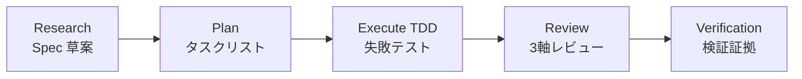
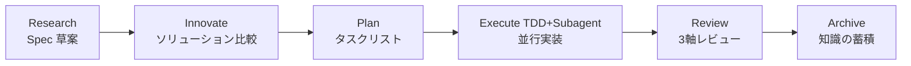

# ALTAS Workflow

> **3つの利点の融合 | インテリジェント深度適応 | 段階的開示 | ステップバイステップのフィードバック | テストエンジニアフレンドリー**

**バージョン:** 4.7 (2026-04-19)
**リポジトリサイズ:** 17M, 165 Markdownファイル, 120+ 参照ドキュメント

---

## 🌐 言語 / Language

[中文](README.md) | [English](README_EN.md) | **日本語** | [Français](README_FR.md) | [Deutsch](README_DE.md)

---

## 🎯 これは何？

**ALTAS Workflow**は、**SDD-RIPER**、**SDD-RIPER-Optimized (Checkpoint-Driven)**、**Superpowers**という3つの優秀なワークフローのエッセンスを統合した包括的なAIネイティブ開発ワークフロー仕様です。

### コアミッション

AIプログラミングにおける4つの主要なエンジニアリングの課題を解決することに専念：

| 課題 | ALTASの解決策 |
|------|-----------|
| **コンテキストの劣化** | CodeMapインデックス + 段階的開示、必要に応じて参照資料をロード |
| **レビューの麻痺** | 4レベルのインテリジェント深度 (XS/S/M/L)、小さなタスクは承認で詰まらない |
| **コードへの不信** | Spec中心主義 + 3軸レビュー、Spec is Truth |
| **保守の困難さ** | Archive知識の蓄積 + TDD鉄則、完了は資産 |

### コア鉄則

1. **No Spec, No Code** — 最小Specが形成される前にコードを書かない (Size XSは免除)
2. **No Approval, No Execute** — Planフェーズで人間が頷かない限り、絶対にコードを書かない
3. **Spec is Truth** — Specとコードが競合する場合、コードが間違っている
4. **Reverse Sync** — 実行中に偏差を発見 → まずSpecを更新 → その後コードを修正
5. **Evidence First** — 完了は検証結果によって証明、モデルの自己宣言ではない
6. **No Root Cause, No Fix** — バグ修正前に根本原因分析が必要、盲目的な修正は禁止
7. **TDD Iron Law** — Size M/L: 失敗したテストなしで本番コードを書かない
8. **Resume Ready** — 長いタスクの一時停止前にSpecに回復アンカーを残す

---

## 📦 何が含まれていますか？

### リポジトリ構造の概要

```
altas/
├── altas-workflow/              # メインプロトコルディレクトリ (8.3M, 120+ ファイル)
│   ├── SKILL.md                 # ⭐ コアシステムプロンプト (AIが読む) - v4.7
│   ├── README.md                # ALTAS詳細説明
│   ├── QUICKSTART.md            # シナリオベースのクイックガイド
│   ├── reference-index.md       # 参考資料マスターインデックス
│   ├── workflow-diagrams.md     # Mermaidフローチャートコレクション
│   ├── protocols/               # 専用プロトコル (4)
│   │   ├── RIPER-5.md           # 厳格モードプロトコル
│   │   ├── RIPER-DOC.md         # ドキュメントエキスパートプロトコル
│   │   ├── SDD-RIPER-DUAL-COOP.md # デュアルモデル協力プロトコル
│   │   └── PROTOCOL-SELECTION.md # プロトコル選択ガイド
│   ├── docs/                    # 方法論ドキュメント (5)
│   │   ├── 从传统编程转向大模型编程.md
│   │   ├── AI-原生研发范式.md
│   │   ├── 团队落地指南.md
│   │   ├── 手把手教程.md
│   │   └── IMPLEMENTATION-PLAN-v4.6.md
│   ├── references/              # オンデマンド参照資料 (95+ ファイル)
│   │   ├── spec-driven-development/  # Spec駆動開発 (7 コアドキュメント)
│   │   ├── checkpoint-driven/        # Checkpoint軽量モード (4 ドキュメント)
│   │   ├── superpowers/              # スーパーパワー (50+ ドキュメント)
│   │   │   ├── test-driven-development/  # TDD鉄則
│   │   │   ├── systematic-debugging/     # システム的デバッグ
│   │   │   ├── subagent-driven-development/ # Subagent駆動
│   │   │   ├── brainstorming/            # デザインブレインストーミング
│   │   │   ├── writing-plans/            # Plan作成のベストプラクティス
│   │   │   ├── code-review/              # コードレビュー (Go/Python)
│   │   │   └── ... (より多くのスーパーパワー)
│   │   ├── agents/                       # Agent定義 (22 ドキュメント)
│   │   │   ├── sdd-riper-one/            # 標準Agent
│   │   │   └── sdd-riper-one-light/      # 軽量Agent
│   │   ├── entry/                        # エントリ設定 (5 ドキュメント)
│   │   ├── special-modes/                # 特殊モード (5 ドキュメント)
│   │   ├── prd-analysis/                 # PRD分析ワークフロー (6 ドキュメント)
│   │   └── testing/                      # 🆕 テストエンジニアリング専門 (18+ ドキュメント)
│   │       ├── test-strategy-template.md    # テスト戦略テンプレート
│   │       ├── pytest-patterns.md           # Pytestベストプラクティス
│   │       ├── e2e-testing.md               # E2Eテストガイド
│   │       ├── api-testing.md               # APIテスト参照
│   │       ├── performance-testing.md       # パフォーマンステスト方法論
│   │       ├── security-testing.md          # セキュリティテスト
│   │       ├── contract-testing.md          # 契約テスト
│   │       ├── test-data-management.md      # テストデータ管理
│   │       ├── test-environment.md          # テスト環境管理
│   │       ├── ci-cd-integration.md         # CI/CD統合
│   │       └── templates/                   # テストスキャフォールドテンプレート
│   └── scripts/                 # 自動化ツール
│       ├── archive_builder.py   # Archiveビルダー
│       ├── scaffold.py          # プロジェクトスキャフォールド
│       └── validate_aliases_sync.py # エイリアス同期検証
├── .agents/skills/              # 🆕 独立スキルパッケージ (6)
│   ├── advanced-api-testing/   # 高度APIテスト
│   ├── go-code-review/         # Goコードレビュー
│   ├── python-code-review/     # Pythonコードレビュー
│   ├── pytest-patterns/        # Pytestパターン
│   ├── specify-requirements/   # 要件仕様
│   └── implementation-verify/  # 実装検証
├── .qoder/repowiki/             # Wikiドキュメント (69 ドキュメント)
├── AGENTS.md                    # 一般AI行動ガイドライン
├── CLAUDE.md                    Claude専用行動ガイドライン
├── EXAMPLES.md                  # 4つの原則コード例
└── skills-lock.json             # スキルパッケージバージョンロック
```

### コア資産統計

| カテゴリ | 数 | 説明 |
|------|------|------|
| **コアプロトコル** | 1 | SKILL.md (ALTAS Workflowメインプロトコル) v4.7 |
| **専用プロトコル** | 4 | RIPER-5 / RIPER-DOC / DUAL-COOP / PROTOCOL-SELECTION |
| **方法論** | 5 | 従来からLLMへ / AIネイティブパラダイム / チーム導入 / ステップバイステップチュートリアル / v4.6実施計画 |
| **参照資料** | 95+ | Spec駆動 (7) / Checkpoint (4) / Superpowers (50+) / Agents (22) / Entry (5) / Special-Modes (5) / PRD分析 (6) / Testing (18+) |
| **独立Agent** | 2 | SDD-RIPER-ONE (標準/軽量) |
| **🆕 スキルパッケージ** | 6 | APIテスト / Goレビュー / Pythonレビュー / Pytest / 要件仕様 / 実装検証 |
| **コード例** | 1 | EXAMPLES.md (4つの原則実践例) |
| **自動化ツール** | 3 | archive_builder.py / scaffold.py / validate_aliases_sync.py |

---

## 🚀 v4.7 新機能 (2026-04-19)

### 🧪 テストエンジニアリング専門最適化

- ✅ **E2Eテストフレームワーク参照ガイド**: エンドツーエンドテストベストプラクティスとPlaywright/Cypress統合
- ✅ **パフォーマンス/負荷テスト方法論**: ストレステスト戦略、ベンチマークテスト、パフォーマンス指標体系
- ✅ **APIテスト完全プロセス**: 契約テスト、セキュリティテスト、APIテストマトリックステンプレート
- ✅ **Pytestテストパターンドキュメントスイート**: Fixture設計、パラメータ化、Mock戦略、カバレッジ
- ✅ **テストデータ管理**: ファクトリーパターン、Fixture階層、テスト分離
- ✅ **テスト環境管理**: Docker Compose、依存性注入、環境一貫性
- ✅ **CI/CD統合テスト**: 自動化パイプライン、品質ゲート、テストレポート
- ✅ **テストスキャフォールドテンプレート**: すぐに使える conftest.py / factories / fixtures
- ✅ **Go/Pythonテストサポート**: マルチランゲージテストベストプラクティスと反パターン

### 🔍 コードレビュースキルパッケージ

- ✅ **Goコードレビュー**: 静的解析、パフォーマンス監査、並行安全性チェック
- ✅ **Pythonコードレビュー**: 型安全性、非同期パターン、エラー処理規範
- ✅ **レビュープロセス標準化**: Review Request → Code Quality → Spec Compliance

### 📋 PRD分析ワークフロー

- ✅ **構造化要件分析**: Brainstorm → Discover → Document → Review → Validate
- ✅ **PRDテンプレートと検証**: 製品概要、ユーザーペルソナ、ジャーニー、機能要件、成功指標
- ✅ **品質メトリックス標準**: 構造完全性、コンテンツ品質、境界検証、クロスセクション一貫性

### 🛠️ その他の改善

- ✅ **エイリアス同期検証スクリプト**: トリガーワード一貫性を自動チェック
- ✅ **プロジェクトスキャフォールド自動化**: プロジェクト構造と規約を迅速に初期化
- ✅ **実装検証スキル**: 自動化受入テストとカバレッジチェック
- ✅ **高度APIテストパターン**: 冪等性、入力検証、エラー処理、同時実行テスト

---

## 🚀 どのように素早く使用しますか？

### 30秒インストール

**方法1**: `altas-workflow/SKILL.md`の内容をAIアシスタントのCustom Instructionsにコピー

**方法2**: Cursor/Traeで実行：
```bash
cp altas-workflow/SKILL.md .cursorrules
```

**方法3**: プロジェクト設定
```bash
mkdir -p mydocs/{codemap,context,specs,micro_specs,archive}
```

### プラットフォーム適応

| プラットフォーム | インストール方法 |
|------|----------|
| **Cursor / Trae** | `SKILL.md`の内容を`.cursorrules`またはグローバルAI Rulesにコピー |
| **Claude / OpenAI Agent** | `SKILL.md`の内容をSystem Promptとして注入 |
| **Qoder** | `SKILL.md`をプロジェクトの`.qoder/skills/`ディレクトリに配置 |

---

### 即座に使用

**極速修正 (Size XS)**:
```
>> src/config.tsのMAX_RETRIESを3から5に変更
```

**小さなタスク (Size S)**:
```
FAST: ログインインターフェースに画像認証コードを追加
```

**標準開発 (Size M)**:
```
sdd_bootstrap: task=ユーザー登録インターフェースにスクレイピング防止機能を追加, goal=セキュリティ向上
```

**アーキテクチャリファクタリング (Size L)**:
```
DEEP: 認証モジュールをリファクタリングして独立したマイクロサービスに分割
```

**バグ調査**:
```
DEBUG: log_path=./logs/error.log, issue=承認後に認可が取得できない
```

**マルチプロジェクト協力**:
```
MULTI: task=フロントエンド・バックエンド連携機能リリース
```

**🆕 PRD分析**:
```
PRD: イーコマースショッピングカート要件を分析し、構造化PRDドキュメントを出力
```

**🆕 テスト専門**:
```
TEST: 支払いモジュールにE2Eテストケースを補充
PERF: 注文問い合わせインターフェースのパフォーマンスストレステスト
REVIEW: 認証モジュールのコード品質をレビュー (Go/Python)
```

---

## 📚 コアコマンド

### コマンド概要

| コマンド | 用途 | 適用サイズ | ワークフロー影響 |
|------|------|----------|----------|
| `>>` / `FAST` | 高速トラック、Research/Planをスキップ | XS/S | 直接実行→検証→要約 |
| `sdd_bootstrap` | RIPERワークフロー開始 | M/L | Research→Plan→Execute→Review |
| `create_codemap` | コードマップ生成 | M/L | 読み取り専用分析、コード変更なし |
| `MAP` / `PROJECT MAP` | 読み取り専用プロジェクト分析 | すべて | アーキテクチャマップ生成 |
| `DEBUG` | システムデバッグモード | - | 根本原因分析→診断レポート |
| `MULTI` | マルチプロジェクト協力 | L | 自動発見 + スコープ分離 |
| `ARCHIVE` | 知識の蓄積 | L | 人間版 + LLM版デュアルパースペクティブ |
| `DOC` | ドキュメントエキスパートモード | - | ABSORB→OUTLINE→AUTHOR→FACT-CHECK |
| `REVIEW SPEC` | 実行前レビュー | M/L | 提言的プレビュー |
| `REVIEW EXECUTE` | 実行後3軸レビュー | M/L | Spec/コード/品質3軸レビュー |
| **`PRD`** | **🆕 PRD分析** | **M/L** | **Brainstorm→Discover→Document→Review→Validate** |
| **`TEST`** | **🆕 テスト専門** | **M/L** | **テスト戦略→ケース設計→実装→検証** |
| **`PERF`** | **🆕 パフォーマンス最適化** | **L** | **ベースライン測定→ボトルネック分析→最適化→回帰検証** |
| **`REVIEW`** | **🆕 コードレビュー** | **M/L** | **レビュー依頼→品質チェック→コンプライアンス検証** |
| **`REFACTOR`** | **🆕 リファクタリング専門** | **L** | **CodeMap→Plan(TDD)→Execute→Review** |
| **`MIGRATE`** | **🆕 移行専門** | **L** | **リスク評価→移行→検証** |

### トリガーワードクイックリファレンス

| トリガーワード | アクション | サイズ |
|--------|------|------|
| `FAST` / `快速` / `>>` | 極速トラック | XS/S |
| `DEEP` | 深度モード | L |
| `MAP` / `链路梳理` | 機能レベルCodeMap | - |
| `PROJECT MAP` / `项目总图` | プロジェクトレベルCodeMap | - |
| `MULTI` / `多项目` | マルチプロジェクトモード | L |
| `CROSS` / `跨项目` | クロスプロジェクト変更を許可 | L |
| `DEBUG` / `排查` | システム的デバッグ | - |
| `REVIEW SPEC` / `计划评审` | 実行前建議的プレビュー | M/L |
| `REVIEW EXECUTE` / `代码评审` | 実行後3軸レビュー | M/L |
| `ARCHIVE` / `归档` / `沉淀` | 知識の蓄積 | L |
| `DOC` / `写文档` | ドキュメントエキスパートモード | - |
| **`PRD` / `PRD ANALYSIS`** | **🆕 PRD分析** | **M/L** |
| **`TEST` / `写测试` / `补测试`** | **🆕 テスト専門** | **M/L** |
| **`PERF` / `性能优化`** | **🆕 パフォーマンス最適化** | **L** |
| **`REVIEW` / `代码审查` / `审查PR`** | **🆕 コードレビュー** | **M/L** |
| **`REFACTOR` / `重构`** | **🆕 リファクタリング専門** | **L** |
| **`MIGRATE` / `迁移`** | **🆕 移行専門** | **L** |
| `EXIT ALTAS` / `退出协议` | プロトコル無効化 | - |
| `全部` / `all` / `execute all` | 一括実行 | M/L |

---

## 🏗️ ワークフローフェーズ

### Size M (標準) ワークフロー



**ワークフロー説明**:
- **Research**: 研究アライメント、Specの形成 (Goal, In-Scope, Out-of-Scope, Facts, Risks, Open Questions)
- **Plan**: 詳細計画、アトミックChecklistへの分解、File Changes + Signatures + Done Contractの明確化
- **Execute**: TDD駆動実装 (RED→GREEN→REFACTOR)
- **Review**: 3軸レビュー (Spec品質 / Spec-コード一貫性 / コード内在的品質)
- **Verification**: 検証証拠、テスト通過の確認

### Size L (深度) ワークフロー



**ワークフロー説明**:
- **Research**: 深度研究、現状リンクトラッキング、リスクの特定
- **Innovate**: ソリューション比較、2-3種類のソリューションを提示 (Pros/Cons/Risks/Effort)
- **Plan**: アトミックChecklist + Subagent割り当て
- **Execute**: TDD駆動 + Subagent並行実装 + 2段階レビュー
- **Review**: 3軸レビュー + Archive蓄積
- **Archive**: デュアルパースペクティブドキュメントの生成 (人間版 + LLM版)

---

## ⚡ インテリジェント深度適応

### 4レベルタスク深度

| サイズ | トリガー条件 | Spec要件 | ワークフロー | 典型的シナリオ |
|------|----------|----------|--------|----------|
| **XS (極速)** | typo、設定値、<10行 | スキップ、事後1行要約 | 直接実行→検証→要約 | 設定変更、typo修正、ログ |
| **S (高速)** | 1-2ファイル、ロジック明確 | micro-spec (1-3文) | micro-spec→承認→実行→書き戻し | パラメータ追加、単純機能 |
| **M (標準)** | 3-10ファイル、モジュール内 | 軽量Spec永続化 | Research→Plan→Execute(TDD)→Review | 新規インターフェース、モジュールリファクタ |
| **L (深度)** | クロスモジュール、>500行、アーキテクチャレベル | 完全Spec + Innovate + Archive | Research→Innovate→Plan→Execute→Subagent→Review→Archive | アーキテクチャ分割、クロスチーム変革 |

### サイズ評価クイックリファレンス表

| シグナル | 推奨サイズ | 説明 |
|------|----------|------|
| "typoを修正" | XS | 純機械的変更 |
| "設定項目を追加" | XS | アーキテクチャへの影響なし |
| "ボタンテキストを変更" | XS/S | 境界シナリオ |
| "このインターフェースにパラメータを追加" | S | 単一ファイルの小変更 |
| "この関数にエラーハンドリングを追加" | S | ロジック明確 |
| "新しいCRUDインターフェースを追加" | M | モジュール内開発 |
| "このモジュールをリファクタリング" | M/L | 境界シナリオ |
| "クロスモジュールデータモデル変更" | L | クロスモジュール影響 |
| "アーキテクチャレベルのリファクタリング" | L | グローバル影響 |
| "フロントエンド・バックエンド連動" | L (MULTI) | マルチプロジェクト協力 |
| "E2Eテストを補充" | M (TEST) | 🆕 テスト専門 |
| "パフォーマンスストレステスト" | L (PERF) | 🆕 パフォーマンス最適化 |

### 自動アップグレード/ダウングレード

- **実行中に複雑さが期待を超えることを発見** → AIが直ちに一時停止、アップグレードを提案
- **ユーザーはいつでも使用可能** `[Mにアップグレード]` / `[Sにダウングレード]` で調整
- **強制指定**: `>>`=XS, `FAST`=S, デフォルト=M, `DEEP`=L

---

## 🛡️ 品質鉄則

| # | 鉄則 | 意味 |
|---|------|------|
| 1 | **No Spec, No Code** | 最小Specが形成される前にコードを書かない (Size XSは免除) |
| 2 | **No Approval, No Execute** | Planフェーズで人間が頷かない限り、絶対にコードを書かない |
| 3 | **Spec is Truth** | Specとコードが競合する場合、コードが間違っている |
| 4 | **Reverse Sync** | 実行中に偏差を発見 → まずSpecを更新 → その後コードを修正 |
| 5 | **Evidence First** | 完了は検証結果によって証明、モデルの自己宣言ではない |
| 6 | **No Root Cause, No Fix** | バグ修正前に根本原因分析が必要、盲目的な修正は禁止 |
| 7 | **TDD Iron Law** | Size M/L: 失敗したテストなしで本番コードを書かない |
| 8 | **Resume Ready** | 長いタスクの一時停止前にSpecに回復アンカーを残す |

---

## 🎯 進捗可視化システム

### チェックポイントメカニズム

**各ステップ完了後**、AIは標準化されたチェックポイントを出力する必要があります：

```markdown
### 進捗 [Phase ▸ Step]
[完了] ▸ **[現在]** ▸ [次] ▸ [今後...]

### 現在の成果
- 刚刚完了了什么（具体的な成果）

### 期待される成果
- 次のステップで何が产出されるか

### 次の操作
- **[続行/Approved]**: 同意、次のステップに進む
- **[変更]** + 意見：現在の成果を調整
- **[Xにアップグレード]** / **[Xにダウングレード]**: サイズを調整
- **[参照をロード：XXX]**: 某参照ドキュメントの詳細を表示
```

### チェックポイント例

**Research完了後**:
```markdown
### 進捗 [Research ▸ 完了]
[ ] ▸ **[Research]** ▸ [Plan] ▸ [Execute] ▸ [Review]

### 現在の成果
- 現状分析を完了し、3つのコアファイルを特定
- 既存の登録インターフェースにグラフィックライブラリの依存がないことを発見
- Spec草案を確立（Goal/Scope/Facts/Risks）

### 期待される成果
- PlanフェーズでアトミックChecklistに分解
- 各ファイルの具体的な変更と署名を明確化

### 次の操作
- **[続行]**: Planフェーズに進む
- **[変更]**: Specのリスク項目を調整
- **[参照をロード：spec-template.md]**: Specテンプレートの詳細を表示
```

**Plan完了後**:
```markdown
### 進捗 [Plan ▸ 完了]
[Research] ▸ **[Plan]** ▸ [Execute] ▸ [Review]

### 現在の成果
- Checklistを5つのアトミックタスクに分解
- 3つのファイル変更 + 関数署名を明確化
- Done Contractを定義

### 期待される成果
- ExecuteフェーズでChecklistに従って順次実装
- TDD駆動：まず失敗テストを書く→ロジックを実装→検証通過

### 次の操作
- **[Approved]**: Planを承認、Executeに進む
- **[変更]**: Checklistの順序や実装方案を調整
- **[Lにアップグレード]**: Subagent並行実装が必要
```

---

## 📖 詳細ドキュメント

### コアドキュメント（必須読読）

| ドキュメント | 用途 | 長さ |
|------|------|------|
| [ALTAS Workflow詳細説明](altas-workflow/README.md) | 完全ワークフロープロトコル | 300+行 |
| [クイックスタートガイド](altas-workflow/QUICKSTART.md) | 30秒で始める | 170+行 |
| [参照資料マスターインデックス](altas-workflow/reference-index.md) | オンデマンドローディングマップ | 200+行 |
| [SKILL.md](altas-workflow/SKILL.md) | AIシステムプロンプト | 650+行 |
| [フローチャートコレクション](altas-workflow/workflow-diagrams.md) | Mermaid可視化 | - |

### 方法論ドキュメント（理論）

| ドキュメント | テーマ | 対象者 |
|------|------|----------|
| [従来プログラミングから大モデルプログラミングへ](altas-workflow/docs/从传统编程转向大模型编程.md) | パラダイムシフト | 全員 |
| [AIネイティブ開発パラダイム](altas-workflow/docs/AI-原生研发范式-从代码中心到文档驱动的演进.md) | 文書駆動 | アーキテクト/Tech Lead |
| [チーム導入ガイド](altas-workflow/docs/团队落地指南.md) | チームプロモーション | Tech Lead/Manager |
| [ステップバイステップチュートリアル](altas-workflow/docs/如何快速从零开始落地大模型编程--手把手教程.md) | ゼロから始める | 初心者 |
| [v4.6実施計画](altas-workflow/docs/IMPLEMENTATION-PLAN-v4.6.md) | バージョンアップグレード | Tech Lead |

### 🆕 テストエンジニアリング専門（v4.7新設）

| ドキュメント | テーマ | 対象者 |
|------|------|----------|
| [テスト戦略テンプレート](altas-workflow/references/testing/test-strategy-template.md) | テスト戦略策定 | QA/Tech Lead |
| [E2Eテストガイド](altas-workflow/references/testing/e2e-testing.md) | エンドツーエンドテスト | テストエンジニア |
| [APIテストリファレンス](altas-workflow/references/testing/api-testing.md) | APIテストフルプロセス | バックエンド/QA |
| [パフォーマンステスト方法論](altas-workflow/references/testing/performance-testing.md) | ストレステストとチューニング | パフォーマンスエンジニア |
| [Pytestテストパターン](altas-workflow/references/testing/pytest-patterns.md) | Pythonテストベストプラクティス | Python開発者 |
| [セキュリティテスト](altas-workflow/references/testing/security-testing.md) | セキュリティテストチェックリスト | セキュリティエンジニア |
| [CI/CD統合](altas-workflow/references/testing/ci-cd-integration.md) | 自動化パイプライン | DevOps |
| [テストスキャフォールドテンプレート](altas-workflow/references/testing/test-scaffold-templates.md) | すぐに使えるテンプレート | 全員 |

### 🆕 コードレビュースキルパッケージ（v4.7新設）

| スキル | 言語 | 用途 |
|------|------|------|
| [Goコードレビュー](.agents/skills/go-code-review/SKILL.md) | Go | 静的解析、並行安全、パフォーマンス監査 |
| [Pythonコードレビュー](.agents/skills/python-code-review/SKILL.md) | Python | 型安全、非同期パターン、エラーハンドリング |
| [高度APIテスト](.agents/skills/advanced-api-testing/SKILL.md) | - | 冪等性、並行、契約テスト |

### 🆕 PRD分析ワークフロー（v4.7新設）

| ドキュメント | 用途 |
|------|------|
| [PRD分析スキル](altas-workflow/references/prd-analysis/SKILL.md) | 完全PRD分析プロセス |
| [PRDテンプレート](altas-workflow/references/prd-analysis/template.md) | 構造化テンプレート |
| [PRD検証](altas-workflow/references/prd-analysis/validation.md) | 品質メトリックス標準 |
| [優良PRD例](altas-workflow/references/prd-analysis/examples/good-prd.md) | リファレンス例 |

### 専用プロトコル（特殊シナリオ）

| プロトコル | 用途 | トリガー方式 |
|------|------|----------|
| [RIPER-5厳格モード](altas-workflow/protocols/RIPER-5.md) | 厳格フェーズゲート | 高リスクプロジェクト |
| [RIPER-DOCドキュメントエキスパート](altas-workflow/protocols/RIPER-DOC.md) | 文書作成 | `DOC`コマンド |
| [デュアルモデル協力プロトコル](altas-workflow/protocols/SDD-RIPER-DUAL-COOP.md) | マルチモデル協力 | 複雑アーキテクチャ |
| [プロトコル選択ガイド](altas-workflow/protocols/PROTOCOL-SELECTION.md) | プロトコル選択意思決定 | 不明時に参照 |

### スキルパッケージ（独立Agent）

| Agent | 位置づけ | 適用シナリオ |
|-------|------|----------|
| [SDD-RIPER-ONE標準版](altas-workflow/references/agents/sdd-riper-one/SKILL.md) | 完全RIPERフロー | 中大型タスク |
| [SDD-RIPER-ONE Light軽量版](altas-workflow/references/agents/sdd-riper-one-light/SKILL.md) | Checkpoint駆動 | 高頻度多輪/強モデル |

### スーパーパワー（Superpowers）

| 能力 | ドキュメント | 呼び出しタイミング |
|------|------|----------|
| **TDD** | [test-driven-development/SKILL.md](altas-workflow/references/superpowers/test-driven-development/SKILL.md) | Size M/L実行フェーズ |
| **システム的デバッグ** | [systematic-debugging/SKILL.md](altas-workflow/references/superpowers/systematic-debugging/SKILL.md) | DEBUGモード |
| **Subagent駆動** | [subagent-driven-development/SKILL.md](altas-workflow/references/superpowers/subagent-driven-development/SKILL.md) | Size L並行実装 |
| **デザインブレインストーミング** | [brainstorming/SKILL.md](altas-workflow/references/superpowers/brainstorming/SKILL.md) | Innovateフェーズ |
| **Plan作成ベストプラクティス** | [writing-plans/SKILL.md](altas-workflow/references/superpowers/writing-plans/SKILL.md) | Planフェーズ |
| **完了前検証** | [verification-before-completion/SKILL.md](altas-workflow/references/superpowers/verification-before-completion/SKILL.md) | Reviewフェーズ |

---

## 🤝 ソース統合

### 3大ソース概要

| ソース | コアメリット | 採用内容 |
|------|----------|----------|
| **SDD-RIPER** | Spec中心主義、RIPERステートマシン | Specテンプレート、3軸Review、Multi-Project自動発見、Debug/Archiveプロトコル、CodeMapインデックス |
| **SDD-RIPER-Optimized** | Checkpoint-Driven軽量モード | 4レベルタスク深度 (zero/fast/standard/deep)、Done Contract、Resume Ready、Hot/Warm/Coldコンテキストアセンブリ、micro-spec |
| **Superpowers** | TDD鉄則、システム的デバッグ | TDDアンチパターン、デバッグ4段階法、Subagent駆動 + 2段階レビュー、並行Agent派遣、検証優先鉄則 |

### ソース貢献統計

| ソース | ドキュメント数 | コアファイル |
|------|--------|----------|
| **SDD-RIPER** | 14+ | spec-template.md, commands.md, multi-project.md, archive-template.md |
| **SDD-RIPER-Optimized** | 6+ | spec-lite-template.md, modules.md, conventions.md |
| **Superpowers** | 24+ | TDD, Debug, Subagent, Brainstorming, Writing-Plans, Verification |
| **🆕 Testing** | 18+ | E2E, API, Performance, Security, Pytest, CI/CD |
| **🆕 Code Review** | 6+ | Go Review, Python Review, Advanced API Testing |
| **🆕 PRD Analysis** | 6 | SKILL, Template, Validation, Examples |

---

## 🎓 典型的な使用シナリオ

### シナリオ1: 日常機能反復 (Size M)

**入力**:
```
sdd_bootstrap: task=ユーザー登録インターフェースに画像認証コードスクレイピング防止機能を追加, goal=セキュリティ向上
```

**AI動作**:
1. ✅ 自動サイズ評価 → Size M (標準)
2. ✅ **Research** → 既存の登録インターフェースを読み込み、画像ライブラリ依存がないことを発見 → チェックポイント出力
3. ✅ **Plan** → Checklistをリスト（ライブラリ導入 → インターフェース変更 → テスト追加）→ チェックポイント出力、[Approved]を待つ
4. ✅ **Execute** → TDD: 最初に失敗テストを書く → ロジックを実装 → 検証通過
5. ✅ **Review** → 3軸レビュー → 通過確認

**产出**:
- Specドキュメント: `mydocs/specs/YYYY-MM-DD_hh-mm_ユーザー登録画像認証.md`
- コード変更: `src/api/auth.ts`, `src/utils/captcha.ts`
- テストファイル: `src/api/auth.test.ts`

---

### シナリオ2: オンライン設定緊急修正 (Size XS)

**入力**:
```
>> src/config.tsのMAX_RETRIESを3から5に変更
```

**AI動作**:
1. ✅ Size XS (極速)として識別
2. ✅ コードを直接修正→検証を実行→1行要約

**产出**:
- 1行要約: `MAX_RETRIESを3→5に変更、検証通過`

---

### シナリオ3: アーキテクチャリファクタリング (Size L)

**入力**:
```
DEEP: 認証モジュールをリファクタリングして独立したマイクロサービスに分割
```

**AI動作**:
1. ✅ Size L (深度)として識別
2. ✅ **create_codemap** → 認証モジュールコードインデックスを生成
3. ✅ **Research** → 現状リンクトラッキング、リスクの特定
4. ✅ **Innovate** → 3種類のソリューション（サービス化/モジュール化/ゲートウェイ層）を提示
5. ✅ **Plan** → アトミックChecklist + Subagent割り当て
6. ✅ **Execute** → TDD駆動 + Subagent並行実装 + 2段階レビュー
7. ✅ **Review** → 3軸レビュー + Archive蓄積

**产出**:
- CodeMap: `mydocs/codemap/YYYY-MM-DD_hh-mm_認証モジュール.md`
- Spec: `mydocs/specs/YYYY-MM-DD_hh-mm_認証サービス化.md`
- Archive: `mydocs/archive/YYYY-MM-DD_hh-mm_認証サービス化_{human,llm}.md`

---

### シナリオ4: バグ調査

**入力**:
```
DEBUG: log_path=./logs/error.log, issue=承認後に認可が取得できない
```

**AI動作**:
1. ✅ デバッグモードに入る（読み取り専用分析）
2. ✅ ログ+Spec+CodeMapを読み込み → 三角位置特定
3. ✅ 出力：症状/期待動作/根本原因候補/提案修正
4. ✅ 修正が必要な場合 → RIPERフローまたはFASTに入る

**产出**:
- 構造化診断レポート：症状 / 期待動作 / 根本原因候補 (3) / 提案修正

---

### シナリオ5: マルチプロジェクト協力

**入力**:
```
MULTI: task=フロントエンド・バックエンド連携機能リリース
```

**AI動作**:
1. ✅ workdirを自動スキャン → web-console + api-serviceを発見
2. ✅ Project Registryを出力して確認を依頼
3. ✅ 2プロジェクトのcodemapを生成
4. ✅ Planをプロジェクト別にグループ化：api-service(Provider)→web-console(Consumer)
5. ✅ 依存順序で実行、Contract Interfacesを記録

**产出**:
- Project Registry: 識別されたサブプロジェクトリスト
- Contract Interfaces: APIインターフェース契約ドキュメント
- Touched Projects: 変更されたプロジェクトリスト

---

### 🆕 シナリオ6: PRD分析 (v4.7)

**入力**:
```
PRD: イーコマースショッピングカート要件を分析, 目標=転換率20%向上
```

**AI動作**:
1. ✅ PRD分析モードに入る
2. ✅ **Brainstorm** → ステークホルダー入力収集、競合分析
3. ✅ **Discover** → ユーザーリサーチ、データ分析、技術的実現可能性
4. ✅ **Document** → 構造化PRDを出力（製品概要/ユーザーペルソナ/ジャーニー/機能要件/成功指標）
5. ✅ **Review** → ステークホルダーレビュー
6. ✅ **Validate** → 品質メトリックス検証（構造完全性/コンテンツ品質/境界検証）

**产出**:
- PRDドキュメント: `mydocs/prds/YYYY-MM-DD_hh-mm_イーコマースショッピングカート最適化.md`
- 検証レポート: 通過/未通過項目リスト

---

### 🆕 シナリオ7: E2Eテスト専門 (v4.7)

**入力**:
```
TEST: 支払いモジュールに重要パスE2Eテストを補完
範囲: src/modules/payment
目標: 注文→支払い→コールバック完全フローをカバー
制約: Playwrightを使用、本物の支払いゲートウェイ依存なし
```

**AI動作**:
1. ✅ TESTモードに入る
2. ✅ **Strategy** → [test-strategy-template.md](altas-workflow/references/testing/test-strategy-template.md) を参照してテスト戦略を策定
3. ✅ **Design** → [e2e-testing.md](altas-workflow/references/testing/e2e-testing.md) を参照してテストケースを設計
4. ✅ **Implement** → [templates/](altas-workflow/references/testing/templates/) スキャフォールドを使用して迅速に実装
5. ✅ **Verify** → テストを実行、レポートを生成

**产出**:
- テストファイル: `src/modules/payment/e2e/checkout-flow.spec.ts`
- テストレポート: カバレッジ、合格率、パフォーマンス指標

---

## 📊 サイズ評価クイックリファレンス

| シグナル | 推奨サイズ |
|------|----------|
| "typoを修正" | XS |
| "設定項目を追加" | XS |
| "ボタンテキストを変更" | XS/S |
| "このインターフェースにパラメータを追加" | S |
| "この関数にエラーハンドリングを追加" | S |
| "新しいCRUDインターフェースを追加" | M |
| "このモジュールをリファクタリング" | M/L |
| "クロスモジュールデータモデル変更" | L |
| "アーキテクチャレベルのリファクタリング" | L |
| "フロントエンド・バックエンド連動" | L (MULTI) |
| "PRDドキュメントを作成" | M (PRD) |
| "E2Eテストを補充" | M (TEST) |
| "パフォーマンスストレステスト" | L (PERF) |
| "コードレビュー" | M (REVIEW) |

---

## 🔧 よくある質問 (FAQ)

### ワークフロー制御

**Q: AIが一度に多くのコードを出力し、すべてのステップを実行してしまう場合は？**

A: ALTASは組み込みのチェックポイントメカニズムを採用しており、AIは1ステップ完了後に**必ず**一時停止して確認を待つ必要があります。AIが暴走した場合は、「停止してください、チェックポイントメカニズムを厳格に実行し、毎回1ステップずつ進めてください。」と返信してください。

**Q: AIの計画に途中で介入する方法は？**

A: 任意のチェックポイントで `[変更] Redisを使用しないで、代わりにメモリキャッシュを使用してください` と返信すると、AIはフィードバックに基づいてPlanを調整し、再度Approveを要求します。

**Q: XS/S/M/Lの選択方法は？**

A: ALTASが自動評価します。強制指定も可能です：`>>`=XS, `FAST`=S, デフォルト=M, `DEEP`=L。実行中にいつでも `[Mにアップグレード]` または `[Sにダウングレード]` で調整可能です。

---

### TDD

**Q: なぜAIはいつもテストを先に書くのですか？遅すぎます。**

A: これは Evidence First + TDD鉄則です。失敗テストがないと、AIが生成したコードは実行されていない可能性があります。タスクが非常に簡単な場合は、`>>` を使用してXSモードをトリガーし、TDDをスキップしてください。

**Q: TDDをスキップできる場合は？**

A: Size XS/S（typo、設定、単一ファイルの小変更）はTDDを免除できます。Size M/LはTDD鉄則に従う必要があります。

---

### 🆕 テスト専門 (v4.7)

**Q: ALTAS v4.7のテストサポートの特徴は？**

A: v4.7は完全なテストエンジニアリング専門を追加しました：
- E2Eテストフレームワーク統合（Playwright/Cypress）
- APIテストフルプロセス（契約テスト、セキュリティテスト）
- パフォーマンス/負荷テスト方法論
- Pytestテストパターンとスキャフォールドテンプレート
- CI/CD統合と品質ゲート
- Go/Python多言語テストサポート

**Q: テストスキャフォールドの使用方法は？**

A: [test-scaffold-templates.md](altas-workflow/references/testing/test-scaffold-templates.md) を参照してください。すぐに使える conftest.py、factories.py、fixturesなどを提供します。

---

### 🆕 コードレビュー (v4.7)

**Q: コードレビューをトリガーする方法は？**

A: `REVIEW` コマンドまたは `コードレビュー`/`レビュー PR` トリガーワードを使用します：
```
REVIEW: src/auth/ モジュールのコード品質をレビュー
```

**Q: どの言語のコードレビューがサポートされていますか？**

A: v4.7はGoとPythonのコードレビュースキルパッケージを組み込んでおり、静的解析、型安全、並行安全、パフォーマンス監査などを含みます。

---

### 文書管理

**Q: mydocs/の下にmdファイルが多すぎます。Gitにコミットすべきですか？**

A: **強くコミットをお勧めします**。SpecとArchiveはプロジェクトの唯一の真相源であり、コンテキストの劣化を防ぎ、新人のオンボーディングを支援します。

**Q: mydocs/の下のファイルの管理方法は？**

A: 統一されたタイムスタンププレフィックス `YYYY-MM-DD_hh-mm_` を使用し、定期的に古いファイルをアーカイブします。Archiveスクリプトは自動で人間版/LLM版のデュアルパースペクティブドキュメントを生成できます。

---

### 参照資料

**Q: 参照資料 (references/) が多すぎます。AIは毎回すべてを読む必要がありますか？**

A: **必要ありません**。ALTASは段階的開示を採用しており、ヒットシナリオでのみ対応するファイルをオンデマンドで読み込みます。SKILL.mdの参照索引表は各ファイルの呼び出しタイミングを明確にしています。

**Q: 参照資料をオンデマンドでロードする方法は？**

A: [reference-index.md](altas-workflow/reference-index.md) を参照してください。各ファイルは呼び出しタイミングがマークされています。例：
- Specを書く時 → `spec-template.md` を読む
- TDD実行時 → `test-driven-development/SKILL.md` を読む
- デバッグ時 → `systematic-debugging/SKILL.md` を読む
- 🆕 テスト専門時 → `testing/test-strategy-template.md` を読む
- 🆕 PRD分析時 → `prd-analysis/SKILL.md` を読む

---

### チーム協力

**Q: 多人数チームで協力する方法は？**

A: Specはチームの共有真相源です。各人が自分のSpecファイルを作成し、Gitで協力します。コア開発者はPlanのみをレビューする必要があり、すべてのコードをレビューする必要はありません。

**Q: どのモデルがALTASに適していますか？**

A: すべてのモデルが標準モード (M/L) を使用できます。軽量モード (S/XS) は特に強モデル（Claude Opus/GPT-4+）の高頻度多輪シナリオに適しています。新しいチームは標準モードから始めることをお勧めします。

**Q: チームメンバーをトレーニングする方法は？**

A: まず [従来プログラミングから大モデルプログラミングへ](altas-workflow/docs/从传统编程转向大模型编程.md) を読み、次に [ステップバイステップチュートリアル](altas-workflow/docs/如何快速从零开始落地大模型编程--手把手教程.md) を実践してください。

---

## 📋 バージョン履歴

| バージョン | 日付 | 名前 | 状態 | 主要な変更 |
|------|------|------|------|----------|
| **v4.7** | 2026-04-19 | ALTAS Workflow | ✅ **現在のバージョン** | 🧪テストエンジニアリング専門最適化、🔍コードレビュースキルパッケージ、📋PRD分析ワークフロー、🛠️自動化強化 |
| **v4.6** | 2026-04-16 | ALTAS Workflow | ✅ 安定バージョン | 実施計画詳細化、プロトコル選択ガイド |
| **v4.0** | 2026-04-13 | ALTAS Workflow | ✅ 歴史バージョン | 3つのワークフローを統合、インテリジェント深度適応、進捗可視化、オンデマンドロードを追加 |
| **v1.0** | 2026-04-12 | SIGMA Workflow | ❌ 廃止 | 初期バージョン |

### v4.7 コア特性

#### 🧪 テストエンジニアリング専門
- ✅ E2Eテストフレームワーク参照ガイド（Playwright/Cypress）
- ✅ パフォーマンス/負荷テスト方法論とストレテス戦略
- ✅ APIテスト完全プロセス（契約テスト、セキュリティテスト）
- ✅ Pytestテストパターンドキュメントスイット（Fixture/パラメータ化/Mock）
- ✅ テストデータ管理とファクトリーパターン
- ✅ テスト環境管理とDocker統合
- ✅ CI/CD統合テストと品質ゲート
- ✅ テストスキャフォールドテンプレート（すぐに使える）
- ✅ Go/Pythonマルチランゲージテストサポート

#### 🔍 コードレビュースキルパッケージ
- ✅ Goコードレビュー（静的解析、並行安全性、パフォーマンス監査）
- ✅ Pythonコードレビュー（型安全性、非同期パターン、エラーハンドリング）
- ✅ 高度APIテストパターン（冪等性、同時実行、契約テスト）
- ✅ レビュープロセス標準化（Request → Quality → Compliance）

#### 📋 PRD分析ワークフロー
- ✅ 構造化要件分析5フェーズプロセス
- ✅ PRDテンプレートと検証標準
- ✅ 品質メトリックス4次元評価
- ✅ 良質PRD例参照

#### 🛠️ 自動化強化
- ✅ エイリアス同期検証スクリプト
- ✅ プロジェクトスキャフォールド自動化
- ✅ 実装検証スキル
- ✅ 要件仕様スキル

---

## 📊 リポジトリ統計

```
リポジトリサイズ: 17M
Markdownファイル: 165
参照資料: 95+
  - Spec-Driven Development: 7
  - Checkpoint-Driven: 4
  - Superpowers: 50+
  - Agents: 22
  - Entry: 5
  - Special-Modes: 5
  - 🆕 PRD Analysis: 6
  - 🆕 Testing: 18+
コアプロトコル: 1個 (SKILL.md v4.7)
専用プロトコル: 4個 (RIPER-5/RIPER-DOC/DUAL-COOP/PROTOCOL-SELECTION)
方法論: 5篇
独立Agent: 2個 (標準/軽量)
🆕 スキルパッケージ: 6個 (APIテスト/Goレビュー/Pythonレビュー/Pytest/要件仕様/実装検証)
自動化ツール: 3個 (archive_builder/scaffold/validate_aliases)
Wikiドキュメント: 69個 (.qoder/repowiki/)
```

---

## 🎯 クイックナビゲーション

### 初心者入門

1. [クイックスタートガイド](altas-workflow/QUICKSTART.md) - 30秒で始める
2. [従来プログラミングから大モデルプログラミングへ](altas-workflow/docs/从传统编程转向大模型编程.md) - パラダイムシフト
3. [ステップバイステップチュートリアル](altas-workflow/docs/如何快速从零开始落地大模型编程--手把手教程.md) - ゼロから始める

### 🆕 テストエンジニア入門 (v4.7)

1. [テスト戦略テンプレート](altas-workflow/references/testing/test-strategy-template.md) - テスト戦略策定
2. [E2Eテストガイド](altas-workflow/references/testing/e2e-testing.md) - エンドツーエンドテスト
3. [Pytestテストパターン](altas-workflow/references/testing/pytest-patterns.md) - Pythonテスト
4. [テストスキャフォールドテンプレート](altas-workflow/references/testing/test-scaffold-templates.md) - すぐに使える

### クイックリファレンス

- [コアコマンド](#-コアコマンド) - すべてのトリガーワードとコマンド
- [サイズ評価](#-インテリジェント深度適応) - XS/S/M/Lの選択方法
- [参照資料索引](altas-workflow/reference-index.md) - オンデマンドローディングマップ
- [詳細ドキュメント](#-詳細ドキュメント) - 完全ドキュメントリスト
- [フローチャートコレクション](altas-workflow/workflow-diagrams.md) - Mermaid可視化

### 高度な使い方

- [RIPER-5厳格モード](altas-workflow/protocols/RIPER-5.md) - 高リスクプロジェクト
- [Subagent駆動開発](altas-workflow/references/superpowers/subagent-driven-development/SKILL.md) - 並行実装
- [システム的デバッグ](altas-workflow/references/superpowers/systematic-debugging/SKILL.md) - 根本原因分析
- [🆕 PRD分析ワークフロー](altas-workflow/references/prd-analysis/SKILL.md) - 要件分析
- [🆕 コードレビュースキル](.agents/skills/go-code-review/SKILL.md) - Go/Pythonレビュー

---

## 📊 技術スタック互換性

### プログラミング言語サポート

| 言語 | テストフレームワーク | コードレビュー | ドキュメントカバレッジ |
|------|----------|----------|----------|
| **Python** | Pytest, unittest | ✅ Python Code Review | 型安全性、非同期パターン、エラーハンドリング |
| **Go** | testing, ginkgo | ✅ Go Code Review | 静的解析、並行安全性、パフォーマンス監査 |
| **JavaScript/TypeScript** | Jest, Playwright, Cypress | ⚠️ APIテスト経由 | E2E、APIテスト |
| **Java** | JUnit, TestNG | ⚠️ 一般プロセス | TDD、テスト戦略 |
| **汎用** | - | Implementation Verify | カバレッジ、受入テスト |

### プラットフォーム互換性

| プラットフォーム | サポートレベル | 備考 |
|------|----------|------|
| **Cursor** | ✅ 完全サポート | 推奨、`.cursorrules`統合 |
| **Trae** | ✅ 完全サポート | ネイティブ統合 |
| **Claude Desktop** | ✅ 完全サポート | System Prompt注入 |
| **OpenAI Agents** | ✅ 完全サポート | System Prompt注入 |
| **Qoder** | ✅ 完全サポート | `.qoder/skills/`統合 |
| **VS Code + Copilot** | ⚠️ 基本サポート | 手動設定が必要 |

---

## 📈 プロジェクトヘルス

### 文書完全性

- ✅ コアプロトコルドキュメント完全 (SKILL.md 650+行)
- ✅ 参照資料索引完全 (reference-index.md 200+行)
- ✅ クイックスタートガイド完全 (QUICKSTART.md 170+行)
- ✅ フローチャート可視化 (workflow-diagrams.md)
- ✅ 多言語サポート (中国語/英語/日本語/フランス語/ドイツ語)
- ✅ バージョンロックと依存関係管理 (skills-lock.json)

### コード品質保証

- ✅ TDD鉄則強制実行
- ✅ 3軸レビューメカニズム
- ✅ コードレビュースキルパッケージ (Go/Python)
- ✅ 実装検証自動化
- ✅ テストスキャフォールドテンプレート

### チーム協力準備完了

- ✅ Specを単一真相源とする
- ✅ Gitに優しい文書管理
- ✅ チェックポイントメカニズムで同期を保証
- ✅ マルチプロジェクト協力サポート
- ✅ チーム導入ガイド

---

*Powered by the integration of SDD-RIPER, SDD-RIPER-Optimized (Checkpoint-Driven), Superpowers, and enhanced with Testing Engineering & Code Review capabilities.*

**最終更新**: 2026-04-19
**現在のバージョン**: v4.7
**メンテナンス状態**: 🟢 アクティブ開発中