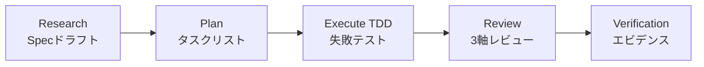
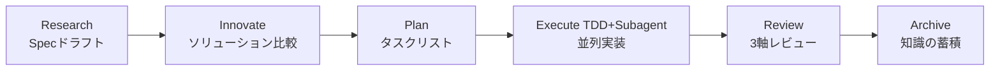

# ALTAS Workflow

> **3つの利点の融合 | インテリジェント深度適応 | 段階的開示 | ステップバイステップのフィードバック**

**バージョン:** 4.0 (2026-04-16)  
**リポジトリサイズ:** 8.3M, 169 Markdownファイル, 79参照ドキュメント

---

## 🌐 言語 / Language

[中文](README.md) | [English](README_EN.md) | **日本語** | [Français](README_FR.md) | [Deutsch](README_DE.md)

---

## 🎯 これは何？

**ALTAS Workflow**は、**SDD-RIPER**、**SDD-RIPER-Optimized (Checkpoint-Driven)**、**Superpowers**という3つの優秀なワークフローのエッセンスを統合した包括的なAIネイティブ開発ワークフロー仕様です。

### コアミッション

AIプログラミングにおける4つの主要なエンジニアリングの課題を解決することに専念：

| 課題 | ALTASの解決策 |
|------|-----------|
| **コンテキストの劣化** | CodeMapインデックス + 段階的開示、必要に応じて参照資料をロード |
| **レビューの麻痺** | 4レベルのインテリジェント深度 (XS/S/M/L)、小さなタスクは承認で詰まらない |
| **コードへの不信** | Spec中心主義 + 3軸レビュー、Spec is Truth |
| **保守の困難さ** | Archive知識の蓄積 + TDD鉄則、完了は資産 |

### コア鉄則

1. **No Spec, No Code** — 最小Specが形成される前にコードを書かない (Size XSは免除)
2. **No Approval, No Execute** — Planフェーズで人間が頷かない限り、絶対にコードを書かない
3. **Spec is Truth** — Specとコードが競合する場合、コードが間違っている
4. **Reverse Sync** — 実行中に偏差を発見 → まずSpecを更新 → その後コードを修正
5. **Evidence First** — 完了は検証結果によって証明、モデルの自己宣言ではない
6. **No Root Cause, No Fix** — バグ修正前に根本原因分析が必要、盲目的な修正は禁止
7. **TDD Iron Law** — Size M/L: 失敗したテストなしで本番コードを書かない
8. **Resume Ready** — 長いタスクの一時停止前にSpecに回復アンカーを残す

---

## 📦 何が含まれていますか？

### リポジトリ構造の概要

```
altas/
├── altas-workflow/              # メインプロトコルディレクトリ (8.3M, 92ファイル)
│   ├── SKILL.md                 # ⭐ コアシステムプロンプト (AIが読む)
│   ├── README.md                # ALTAS詳細説明
│   ├── QUICKSTART.md            # シナリオベースのクイックガイド
│   ├── reference-index.md       # 参照資料マスターインデックス
│   ├── protocols/               # 専用プロトコル (3)
│   │   ├── RIPER-5.md           # 厳格モードプロトコル
│   │   ├── RIPER-DOC.md         # ドキュメントエキスパートプロトコル
│   │   └── SDD-RIPER-DUAL-COOP.md # デュアルモデル協力プロトコル
│   ├── docs/                    # 方法論ドキュメント (4)
│   │   ├── 从传统编程转向大模型编程.md
│   │   ├── AI-原生研发范式.md
│   │   ├── 团队落地指南.md
│   │   └── 手把手教程.md
│   ├── references/              # オンデマンド参照資料 (79ファイル)
│   │   ├── spec-driven-development/  # Spec駆動開発 (7コアドキュメント)
│   │   ├── checkpoint-driven/        # Checkpoint軽量モード (4ドキュメント)
│   │   ├── superpowers/              # スーパーパワー (37ドキュメント)
│   │   │   ├── test-driven-development/  # TDD鉄則
│   │   │   ├── systematic-debugging/     # システム的デバッグ
│   │   │   ├── subagent-driven-development/ # Subagent駆動
│   │   │   ├── brainstorming/            # デザインブレインストーミング
│   │   │   ├── writing-plans/            # Plan作成のベストプラクティス
│   │   │   └── ... (より多くのスーパーパワー)
│   │   ├── agents/                       # Agent定義 (22ドキュメント)
│   │   │   ├── sdd-riper-one/            # 標準Agent
│   │   │   └── sdd-riper-one-light/      # 軽量Agent
│   │   ├── entry/                        # エントリ設定 (4ドキュメント)
│   │   └── special-modes/                # 特殊モード (5ドキュメント)
│   └── scripts/                 # 自動化ツール
│       └── archive_builder.py   # Archiveビルダー
├── .qoder/repowiki/             # Wikiドキュメント (69ドキュメント)
├── AGENTS.md                    # 一般AI行動ガイドライン
├── CLAUDE.md                    # 一般AI行動ガイドライン
└── EXAMPLES.md                  # 4つの原則コード例
```

### コア資産統計

| カテゴリ | 数 | 説明 |
|------|------|------|
| **コアプロトコル** | 1 | SKILL.md (ALTAS Workflowメインプロトコル) |
| **専用プロトコル** | 3 | RIPER-5 / RIPER-DOC / DUAL-COOP |
| **方法論** | 4 | 従来からLLMへ / AIネイティブパラダイム / チーム導入 / ステップバイステップチュートリアル |
| **参照資料** | 79 | Spec駆動 (7) / Checkpoint (4) / Superpowers (37) / Agents (22) / Entry (4) / Special-Modes (5) |
| **独立Agent** | 2 | SDD-RIPER-ONE (標準/軽量) |
| **コード例** | 1 | EXAMPLES.md (4つの原則実践例) |
| **自動化ツール** | 1 | archive_builder.py (Archiveビルダー) |

---

## 🚀 どのように素早く使用しますか？

### 30秒インストール

**方法1**: `altas-workflow/SKILL.md`の内容をAIアシスタントのCustom Instructionsにコピー

**方法2**: Cursor/Traeで実行：
```bash
cp altas-workflow/SKILL.md .cursorrules
```

**方法3**: プロジェクト設定
```bash
mkdir -p mydocs/{codemap,context,specs,micro_specs,archive}
```

### プラットフォーム適応

| プラットフォーム | インストール方法 |
|------|----------|
| **Cursor / Trae** | `SKILL.md`の内容を`.cursorrules`またはグローバルAI Rulesにコピー |
| **Claude / OpenAI Agent** | `SKILL.md`の内容をSystem Promptとして注入 |
| **Qoder** | `SKILL.md`をプロジェクトの`.qoder/skills/`ディレクトリに配置 |

---

### 即座に使用

**極速修正 (Size XS)**:
```
>> src/config.tsのMAX_RETRIESを3から5に変更
```

**小さなタスク (Size S)**:
```
FAST: ログインインターフェースに画像認証コードを追加
```

**標準開発 (Size M)**:
```
sdd_bootstrap: task=ユーザー登録インターフェースにスクレイピング防止機能を追加, goal=セキュリティ向上
```

**アーキテクチャリファクタリング (Size L)**:
```
DEEP: 認証モジュールをリファクタリングして独立したマイクロサービスに分割
```

**バグ調査**:
```
DEBUG: log_path=./logs/error.log, issue=承認後に認可が取得できない
```

**マルチプロジェクト協力**:
```
MULTI: task=フロントエンド・バックエンド連携機能リリース
```

---

## 📚 コアコマンド

### コマンド概要

| コマンド | 用途 | 適用サイズ | ワークフロー影響 |
|------|------|----------|----------|
| `>>` / `FAST` | 高速トラック、Research/Planをスキップ | XS/S | 直接実行→検証→要約 |
| `sdd_bootstrap` | RIPERワークフロー開始 | M/L | Research→Plan→Execute→Review |
| `create_codemap` | コードマップ生成 | M/L | 読み取り専用分析、コード変更なし |
| `MAP` / `PROJECT MAP` | 読み取り専用プロジェクト分析 | すべて | アーキテクチャマップ生成 |
| `DEBUG` | システムデバッグモード | - | 根本原因分析→診断レポート |
| `MULTI` | マルチプロジェクト協力 | L | 自動発見 + スコープ分離 |
| `ARCHIVE` | 知識の蓄積 | L | 人間版 + LLM版デュアルパースペクティブ |
| `DOC` | ドキュメントエキスパートモード | - | ABSORB→OUTLINE→AUTHOR→FACT-CHECK |
| `REVIEW SPEC` | 実行前レビュー | M/L | 提言的プレビュー |
| `REVIEW EXECUTE` | 実行後3軸レビュー | M/L | Spec/コード/品質3軸レビュー |

### トリガーワードクイックリファレンス

| トリガーワード | アクション | サイズ |
|--------|------|------|
| `FAST` / `快速` / `>>` | 極速トラック | XS/S |
| `DEEP` | 深度モード | L |
| `MAP` / `链路梳理` | 機能レベルCodeMap | - |
| `PROJECT MAP` / `项目总图` | プロジェクトレベルCodeMap | - |
| `MULTI` / `多项目` | マルチプロジェクトモード | L |
| `CROSS` / `跨项目` | クロスプロジェクト変更を許可 | L |
| `DEBUG` / `排查` | システム的デバッグ | - |
| `REVIEW SPEC` / `计划评审` | 実行前提言的レビュー | M/L |
| `REVIEW EXECUTE` / `代码评审` | 実行後3軸レビュー | M/L |
| `ARCHIVE` / `归档` / `沉淀` | 知識の蓄積 | L |
| `DOC` / `写文档` | ドキュメントエキスパートモード | - |
| `EXIT ALTAS` / `退出协议` | プロトコル無効化 | - |
| `全部` / `all` / `execute all` | バッチ実行 | M/L |

---

## 🏗️ ワークフローステージ

### Size M (標準) ワークフロー



**ワークフロー説明**:
- **Research**: リサーチ調整、Specを形成 (Goal, In-Scope, Out-of-Scope, Facts, Risks, Open Questions)
- **Plan**: 詳細計画、原子Checklistに分解、File Changes + Signatures + Done Contractを明確化
- **Execute**: TDD駆動実装 (RED→GREEN→REFACTOR)
- **Review**: 3軸レビュー (Spec品質 / Spec-コード一貫性 / コード内在品質)
- **Verification**: 検証エビデンス、テストが通ることを確認

### Size L (深度) ワークフロー



**ワークフロー説明**:
- **Research**: 深度リサーチ、現状リンクを整理、リスクを特定
- **Innovate**: ソリューション比較、2-3のソリューションを提供 (Pros/Cons/Risks/Effort)
- **Plan**: 原子Checklist + Subagent割り当て
- **Execute**: TDD駆動 + Subagent並列実装 + 2段階Review
- **Review**: 3軸レビュー + Archive蓄積
- **Archive**: デュアルパースペクティブドキュメント生成 (人間版 + LLM版)

---

## ⚡ インテリジェント深度適応

### 4レベルタスク深度

| サイズ | トリガー条件 | Spec要件 | ワークフロー | 典型的シナリオ |
|------|----------|----------|--------|----------|
| **XS (極速)** | typo、設定値、<10行 | スキップ、事後に1行要約 | 直接実行→検証→要約 | 設定変更、typo修正、ログ |
| **S (高速)** | 1-2ファイル、ロジック明確 | micro-spec (1-3文) | micro-spec→承認→実行→書き戻し | パラメータ追加、単純機能 |
| **M (標準)** | 3-10ファイル、モジュール内 | 軽量Spec永続化 | Research→Plan→Execute(TDD)→Review | 新規インターフェース、モジュールリファクタ |
| **L (深度)** | クロスモジュール、>500行、アーキテクチャレベル | 完全Spec + Innovate + Archive | Research→Innovate→Plan→Execute→Subagent→Review→Archive | アーキテクチャ分割、クロスチーム変革 |

### サイズ評価クイックリファレンステーブル

| シグナル | 推奨サイズ | 説明 |
|------|----------|------|
| "typoを修正" | XS | 純粋な機械的変更 |
| "設定項目を追加" | XS | アーキテクチャへの影響なし |
| "ボタンテキストを変更" | XS/S | 境界シナリオ |
| "このインターフェースにパラメータを追加" | S | 単一ファイル小変更 |
| "この関数にエラーハンドリングを追加" | S | ロジック明確 |
| "新しいCRUDインターフェースを追加" | M | モジュール内開発 |
| "このモジュールをリファクタリング" | M/L | 境界シナリオ |
| "クロスモジュールデータモデル変更" | L | クロスモジュール影響 |
| "アーキテクチャレベルのリファクタリング" | L | グローバル影響 |
| "フロントエンド・バックエンド連携" | L (MULTI) | マルチプロジェクト協力 |

### 自動アップグレード/ダウングレード

- **実行中に期待を超える複雑さを発見** → AIが即座に一時停止、アップグレードを提案
- **ユーザーはいつでも** `[Upgrade to M]` / `[Downgrade to S]` で調整可能
- **強制指定**: `>>`=XS, `FAST`=S, デフォルト=M, `DEEP`=L

---

## 🛡️ 品質鉄則

| # | 鉄則 | 意味 |
|---|------|------|
| 1 | **No Spec, No Code** | 最小Specが形成される前にコードを書かない (Size XSは免除) |
| 2 | **No Approval, No Execute** | Planフェーズで人間が頷かない限り、絶対にコードを書かない |
| 3 | **Spec is Truth** | Specとコードが競合する場合、コードが間違っている |
| 4 | **Reverse Sync** | 実行中に偏差を発見 → まずSpecを更新 → その後コードを修正 |
| 5 | **Evidence First** | 完了は検証結果によって証明、モデルの自己宣言ではない |
| 6 | **No Root Cause, No Fix** | バグ修正前に根本原因分析が必要、盲目的な修正は禁止 |
| 7 | **TDD Iron Law** | Size M/L: 失敗したテストなしで本番コードを書かない |
| 8 | **Resume Ready** | 長いタスクの一時停止前にSpecに回復アンカーを残す |

---

## 🎯 進捗可視化システム

### チェックポイントメカニズム

**各ステップ完了後**、AIは標準化されたチェックポイントを出力する必要があります：

```markdown
### 進捗 [Phase ▸ Step]
[完了] ▸ **[現在]** ▸ [次] ▸ [続く...]

### 現在の成果
- 何が完了したか (具体的な出力)

### 期待される出力
- 次に何が生成されるか

### 次のアクション
- **[Continue/Approved]**: 同意、次のステップへ
- **[Modify]** + フィードバック: 現在の成果を調整
- **[Upgrade to X]** / **[Downgrade to X]**: サイズを調整
- **[Load Reference: XXX]**: 参照ドキュメントの詳細を表示
```

### チェックポイント例

**Research完了後**:
```markdown
### 進捗 [Research ▸ Complete]
[ ] ▸ **[Research]** ▸ [Plan] ▸ [Execute] ▸ [Review]

### 現在の成果
- 現状分析完了、3つのコアファイルを特定
- 既存の登録インターフェースに画像ライブラリ依存がないことを発見
- Specドラフト確立 (Goal/Scope/Facts/Risks)

### 期待される出力
- Planフェーズで原子Checklistに分解
- 各ファイルの具体的な変更とシグネチャを明確化

### 次のアクション
- **[Continue]**: Planフェーズに入る
- **[Modify]**: Specのリスク項目を調整
- **[Load Reference: spec-template.md]**: Specテンプレート詳細を表示
```

**Plan完了後**:
```markdown
### 進捗 [Plan ▸ Complete]
[Research] ▸ **[Plan]** ▸ [Execute] ▸ [Review]

### 現在の成果
- Checklistを5つの原子タスクに分解
- 3つのファイル変更 + 関数シグネチャを明確化
- Done Contract定義済み

### 期待される出力
- ExecuteフェーズでChecklistに従って項目ごとに実装
- TDD駆動: 最初に失敗テストを書く → ロジックを実装 → 検証通過

### 次のアクション
- **[Approved]**: Planを承認、Executeに入る
- **[Modify]**: Checklist順序または実装アプローチを調整
- **[Upgrade to L]**: Subagent並列実装が必要
```

---

## 📖 詳細ドキュメント

### コアドキュメント (必読)

| ドキュメント | 用途 | 長さ |
|------|------|------|
| [ALTAS Workflow詳細説明](altas-workflow/README.md) | 完全ワークフロープロトコル | 650+行 |
| [クイックスタートガイド](altas-workflow/QUICKSTART.md) | 30秒オンボーディング | 170+行 |
| [参照資料マスターインデックス](altas-workflow/reference-index.md) | オンデマンドロードマップ | 200+行 |
| [SKILL.md](altas-workflow/SKILL.md) | AIシステムプロンプト | 650+行 |

### 方法論ドキュメント (理論)

| ドキュメント | トピック | 対象読者 |
|------|------|----------|
| [従来のプログラミングからLLMプログラミングへ](altas-workflow/docs/从传统编程转向大模型编程.md) | パラダイムシフト | すべて |
| [AIネイティブ開発パラダイム](altas-workflow/docs/AI-原生研发范式 - 从代码中心到文档驱动的演进.md) | ドキュメント駆動 | アーキテクト/Tech Lead |
| [チーム導入ガイド](altas-workflow/docs/团队落地指南.md) | チーム推進 | Tech Lead/Manager |
| [ステップバイステップチュートリアル](altas-workflow/docs/如何快速从零开始落地大模型编程%20--%20手把手教程.md) | ゼロから始める | 初心者 |

### 専用プロトコル (特殊シナリオ)

| プロトコル | 用途 | トリガー方法 |
|------|------|----------|
| [RIPER-5厳格モード](altas-workflow/protocols/RIPER-5.md) | 厳格フェーズゲート | 高リスクプロジェクト |
| [RIPER-DOCドキュメントエキスパート](altas-workflow/protocols/RIPER-DOC.md) | ドキュメント作成 | `DOC`コマンド |
| [デュアルモデル協力プロトコル](altas-workflow/protocols/SDD-RIPER-DUAL-COOP.md) | マルチモデル協力 | 複雑なアーキテクチャ |

### スキルパッケージ (独立Agent)

| Agent | ポジショニング | 適用シナリオ |
|-------|------|----------|
| [SDD-RIPER-ONE標準](altas-workflow/references/agents/sdd-riper-one/SKILL.md) | 完全RIPERワークフロー | 中規模〜大規模タスク |
| [SDD-RIPER-ONE Light](altas-workflow/references/agents/sdd-riper-one-light/SKILL.md) | Checkpoint駆動 | 高頻度マルチターン/強力モデル |

### スーパーパワー

| 能力 | ドキュメント | 呼び出しタイミング |
|------|------|----------|
| **TDD** | [test-driven-development/SKILL.md](altas-workflow/references/superpowers/test-driven-development/SKILL.md) | Size M/L実行フェーズ |
| **システム的デバッグ** | [systematic-debugging/SKILL.md](altas-workflow/references/superpowers/systematic-debugging/SKILL.md) | DEBUGモード |
| **Subagent駆動** | [subagent-driven-development/SKILL.md](altas-workflow/references/superpowers/subagent-driven-development/SKILL.md) | Size L並列実装 |
| **デザインブレインストーミング** | [brainstorming/SKILL.md](altas-workflow/references/superpowers/brainstorming/SKILL.md) | Innovateフェーズ |
| **Plan作成ベストプラクティス** | [writing-plans/SKILL.md](altas-workflow/references/superpowers/writing-plans/SKILL.md) | Planフェーズ |
| **完了前検証** | [verification-before-completion/SKILL.md](altas-workflow/references/superpowers/verification-before-completion/SKILL.md) | Reviewフェーズ |

---

## 🤝 ソース統合

### 3つのソース概要

| ソース | コアアドバンテージ | 採用内容 |
|------|----------|----------|
| **SDD-RIPER** | Spec中心主義、RIPERステートマシン | Specテンプレート、3軸Review、Multi-Project自動発見、Debug/Archiveプロトコル、CodeMapインデックス |
| **SDD-RIPER-Optimized** | Checkpoint-Driven軽量モード | 4レベルタスク深度 (zero/fast/standard/deep)、Done Contract、Resume Ready、Hot/Warm/Coldコンテキストアセンブリ、micro-spec |
| **Superpowers** | TDD鉄則、システム的デバッグ | TDDアンチパターン、デバッグ4段階法、Subagent駆動 + 2段階Review、並列Agent派遣、検証優先鉄則 |

### ソース貢献統計

| ソース | ドキュメント数 | コアファイル |
|------|--------|----------|
| **SDD-RIPER** | 14+ | spec-template.md, commands.md, multi-project.md, archive-template.md |
| **SDD-RIPER-Optimized** | 6+ | spec-lite-template.md, modules.md, conventions.md |
| **Superpowers** | 24+ | TDD, Debug, Subagent, Brainstorming, Writing-Plans, Verification |

---

## 🎓 典型的使用シナリオ

### シナリオ1: 日常機能反復 (Size M)

**入力**:
```
sdd_bootstrap: task=ユーザー登録インターフェースに画像認証コードスクレイピング防止機能を追加, goal=セキュリティ向上
```

**AI動作**:
1. ✅ 自動サイズ評価 → Size M (標準)
2. ✅ **Research** → 既存の登録インターフェースを読み込み、画像ライブラリ依存がないことを発見 → チェックポイント出力
3. ✅ **Plan** → Checklistをリスト (ライブラリ導入 → インターフェース変更 → テスト追加) → チェックポイント出力、[Approved]を待つ
4. ✅ **Execute** → TDD: 最初に失敗テストを書く → ロジックを実装 → 検証通過
5. ✅ **Review** → 3軸レビュー → 通過確認

**出力**:
- Specドキュメント: `mydocs/specs/YYYY-MM-DD_hh-mm_UserRegistrationImageVerification.md`
- コード変更: `src/api/auth.ts`, `src/utils/captcha.ts`
- テストファイル: `src/api/auth.test.ts`

---

### シナリオ2: 緊急オンライン設定修正 (Size XS)

**入力**:
```
>> src/config.tsのMAX_RETRIESを3から5に変更
```

**AI動作**:
1. ✅ Size XS (極速)として識別
2. ✅ 直接コードを修正 → 検証実行 → 1行要約

**出力**:
- 1行要約: `MAX_RETRIESを3→5に変更、検証通過`

---

### シナリオ3: アーキテクチャリファクタリング (Size L)

**入力**:
```
DEEP: 認証モジュールをリファクタリングして独立したマイクロサービスに分割
```

**AI動作**:
1. ✅ Size L (深度)として識別
2. ✅ **create_codemap** → 認証モジュールコードインデックス生成
3. ✅ **Research** → 現状リンクを整理、リスクを特定
4. ✅ **Innovate** → 3つのソリューション (サービス化/モジュール化/ゲートウェイ層) 比較を提供
5. ✅ **Plan** → 原子Checklist + Subagent割り当て
6. ✅ **Execute** → TDD駆動 + Subagent並列実装 + 2段階Review
7. ✅ **Review** → 3軸レビュー + Archive蓄積

**出力**:
- CodeMap: `mydocs/codemap/YYYY-MM-DD_hh-mm_AuthenticationModule.md`
- Spec: `mydocs/specs/YYYY-MM-DD_hh-mm_AuthenticationService.md`
- Archive: `mydocs/archive/YYYY-MM-DD_hh-mm_AuthenticationService_{human,llm}.md`

---

### シナリオ4: バグ調査

**入力**:
```
DEBUG: log_path=./logs/error.log, issue=承認後に認可が取得できない
```

**AI動作**:
1. ✅ デバッグモードに入る (読み取り専用分析)
2. ✅ ログ + Spec + CodeMapを読み込み → 三角測位
3. ✅ 出力: 症状 / 期待される動作 / 根本原因候補 / 推奨修正
4. ✅ 修正が必要な場合 → RIPERワークフローまたはFASTに入る

**出力**:
- 構造化診断レポート: 症状 / 期待される動作 / 根本原因候補 (3) / 推奨修正

---

### シナリオ5: マルチプロジェクト協力

**入力**:
```
MULTI: task=フロントエンド・バックエンド連携機能リリース
```

**AI動作**:
1. ✅ 自動スキャンworkdir → web-console + api-serviceを発見
2. ✅ プロジェクトレジストリを出力して確認
3. ✅ デュアルプロジェクトcodemap生成
4. ✅ プロジェクト別にグループ化されたPlan: api-service(Provider)→web-console(Consumer)
5. ✅ 依存順序で実行、Contract Interfacesを記録

**出力**:
- プロジェクトレジストリ: 識別されたサブプロジェクトリスト
- Contract Interfaces: APIインターフェース契約ドキュメント
- Touched Projects: 変更されたプロジェクトリスト

---

## 📊 サイズ評価クイックリファレンス

| シグナル | 推奨サイズ |
|------|----------|
| "typoを修正" | XS |
| "設定項目を追加" | XS |
| "ボタンテキストを変更" | XS/S |
| "このインターフェースにパラメータを追加" | S |
| "この関数にエラーハンドリングを追加" | S |
| "新しいCRUDインターフェースを追加" | M |
| "このモジュールをリファクタリング" | M/L |
| "クロスモジュールデータモデル変更" | L |
| "アーキテクチャレベルのリファクタリング" | L |
| "フロントエンド・バックエンド連携" | L (MULTI) |

---

## 🔧 FAQ

### ワークフロー制御

**Q: AIが一度に多くのコードを出力し、すべてのステップを実行してしまう、どうすればいい？**

A: ALTASには組み込みのチェックポイントメカニズムがあり、AIは1つのステップを完了した後、確認を待つために**必ず**一時停止する必要があります。AIが暴走した場合、"Please stop, strictly execute checkpoint mechanism, advance one step at a time."と返信してください。

**Q: AIの計画に途中で介入するにはどうすればいい？**

A: 任意のチェックポイントで`[Modify] Please don't use Redis, use memory cache instead`と返信すると、AIはフィードバックに基づいてPlanを調整し、再度Approveを要求します。

**Q: XS/S/M/Lをどのように選択するか？**

A: ALTASが自動評価します。強制指定も可能: `>>`=XS, `FAST`=S, デフォルト=M, `DEEP`=L。実行中はいつでも`[Upgrade to M]`または`[Downgrade to S]`で調整可能。

---

### TDD

**Q: なぜAIは常に最初にテストを書くのか？遅すぎる。**

A: これはEvidence First + TDD鉄則です。失敗したテストがないと、AIが生成したコードが実行されていない可能性があります。タスクが最小限の場合、`>>`を使用してXSモードをトリガーし、TDDをスキップできます。

**Q: TDDをスキップできるのはいつ？**

A: Size XS/S (typo、設定、単一ファイル小変更) はTDDを免除できます。Size M/LはTDD鉄則に従う必要があります。

---

### ドキュメント管理

**Q: mydocs/の下に多くのmdファイルがあるが、Gitにコミットすべきか？**

A: **強くコミットを推奨**。SpecとArchiveはプロジェクトの唯一の真実のソースであり、コンテキストの劣化を防ぎ、新規参加者のオンボーディングを支援します。

**Q: mydocs/の下のファイルをどのように管理するか？**

A: 統一された時間プレフィックス`YYYY-MM-DD_hh-mm_`を使用し、古いファイルを定期的にアーカイブ。Archiveスクリプトは人間/LLMデュアルパースペクティブドキュメントを自動生成できます。

---

### 参照資料

**Q: 参照資料 (references/) が多すぎるが、AIは毎回すべてを読む必要があるか？**

A: **不要**。ALTASは段階的開示を使用し、シナリオにヒットした場合にのみ対応するファイルをオンデマンドで読み込みます。SKILL.mdの参照インデックステーブルは各ファイルの呼び出しタイミングを明確にしています。

**Q: 参照資料をオンデマンドでロードするには？**

A: [reference-index.md](altas-workflow/reference-index.md)を表示、各ファイルに呼び出しタイミングがマークされています。例：
- Specを作成する場合 → `spec-template.md`を読む
- TDDを実行する場合 → `test-driven-development/SKILL.md`を読む
- デバッグする場合 → `systematic-debugging/SKILL.md`を読む

---

### チーム協力

**Q: マルチパーソンチームでどのように協力するか？**

A: Specはチームの共有真実のソースです。各人が自分のSpecファイルを作成し、Gitを通じて協力します。コア開発者はPlanをレビューするだけで、すべてのコードをレビューする必要はありません。

**Q: ALTASに適したモデルは？**

A: すべてのモデルが標準モード (M/L) を使用できます。軽量モード (S/XS) は強力なモデル (Claude Opus/GPT-4+) の高頻度マルチターンシナリオに特に適しています。新しいチームは標準モードから始めることを推奨します。

**Q: チームメンバーをどのようにトレーニングするか？**

A: 最初に[従来のプログラミングからLLMプログラミングへ](altas-workflow/docs/从传统编程转向大模型编程.md)を読み、その後[ステップバイステップチュートリアル](altas-workflow/docs/如何快速从零开始落地大模型编程%20--%20手把手教程.md)を実践してください。

---

## 📋 バージョン履歴

| バージョン | 日付 | 名前 | ステータス | 主要変更 |
|------|------|------|------|----------|
| **v4.0** | 2026-04-13 | ALTAS Workflow | ✅ 現在のバージョン | 3つのワークフローを統合、インテリジェント深度適応、進捗可視化、オンデマンドロードを追加 |
| **v1.0** | 2026-04-12 | SIGMA Workflow | ❌ 廃止 | 初期バージョン |

### v4.0コア機能

- ✅ **インテリジェント深度適応**: 4レベルタスク深度 (XS/S/M/L)、自動評価 + 手動アップグレード/ダウングレード
- ✅ **進捗可視化**: 標準化されたチェックポイントメカニズム、各ステップ完了後に確認のために一時停止
- ✅ **段階的開示**: 参照資料のオンデマンドロード、コンテキスト汚染を回避
- ✅ **コア鉄則**: 8つの交渉不可能な鉄則 (No Spec No Code, TDD Iron Lawなど)
- ✅ **完全なドキュメント**: 70+参照資料、Spec駆動/Checkpoint/Superpowersの3カテゴリをカバー
- ✅ **独立Agent**: SDD-RIPER-ONE標準/軽量バージョン

---

## 📊 リポジトリ統計

```
リポジトリサイズ: 8.3M
Markdownファイル: 169
参照資料: 79
  - Spec-Driven Development: 7
  - Checkpoint-Driven: 4
  - Superpowers: 37
  - Agents: 22
  - Entry: 4
  - Special-Modes: 5
コアプロトコル: 1 (SKILL.md)
専用プロトコル: 3 (RIPER-5/RIPER-DOC/DUAL-COOP)
方法論: 4
独立Agent: 2 (標準/軽量)
自動化ツール: 1 (archive_builder.py)
Wikiドキュメント: 69 (.qoder/repowiki/)
```

---

## 🎯 クイックナビゲーション

### 初心者オンボーディング

1. [クイックスタートガイド](altas-workflow/QUICKSTART.md) - 30秒オンボーディング
2. [従来のプログラミングからLLMプログラミングへ](altas-workflow/docs/从传统编程转向大模型编程.md) - パラダイムシフト
3. [ステップバイステップチュートリアル](altas-workflow/docs/如何快速从零开始落地大模型编程%20--%20手把手教程.md) - ゼロから始める

### クイックリファレンス

- [コアコマンド](#-コアコマンド) - すべてのトリガーワードとコマンド
- [サイズ評価](#-インテリジェント深度適応) - XS/S/M/Lの選び方
- [参照資料インデックス](altas-workflow/reference-index.md) - オンデマンドロードマップ
- [詳細ドキュメント](#-詳細ドキュメント) - 完全なドキュメントリスト

### 高度な使用法

- [RIPER-5厳格モード](altas-workflow/protocols/RIPER-5.md) - 高リスクプロジェクト
- [Subagent駆動開発](altas-workflow/references/superpowers/subagent-driven-development/SKILL.md) - 並列実装
- [システム的デバッグ](altas-workflow/references/superpowers/systematic-debugging/SKILL.md) - 根本原因分析

---

*Powered by the integration of SDD-RIPER, SDD-RIPER-Optimized (Checkpoint-Driven), and Superpowers.*

**最終更新**: 2026-04-16
