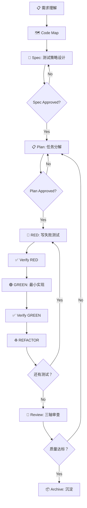

# Test-Dev-Workflow 项目总览

> **版本**: v1.0.0  
> **创建日期**: 2026-04-11  
> **基于**: SDD-RIPER, SDD-RIPER-Optimized, Superpowers  
> **特性**: 全功能整合 + 项目分级处理

---

## 📋 项目简介

**Test-Dev-Workflow** 是一套专为**测试开发工程师**设计的 AI 工作流程规范，**全面整合**三个优秀工作流的所有能力：

### 来自 SDD-RIPER 的能力
- ✅ **RIPER 状态机**：Research → Innovate → Plan → Execute → Review
- ✅ **Spec 驱动开发**：No Spec, No Code
- ✅ **Code Map 协议**：功能级/项目级代码索引
- ✅ **Context Bundle**：需求上下文整理
- ✅ **Archive 协议**：知识沉淀（human/llm 双文档）

### 来自 SDD-RIPER-Optimized 的能力
- ✅ **Checkpoint-driven**：轻量级控制内核
- ✅ **任务深度分级**：zero/fast/standard/deep
- ✅ **阶段感知**：按需加载参考文档，不堆砌上下文

### 来自 Superpowers 的能力
- ✅ **TDD 铁律**：NO PRODUCTION CODE WITHOUT FAILING TEST FIRST
- ✅ **Systematic Debugging**：4 阶段根因分析
- ✅ **Brainstorming**：苏格拉底式需求澄清
- ✅ **Writing Plans**：原子级任务分解
- ✅ **Subagent-Driven Development**：多任务并行 + 两阶段审查
- ✅ **Code Review**：请求/接收代码审查

### 核心创新：项目分级处理

**根据项目规模自动选择合适的工作流深度**：

| 规模 | 触发词 | 适用场景 | 工作流 | 预计时间 |
|------|--------|---------|--------|---------|
| 🟢 **小型** | `FAST` / `快速` / `>>` | 单文件修改、简单 bug 修复 | Fast Flow | < 2 小时 |
| 🟡 **中型** | `standard` / `设计测试` | 2+ 文件、新功能测试 | Standard Flow | 2 小时 -2 天 |
| 🔴 **大型** | `deep` / `大型项目` / `复杂功能` | 跨模块、核心链路建设 | Deep Flow | 2 天 + |

**避免**：小型项目用重流程、浪费时间

### 核心价值

**解决测试开发的 5 大痛点**:

| 🚫 痛点 | ✅ 解法 |
| --- | --- |
| **测试代码质量差** | **Spec 驱动**：先设计测试策略，再写测试代码 |
| **补测试而非驱动** | **TDD 铁律**：NO PRODUCTION CODE WITHOUT FAILING TEST FIRST |
| **覆盖不全** | **Done Contract**：明确定义"完成"的证据和边界 |
| **调试随意** | **Systematic Debugging**：4 阶段根因分析 |
| **测试文档缺失** | **Spec 即文档**：测试策略、场景、数据全部落盘 |

---

## 📁 项目结构

```
altas/
├── test-dev-workflow.md                      # 主文档（完整规范）
└── skills/
    └── test-dev-workflow/                    # 可安装 Skill
        ├── SKILL.md                          # Skill 主定义 ⭐
        ├── README.md                         # Skill 使用说明
        ├── STRUCTURE.md                      # 项目结构说明
        └── references/
            ├── test-spec-template.md         # Spec 模板
            ├── test-plan-template.md         # Plan 模板
            ├── test-review-template.md       # Review 模板
            └── quickref.md                   # 快速参考卡
```

---

## 🚀 快速开始

### 30 秒安装

**Claude Desktop / Claude.ai**:
```bash
cp skills/test-dev-workflow/SKILL.md ~/.claude/custom-instructions.md
```

**Cursor**:
```bash
cp skills/test-dev-workflow/SKILL.md .cursorrules
```

### 验证安装

在对话中输入：
```text
MAP: scope=登录模块
```

如果 AI 开始生成代码地图并保存到 `mydocs/codemap/`，说明安装成功 ✅

### 选择你的场景

根据你的项目规模，选择合适的触发词：

#### 🟢 小型项目/快速改动
```text
FAST: 修复登录接口密码验证的 bug，测试已存在
```

#### 🟡 中型项目/新功能测试
```text
我要为支付功能设计测试方案，使用 standard 流程
```

#### 🔴 大型项目/核心链路建设
```text
我要为电商核心链路（浏览→加购→下单→支付）建设测试体系，请用 deep flow
```

**详细示例**: 查看 [`QUICKSTART.md`](./skills/test-dev-workflow/QUICKSTART.md)

---

## 🔄 工作流总览



---

## 📂 统一输出路径

**所有产出物统一保存到**:

```
mydocs/
├── codemap/                          # 代码地图（被测系统链路）
│   └── YYYY-MM-DD_<项目/功能>-codemap.md
├── context/                          # 测试需求上下文包
│   └── YYYY-MM-DD_<任务>-test-context-bundle.md
├── specs/                            # 测试策略设计 Spec
│   └── YYYY-MM-DD_<功能>-test-spec.md
├── plans/                            # 测试任务分解计划
│   └── YYYY-MM-DD_<功能>-test-plan.md
├── reviews/                          # 审查报告
│   └── YYYY-MM-DD_<功能>-test-review.md
└── archive/                          # 测试资产沉淀
    ├── human/<功能>-test-assets.md   (给人读)
    └── llm/<功能>-test-index.md      (给 LLM 读)
```

---

## 🎯 核心特性

### 1. Spec 驱动测试设计

**No Spec, No Test**

- 先设计测试策略，再写测试代码
- Spec 包含：Goal、Done Contract、Test Scenarios、Mock 策略、数据策略
- Spec 获批后才进入实现

**模板**: [`references/test-spec-template.md`](skills/test-dev-workflow/references/test-spec-template.md)

### 2. TDD 铁律执行

**NO PRODUCTION CODE WITHOUT FAILING TEST FIRST**

```
🔴 RED → ✅ Verify RED → 🟢 GREEN → ✅ Verify GREEN → ♻️ REFACTOR → 重复
```

**违反 TDD 铁律 = 删除代码重来**

### 3. 系统调试

**NO FIXES WITHOUT ROOT CAUSE**

- Phase 1: 根因调查（读错误、复现、查变更、收集证据）
- Phase 2: 模式分析（找 working example、对比差异）
- Phase 3: 假设测试（单一假设、最小验证）
- Phase 4: 实施修复（创建测试、修复、验证）

**3+ 次修复失败 = 质疑架构**

### 4. 三轴审查

**系统性质量审查**

- Axis-1: 需求完成度（测完了吗？）
- Axis-2: Spec-Code 一致性（按 Spec 测的吗？）
- Axis-3: 代码质量（测得好吗？）

**审查不通过 = 返工**

**模板**: [`references/test-review-template.md`](skills/test-dev-workflow/references/test-review-template.md)

### 5. 测试资产沉淀

**将测试实现过程沉淀为可复用资产**

- 人类报告：测试策略、Mock 决策、数据权衡
- LLM 上下文：测试场景索引、测试命令、调试技巧

---

## 📊 预期效果

### 效率提升

| 指标 | 传统方式 | 使用本规范 | 提升 |
|------|---------|-----------|------|
| 测试设计时间 | 2-3 小时 | 30 分钟 | **4-6x** |
| 测试实现时间 | 1-2 天 | 2-4 小时 | **3-4x** |
| 调试时间 | 3-5 小时/bug | 15-30 分钟/bug | **6-10x** |
| 测试返工率 | 30-40% | < 5% | **6-8x** |

### 质量提升

| 指标 | 传统方式 | 使用本规范 |
|------|---------|-----------|
| 测试覆盖率 | 60-70% | **90-95%** |
| Flaky test 比例 | 10-15% | **< 1%** |
| 线上漏测率 | 5-8% | **< 1%** |
| 测试可信度 | "不敢全信" | **"100% 可信"** |

---

## 🛠️ 核心技能

### 必选 Skills

1. **test-driven-development**
   - TDD 流程执行
   - RED-GREEN-REFACTOR 循环

2. **systematic-debugging**
   - 4 阶段根因分析
   - 数据流追踪

### 可选 Skills

1. **brainstorming**
   - 需求澄清
   - 设计探索

2. **writing-plans**
   - 任务分解
   - 原子化 Step

3. **subagent-driven-development**
   - 多任务并行
   - 两阶段审查

---

## 📖 文档导航

### 学习路径

**第一周：理解理念**
- 阅读 [`test-dev-workflow.md`](test-dev-workflow.md) 第 1-3 章
- 理解 Spec 驱动和 TDD 理念
- 安装 Skill

**第二周：掌握流程**
- 练习 Spec 设计（使用 [`test-spec-template.md`](skills/test-dev-workflow/references/test-spec-template.md)）
- 练习任务分解（使用 [`test-plan-template.md`](skills/test-dev-workflow/references/test-plan-template.md)）
- 练习 TDD 循环

**第三周：系统调试**
- 阅读 [`systematic-debugging`](skills/test-dev-workflow/references/test-review-template.md)
- 实践 4 阶段调试流程
- 避免"快速试一下"的陷阱

**第四周：质量审查**
- 练习三轴审查
- 建立审查检查清单
- 培养"零容忍"质量文化

### 快速查询

**命令速查**: [`quickref.md`](skills/test-dev-workflow/references/quickref.md)

| 命令 | 用途 | 输出路径 |
|------|------|---------|
| `MAP` | 生成代码地图 | `mydocs/codemap/` |
| `sdd_bootstrap` | 启动 Spec 设计 | `mydocs/specs/` |
| `write_plan` | 创建测试计划 | `mydocs/plans/` |
| `review` | 三轴审查 | `mydocs/reviews/` |
| `archive` | 归档沉淀 | `mydocs/archive/` |

**触发词速查**: [`quickref.md`](skills/test-dev-workflow/references/quickref.md#触发词速查)

---

## ⚠️ 常见陷阱

### 1. Spec 写得太细或太粗

**太细**（过度设计）:
```markdown
## Test Steps
1. 打开浏览器
2. 输入网址
3. 在用户名框输入...
```

**太粗**（设计不足）:
```markdown
## Test Scenarios
- 测试登录功能
- 测试各种情况
```

**正确粒度**:
```markdown
## Test Scenarios
| ID | 场景 | 前置条件 | 输入 | 预期输出 |
|----|------|---------|------|---------|
| T01 | 正常登录 | 用户已注册 | 正确账号密码 | 返回 JWT |
```

### 2. TDD 流程被跳过

**错误**:
```text
"这个功能很简单，我直接实现，稍后补测试"
```

**正确**:
```text
"再简单的功能也需要 TDD。先写一个失败测试。"
```

### 3. 调试时"试一下这个 fix"

**错误**:
```text
"可能是这里的问题，我改一下试试... 不对，再试试那里..."
```

**正确**:
```text
"停止。回到 Phase 1：根因调查。
1. 错误信息是什么？
2. 能稳定复现吗？
3. 最近改了什么？
..."
```

### 4. 审查流于形式

**错误**:
```text
"看起来没问题，approve 吧"
```

**正确**:
```text
"让我对照 Spec 逐项检查：
- T01 场景：✅ 已覆盖，测试通过
- T02 场景：✅ 已覆盖，测试通过
- T03 场景：❌ 缺失，需要补充
..."
```

---

## 🎓 学习资源

### 核心文档

- [Test-Dev-Workflow 主文档](test-dev-workflow.md)
- [Skill 使用说明](skills/test-dev-workflow/README.md)
- [项目结构说明](skills/test-dev-workflow/STRUCTURE.md)

### 模板文档

- [Spec 模板](skills/test-dev-workflow/references/test-spec-template.md)
- [Plan 模板](skills/test-dev-workflow/references/test-plan-template.md)
- [Review 模板](skills/test-dev-workflow/references/test-review-template.md)

### 快速参考

- [快速参考卡](skills/test-dev-workflow/references/quickref.md)

### 参考资料

- [SDD-RIPER](sdd-riper/protocols/SDD-RIPER-ONE.md)
- [Superpowers TDD](superpowers/skills/test-driven-development/SKILL.md)
- [Superpowers Systematic Debugging](superpowers/skills/systematic-debugging/SKILL.md)

---

## 🔄 版本历史

### v1.0.0 (2026-04-11)

**初始版本**:
- ✅ 主文档：test-dev-workflow.md
- ✅ 可安装 Skill: skills/test-dev-workflow/
- ✅ Spec/Plan/Review 模板
- ✅ 快速参考卡
- ✅ 统一输出路径

**基于**:
- SDD-RIPER (Spec 驱动 + RIPER 状态机)
- SDD-RIPER-Optimized (Checkpoint-driven)
- Superpowers (TDD + Systematic Debugging)

---

## 📝 反馈与改进

欢迎提交 Issue/PR 改进文档和 Skill！

**反馈渠道**:
- GitHub Issues
- 团队内部反馈

**持续改进**:
- 根据实战经验更新模板
- 收集常见问题补充 FAQ
- 优化工作流提升效率

---

## 📄 License

MIT License

---

**总结**: Test-Dev-Workflow 是一套完整的测试开发工作流规范，通过 Spec 驱动、TDD 执行、系统调试和三轴审查，帮助测试开发工程师从"补测试"转向"测试驱动开发"，打造可信赖的质量保障体系。
