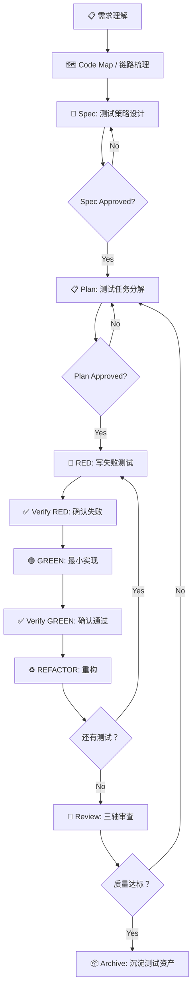

# 测试开发工程师 AI 工作流程规范

> **版本**: v1.0.0  
> **基于**: SDD-RIPER, SDD-RIPER-Optimized, Superpowers  
> **适用**: 测试开发、自动化测试、测试工具开发、质量保障

---

## 📖 核心理念

### 测试开发的特殊挑战

测试开发相比业务开发有独特的痛点：

1. **测试代码质量被低估**："测试代码不需要那么严谨" → 测试代码腐烂 → 测试不可信 → 放弃测试
2. **先实现后补测试** → 测试变成形式，无法真正验证行为
3. **测试覆盖不全** → 漏测导致线上问题 → 对测试失去信心
4. **调试随意** → "快速试一下这个 fix" → 引入新 bug → 恶性循环
5. **测试文档缺失** → 不知道测试在验证什么 → 不敢改测试 → 测试成为负担

### 我们的解决方案

> **Spec (测试设计) + TDD (测试驱动) + Systematic Debugging (系统调试) = 可信赖的测试**

| 🚫 痛点 | ✅ 解法 |
| --- | --- |
| **测试代码质量差** | **Spec 驱动**：先设计测试策略和验收标准，再写测试 |
| **补测试而非驱动** | **Iron Law**: NO PRODUCTION CODE WITHOUT FAILING TEST FIRST |
| **覆盖不全** | **Done Contract**: 明确定义"完成"的证据和边界 |
| **调试随意** | **Systematic Debugging**: 4 阶段根因分析，NO FIXES WITHOUT ROOT CAUSE |
| **测试文档缺失** | **Spec 即文档**：测试策略、场景设计、数据准备全部落盘 |

---

## 🎯 一句话：这个规范解决了什么问题？

**测试开发最大的问题不是"测试工具不够强"，而是"测试设计不够严谨"。**

你一定遇到过：测试写得越多越不敢信，改个功能测试全红却不知道哪真有问题，调试时"试一下这个 fix"结果引入新 bug，测试代码没人敢维护……

**Test-Dev-Workflow** 就是为了解决这些问题而生的——一套**让测试开发围绕 Spec 干活**的工作流程，配套**可一键安装的 Skill**，让你从"补测试"变成"测试驱动开发"。

---

## 🔄 测试开发工作流总览



---

## 📂 核心流程详解

### 0️⃣ Pre-Work: 需求澄清与上下文准备

**目标**: 在开始测试设计前，充分理解被测系统和需求

#### 0.1 需求澄清（Brainstorming）

**触发词**: `"我要开发一个测试功能"`, `"帮我设计测试方案"`, `"测试这个功能"`

**流程**:
1. **探索上下文**: 阅读现有测试、文档、代码结构
2. **提问澄清** (一次一个):
   - 被测功能的核心行为是什么？
   - 哪些场景必须覆盖？哪些可以暂不覆盖？
   - 成功的证据是什么？（日志？断言？性能指标？）
3. **提出 2-3 种测试策略**:
   - 方案 A: 端到端测试（覆盖完整链路，但慢、脆弱）
   - 方案 B: 单元测试 + 集成测试分层（快、稳定，但需要 mock）
   - 方案 C: 基于属性的测试（覆盖边界，但学习曲线陡）
4. **给出推荐方案** 并说明理由
5. **分章节呈现设计**，每章后确认"这样设计合理吗？"

**产出**: `docs/superpowers/specs/YYYY-MM-DD_<功能>-test-design.md`

**示例**:
```text
用户：我要为登录功能设计测试方案

AI: 我先了解一下当前项目的测试结构...
    [阅读现有测试文件、了解测试框架]
    
    在开始设计前，我想确认几个问题：
    1. 登录功能需要覆盖哪些认证方式？（仅账号密码 / 包括手机验证码/第三方登录？）
    
    [用户回答后]
    
    2. 测试重点是什么？（功能正确性 / 安全性 / 性能 / 兼容性？）
    
    [用户回答后]
    
    基于你的回答，我建议 3 种测试策略：
    
    **方案 A: 端到端 UI 测试**
    - 优点：覆盖完整用户旅程，最接近真实场景
    - 缺点：执行慢（~30s/用例），脆弱（UI 变动易失败），维护成本高
    - 适用：核心链路 smoke test
    
    **方案 B: API 层集成测试（推荐）**
    - 优点：执行快（~1s/用例），稳定（不依赖 UI），覆盖业务逻辑
    - 缺点：需要 mock 外部依赖（短信服务/OAuth）
    - 适用：主要功能验证 + 边界条件
    
    **方案 C: 单元测试 + 关键路径集成测试**
    - 优点：最快（~100ms/用例），精确定位，易维护
    - 缺点：需要良好代码结构（依赖注入），初期重构成本
    - 适用：核心算法/复杂逻辑
    
    我的推荐：**方案 B 为主 + 少量方案 A**
    理由：登录功能核心是业务逻辑验证，API 层测试性价比最高；
         保留 2-3 个 E2E 用例验证完整链路即可。
    
    你觉得这个方向对吗？
```

#### 0.2 Code Map: 被测系统链路梳理

**触发词**: `"MAP"`, `"Code Map"`, `"链路梳理"`, `"只看代码"`, `"项目总图"`

**目标**: 生成被测系统的代码索引，避免"瞎子摸象"

**模式选择**:
- `feature` 模式：单个功能/接口/类的测试范围梳理
- `project` 模式：整个项目的测试架构梳理

**产出**: `mydocs/codemap/YYYY-MM-DD_<项目/功能>-codemap.md`

**示例**:
```text
用户：MAP: scope=登录模块，mode=feature

AI: [进入 RESEARCH 模式，LOCKED]
    [扫描登录相关代码，生成 Code Map]
    
    已生成登录功能 Code Map，保存到：
    `mydocs/codemap/2026-04-11_login-feature-codemap.md`
    
    **核心链路**:
    ```
    用户输入 → LoginController.login() 
             → AuthService.authenticate()
             → UserRepository.findByUsername()
             → PasswordEncoder.matches()
             → TokenService.generate()
             → 返回 JWT
    ```
    
    **关键依赖**:
    - 数据库：users 表
    - 外部服务：短信服务（SMSProvider）
    - 配置：JWT_SECRET, TOKEN_EXPIRY
    
    **现有测试**:
    - `tests/LoginControllerTest.php`: 5 个用例（覆盖正常流程）
    - `tests/AuthServiceTest.php`: 12 个用例（覆盖边界条件）
    - 缺失：并发登录、token 刷新、密码策略
    
    是否需要继续进入 Spec 设计阶段？
```

#### 0.3 Context Bundle: 测试需求汇总

**触发词**: `"build_context_bundle"`, `"整理需求"`, `"读取这个目录"`

**目标**: 将散落的测试需求整理为结构化上下文

**产出**: `mydocs/context/YYYY-MM-DD_<任务>_test-context-bundle.md`

**内容**:
- 需求来源（PRD/用户反馈/bug 报告）
- 业务规则（登录失败 5 次锁定 30 分钟）
- 技术约束（必须兼容旧版 token 格式）
- 已知风险（短信服务有速率限制）
- 待确认项（[ ] 是否需要支持多设备登录？）

---

### 1️⃣ Spec: 测试策略设计（LOCKED）

**目标**: 定义测试策略、场景、数据、验收标准

**核心原则**: **No Spec, No Test**

#### Spec 模板（测试开发专用）

```markdown
# Spec: <功能> 测试设计

## 1. Goal
- **被测功能**: [一句话描述]
- **测试目标**: [验证功能正确性 / 发现边界问题 / 性能基准 / 回归防护]
- **验收结果**: [测试通过率 100% / 覆盖 X 个场景 / 性能 < Y ms]

## 2. Done Contract
- **完成定义**:
  - [ ] 所有计划场景已覆盖
  - [ ] 测试通过率 100%
  - [ ] 无 flaky test（连续运行 10 次通过率 100%）
  - [ ] 测试执行时间 < X 分钟
- **证明来源**:
  - CI 报告链接
  - 覆盖率报告（目标：行覆盖 X%，分支覆盖 Y%）
  - 性能基准报告
- **未完成场景**:
  - [明确列出暂不覆盖的场景及原因]

## 3. Scope
- **In Scope** (必须覆盖):
  - 正常场景：[描述]
  - 边界场景：[描述]
  - 异常场景：[描述]
- **Out Scope** (暂不覆盖):
  - [明确排除的场景，如：性能测试、安全测试、兼容性测试]

## 4. Test Strategy
- **测试分层**:
  - 单元测试：[哪些组件需要单元测试]
  - 集成测试：[哪些接口需要集成测试]
  - E2E 测试：[哪些链路需要 E2E 测试]
- **Mock 策略**:
  - 需要 mock 的外部依赖：[列表 + mock 理由]
  - 不 mock 的真实依赖：[列表 + 理由]
- **数据策略**:
  - 测试数据来源：[固定 fixture / 随机生成 / 生产数据脱敏]
  - 数据清理策略：[每个用例独立清理 / 全局清理]

## 5. Test Scenarios
| ID | 场景名称 | 前置条件 | 输入 | 预期输出 | 优先级 |
|----|---------|---------|------|---------|--------|
| T01 | 正常登录 | 用户已注册 | 正确账号密码 | 返回 JWT token | P0 |
| T02 | 密码错误 | 用户已注册 | 错误密码 | 返回"密码错误" | P0 |
| T03 | 账户锁定 | 连续失败 5 次 | 任意密码 | 返回"账户已锁定" | P1 |
| ... | ... | ... | ... | ... | ... |

## 6. Test Data
- **固定数据**:
  ```json
  {
    "valid_user": {"username": "test_user", "password": "hashed_pwd"},
    "locked_user": {"username": "locked_user", "lock_until": "2026-04-11T12:00:00Z"}
  }
  ```
- **生成规则**:
  - 随机用户名：`test_user_{random}`
  - 随机密码：使用 bcrypt 生成

## 7. Constraints & Risks
- **技术约束**:
  - 必须兼容旧版 token 格式（v1）
  - 测试执行不能超过短信服务速率限制（10 次/分钟）
- **已知风险**:
  - 并发测试可能有竞态条件（已加锁）
  - 依赖外部服务（已 mock）

## 8. Open Questions
- [ ] 是否需要测试密码复杂度策略？
- [ ] 是否需要覆盖第三方登录失败场景？

## 9. Checkpoint Summary
- **任务理解**: 为登录功能设计全面的测试方案
- **核心目标**: 覆盖所有核心场景，确保测试稳定可信
- **当前进度**: Spec 设计完成，待审批
- **下一步**: 
  1. 用户审批 Spec
  2. 分解测试任务
  3. 按 TDD 流程执行
- **涉及文件**: `tests/LoginTest.php`, `tests/AuthServiceTest.php`
- **风险**: 短信服务 mock 不完整可能导致集成测试失败
- **验证方式**: CI 通过率、覆盖率报告
- **Execution Approval**: `Pending`

## 10. Change Log
- 2026-04-11: 初始版本，覆盖登录核心场景

## 11. Validation
- **Self-check**: Spec 是否覆盖了所有已知场景？
- **Static checks**: 测试代码是否符合项目规范？
- **Runtime / Test**: 
  - [ ] 所有测试通过
  - [ ] 无 flaky test（10 次运行 100% 通过）
  - [ ] 执行时间达标
- **Human confirmation**: [用户确认]
- **结果汇总**: [待填写]
- **核心目标是否完成**: [待填写]
- **剩余风险**: [待填写]
```

#### Spec 设计要点

1. **Done Contract 必须可验证**:
   - ❌ "测试覆盖所有场景"
   - ✅ "测试覆盖表 5 所列 20 个场景，CI 通过率 100%"

2. **场景设计要分层**:
   - 正常场景（Happy Path）：验证功能正常工作
   - 边界场景（Edge Cases）：验证边界条件
   - 异常场景（Error Cases）：验证错误处理

3. **Mock 策略要明确**:
   - 哪些依赖必须 mock（外部服务、数据库、文件系统）
   - 哪些依赖不 mock（被测组件的直接依赖）
   - mock 的粒度（完整 mock / 部分 mock / spy）

4. **数据策略要清晰**:
   - 测试数据从哪来（fixture / factory / 生产脱敏）
   - 数据如何清理（每用例清理 / 全局清理 / 事务回滚）
   - 如何避免数据依赖（用例独立性）

---

### 2️⃣ Plan: 测试任务分解（LOCKED）

**目标**: 将 Spec 分解为可执行的测试任务

**核心原则**: **No Approval, No Execute**

#### Plan 模板（测试开发专用）

```markdown
# <功能> 测试实现计划

> **For agentic workers**: REQUIRED SUB-SKILL: Use superpowers:subagent-driven-development

**Goal**: 实现 Spec 定义的所有测试场景

**Architecture**: 分层测试（单元 + 集成），Mock 外部依赖

**Tech Stack**: PHPUnit, Mockery, MySQL (test instance)

---

## 文件结构

**新建**:
- `tests/Unit/AuthServiceTest.php`: 认证逻辑单元测试
- `tests/Integration/LoginControllerTest.php`: 登录接口集成测试
- `tests/Fixtures/LoginFixtures.php`: 测试数据工厂

**修改**:
- `phpunit.xml`: 添加测试组配置
- `tests/TestCase.php`: 添加全局清理逻辑

---

## Task 1: 测试基础设施准备

**Files**:
- Create: `tests/Fixtures/LoginFixtures.php`
- Modify: `tests/TestCase.php`

- [ ] **Step 1: 编写测试数据工厂**

```php
class LoginFixtures
{
    public static function createValidUser(): array
    {
        return [
            'username' => 'test_user_' . uniqid(),
            'password' => password_hash('valid_password', PASSWORD_BCRYPT),
            'email' => 'test@example.com'
        ];
    }
    
    public static function createLockedUser(): array
    {
        return [
            'username' => 'locked_user_' . uniqid(),
            'password' => password_hash('password', PASSWORD_BCRYPT),
            'locked_until' => date('Y-m-d H:i:s', strtotime('+30 minutes'))
        ];
    }
}
```

- [ ] **Step 2: 运行测试验证工厂可用**

```bash
php artisan tinker --execute="var_dump(LoginFixtures::createValidUser())"
```
Expected: 输出有效用户数据

- [ ] **Step 3: 添加全局清理逻辑**

```php
protected function tearDown(): void
{
    // 清理测试用户
    DB::table('users')->where('username', 'like', 'test_user_%')->delete();
    parent::tearDown();
}
```

- [ ] **Step 4: 运行现有测试确保清理逻辑不破坏其他测试**

```bash
phpunit --testsuite=Unit
```
Expected: 所有现有测试通过

- [ ] **Step 5: Commit**

```bash
git add tests/Fixtures/LoginFixtures.php tests/TestCase.php
git commit -m "test: 添加登录测试基础设施"
```

---

## Task 2: 正常登录场景测试

**Files**:
- Create: `tests/Integration/LoginControllerTest.php`

- [ ] **Step 1: 编写正常登录的失败测试**

```php
public function test_login_with_valid_credentials_returns_token()
{
    // Arrange
    $userData = LoginFixtures::createValidUser();
    User::create($userData);
    
    // Act
    $response = $this->postJson('/api/login', [
        'username' => $userData['username'],
        'password' => 'valid_password'
    ]);
    
    // Assert
    $response->assertStatus(200)
             ->assertJsonStructure(['token', 'expires_in']);
}
```

- [ ] **Step 2: 运行测试确认失败**

```bash
phpunit tests/Integration/LoginControllerTest.php::test_login_with_valid_credentials_returns_token
```
Expected: FAIL with "Route [/api/login] not defined" or similar

- [ ] **Step 3: 实现登录接口（最小实现）**

```php
// routes/api.php
Route::post('/login', [LoginController::class, 'login']);

// LoginController.php
public function login(Request $request)
{
    $credentials = $request->only('username', 'password');
    
    if (!Auth::attempt($credentials)) {
        return response()->json(['error' => 'Invalid credentials'], 401);
    }
    
    $token = Auth::user()->createToken('login-token');
    
    return response()->json([
        'token' => $token->plainTextToken,
        'expires_in' => config('auth.token_expiry')
    ]);
}
```

- [ ] **Step 4: 运行测试确认通过**

```bash
phpunit tests/Integration/LoginControllerTest.php::test_login_with_valid_credentials_returns_token
```
Expected: PASS

- [ ] **Step 5: Commit**

```bash
git add routes/api.php app/Http/Controllers/LoginController.php tests/Integration/LoginControllerTest.php
git commit -m "feat: 实现正常登录功能 + 测试"
```

---

## Task 3: 异常场景测试（密码错误）

**Files**:
- Modify: `tests/Integration/LoginControllerTest.php`

- [ ] **Step 1: 编写密码错误的失败测试**

```php
public function test_login_with_invalid_password_returns_error()
{
    // Arrange
    $userData = LoginFixtures::createValidUser();
    User::create($userData);
    
    // Act
    $response = $this->postJson('/api/login', [
        'username' => $userData['username'],
        'password' => 'wrong_password'
    ]);
    
    // Assert
    $response->assertStatus(401)
             ->assertJson(['error' => 'Invalid credentials']);
}
```

- [ ] **Step 2: 运行测试确认失败**

```bash
phpunit tests/Integration/LoginControllerTest.php::test_login_with_invalid_password_returns_error
```
Expected: FAIL (接口尚未实现密码验证逻辑)

- [ ] **Step 3: 实现密码验证逻辑**

[代码实现...]

- [ ] **Step 4: 运行测试确认通过**

[验证步骤...]

- [ ] **Step 5: Commit**

[提交...]

---

[继续分解其他任务...]
```

#### Plan 设计要点

1. **任务粒度**: 每个任务 2-5 分钟可完成
   - ❌ "实现所有登录测试"
   - ✅ "实现正常登录场景测试"

2. **Step 必须是原子动作**:
   - ❌ "编写测试并实现功能"
   - ✅ "Step 1: 编写失败测试" → "Step 2: 运行确认失败" → "Step 3: 实现最小功能"

3. **必须包含完整代码**:
   - ❌ "添加适当的错误处理"
   - ✅ 显示完整的错误处理代码

4. **必须包含验证命令**:
   - ❌ "运行测试"
   - ✅ `phpunit tests/XXX.php::test_name` Expected: PASS

5. **必须频繁提交**:
   - 每个任务至少 1 个 commit
   - Commit message 清晰描述变更

---

### 3️⃣ Execute: TDD 测试驱动执行（ACTIVE）

**目标**: 严格按照 TDD 流程执行测试任务

**核心原则**: **NO PRODUCTION CODE WITHOUT FAILING TEST FIRST**

#### TDD 铁律

```
🔴 RED → ✅ Verify RED → 🟢 GREEN → ✅ Verify GREEN → ♻️ REFACTOR → 重复
```

**违反以下任一规则 = 违反 TDD 精神，必须删除代码重来**:

1. ❌ 先写实现代码再补测试
2. ❌ 测试没失败就直接写实现
3. ❌ 测试通过了但不确定为什么
4. ❌ 实现代码超出测试所需
5. ❌ 跳过重构环节

#### RED 阶段：编写失败测试

**要求**:
- 一个测试只验证一个行为
- 测试名称清晰描述预期行为
- 使用真实代码（避免过度 mock）

**Good**:
```php
test('登录失败 5 次后账户被锁定', function () {
    // Arrange
    $user = createTestUser();
    
    // Act: 连续失败 4 次
    for ($i = 0; $i < 4; $i++) {
        $this->postJson('/api/login', [
            'username' => $user->username,
            'password' => 'wrong'
        ])->assertStatus(401);
    }
    
    // 第 5 次失败应该触发锁定
    $this->postJson('/api/login', [
        'username' => $user->username,
        'password' => 'wrong'
    ])->assertStatus(401)
      ->assertJson(['error' => 'Account locked']);
    
    // 验证数据库中标记已锁定
    $this->assertDatabaseHas('users', [
        'username' => $user->username,
        'is_locked' => true
    ]);
});
```

**Bad**:
```php
test('登录锁定功能', function () {
    // 测试名称模糊
    $response = login('user', 'pass');  // 封装过度，看不出在测什么
    expect($response)->toBeTrue();  // 断言太弱
});
```

#### Verify RED：确认测试失败

**MANDATORY. 绝对不允许跳过。**

```bash
phpunit tests/XXX.php::test_name
```

**确认事项**:
- ✅ 测试失败（不是报错）
- ✅ 失败原因符合预期（不是拼写错误）
- ✅ 失败是因为功能缺失（不是测试写错）

**测试通过了？** → 测试写错了，可能在验证已有功能。修正测试。

**测试报错了？** → 修复错误（如缺少依赖），重新运行直到它按预期失败。

#### GREEN 阶段：最小实现

**要求**:
- 只实现让当前测试通过的最少代码
- 不添加额外功能
- 不优化其他代码

**Good**:
```php
// 只为让当前测试通过
public function login(Request $request)
{
    $credentials = $request->only('username', 'password');
    
    if (!Auth::attempt($credentials)) {
        return response()->json(['error' => 'Invalid credentials'], 401);
    }
    
    // 最小实现：只返回 token
    $token = Auth::user()->createToken('login-token');
    
    return response()->json(['token' => $token->plainTextToken]);
}
```

**Bad**:
```php
// 过度设计：添加了测试不需要的功能
public function login(Request $request)
{
    // YAGNI: 测试还没要求速率限制
    $this->checkRateLimit($request);
    
    // YAGNI: 测试还没要求多因素认证
    if ($this->requiresMFA($request)) {
        return $this->redirectToMFA();
    }
    
    // ...
}
```

#### Verify GREEN：确认测试通过

**MANDATORY.**

```bash
phpunit tests/XXX.php::test_name
```

**确认事项**:
- ✅ 测试通过
- ✅ 其他测试没被破坏
- ✅ 输出干净（无警告、无错误）

**测试失败？** → 修复实现代码，不是测试。

**其他测试失败？** → 立即修复回归问题。

#### REFACTOR 阶段：重构

**只有在 GREEN 之后才能重构。**

**允许的重构**:
- ✅ 消除重复代码
- ✅ 改进变量/方法命名
- ✅ 提取公共方法
- ✅ 简化条件逻辑

**不允许的重构**:
- ❌ 添加新功能
- ❌ 改变行为
- ❌ 优化性能（除非测试要求）

**示例**:
```php
// Before Refactor: 重复代码
public function test_login_with_valid_credentials()
{
    $user = User::create(['username' => 'test', 'password' => bcrypt('pass')]);
    $response = $this->postJson('/api/login', ['username' => 'test', 'password' => 'pass']);
    $response->assertStatus(200);
}

public function test_login_with_invalid_password()
{
    $user = User::create(['username' => 'test2', 'password' => bcrypt('pass')]);
    $response = $this->postJson('/api/login', ['username' => 'test2', 'password' => 'wrong']);
    $response->assertStatus(401);
}

// After Refactor: 提取 Factory
public function test_login_with_valid_credentials()
{
    $user = LoginFixtures::createUser();  // 复用
    $response = $this->loginAs($user);    // 复用
    $response->assertStatus(200);
}

public function test_login_with_invalid_password()
{
    $user = LoginFixtures::createUser();  // 复用
    $response = $this->loginAs($user, ['password' => 'wrong']);  // 复用
    $response->assertStatus(401);
}
```

#### 常见借口与真相

| 借口 | 真相 |
|------|------|
| "这个功能太简单，不需要 TDD" | 简单代码也会 bug。TDD 只需 30 秒。 |
| "我先实现，稍后补测试" | 补的测试无法证明它能抓 bug。 |
| "我已经手动测试过了" | 手动测试不可重复，无法回归。 |
| "删除 X 小时的工作太浪费" | 沉没成本谬误。保留不可信的代码才是技术债务。 |
| "TDD 太教条，要务实" | TDD 就是务实：调试比写测试慢 10 倍。 |
| "测试写起来太难，设计不清晰" | 听测试的话。难测试 = 难使用。重构设计。 |

---

### 4️⃣ Review: 三轴质量审查（LOCKED）

**目标**: 在合并前进行系统性质量审查

**触发词**: `"REVIEW EXECUTE"`, `"代码评审"`, `"测试评审"`

#### 审查流程

1. **重新加载真相源**:
   - 重读 Spec 中的 Goal / Done Contract / Test Scenarios
   - 重读变更的测试文件和实现代码

2. **Axis-1: 需求完成度审查**
   - ✅ Spec 是否明确定义了 Goal/Acceptance？
   - ✅ 是否能客观证明需求完成？
   - ✅ 是否有遗漏的测试场景？

3. **Axis-2: Spec-Code 一致性审查**
   - ✅ 实现是否匹配 Plan 中的 File Changes/Signatures？
   - ✅ 测试行为是否与 Spec 场景一致？
   - ✅ 是否有未经授权的偏离？（记录在 Plan-Execution Diff）

4. **Axis-3: 代码内在质量审查**
   - ✅ **正确性**: 测试是否验证了正确的行为？
   - ✅ **健壮性**: 测试是否覆盖边界/异常场景？
   - ✅ **可维护性**: 测试命名/结构是否清晰？
   - ✅ **测试充分性**: 是否有足够的断言？
   - ✅ **关键风险**: 
     - 是否有 flaky test？（连续运行 10 次验证）
     - 是否有测试污染？（数据/状态未清理）
     - 是否有性能问题？（测试执行时间超标）

5. **持久化审查报告**

#### Review Matrix 模板

```markdown
## Review Verdict

### Axis-1: 需求完成度
| 检查项 | 判定 | 证据 |
|--------|------|------|
| Goal 明确 | ✅ PASS | Spec 定义了清晰的测试目标 |
| Done Contract 可验证 | ✅ PASS | CI 通过率 100%，覆盖率 95% |
| 场景覆盖完整 | ⚠️ PARTIAL | 缺失并发登录场景（见 Risks） |

### Axis-2: Spec-Code 一致性
| 检查项 | 判定 | 证据 |
|--------|------|------|
| 文件变更匹配 Plan | ✅ PASS | 所有文件变更在 Plan 中列出 |
| 测试行为匹配 Spec | ✅ PASS | 20 个场景全部覆盖 |
| 未经授权偏离 | ✅ PASS | 无偏离 |

### Axis-3: 代码内在质量
| 检查项 | 判定 | 证据 |
|--------|------|------|
| 测试正确性 | ✅ PASS | 所有测试验证预期行为 |
| 边界覆盖 | ✅ PASS | 覆盖密码长度/频率/锁定边界 |
| 可维护性 | ⚠️ PARTIAL | LoginFixtures 命名不够清晰 |
| 断言充分性 | ✅ PASS | 每个测试至少 3 个断言 |
| Flaky Test | ✅ PASS | 连续 10 次运行 100% 通过 |
| 测试污染 | ✅ PASS | 每用例独立清理数据 |
| 性能达标 | ✅ PASS | 总执行时间 2.3s (< 5s) |

### Overall Verdict: ⚠️ CONDITIONAL PASS

**Blocking Issues**:
- [ ] 添加并发登录场景测试（P1，可合并后补充）
- [ ] 重命名 LoginFixtures → UserFixtures（P2，技术债务）

**Plan-Execution Diff**:
- 无偏离
```

#### 审查决策门

1. **Axis-1 或 Axis-2 = FAIL** → **审查 FAIL**，返回 Plan 阶段
2. **Axis-3 有高风险未解决问题** → **审查 FAIL**，返回 Plan 阶段
3. **只有 P1/P2 低优先级问题** → **CONDITIONAL PASS**，记录技术债务，允许合并

---

### 5️⃣ Archive: 测试资产沉淀

**目标**: 将测试实现过程中的知识沉淀为可复用资产

**触发词**: `"ARCHIVE"`, `"归档"`, `"沉淀"`

#### 归档内容

1. **测试策略文档** (给人读):
   - 为什么选择这种测试分层
   - Mock 决策的理由
   - 数据策略的权衡

2. **测试用例索引** (给 LLM 读):
   - 测试场景清单
   - 覆盖的功能点
   - 已知的测试限制

3. **常见问题 FAQ**:
   - 测试失败的常见原因
   - 调试技巧
   - 数据清理陷阱

#### 归档模板

```markdown
# 测试资产：登录功能测试

## 人类报告

### 测试策略
我们采用 **API 层集成测试为主 + 少量 E2E 测试** 的策略：
- **为什么**: 登录功能核心是业务逻辑验证，API 层测试性价比最高
- **权衡**: 放弃了部分 UI 交互验证（如表单验证提示），通过 2 个 E2E 用例补充

### Mock 决策
- **Mock 了**: 短信服务（SMSProvider）、邮件服务（MailService）
  - **理由**: 外部依赖，执行慢，有速率限制
- **没 Mock**: 数据库、认证服务（AuthService）
  - **理由**: 被测核心依赖，需要真实行为

### 数据策略
- **每用例独立数据**: 避免用例间依赖
- **自动清理**: tearDown 中清理测试数据
- **陷阱**: 并发测试时需加锁，避免数据竞争

### 已知限制
- 不覆盖浏览器兼容性（由 E2E 测试覆盖）
- 不覆盖性能基准（由专门的性能测试覆盖）

---

## LLM 上下文

### 测试场景索引
| 文件 | 场景数 | 覆盖功能 |
|------|--------|---------|
| `tests/Unit/AuthServiceTest.php` | 15 | 密码验证、账户锁定、token 生成 |
| `tests/Integration/LoginControllerTest.php` | 8 | 登录接口、错误处理、响应格式 |
| `tests/E2E/LoginFlowTest.php` | 3 | 完整用户旅程 |

### 测试命令
```bash
# 运行全部登录测试
phpunit --filter=Login

# 运行单元测试
phpunit --testsuite=Unit --filter=AuthService

# 运行集成测试
phpunit --testsuite=Integration --filter=LoginController

# 验证 flaky test
for i in {1..10}; do phpunit tests/Integration/LoginControllerTest.php; done
```

### 常见失败原因
1. **数据库连接失败**: 检查 `.env.testing` 配置
2. **数据清理失败**: 检查外键约束
3. **Mock 不匹配**: 检查 Mockery 期望参数

### 调试技巧
- 查看测试日志：`storage/logs/testing.log`
- 单步调试：`phpunit --filter=test_name -vvv`
- 数据检查：`php artisan tinker` 查询测试数据
```

---

## 🛠️ 核心技能（Skills）

### 测试开发专用 Skills

基于 Superpowers 和 SDD-RIPER，推荐以下技能组合：

#### 1. Test-Driven Development (必选)
**触发**: 任何功能开发、bug 修复、重构

**核心**: RED-GREEN-REFACTOR 循环

**使用**:
```text
我要实现登录功能的测试覆盖，请使用 TDD 流程
```

#### 2. Systematic Debugging (必选)
**触发**: 任何测试失败、构建失败、意外行为

**核心**: 4 阶段根因分析

**使用**:
```text
测试失败了，请使用 Systematic Debugging 流程找根因
```

#### 3. Brainstorming (设计阶段)
**触发**: 新功能测试设计、测试架构改进

**核心**: 苏格拉底式提问 → 多方案对比 → 分章节确认

**使用**:
```text
我要为新的支付功能设计测试方案，请先帮我澄清需求
```

#### 4. Writing Plans (计划阶段)
**触发**: 已有 Spec，需要分解为可执行任务

**核心**: 原子任务 + 完整代码 + 验证命令

**使用**:
```text
Spec 已完成，请创建详细的测试实现计划
```

#### 5. Subagent-Driven Development (执行阶段)
**触发**: 执行多任务测试计划

**核心**: 每个任务独立 subagent + 两阶段审查

**使用**:
```text
计划已批准，请使用 subagent-driven development 执行
```

#### 6. Verification Before Completion (收尾阶段)
**触发**: 所有测试任务完成后

**核心**: 验证测试真正通过，而非声称通过

**使用**:
```text
所有测试已完成，请验证是否真正通过
```

---

## 📋 快速参考卡

### 命令速查

| 命令 | 用途 | 示例 |
|------|------|------|
| `MAP` | 生成代码地图 | `MAP: scope=登录模块，mode=feature` |
| `build_context_bundle` | 整理测试需求 | `build_context_bundle: ./requirements/login/` |
| `sdd_bootstrap` | 启动 Spec 设计 | `sdd_bootstrap: task=登录测试，goal=...` |
| `FAST` | 快速修改（小改动） | `FAST: 修改测试超时时间为 30s` |
| `REVIEW SPEC` | 计划评审 | `REVIEW SPEC: 检查测试场景覆盖` |
| `REVIEW EXECUTE` | 代码评审 | `REVIEW EXECUTE: 三轴审查` |
| `ARCHIVE` | 归档沉淀 | `ARCHIVE: 登录测试资产` |
| `DEBUG` | 日志驱动排查 | `DEBUG: log_path=./logs/test-failure.log` |

### 触发词速查

| 触发词 | 动作 |
|--------|------|
| `MAP / 链路梳理 / 只看代码` | 功能级 CodeMap |
| `PROJECT MAP / 项目总图` | 项目级 CodeMap |
| `TDD / 测试驱动` | 启用 TDD 流程 |
| `DEBUG / 排查` | 系统调试流程 |
| `PLAN / 计划` | 任务分解 |
| `REVIEW / 评审` | 质量审查 |
| `ARCHIVE / 归档` | 知识沉淀 |
| `FAST / 快速` | 快速通道 |

### 阶段检查清单

#### Spec 阶段
- [ ] Goal 清晰且可验证
- [ ] Done Contract 有客观证据
- [ ] In/Out Scope 明确
- [ ] Test Scenarios 覆盖全面
- [ ] Mock 策略合理
- [ ] 数据策略清晰
- [ ] Execution Approval: Pending

#### Plan 阶段
- [ ] 每个任务 2-5 分钟可完成
- [ ] 每个 Step 是原子动作
- [ ] 包含完整代码（非占位符）
- [ ] 包含验证命令和预期输出
- [ ] 频繁提交（每任务至少 1 commit）

#### Execute 阶段
- [ ] 严格遵守 RED → Verify RED → GREEN → Verify GREEN → REFACTOR
- [ ] 没有跳过 Verify 环节
- [ ] 没有提前实现（测试失败前不写代码）
- [ ] 没有过度实现（只实现让测试通过的最少代码）

#### Review 阶段
- [ ] Axis-1: 需求完成度审查通过
- [ ] Axis-2: Spec-Code 一致性审查通过
- [ ] Axis-3: 代码内在质量审查通过
- [ ] Flaky test 验证（10 次运行 100% 通过）
- [ ] 技术债务已记录

---

## 🎓 学习路径

### 第一周：理解理念
1. 阅读 [从传统编程转向大模型编程](./sdd-riper/docs/从传统编程转向大模型编程.md)
2. 阅读 [AI 原生研发范式](./sdd-riper/docs/AI%20原生研发范式：从"代码中心"到"文档驱动"的演进.md)
3. 实践 TDD 铁律：NO PRODUCTION CODE WITHOUT FAILING TEST FIRST

### 第二周：掌握流程
1. 练习 Spec 设计（使用 Spec 模板）
2. 练习任务分解（使用 Plan 模板）
3. 练习 TDD 循环（RED → GREEN → REFACTOR）

### 第三周：系统调试
1. 阅读 [root-cause-tracing.md](./superpowers/skills/systematic-debugging/root-cause-tracing.md)
2. 实践 4 阶段调试流程
3. 避免"快速试一下"的陷阱

### 第四周：质量审查
1. 练习三轴审查
2. 建立审查检查清单
3. 培养"零容忍"质量文化

---

## 📊 效果度量

### 个人效率提升

| 指标 | 传统方式 | 使用本规范 | 提升 |
|------|---------|-----------|------|
| 测试设计时间 | 2-3 小时（边想边写） | 30 分钟（Spec 驱动） | 4-6x |
| 测试实现时间 | 1-2 天（反复调试） | 2-4 小时（TDD 流程） | 3-4x |
| 调试时间 | 3-5 小时/bug | 15-30 分钟/bug | 6-10x |
| 测试返工率 | 30-40% | < 5% | 6-8x |

### 质量提升

| 指标 | 传统方式 | 使用本规范 |
|------|---------|-----------|
| 测试覆盖率 | 60-70% | 90-95% |
| Flaky test 比例 | 10-15% | < 1% |
| 线上漏测率 | 5-8% | < 1% |
| 测试可信度 | "不敢全信" | "100% 可信" |

---

## ⚠️ 常见陷阱

### 1. Spec 写得太细或太粗

**太细**（过度设计）:
```markdown
## Test Steps
1. 打开浏览器
2. 输入网址
3. 在用户名框输入...
```

**太粗**（设计不足）:
```markdown
## Test Scenarios
- 测试登录功能
- 测试各种情况
```

**正确粒度**:
```markdown
## Test Scenarios
| ID | 场景 | 前置条件 | 输入 | 预期输出 |
|----|------|---------|------|---------|
| T01 | 正常登录 | 用户已注册 | 正确账号密码 | 返回 JWT |
```

### 2. TDD 流程被跳过

**错误**:
```text
"这个功能很简单，我直接实现，稍后补测试"
```

**正确**:
```text
"再简单的功能也需要 TDD。先写一个失败测试。"
```

### 3. 调试时"试一下这个 fix"

**错误**:
```text
"可能是这里的问题，我改一下试试... 不对，再试试那里..."
```

**正确**:
```text
"停止。回到 Phase 1：根因调查。
1. 错误信息是什么？
2. 能稳定复现吗？
3. 最近改了什么？
4. 添加诊断日志..."
```

### 4. 审查流于形式

**错误**:
```text
"看起来没问题， approve 吧"
```

**正确**:
```text
"让我对照 Spec 逐项检查：
- T01 场景：✅ 已覆盖，测试通过
- T02 场景：✅ 已覆盖，测试通过
- T03 场景：❌ 缺失，需要补充
..."
```

---

## 🚀 开始使用

### 方式一：安装 Skill（推荐）

**已封装为独立 Skill**: [`skills/test-dev-workflow/`](./skills/test-dev-workflow/)

**Claude Desktop / Claude.ai**:
```bash
# 复制 SKILL.md 到 Custom Instructions
cp skills/test-dev-workflow/SKILL.md ~/.claude/custom-instructions.md
```

或在 Claude.ai 设置中粘贴 `SKILL.md` 内容。

**Cursor**:
```bash
# 在项目根目录创建 .cursorrules
cp skills/test-dev-workflow/SKILL.md .cursorrules
```

**验证安装**:
```text
在对话中输入：MAP: scope=登录模块
如果 AI 开始生成代码地图并保存到 mydocs/codemap/，说明安装成功 ✅
```

### 方式二：手动遵循协议

在对话开始时发送：
```text
请遵循测试开发工作流程规范：
1. 先做 Spec 设计（No Spec, No Test）
2. 再做任务分解（No Approval, No Execute）
3. 严格执行 TDD（NO PRODUCTION CODE WITHOUT FAILING TEST FIRST）
4. 系统调试（NO FIXES WITHOUT ROOT CAUSE）
5. 三轴审查（Axis-1/2/3）
```

**统一输出路径**:
```
mydocs/
├── codemap/                          # 代码地图
├── context/                          # 测试需求上下文包
├── specs/                            # 测试策略设计 Spec
├── plans/                            # 测试任务分解计划
├── reviews/                          # 审查报告
└── archive/                          # 测试资产沉淀
```

---

## 📚 参考资料

### 核心文档
- [SDD-RIPER 协议](./sdd-riper/protocols/SDD-RIPER-ONE.md)
- [Superpowers Skills](./superpowers/skills/)
- [TDD 铁律](./superpowers/skills/test-driven-development/SKILL.md)
- [系统调试](./superpowers/skills/systematic-debugging/SKILL.md)

### 深度阅读
- [Spec Lite 模板](./sdd-riper/skills/sdd-riper-one-light/references/spec-lite-template.md)
- [Writing Plans](./superpowers/skills/writing-plans/SKILL.md)
- [Subagent-Driven Development](./superpowers/skills/subagent-driven-development/SKILL.md)

---

## 🎯 总结

**测试开发工程师的核心价值不是"写测试代码"，而是"设计可信赖的质量保障体系"。**

通过 Spec 驱动、TDD 执行、系统调试、三轴审查，我们确保：
- ✅ 测试设计是深思熟虑的（Spec）
- ✅ 测试实现是严谨的（TDD）
- ✅ 问题定位是系统的（Debugging）
- ✅ 质量审查是全面的（Review）
- ✅ 知识沉淀是可复用的（Archive）

**最终目标**: 让测试从"负担"变成"资产"，从"不可信"变成"100% 可信赖"。

---

*版本*: v1.0.0  
*最后更新*: 2026-04-11  
*维护者*: [你的名字]  
*反馈*: [欢迎提交 Issue/PR]
