# ALTAS Workflow 流程图集

> 本文件存放 ALTAS Workflow 的所有 Mermaid 流程图，供需要可视化参考时查阅。

---

## 1. 架构总览图

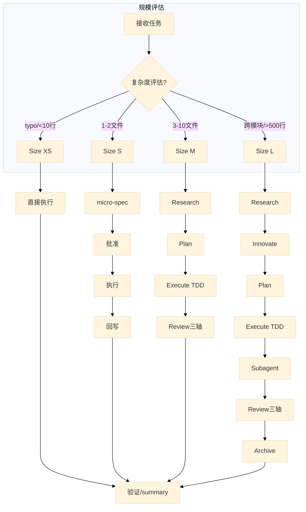

---

## 2. 阶段流程图 (Size M/L)

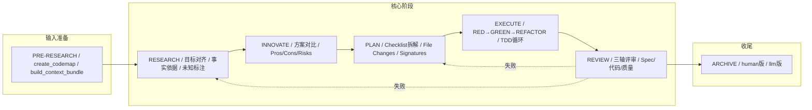

---

## 3. 铁律与门禁图

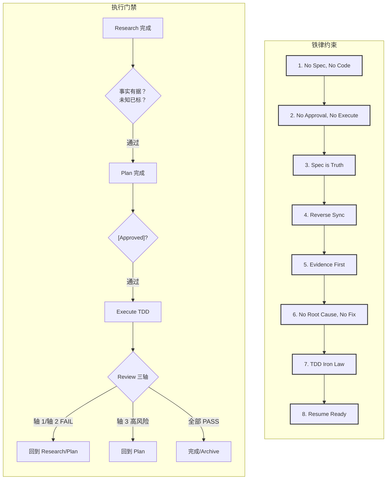

---

## 4. Review三轴评审图

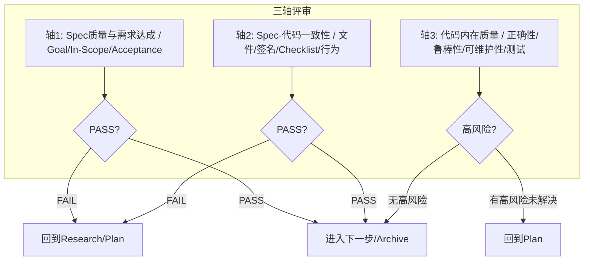

---

## 5. Size L工作流甘特图

```mermaid
gantt
    title ALTAS Workflow Size L 阶段规划
    dateFormat X
    axisFormat %s
    
    section PRE-RESEARCH
    create_codemap           :done, p1, 0, 5
    build_context_bundle     :done, p2, 3, 8
    
    section 核心阶段
    Research                 :active, r1, 8, 25
    Innovate方案对比          :active, i1, 20, 35
    Plan                     :active, pl1, 30, 45
    Execute TDD循环          :active, e1, 45, 120
    Subagent驱动             :active, s1, 60, 110
    Review三轴评审           :active, rv1, 115, 130
    
    section 收尾
    Archive知识沉淀           :active, a1, 125, 140
```

---

## 6. TDD执行循环图

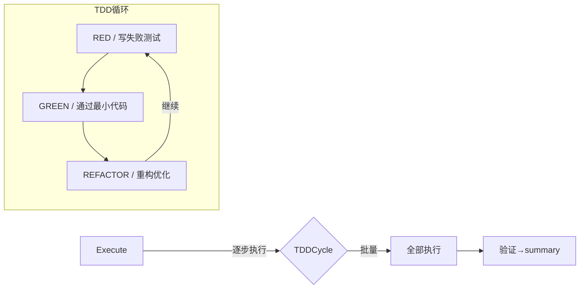

---

## 7. 特殊模式总览图

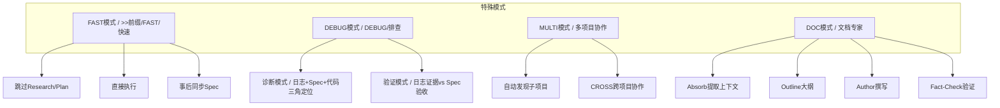

---

## 8. 参考资料索引图

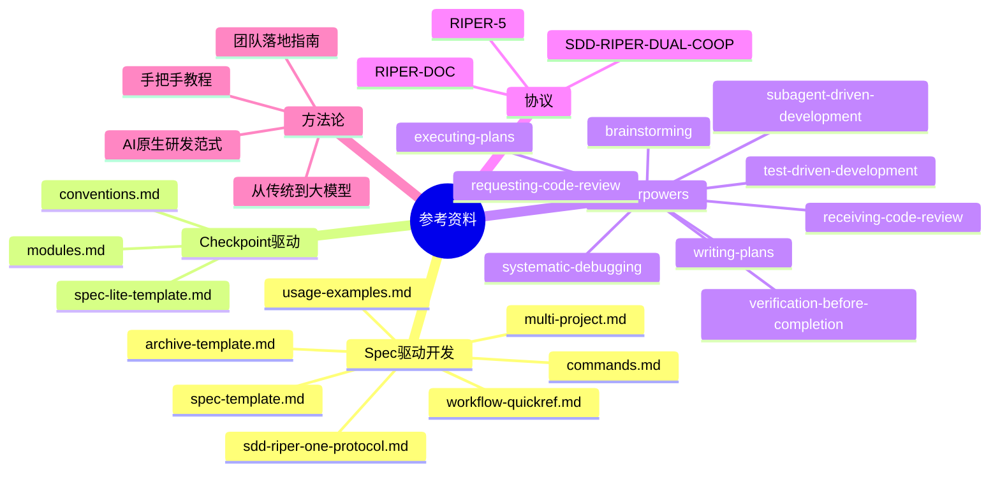

---

## 9. 上下文装配层级图

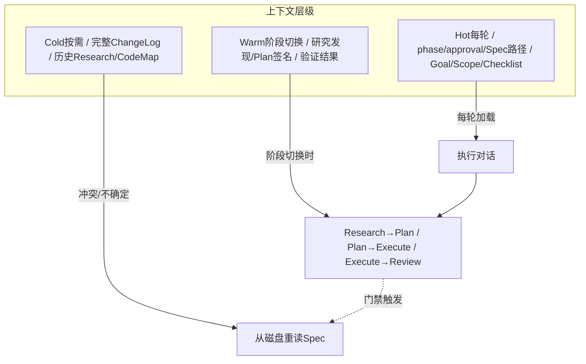

---

## 10. 触发词与模式映射图

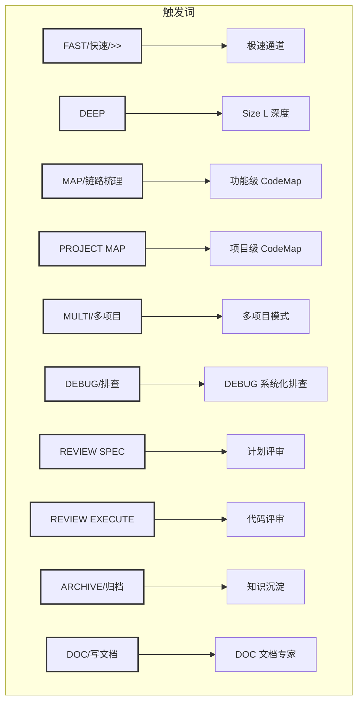

---

## 11. 完整工作流时序图

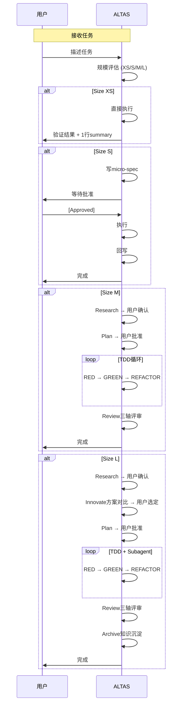
